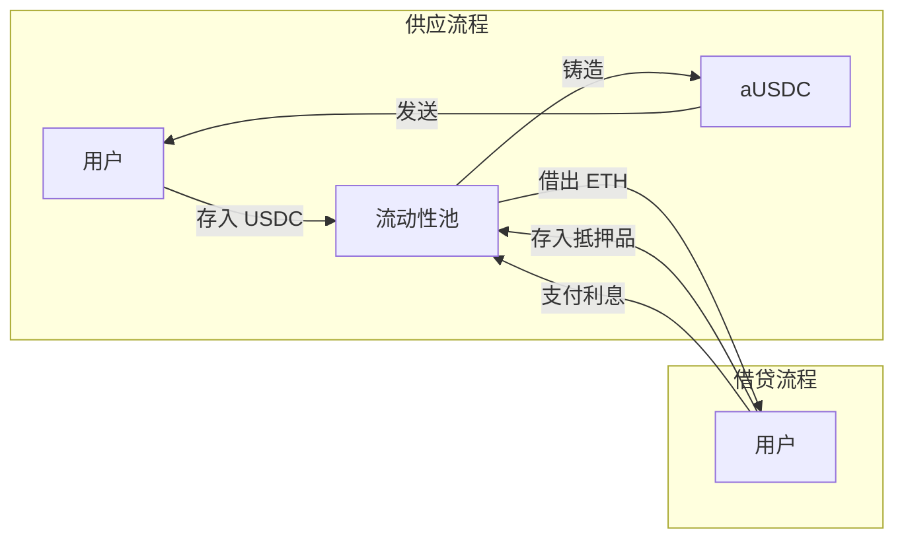
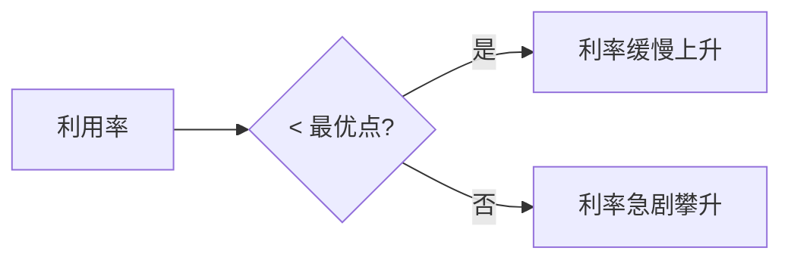
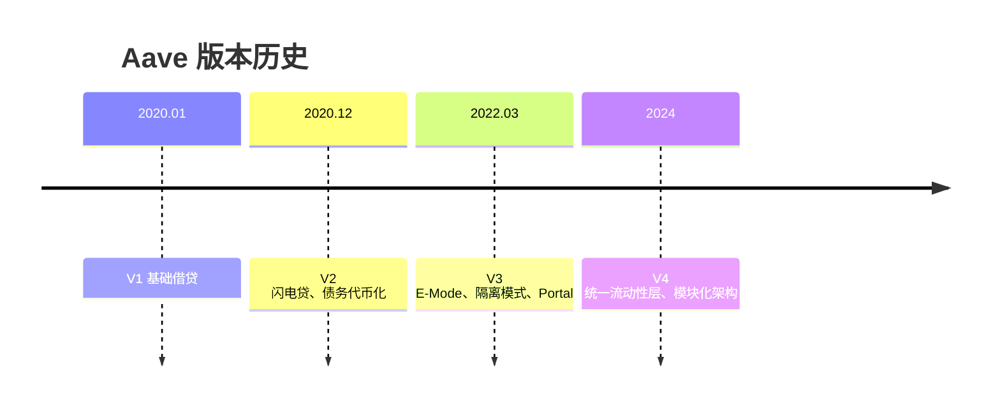
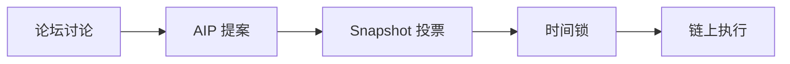

# Aave 概述

Aave 是以太坊上领先的去中心化借贷协议，TVL 超 400 亿美元。用户可存入资产赚取利息，或超额抵押借出资产。

## 核心机制

### 供应

用户存入资产获得 aToken（如 USDC → aUSDC）。aToken 余额自动增长，反映利息收益，可随时赎回。

### 借贷

存入抵押品后可借出其他资产。借款价值需低于抵押品的 LTV 比例，并维持健康因子 > 1。

### 闪电贷

单笔交易内无抵押借贷，需在交易结束前偿还本金 + 0.09% 手续费，否则回滚。

### 清算

健康因子 < 1 时触发。清算人偿还最高 50% 债务，获得等值抵押品 + 5-10% 奖励。

## 关键参数

### 健康因子

$$
健康因子 = \frac{抵押品价值 \times 清算阈值}{借款总额}
$$

| 范围 | 状态 | 操作建议 |
|:---:|:---:|:---|
| > 2.0 | 🟢 安全 | 可增加借款 |
| 1.5-2.0 | 🟡 正常 | 保持监控 |
| 1.0-1.5 | 🟠 警告 | 增加抵押或还款 |
| < 1.0 | 🔴 危险 | 立即处理 |

### 风险参数

| 资产 | LTV | 清算阈值 | 清算惩罚 |
|:---:|:---:|:---:|:---:|
| ETH | 80% | 82.5% | 5% |
| WBTC | 70% | 75% | 6.25% |
| USDC | 77% | 80% | 4.5% |

::: tip LTV vs 清算阈值
- **LTV**：最大可借比例（100 美元抵押品，80% LTV = 最多借 80 美元）
- **清算阈值**：触发清算的比例，比 LTV 高 2-5%，提供缓冲
:::

### 利率模型

- **浮动利率**：随供需实时变化，通常较低
- **稳定利率**：短期固定，可预测性强

## 高级功能

### E-Mode（效率模式）

针对相关资产提供更高借贷效率：

| 类别 | 资产 | LTV | 清算阈值 |
|:---|:---|:---:|:---:|
| 稳定币 | USDC, USDT, DAI | 97% | 97.5% |
| ETH 相关 | ETH, wstETH, rETH | 93% | 95% |

::: warning 限制
启用 E-Mode 后只能借出同类别资产
:::

### 隔离模式

新上线高风险资产的限制：
- 只能作为唯一抵押品
- 只能借出指定稳定币
- 设有债务上限

### Portal

跨链仓位迁移，源链销毁 → 目标链铸造。

## 版本演进

## 多链部署

| 网络 | 类型 | TVL 占比 |
|:---|:---:|:---:|
| Ethereum | L1 | ~60% |
| Arbitrum | L2 | ~12% |
| Polygon | Sidechain | ~8% |
| Optimism | L2 | ~6% |
| Avalanche | L1 | ~5% |
| Base | L2 | ~5% |

## 治理

### AAVE 代币用途

- 🗳️ 治理投票
- 🛡️ 安全模块质押（获得 stkAAVE + 奖励）
- 💰 GHO 借贷折扣（最高 50%）

### 治理流程

### 安全模块

stkAAVE 持有者承担协议风险：资金缺口时最高 30% 被 Slashing，作为补偿获得约 7% APY 奖励。

## 风险

| 类型 | 描述 | 缓解措施 |
|:---|:---|:---|
| 智能合约 | 代码漏洞 | 多家审计、Bug Bounty |
| 预言机 | 价格异常 | Chainlink 多源验证 |
| 清算 | 抵押品下跌 | 保持健康因子 > 1.5 |
| 流动性 | 无法提取 | 利率曲线激励 |

::: info 审计
Trail of Bits、OpenZeppelin、ABDK、SigmaPrime、Certora（形式化验证）
:::
