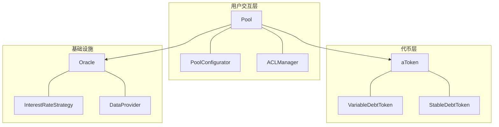
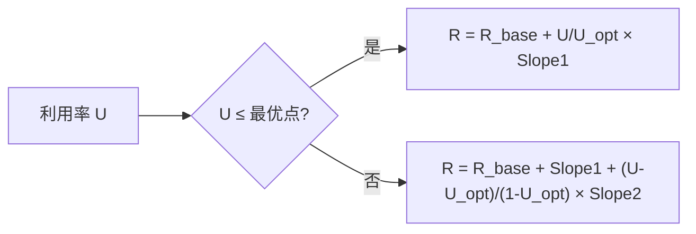
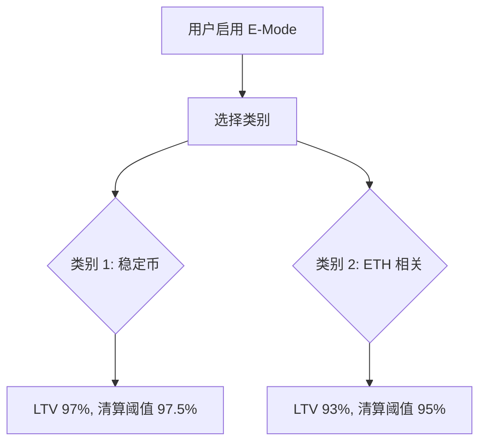
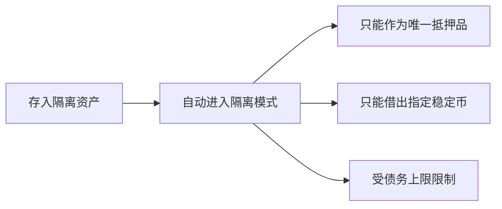
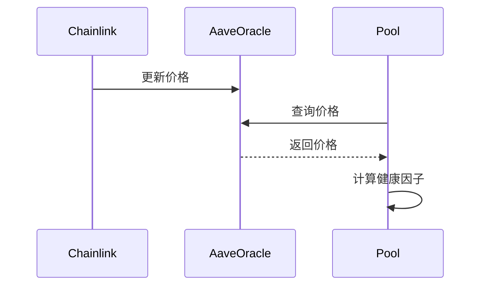

# V3 核心概念

## 架构



## 核心合约

### Pool

用户交互的主入口：

```solidity
interface IPool {
    function supply(address asset, uint256 amount, address onBehalfOf, uint16 referralCode) external;
    function withdraw(address asset, uint256 amount, address to) external returns (uint256);
    function borrow(address asset, uint256 amount, uint256 interestRateMode, uint16 referralCode, address onBehalfOf) external;
    function repay(address asset, uint256 amount, uint256 interestRateMode, address onBehalfOf) external returns (uint256);
    function liquidationCall(address collateralAsset, address debtAsset, address user, uint256 debtToCover, bool receiveAToken) external;
    function flashLoan(...) external;
}
```

### aToken

存款凭证，特点：
- 1:1 锚定底层资产
- 余额自动增长（反映利息）
- ERC-20 兼容，可转让

```solidity
interface IAToken is IERC20 {
    function UNDERLYING_ASSET_ADDRESS() external view returns (address);
    function scaledBalanceOf(address user) external view returns (uint256);
}
```

### 债务代币

| 类型 | 用途 | 特点 |
|:---|:---|:---|
| VariableDebtToken | 浮动利率债务 | 利率随市场变化 |
| StableDebtToken | 稳定利率债务 | 利率短期固定 |

## 利率模型

### 计算公式



$$
利用率 = \frac{总借款}{总存款}
$$

$$
存款利率 = 借款利率 \times 利用率 \times (1 - 储备因子)
$$

### 参数示例

| 资产 | 基础利率 | 最优利用率 | Slope1 | Slope2 |
|:---:|:---:|:---:|:---:|:---:|
| USDC | 0% | 90% | 4% | 60% |
| ETH | 0% | 80% | 3.8% | 80% |
| WBTC | 0% | 45% | 4% | 300% |

::: tip 利率曲线设计
- 利用率 < 最优点：利率平缓上升，鼓励借贷
- 利用率 > 最优点：利率急剧上升，激励还款和存款
:::

## 风险参数

### 定义

| 参数 | 含义 | 示例 |
|:---|:---|:---|
| LTV | 最大可借比例 | 80% = 100$ 抵押最多借 80$ |
| 清算阈值 | 触发清算的比例 | 通常比 LTV 高 2-5% |
| 清算惩罚 | 清算人获得的额外奖励 | 5-10% |

### 主要资产参数

| 资产 | LTV | 清算阈值 | 清算惩罚 | 储备因子 |
|:---:|:---:|:---:|:---:|:---:|
| ETH | 80% | 82.5% | 5% | 15% |
| WBTC | 70% | 75% | 6.25% | 20% |
| USDC | 77% | 80% | 4.5% | 10% |
| DAI | 75% | 78% | 4% | 10% |

## E-Mode

### 工作原理



### 类别配置

| ID | 名称 | 资产 | LTV | 清算阈值 |
|:---:|:---|:---|:---:|:---:|
| 1 | 稳定币 | USDC, USDT, DAI | 97% | 97.5% |
| 2 | ETH 相关 | ETH, wstETH, rETH | 93% | 95% |

### 使用示例

```solidity
// 启用稳定币 E-Mode
pool.setUserEMode(1);

// 查询用户 E-Mode
uint256 categoryId = pool.getUserEMode(user);
```

::: warning 限制
E-Mode 下只能借出同类别资产
:::

## 隔离模式

### 触发条件

存入被标记为"隔离资产"的代币时自动进入。

### 限制



### 配置参数

```solidity
struct ReserveConfiguration {
    uint256 debtCeiling;        // 债务上限
    bool borrowableInIsolation; // 是否可在隔离模式下借出
}
```

## 供应/借贷上限

| 类型 | 作用 | 目的 |
|:---|:---|:---|
| Supply Cap | 限制最大供应量 | 控制单一资产风险敞口 |
| Borrow Cap | 限制最大借款量 | 防止预言机操纵攻击 |

```solidity
function getSupplyCap(address asset) external view returns (uint256);
function getBorrowCap(address asset) external view returns (uint256);
```

## 预言机

### Chainlink 集成

```solidity
interface IAaveOracle {
    function getAssetPrice(address asset) external view returns (uint256);
    function getAssetsPrices(address[] calldata assets) external view returns (uint256[] memory);
    function BASE_CURRENCY_UNIT() external view returns (uint256);
}
```

### 价格更新流程



## 合约地址

### Ethereum

| 合约 | 地址 |
|:---|:---|
| Pool | `0x87870Bca3F3fD6335C3F4ce8392D69350B4fA4E2` |
| PoolAddressesProvider | `0x2f39d218133AFaB8F2B819B1066c7E434Ad94E9e` |
| Oracle | `0x54586bE62E3c3580375aE3723C145253060Ca0C2` |

### Polygon

| 合约 | 地址 |
|:---|:---|
| Pool | `0x794a61358D6845594F94dc1DB02A252b5b4814aD` |
| PoolAddressesProvider | `0xa97684ead0e402dC232d5A977953DF7ECBaB3CDb` |

### Arbitrum

| 合约 | 地址 |
|:---|:---|
| Pool | `0x794a61358D6845594F94dc1DB02A252b5b4814aD` |
| PoolAddressesProvider | `0xa97684ead0e402dC232d5A977953DF7ECBaB3CDb` |
