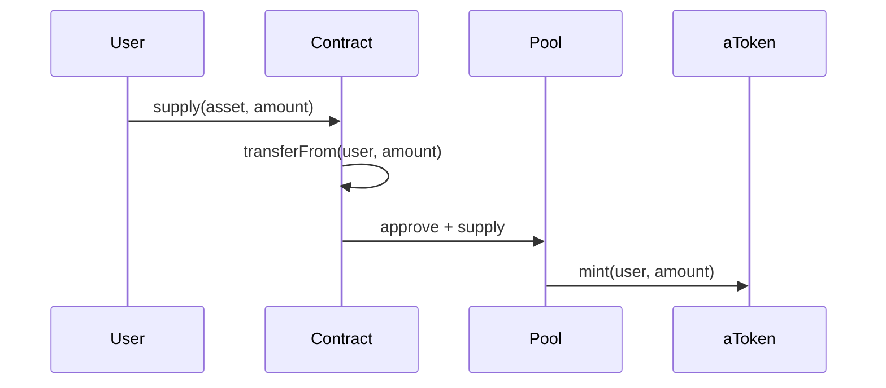

# V3 集成指南

## 环境准备

::: code-group
```bash [npm]
npm install @aave/core-v3 @aave/periphery-v3
```

```bash [yarn]
yarn add @aave/core-v3 @aave/periphery-v3
```

```bash [foundry]
forge install aave/aave-v3-core
forge install aave/aave-v3-periphery
```
:::

## 基础操作

### 初始化

```solidity
import {IPool} from "@aave/core-v3/contracts/interfaces/IPool.sol";
import {IPoolAddressesProvider} from "@aave/core-v3/contracts/interfaces/IPoolAddressesProvider.sol";
import {IERC20} from "@openzeppelin/contracts/token/ERC20/IERC20.sol";

contract AaveIntegration {
    IPool public immutable POOL;
    
    constructor(address provider) {
        POOL = IPool(IPoolAddressesProvider(provider).getPool());
    }
}
```

### 供应



```solidity
function supply(address asset, uint256 amount) external {
    IERC20(asset).transferFrom(msg.sender, address(this), amount);
    IERC20(asset).approve(address(POOL), amount);
    POOL.supply(asset, amount, msg.sender, 0);
}
```

### 提取

```solidity
// 提取指定数量
function withdraw(address asset, uint256 amount) external returns (uint256) {
    return POOL.withdraw(asset, amount, msg.sender);
}

// 提取全部
function withdrawAll(address asset) external returns (uint256) {
    return POOL.withdraw(asset, type(uint256).max, msg.sender);
}
```

### 借贷

```solidity
uint256 constant VARIABLE_RATE = 2;
uint256 constant STABLE_RATE = 1;

function borrow(address asset, uint256 amount, bool stable) external {
    uint256 rateMode = stable ? STABLE_RATE : VARIABLE_RATE;
    POOL.borrow(asset, amount, rateMode, 0, msg.sender);
}
```

### 偿还

```solidity
function repay(address asset, uint256 amount, uint256 rateMode) external returns (uint256) {
    IERC20(asset).transferFrom(msg.sender, address(this), amount);
    IERC20(asset).approve(address(POOL), amount);
    return POOL.repay(asset, amount, rateMode, msg.sender);
}

// 使用 aToken 偿还
function repayWithATokens(address asset, uint256 amount, uint256 rateMode) external returns (uint256) {
    return POOL.repayWithATokens(asset, amount, rateMode);
}
```

## 数据查询

### 用户账户

```solidity
function getUserData(address user) external view returns (
    uint256 totalCollateral,
    uint256 totalDebt,
    uint256 availableBorrows,
    uint256 liquidationThreshold,
    uint256 ltv,
    uint256 healthFactor
) {
    return POOL.getUserAccountData(user);
}

function canBeLiquidated(address user) external view returns (bool) {
    (, , , , , uint256 hf) = POOL.getUserAccountData(user);
    return hf < 1e18;
}
```

### 储备数据

```solidity
import {DataTypes} from "@aave/core-v3/contracts/protocol/libraries/types/DataTypes.sol";

function getReserveInfo(address asset) external view returns (
    address aToken,
    uint256 liquidityRate,
    uint256 variableBorrowRate
) {
    DataTypes.ReserveData memory data = POOL.getReserveData(asset);
    return (
        data.aTokenAddress,
        data.currentLiquidityRate,
        data.currentVariableBorrowRate
    );
}
```

## TypeScript 集成

### ethers.js

```typescript
import { ethers } from 'ethers';

const POOL_ABI = [
  "function supply(address,uint256,address,uint16)",
  "function withdraw(address,uint256,address) returns (uint256)",
  "function borrow(address,uint256,uint256,uint16,address)",
  "function repay(address,uint256,uint256,address) returns (uint256)",
  "function getUserAccountData(address) view returns (uint256,uint256,uint256,uint256,uint256,uint256)"
];

class AaveClient {
  private pool: ethers.Contract;
  
  constructor(poolAddress: string, signer: ethers.Signer) {
    this.pool = new ethers.Contract(poolAddress, POOL_ABI, signer);
  }
  
  async supply(asset: string, amount: bigint) {
    const token = new ethers.Contract(asset, ["function approve(address,uint256)"], this.pool.signer);
    await (await token.approve(this.pool.address, amount)).wait();
    return this.pool.supply(asset, amount, await this.pool.signer.getAddress(), 0);
  }
  
  async getUserData(user: string) {
    const [collateral, debt, available, threshold, ltv, hf] = 
      await this.pool.getUserAccountData(user);
    return {
      totalCollateral: ethers.formatUnits(collateral, 8),
      totalDebt: ethers.formatUnits(debt, 8),
      availableBorrows: ethers.formatUnits(available, 8),
      healthFactor: ethers.formatEther(hf)
    };
  }
}
```

### Aave SDK

```typescript
import { Pool, InterestRate } from '@aave/contract-helpers';

const pool = new Pool(provider, {
  POOL: '0x87870Bca3F3fD6335C3F4ce8392D69350B4fA4E2',
  WETH_GATEWAY: '0xD322A49006FC828F9B5B37Ab215F99B4E5caB19C',
});

// 供应
const supplyTxs = await pool.supply({ user, reserve: asset, amount });
for (const tx of supplyTxs) {
  await (await signer.sendTransaction(tx)).wait();
}

// 借贷
const borrowTxs = await pool.borrow({
  user,
  reserve: asset,
  amount,
  interestRateMode: InterestRate.Variable,
});
```

## ETH 处理

使用 WETH Gateway 处理原生 ETH：

```solidity
interface IWETHGateway {
    function depositETH(address pool, address onBehalfOf, uint16 referralCode) external payable;
    function withdrawETH(address pool, uint256 amount, address to) external;
    function borrowETH(address pool, uint256 amount, uint256 interestRateMode, uint16 referralCode) external;
    function repayETH(address pool, uint256 amount, uint256 rateMode, address onBehalfOf) external payable;
}

// 存入 ETH
wethGateway.depositETH{value: 1 ether}(poolAddress, msg.sender, 0);

// 提取 ETH
wethGateway.withdrawETH(poolAddress, 1 ether, msg.sender);
```

## 事件监听

```typescript
// 监听供应事件
pool.on("Supply", (reserve, user, onBehalfOf, amount) => {
  console.log(`${user} supplied ${amount} of ${reserve}`);
});

// 监听借贷事件
pool.on("Borrow", (reserve, user, onBehalfOf, amount, rateMode, rate) => {
  console.log(`${user} borrowed ${amount} of ${reserve}`);
});

// 监听清算事件
pool.on("LiquidationCall", (collateral, debt, user, debtCovered, liquidatedAmount, liquidator) => {
  console.log(`${liquidator} liquidated ${user}`);
});
```

## 测试

### Hardhat Fork

```javascript
// hardhat.config.js
module.exports = {
  networks: {
    hardhat: {
      forking: {
        url: "https://eth-mainnet.alchemyapi.io/v2/YOUR_KEY",
        blockNumber: 18000000
      }
    }
  }
};
```

```typescript
describe("Aave Integration", () => {
  it("should supply and borrow", async () => {
    // Impersonate whale
    await network.provider.request({
      method: "hardhat_impersonateAccount",
      params: [WHALE_ADDRESS]
    });
    
    const whale = await ethers.getSigner(WHALE_ADDRESS);
    const pool = await ethers.getContractAt("IPool", POOL_ADDRESS, whale);
    
    // Supply
    await usdc.approve(pool.address, amount);
    await pool.supply(USDC_ADDRESS, amount, whale.address, 0);
    
    // Verify
    const data = await pool.getUserAccountData(whale.address);
    expect(data.totalCollateralBase).to.be.gt(0);
  });
});
```

## 常见问题

::: details 如何获取实时 APY？
```solidity
DataTypes.ReserveData memory data = pool.getReserveData(asset);
// 利率以 ray (1e27) 为单位
uint256 supplyAPY = data.currentLiquidityRate / 1e25; // 转为百分比
uint256 borrowAPY = data.currentVariableBorrowRate / 1e25;
```
:::

::: details 如何计算可借金额？
```solidity
(, , uint256 availableBorrows, , ,) = pool.getUserAccountData(user);
// availableBorrows 以基础货币（通常是 USD，8 位小数）计价
```
:::

::: details 如何处理代币精度？
```solidity
// USDC: 6 decimals
uint256 amount = 1000 * 1e6; // 1000 USDC

// ETH/WETH: 18 decimals
uint256 amount = 1 ether; // 1 ETH
```
:::
