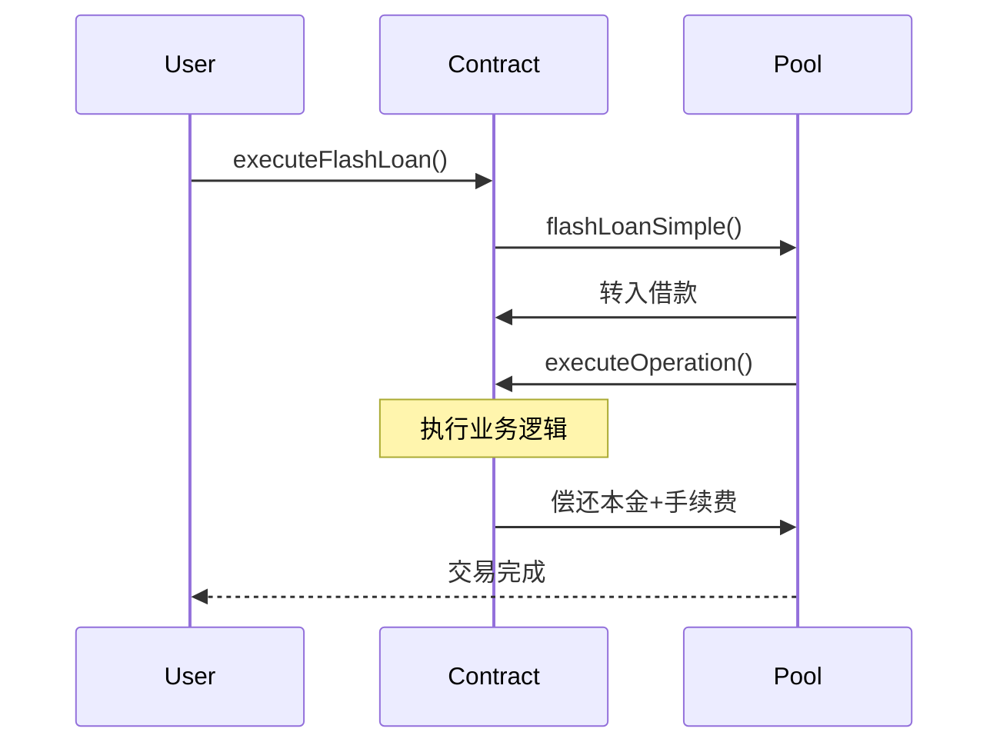
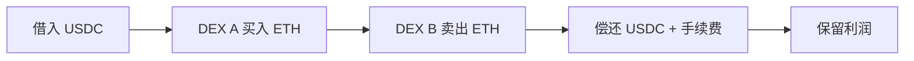

# 闪电贷

## 概述

闪电贷允许在单笔交易内无抵押借贷任意金额，条件是交易结束前偿还本金 + 手续费（0.09%）。



## 常见用途

| 用途 | 描述 |
|:---|:---|
| 套利 | 跨 DEX 价格差异套利 |
| 清算 | 清算不健康仓位获取奖励 |
| 抵押品交换 | 一键更换抵押品类型 |
| 债务再融资 | 切换协议或利率模式 |

## 基础实现

### 单资产闪电贷

```solidity
// SPDX-License-Identifier: MIT
pragma solidity ^0.8.10;

import {FlashLoanSimpleReceiverBase} from "@aave/core-v3/contracts/flashloan/base/FlashLoanSimpleReceiverBase.sol";
import {IPoolAddressesProvider} from "@aave/core-v3/contracts/interfaces/IPoolAddressesProvider.sol";
import {IERC20} from "@openzeppelin/contracts/token/ERC20/IERC20.sol";

contract SimpleFlashLoan is FlashLoanSimpleReceiverBase {
    constructor(IPoolAddressesProvider provider) 
        FlashLoanSimpleReceiverBase(provider) {}
    
    function execute(address asset, uint256 amount) external {
        POOL.flashLoanSimple(
            address(this),  // receiver
            asset,
            amount,
            abi.encode(msg.sender), // params
            0  // referralCode
        );
    }
    
    function executeOperation(
        address asset,
        uint256 amount,
        uint256 premium,
        address initiator,
        bytes calldata params
    ) external override returns (bool) {
        require(msg.sender == address(POOL), "Invalid caller");
        require(initiator == address(this), "Invalid initiator");
        
        // ========== 业务逻辑 ==========
        // 此时拥有 `amount` 数量的 `asset`
        
        address user = abi.decode(params, (address));
        // ... 执行操作
        
        // ========== 偿还 ==========
        uint256 totalDebt = amount + premium;
        IERC20(asset).approve(address(POOL), totalDebt);
        
        return true;
    }
}
```

### 多资产闪电贷

```solidity
contract MultiFlashLoan is FlashLoanReceiverBase {
    constructor(IPoolAddressesProvider provider) 
        FlashLoanReceiverBase(provider) {}
    
    function execute(
        address[] calldata assets,
        uint256[] calldata amounts
    ) external {
        uint256[] memory modes = new uint256[](assets.length);
        // modes: 0=不保留债务, 1=稳定利率, 2=浮动利率
        
        POOL.flashLoan(
            address(this),
            assets,
            amounts,
            modes,
            address(this),
            "",
            0
        );
    }
    
    function executeOperation(
        address[] calldata assets,
        uint256[] calldata amounts,
        uint256[] calldata premiums,
        address initiator,
        bytes calldata params
    ) external override returns (bool) {
        require(msg.sender == address(POOL), "Invalid caller");
        
        // 业务逻辑...
        
        // 偿还所有资产
        for (uint i = 0; i < assets.length; i++) {
            IERC20(assets[i]).approve(address(POOL), amounts[i] + premiums[i]);
        }
        
        return true;
    }
}
```

## 实战案例

### 套利机器人



```solidity
contract ArbitrageBot is FlashLoanSimpleReceiverBase {
    IUniswapV2Router public immutable routerA;
    IUniswapV2Router public immutable routerB;
    address public owner;
    
    struct ArbParams {
        address tokenA;
        address tokenB;
        bool buyOnA;
        uint256 minProfit;
    }
    
    function executeArbitrage(
        address tokenA,
        address tokenB,
        uint256 amount,
        bool buyOnA,
        uint256 minProfit
    ) external {
        require(msg.sender == owner, "Only owner");
        
        bytes memory params = abi.encode(ArbParams({
            tokenA: tokenA,
            tokenB: tokenB,
            buyOnA: buyOnA,
            minProfit: minProfit
        }));
        
        POOL.flashLoanSimple(address(this), tokenA, amount, params, 0);
    }
    
    function executeOperation(
        address asset,
        uint256 amount,
        uint256 premium,
        address,
        bytes calldata params
    ) external override returns (bool) {
        require(msg.sender == address(POOL), "Invalid caller");
        
        ArbParams memory arb = abi.decode(params, (ArbParams));
        uint256 totalDebt = amount + premium;
        
        // 构建路径
        address[] memory path = new address[](2);
        path[0] = arb.tokenA;
        path[1] = arb.tokenB;
        
        address[] memory reversePath = new address[](2);
        reversePath[0] = arb.tokenB;
        reversePath[1] = arb.tokenA;
        
        IUniswapV2Router buyRouter = arb.buyOnA ? routerA : routerB;
        IUniswapV2Router sellRouter = arb.buyOnA ? routerB : routerA;
        
        // 买入
        IERC20(arb.tokenA).approve(address(buyRouter), amount);
        uint[] memory buyAmounts = buyRouter.swapExactTokensForTokens(
            amount, 0, path, address(this), block.timestamp
        );
        
        // 卖出
        IERC20(arb.tokenB).approve(address(sellRouter), buyAmounts[1]);
        uint[] memory sellAmounts = sellRouter.swapExactTokensForTokens(
            buyAmounts[1], totalDebt + arb.minProfit, reversePath, address(this), block.timestamp
        );
        
        // 验证利润
        require(sellAmounts[1] >= totalDebt + arb.minProfit, "No profit");
        
        // 偿还
        IERC20(asset).approve(address(POOL), totalDebt);
        
        // 转移利润
        IERC20(asset).transfer(owner, sellAmounts[1] - totalDebt);
        
        return true;
    }
}
```

### 清算机器人


```solidity
contract LiquidationBot is FlashLoanSimpleReceiverBase {
    ISwapRouter public immutable swapRouter;
    address public owner;
    
    struct LiqParams {
        address collateral;
        address debt;
        address user;
        uint256 debtToCover;
    }
    
    function liquidate(
        address collateral,
        address debt,
        address user,
        uint256 debtToCover
    ) external {
        require(msg.sender == owner, "Only owner");
        
        // 验证可清算
        (, , , , , uint256 hf) = POOL.getUserAccountData(user);
        require(hf < 1e18, "Cannot liquidate");
        
        bytes memory params = abi.encode(LiqParams({
            collateral: collateral,
            debt: debt,
            user: user,
            debtToCover: debtToCover
        }));
        
        POOL.flashLoanSimple(address(this), debt, debtToCover, params, 0);
    }
    
    function executeOperation(
        address asset,
        uint256 amount,
        uint256 premium,
        address,
        bytes calldata params
    ) external override returns (bool) {
        require(msg.sender == address(POOL), "Invalid caller");
        
        LiqParams memory liq = abi.decode(params, (LiqParams));
        uint256 totalDebt = amount + premium;
        
        // 执行清算
        IERC20(asset).approve(address(POOL), amount);
        POOL.liquidationCall(liq.collateral, liq.debt, liq.user, liq.debtToCover, false);
        
        // 卖出抵押品
        uint256 collateralReceived = IERC20(liq.collateral).balanceOf(address(this));
        IERC20(liq.collateral).approve(address(swapRouter), collateralReceived);
        
        uint256 amountOut = swapRouter.exactInputSingle(ISwapRouter.ExactInputSingleParams({
            tokenIn: liq.collateral,
            tokenOut: liq.debt,
            fee: 3000,
            recipient: address(this),
            deadline: block.timestamp,
            amountIn: collateralReceived,
            amountOutMinimum: totalDebt,
            sqrtPriceLimitX96: 0
        }));
        
        // 偿还
        IERC20(asset).approve(address(POOL), totalDebt);
        
        // 转移利润
        if (amountOut > totalDebt) {
            IERC20(asset).transfer(owner, amountOut - totalDebt);
        }
        
        return true;
    }
}
```

### 抵押品交换

```solidity
contract CollateralSwap is FlashLoanSimpleReceiverBase {
    struct SwapParams {
        address user;
        address fromAsset;
        address toAsset;
        uint256 fromAmount;
    }
    
    function swap(address fromAsset, address toAsset, uint256 fromAmount) external {
        uint256 toAmount = _estimateSwap(fromAsset, toAsset, fromAmount);
        
        bytes memory params = abi.encode(SwapParams({
            user: msg.sender,
            fromAsset: fromAsset,
            toAsset: toAsset,
            fromAmount: fromAmount
        }));
        
        POOL.flashLoanSimple(address(this), toAsset, toAmount, params, 0);
    }
    
    function executeOperation(
        address asset,
        uint256 amount,
        uint256 premium,
        address,
        bytes calldata params
    ) external override returns (bool) {
        require(msg.sender == address(POOL), "Invalid caller");
        
        SwapParams memory swap = abi.decode(params, (SwapParams));
        
        // 1. 存入新抵押品
        IERC20(asset).approve(address(POOL), amount);
        POOL.supply(asset, amount, swap.user, 0);
        
        // 2. 提取旧抵押品（需要用户预先授权 aToken）
        POOL.withdraw(swap.fromAsset, swap.fromAmount, address(this));
        
        // 3. 交换
        uint256 swapped = _swap(swap.fromAsset, asset, swap.fromAmount);
        
        // 4. 偿还
        uint256 totalDebt = amount + premium;
        require(swapped >= totalDebt, "Insufficient");
        IERC20(asset).approve(address(POOL), totalDebt);
        
        // 5. 返还多余
        if (swapped > totalDebt) {
            IERC20(asset).transfer(swap.user, swapped - totalDebt);
        }
        
        return true;
    }
}
```

## 手续费

```solidity
// 标准手续费: 0.09%
uint256 premium = (amount * 9) / 10000;
uint256 totalDebt = amount + premium;

// 获取实际费率
uint128 premiumTotal = POOL.FLASHLOAN_PREMIUM_TOTAL();
uint128 premiumToProtocol = POOL.FLASHLOAN_PREMIUM_TO_PROTOCOL();
```

## 安全检查

::: danger 必须验证
```solidity
function executeOperation(...) external override returns (bool) {
    // 1. 验证调用者是 Pool
    require(msg.sender == address(POOL), "Invalid caller");
    
    // 2. 验证发起者是本合约
    require(initiator == address(this), "Invalid initiator");
    
    // 3. 确保有足够资金偿还
    uint256 totalDebt = amount + premium;
    require(IERC20(asset).balanceOf(address(this)) >= totalDebt, "Insufficient");
    
    // ...
}
```
:::

::: warning 其他注意事项
- 使用 ReentrancyGuard 防止重入
- DEX 交换设置合理滑点
- 实现紧急提取功能
- 充分测试后再部署主网
:::
