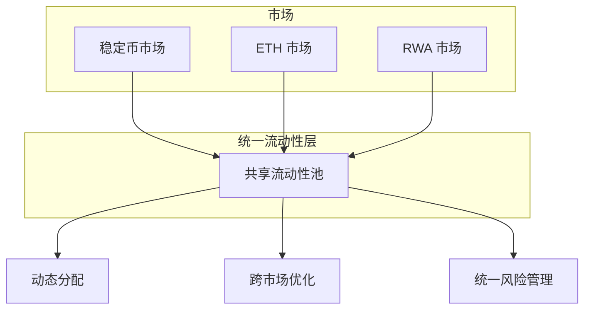
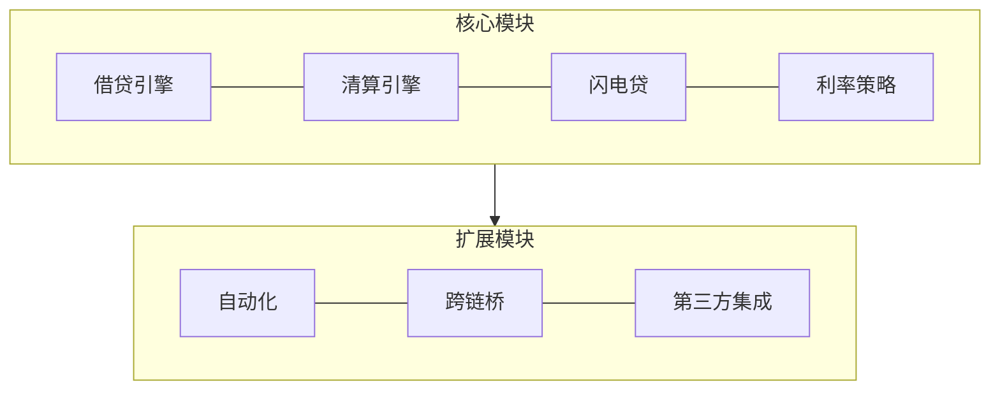
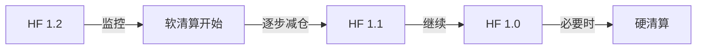
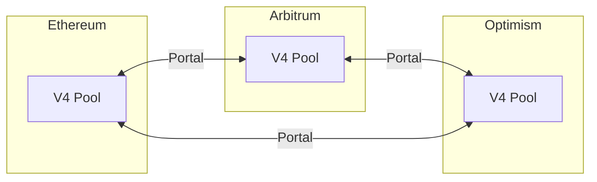
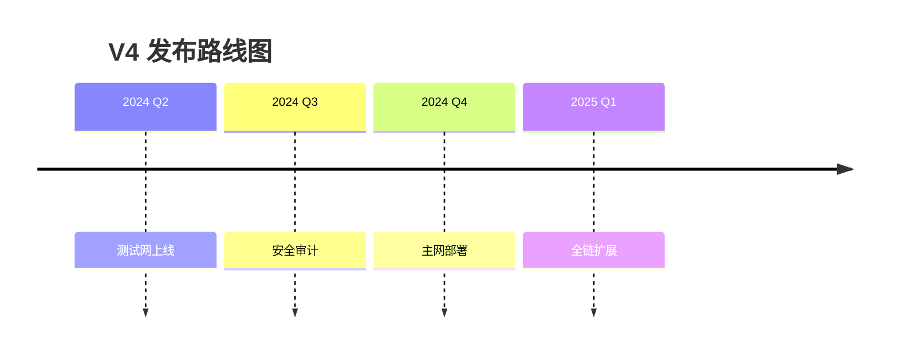

# V4 概述

Aave V4 是协议的下一代版本，引入统一流动性层、模块化架构和原生账户抽象，大幅提升资本效率和用户体验。

## 核心创新

### 统一流动性层



| 特性 | V3 | V4 |
|:---|:---:|:---:|
| 流动性 | 市场隔离 | 统一共享 |
| 资本效率 | 中等 | 高 |
| 碎片化 | 存在 | 消除 |

### 模块化架构



::: tip 模块化优势
- 独立升级各模块，无需整体迁移
- 第三方可开发自定义模块
- 降低系统性风险
:::

### 智能账户

原生 ERC-4337 账户抽象支持：

| 功能 | 描述 |
|:---|:---|
| 批量操作 | 单笔交易执行多个操作 |
| Gas 代付 | 第三方支付 Gas 费用 |
| 社交恢复 | 多签恢复账户访问 |
| 自动化 | 条件触发的自动操作 |

### 动态风险参数

风险参数根据市场条件实时调整：

```solidity
interface IDynamicRisk {
    struct RiskParams {
        uint256 dynamicLTV;
        uint256 dynamicLiquidationThreshold;
        uint256 liquidityFactor;
    }
    
    function getCurrentParams(address asset) 
        external view returns (RiskParams memory);
}
```

## V3 vs V4 对比

| 特性 | V3 | V4 |
|:---|:---:|:---:|
| 架构 | 单体 | 模块化 |
| 流动性 | 市场隔离 | 统一层 |
| 账户系统 | EOA | 原生账户抽象 |
| 风险参数 | 静态 | 动态调整 |
| Gas 效率 | 基准 | 优化 20-30% |
| 清算机制 | 硬清算 | 软清算 |

## 清算机制升级

### 软清算

健康因子接近 1 时逐步减少仓位，而非一次性清算：



| 对比 | 硬清算 | 软清算 |
|:---|:---:|:---:|
| 触发点 | HF < 1 | HF < 1.2 |
| 清算量 | 最高 50% | 渐进式 |
| 用户损失 | 较高 | 较低 |
| 惩罚 | 固定 | 可变 |

### 可变清算惩罚

```solidity
function calculatePenalty(
    address asset,
    uint256 healthFactor,
    uint256 marketVolatility
) external view returns (uint256) {
    uint256 basePenalty = 500; // 5%
    
    // 健康因子越低，惩罚越高
    if (healthFactor < 0.95e18) basePenalty += 200;
    
    // 市场波动越大，惩罚越高
    if (marketVolatility > HIGH_VOLATILITY) basePenalty += 100;
    
    return basePenalty;
}
```

## 批量操作

```solidity
// 一键开仓示例
BatchOperation[] memory ops = new BatchOperation[](2);
ops[0] = BatchOperation({
    opType: OpType.SUPPLY,
    asset: USDC,
    amount: 10000e6
});
ops[1] = BatchOperation({
    opType: OpType.BORROW,
    asset: ETH,
    amount: 2e18
});
pool.executeBatch(ops);
```

::: info Gas 节省
批量操作相比单独调用节省约 30% Gas
:::

## 自动化功能

```solidity
interface IAutomation {
    enum TriggerType { HEALTH_FACTOR, PRICE, TIME, UTILIZATION }
    enum ActionType { REPAY, WITHDRAW, SUPPLY, SWAP_COLLATERAL }
    
    struct Rule {
        TriggerType trigger;
        uint256 triggerValue;
        ActionType action;
        address actionAsset;
        uint256 actionAmount;
        bool isActive;
    }
    
    function createRule(Rule calldata rule) external returns (uint256 ruleId);
    function executeRule(uint256 ruleId) external;
}
```

### 自动化场景

| 场景 | 触发条件 | 执行动作 |
|:---|:---|:---|
| 健康因子保护 | HF < 1.3 | 自动还款 |
| 止损 | 价格下跌 10% | 提取抵押品 |
| 利率切换 | 浮动利率 > 8% | 切换稳定利率 |
| 定期再平衡 | 每周 | 调整仓位比例 |

## Gas 优化

| 操作 | V3 | V4 | 优化 |
|:---|:---:|:---:|:---:|
| Supply | 150k | 120k | -20% |
| Borrow | 200k | 160k | -20% |
| Repay | 180k | 140k | -22% |
| Liquidation | 300k | 220k | -27% |
| Flash Loan | 180k | 140k | -22% |

## 跨链功能

### Portal 增强



```solidity
interface ICrossChain {
    function bridgeSupply(
        uint256 destChainId,
        address asset,
        uint256 amount
    ) external;
    
    function bridgeBorrow(
        uint256 destChainId,
        address asset,
        uint256 amount
    ) external;
}
```

## 模块化治理

```solidity
interface IModuleGovernance {
    function proposeModuleUpdate(
        address module,
        bytes calldata updateData
    ) external returns (uint256 proposalId);
    
    function executeModuleUpdate(uint256 proposalId) external;
}
```

### 紧急操作

Guardian 可执行的紧急操作：
- 暂停/恢复特定资产
- 紧急参数调整
- 风险上限修改

## 发布计划



## SDK 预览

```typescript
import { AaveV4 } from '@aave/v4-sdk';

const aave = new AaveV4({ provider, signer, chainId: 1 });

// 批量操作
await aave.executeBatch([
    aave.supply('USDC', '10000'),
    aave.borrow('DAI', '5000'),
]);

// 创建自动化规则
await aave.automation.createRule({
    trigger: { type: 'healthFactor', value: 1.2 },
    action: { type: 'repay', asset: 'USDC', amount: '1000' },
});

// 获取动态风险参数
const params = await aave.getDynamicRiskParams('ETH');
console.log('Dynamic LTV:', params.dynamicLTV);
```
