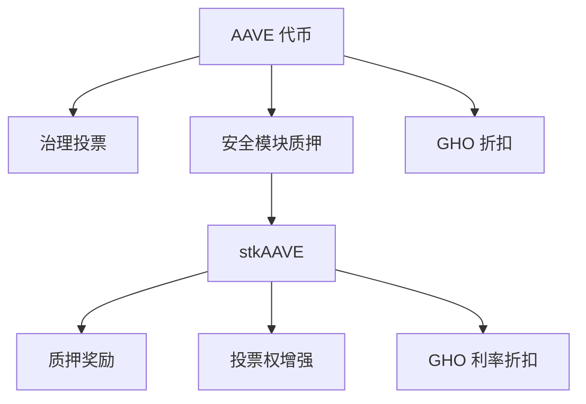
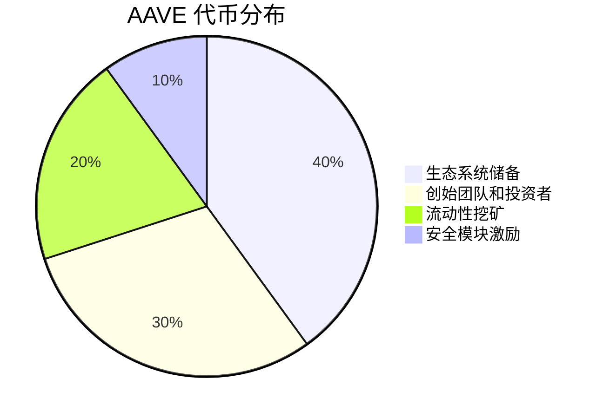

# AAVE 代币

AAVE 是 Aave 协议的原生治理代币，赋予持有者参与协议决策的权力。

## 代币信息

| 属性 | 值 |
|:---|:---|
| 代币标准 | ERC-20 |
| 总供应量 | 16,000,000 AAVE |
| 合约地址 | `0x7Fc66500c84A76Ad7e9c93437bFc5Ac33E2DDaE9` |
| 小数位 | 18 |

## 核心功能



### 治理投票

| 权力类型 | 描述 |
|:---|:---|
| 提案权 | 创建治理提案（需达到阈值） |
| 投票权 | 对提案进行投票 |
| 委托权 | 将投票权委托给他人 |

### 安全模块质押

质押 AAVE 获得 stkAAVE：

```solidity
interface IStakedAave {
    function stake(address to, uint256 amount) external;
    function cooldown() external;
    function redeem(address to, uint256 amount) external;
    function claimRewards(address to, uint256 amount) external;
}
```

| 参数 | 值 |
|:---|:---|
| 质押奖励 | ~7% APY |
| 冷却期 | 10 天 |
| 赎回窗口 | 2 天 |
| 最大 Slashing | 30% |

### GHO 折扣

stkAAVE 持有者借 GHO 享受利率折扣：

| stkAAVE 数量 | GHO 债务 | 折扣率 | 有效利率 |
|:---:|:---:|:---:|:---:|
| 100 | 10,000 | 50% | 1.5% |
| 50 | 10,000 | 25% | 2.25% |
| 100 | 20,000 | 25% | 2.25% |

::: tip 折扣计算
每 100 stkAAVE 可为 10,000 GHO 债务提供最高 50% 折扣
:::

## 代币分布



## 代币迁移

AAVE 由 LEND 代币迁移而来（100 LEND = 1 AAVE）：

```solidity
interface ILendToAaveMigrator {
    function migrateFromLEND(uint256 amount) external;
}
```

## 获取方式

| 方式 | 描述 |
|:---|:---|
| 中心化交易所 | Binance, Coinbase, Kraken 等 |
| DEX | Uniswap, Curve, Balancer |
| 质押奖励 | 质押 stkAAVE 获得 |
| 流动性挖矿 | 参与协议激励计划 |

## 合约交互

```typescript
import { ethers } from 'ethers';

const AAVE_ADDRESS = '0x7Fc66500c84A76Ad7e9c93437bFc5Ac33E2DDaE9';
const STK_AAVE_ADDRESS = '0x4da27a545c0c5B758a6BA100e3a049001de870f5';

// 质押 AAVE
async function stakeAave(amount: string, signer: ethers.Signer) {
    const aave = new ethers.Contract(AAVE_ADDRESS, ERC20_ABI, signer);
    const stkAave = new ethers.Contract(STK_AAVE_ADDRESS, STK_AAVE_ABI, signer);
    
    // 授权
    await aave.approve(STK_AAVE_ADDRESS, ethers.utils.parseEther(amount));
    
    // 质押
    const userAddress = await signer.getAddress();
    await stkAave.stake(userAddress, ethers.utils.parseEther(amount));
}

// 领取奖励
async function claimRewards(signer: ethers.Signer) {
    const stkAave = new ethers.Contract(STK_AAVE_ADDRESS, STK_AAVE_ABI, signer);
    const userAddress = await signer.getAddress();
    
    const rewards = await stkAave.getTotalRewardsBalance(userAddress);
    await stkAave.claimRewards(userAddress, rewards);
}
```

::: warning 风险提示
质押 AAVE 存在 Slashing 风险。当协议出现资金缺口时，最高 30% 的 stkAAVE 可能被削减用于弥补损失。
:::
