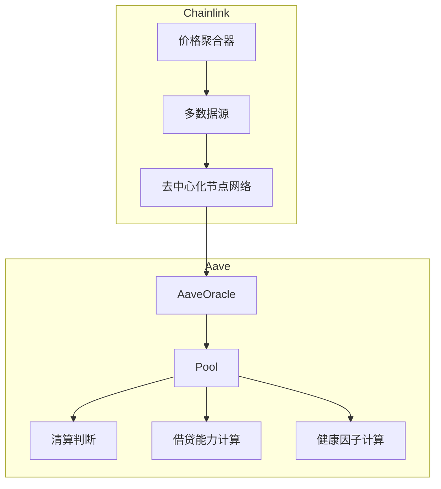
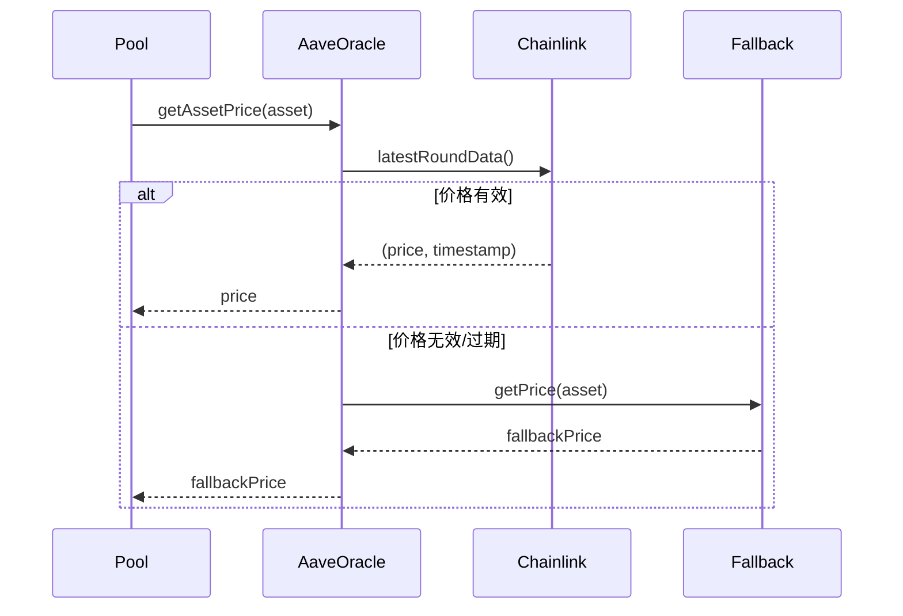
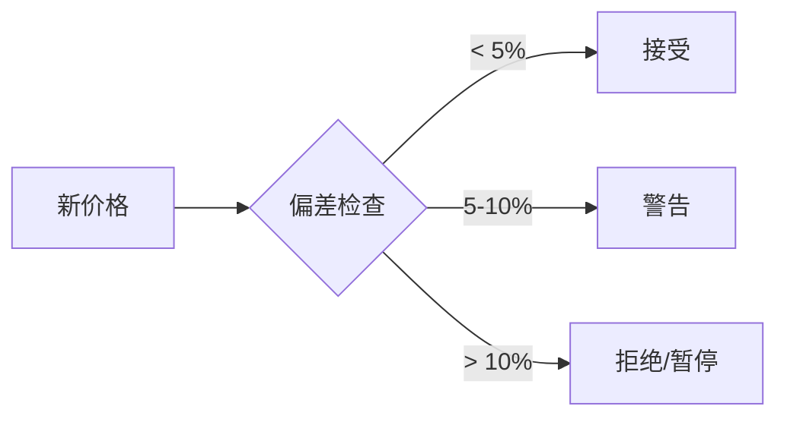

# 预言机

Aave 使用 Chainlink 预言机获取资产价格，确保借贷、清算等操作的准确性。

## 架构概览



## 核心合约

### AaveOracle

```solidity
interface IAaveOracle {
    // 获取资产价格（以基础货币计价）
    function getAssetPrice(address asset) external view returns (uint256);
    
    // 批量获取价格
    function getAssetsPrices(address[] calldata assets) 
        external view returns (uint256[] memory);
    
    // 获取资产的价格源
    function getSourceOfAsset(address asset) external view returns (address);
    
    // 设置价格源（仅管理员）
    function setAssetSources(
        address[] calldata assets,
        address[] calldata sources
    ) external;
    
    // 获取基础货币单位
    function BASE_CURRENCY_UNIT() external view returns (uint256);
}
```

### 价格源类型

| 类型 | 描述 | 使用场景 |
|:---|:---|:---|
| Chainlink Feed | 标准价格聚合器 | 主流资产 |
| Fallback Oracle | 备用价格源 | 主源失效时 |
| Custom Adapter | 自定义适配器 | 特殊资产 |

## 价格获取流程



## 价格验证

```solidity
contract PriceValidator {
    IAaveOracle public oracle;
    
    uint256 public constant MAX_PRICE_DEVIATION = 500; // 5%
    uint256 public constant MAX_PRICE_AGE = 1 hours;
    
    function validatePrice(address asset) external view returns (
        bool isValid,
        uint256 price,
        string memory reason
    ) {
        price = oracle.getAssetPrice(asset);
        
        // 检查价格是否为零
        if (price == 0) {
            return (false, 0, "Zero price");
        }
        
        // 获取 Chainlink 数据
        address source = oracle.getSourceOfAsset(asset);
        (
            uint80 roundId,
            int256 answer,
            uint256 startedAt,
            uint256 updatedAt,
            uint80 answeredInRound
        ) = AggregatorV3Interface(source).latestRoundData();
        
        // 检查价格时效性
        if (block.timestamp - updatedAt > MAX_PRICE_AGE) {
            return (false, price, "Stale price");
        }
        
        // 检查回合完整性
        if (answeredInRound < roundId) {
            return (false, price, "Incomplete round");
        }
        
        return (true, price, "Valid");
    }
}
```

## 集成示例

### 获取用户仓位价值

```solidity
contract PositionCalculator {
    IAaveOracle public oracle;
    IPool public pool;
    
    function getUserPositionValue(address user) 
        external view returns (
            uint256 totalCollateralUSD,
            uint256 totalDebtUSD
        ) 
    {
        (
            uint256 totalCollateralBase,
            uint256 totalDebtBase,
            ,,,
        ) = pool.getUserAccountData(user);
        
        // 基础货币单位（通常是 8 位小数的 USD）
        uint256 baseUnit = oracle.BASE_CURRENCY_UNIT();
        
        totalCollateralUSD = totalCollateralBase * 1e18 / baseUnit;
        totalDebtUSD = totalDebtBase * 1e18 / baseUnit;
    }
    
    function getAssetValueUSD(address asset, uint256 amount) 
        external view returns (uint256) 
    {
        uint256 price = oracle.getAssetPrice(asset);
        uint256 decimals = IERC20Metadata(asset).decimals();
        
        return (amount * price) / (10 ** decimals);
    }
}
```

### TypeScript 集成

```typescript
import { ethers } from 'ethers';

const ORACLE_ABI = [
    'function getAssetPrice(address asset) view returns (uint256)',
    'function getAssetsPrices(address[] assets) view returns (uint256[])',
    'function BASE_CURRENCY_UNIT() view returns (uint256)',
];

class AaveOracleClient {
    private oracle: ethers.Contract;
    
    constructor(oracleAddress: string, provider: ethers.Provider) {
        this.oracle = new ethers.Contract(oracleAddress, ORACLE_ABI, provider);
    }
    
    async getPrice(asset: string): Promise<number> {
        const price = await this.oracle.getAssetPrice(asset);
        const baseUnit = await this.oracle.BASE_CURRENCY_UNIT();
        return Number(price) / Number(baseUnit);
    }
    
    async getPrices(assets: string[]): Promise<Map<string, number>> {
        const prices = await this.oracle.getAssetsPrices(assets);
        const baseUnit = await this.oracle.BASE_CURRENCY_UNIT();
        
        const result = new Map<string, number>();
        assets.forEach((asset, i) => {
            result.set(asset, Number(prices[i]) / Number(baseUnit));
        });
        return result;
    }
}

// 使用示例
const oracle = new AaveOracleClient(ORACLE_ADDRESS, provider);
const ethPrice = await oracle.getPrice(WETH_ADDRESS);
console.log('ETH Price:', ethPrice, 'USD');
```

## 价格源配置

### 主网资产价格源

| 资产 | 价格源类型 | 心跳 |
|:---|:---|:---:|
| ETH | ETH/USD | 1h |
| WBTC | BTC/USD | 1h |
| USDC | USDC/USD | 24h |
| DAI | DAI/USD | 1h |
| LINK | LINK/USD | 1h |

### 添加新价格源

```solidity
// 仅限治理执行
function addNewAssetSource(
    address asset,
    address chainlinkFeed
) external onlyGovernance {
    // 验证 feed 有效性
    (, int256 price,,,) = AggregatorV3Interface(chainlinkFeed).latestRoundData();
    require(price > 0, "Invalid feed");
    
    address[] memory assets = new address[](1);
    address[] memory sources = new address[](1);
    assets[0] = asset;
    sources[0] = chainlinkFeed;
    
    oracle.setAssetSources(assets, sources);
}
```

## 安全机制

### 价格偏差保护



### 断路器

```solidity
contract OracleCircuitBreaker {
    mapping(address => uint256) public lastValidPrice;
    mapping(address => uint256) public lastUpdateTime;
    
    uint256 public constant MAX_DEVIATION = 1000; // 10%
    uint256 public constant CIRCUIT_BREAKER_DURATION = 1 hours;
    
    function checkPrice(address asset, uint256 newPrice) 
        external returns (bool isValid) 
    {
        uint256 lastPrice = lastValidPrice[asset];
        
        if (lastPrice == 0) {
            lastValidPrice[asset] = newPrice;
            lastUpdateTime[asset] = block.timestamp;
            return true;
        }
        
        uint256 deviation = calculateDeviation(lastPrice, newPrice);
        
        if (deviation > MAX_DEVIATION) {
            emit CircuitBreakerTriggered(asset, lastPrice, newPrice, deviation);
            return false;
        }
        
        lastValidPrice[asset] = newPrice;
        lastUpdateTime[asset] = block.timestamp;
        return true;
    }
    
    function calculateDeviation(uint256 a, uint256 b) 
        internal pure returns (uint256) 
    {
        if (a > b) {
            return ((a - b) * 10000) / a;
        }
        return ((b - a) * 10000) / b;
    }
}
```

## 监控与告警

```typescript
class OracleMonitor {
    private oracle: AaveOracleClient;
    private alertThreshold = 0.05; // 5%
    private lastPrices: Map<string, number> = new Map();
    
    async checkPriceDeviation(assets: string[]): Promise<void> {
        const currentPrices = await this.oracle.getPrices(assets);
        
        for (const [asset, price] of currentPrices) {
            const lastPrice = this.lastPrices.get(asset);
            
            if (lastPrice) {
                const deviation = Math.abs(price - lastPrice) / lastPrice;
                
                if (deviation > this.alertThreshold) {
                    console.warn(`Price deviation alert: ${asset}`);
                    console.warn(`  Last: ${lastPrice}, Current: ${price}`);
                    console.warn(`  Deviation: ${(deviation * 100).toFixed(2)}%`);
                }
            }
            
            this.lastPrices.set(asset, price);
        }
    }
}
```

::: danger 预言机风险
- 价格操纵：闪电贷攻击可能影响 DEX 价格源
- 数据延迟：极端市场条件下价格更新可能滞后
- 单点故障：依赖单一预言机存在风险

Aave 通过多源验证、价格偏差检查和断路器机制缓解这些风险。
:::
