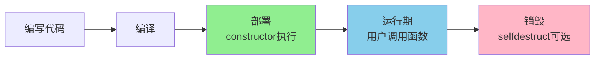
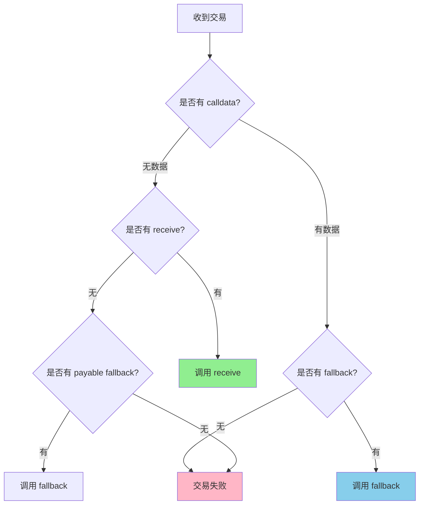

# 合约结构与核心组成

> 深入理解智能合约的组成要素和高级特性

Solidity 智能合约是部署在以太坊区块链上的程序，由**状态变量、函数、事件、修饰符**等核心组件组成，运行于以太坊虚拟机（EVM）。

## 合约基本结构

```solidity
// SPDX-License-Identifier: MIT
pragma solidity ^0.8.20;

contract MyContract {
    // ==================== 状态变量 ====================
    uint256 public value;
    address public owner;

    // ==================== 事件 ====================
    event ValueChanged(uint256 newValue);

    // ==================== 修饰符 ====================
    modifier onlyOwner() {
        require(msg.sender == owner, "Not owner");
        _;
    }

    // ==================== 构造函数 ====================
    constructor(uint256 _value) {
        value = _value;
        owner = msg.sender;
    }

    // ==================== 函数 ====================
    function setValue(uint256 _v) public onlyOwner {
        value = _v;
        emit ValueChanged(_v);
    }
}
```

## 合约生命周期

智能合约的生命周期分为三个主要阶段：



| 阶段 | 说明 | 特点 |
|------|------|------|
| **构造部署** | 部署时运行 `constructor` | 仅执行一次，初始化状态 |
| **运行期** | 用户调用、状态改变 | 持续运行，直到合约销毁 |
| **销毁阶段** | 可选，`selfdestruct()` 删除合约 | ⚠️ 慎用，资金转移到指定地址 |

### 构造函数详解

```solidity
contract ConstructorExample {
    address public owner;
    uint256 public initialValue;
    uint256 public deployTime;

    // ✅ 构造函数：仅在部署时执行一次
    constructor(uint256 _initialValue) {
        owner = msg.sender;
        initialValue = _initialValue;
        deployTime = block.timestamp;
    }

    // ❌ 错误：构造函数不能有返回值
    // constructor() returns (uint256) { }

    // ❌ 错误：构造函数不能有修饰符（除 payable）
    // modifier onlyOwner() { _; }
    // constructor() onlyOwner { }

    // ✅ 正确：构造函数可以 payable
    constructor() payable {
        owner = msg.sender;
    }
}
```

> [!TIP] 构造函数最佳实践
> - 仅用于初始化状态变量
> - 避免复杂逻辑（节省部署 Gas）
> - 可以使用 `payable` 接收初始资金
> - 不能被外部调用（自动执行）

## 状态变量与作用域

### 状态变量可见性

```solidity
contract VisibilityExample {
    // public：自动生成 getter
    uint256 public publicVar = 100;

    // internal：默认可见性，子合约可访问
    uint256 internal internalVar = 200;

    // private：仅当前合约，子合约不可访问
    uint256 private privateVar = 300;

    // ❌ 状态变量不能是 external
    // uint256 external externalVar;
}
```

| 可见性 | 当前合约 | 子合约 | 外部访问 | 自动 getter |
|--------|---------|--------|---------|------------|
| `public` | ✅ | ✅ | ✅ | ✅ 是 |
| `internal` | ✅ | ✅ | ❌ | ❌ 否 |
| `private` | ✅ | ❌ | ❌ | ❌ 否 |

### 作用域类型

```solidity
contract ScopeExample {
    // ==================== 状态变量：合约级作用域 ====================
    uint256 stateVar = 100;

    function example() public view returns (uint256) {
        // ==================== 局部变量：函数级作用域 ====================
        uint256 localVar = 50;

        // ==================== 全局变量：EVM 提供 ====================
        address sender = msg.sender;
        uint256 timestamp = block.timestamp;

        return stateVar + localVar;
    }

    // ❌ 错误：局部变量不能在函数外访问
    // uint256 x = localVar; // 编译错误
}
```

| 类型 | 作用域 | 存储位置 | 生命周期 |
|------|--------|---------|---------|
| **状态变量** | 整个合约 | storage | 永久 |
| **局部变量** | 函数内 | memory/stack | 函数执行期间 |
| **全局变量** | 任何位置 | - | EVM 提供 |

## 枚举与结构体

### 枚举（Enum）

枚举用于定义有限的状态集合，常用于状态机模式。

```solidity
contract EnumExample {
    // 定义枚举
    enum OrderStatus {
        Pending,    // 0
        Approved,   // 1
        Shipping,   // 2
        Delivered,  // 3
        Cancelled   // 4
    }

    // 使用枚举
    OrderStatus public status;

    constructor() {
        status = OrderStatus.Pending; // 初始状态
    }

    // 状态转换
    function approve() public {
        require(status == OrderStatus.Pending, "Invalid status");
        status = OrderStatus.Approved;
    }

    function ship() public {
        require(status == OrderStatus.Approved, "Not approved yet");
        status = OrderStatus.Shipping;
    }

    // 获取枚举值
    function getStatus() public view returns (OrderStatus) {
        return status;
    }

    // 枚举与 uint 转换
    function getStatusAsUint() public view returns (uint256) {
        return uint256(status);
    }

    // 重置为默认值（第一个枚举值）
    function reset() public {
        delete status; // status = OrderStatus.Pending
    }
}
```

**枚举的优势：**
- ✅ 代码可读性强（避免魔法数字）
- ✅ 类型安全（编译时检查）
- ✅ Gas 优化（底层存储为 uint8）

### 结构体（Struct）

结构体用于打包多个相关变量为自定义类型。

```solidity
contract StructExample {
    // 定义结构体
    struct User {
        string name;
        uint256 age;
        address wallet;
        bool isActive;
    }

    // 状态变量：单个结构体
    User public admin;

    // 状态变量：结构体数组
    User[] public users;

    // 状态变量：结构体映射
    mapping(address => User) public userMap;

    // ==================== 创建结构体 ====================

    // 方法 1：命名参数（推荐）
    function createUser1() public {
        users.push(User({
            name: "Alice",
            age: 25,
            wallet: msg.sender,
            isActive: true
        }));
    }

    // 方法 2：位置参数（不推荐，易出错）
    function createUser2() public {
        users.push(User("Bob", 30, msg.sender, true));
    }

    // 方法 3：逐个赋值
    function createUser3() public {
        User memory newUser;
        newUser.name = "Charlie";
        newUser.age = 35;
        newUser.wallet = msg.sender;
        newUser.isActive = true;

        users.push(newUser);
    }

    // ==================== 修改结构体 ====================

    function updateUser(uint256 index, string memory newName) public {
        require(index < users.length, "Index out of bounds");

        // storage 引用：直接修改区块链数据
        User storage user = users[index];
        user.name = newName;
    }

    function getUserCopy(uint256 index) public view returns (User memory) {
        require(index < users.length, "Index out of bounds");

        // memory 副本：不会修改原数据
        User memory userCopy = users[index];
        return userCopy;
    }

    // ==================== 删除结构体 ====================

    function deactivateUser(uint256 index) public {
        require(index < users.length, "Index out of bounds");

        // delete：重置为默认值
        delete users[index];
        // 结果：name = "", age = 0, wallet = 0x0, isActive = false
    }
}
```

**结构体最佳实践：**

```solidity
// ✅ 好的结构体设计
struct Order {
    uint256 id;
    address buyer;
    uint256 amount;
    OrderStatus status;
    uint256 timestamp;
}

// ❌ 避免：嵌套过深的结构体（Gas 高昂）
struct BadStruct {
    struct InnerStruct1 {
        struct InnerStruct2 {
            uint256 value;
        }
        InnerStruct2 inner2;
    }
    InnerStruct1 inner1;
}
```

## 数组与映射进阶

### 数组的高级用法

```solidity
contract AdvancedArrays {
    uint256[] public numbers;

    // 初始化数组
    function initializeArray() public {
        numbers = [1, 2, 3, 4, 5];
    }

    // 批量添加（注意 Gas 成本）
    function batchPush(uint256[] memory newNumbers) public {
        for (uint256 i = 0; i < newNumbers.length; i++) {
            numbers.push(newNumbers[i]);
        }
    }

    // 删除中间元素（方法 1：移位）
    function removeByShift(uint256 index) public {
        require(index < numbers.length, "Index out of bounds");

        // 将后面的元素前移
        for (uint256 i = index; i < numbers.length - 1; i++) {
            numbers[i] = numbers[i + 1];
        }
        numbers.pop();
    }

    // 删除中间元素（方法 2：交换-弹出，不保持顺序）
    function removeBySwap(uint256 index) public {
        require(index < numbers.length, "Index out of bounds");

        // 将最后一个元素移到要删除的位置
        numbers[index] = numbers[numbers.length - 1];
        numbers.pop();
    }

    // 清空数组
    function clearArray() public {
        delete numbers; // length = 0
    }
}
```

### 映射的高级用法

```solidity
contract AdvancedMappings {
    // 三层嵌套映射：用户 => 代币 => 授权者 => 额度
    mapping(address => mapping(address => mapping(address => uint256))) public complexAllowances;

    // 映射 + 结构体
    struct UserProfile {
        string username;
        uint256 balance;
        uint256 joinedAt;
    }

    mapping(address => UserProfile) public profiles;

    // 映射 + 数组：维护键列表
    mapping(address => uint256) public balances;
    address[] public users;

    function addUser() public {
        if (balances[msg.sender] == 0) {
            users.push(msg.sender); // 记录新用户
        }
        balances[msg.sender] += 100;
    }

    // 遍历所有用户（⚠️ Gas 密集型）
    function getTotalBalance() public view returns (uint256) {
        uint256 total = 0;
        for (uint256 i = 0; i < users.length; i++) {
            total += balances[users[i]];
        }
        return total;
    }
}
```

## 事件（Events）

事件是 Solidity 与外部世界通信的重要机制，用于记录链上日志。

### 事件声明与使用

```solidity
contract EventExample {
    // ==================== 事件声明 ====================

    // 简单事件
    event Transfer(address indexed from, address indexed to, uint256 amount);

    // 多参数事件（最多 3 个 indexed）
    event OrderCreated(
        uint256 indexed orderId,
        address indexed buyer,
        address indexed seller,
        uint256 amount,
        uint256 timestamp
    );

    // ==================== 触发事件 ====================

    function transfer(address to, uint256 amount) public {
        // 业务逻辑...

        emit Transfer(msg.sender, to, amount);
    }

    // ==================== indexed 的作用 ====================

    // indexed 参数可用于筛选
    // 例如：查询 "所有从 Alice 转账的记录"
    // logs = contract.queryFilter(contract.filters.Transfer(aliceAddress, null, null))
}
```

### 事件的底层原理

```solidity
contract EventInternals {
    event LogExample(
        address indexed sender,
        uint256 indexed value,
        string message
    );

    function emitLog() public {
        emit LogExample(msg.sender, 123, "Hello");
    }

    // 底层编码结构：
    // topics[0] = keccak256("LogExample(address,uint256,string)")
    // topics[1] = msg.sender（left-padded to 32 bytes）
    // topics[2] = 123（left-padded to 32 bytes）
    // data = abi.encode("Hello")
}
```

| 特性 | `indexed` 参数 | 非 `indexed` 参数 |
|------|---------------|------------------|
| **存储位置** | topics（易于筛选） | data（ABI 编码） |
| **最大数量** | 3 个 | 无限制 |
| **Gas 成本** | 高（每个 ~375 Gas） | 低（~8 Gas/字节） |
| **可筛选性** | ✅ 可高效筛选 | ❌ 需解析全部 data |

### 前端监听事件

```typescript
// 使用 ethers.js v6 监听事件
const contract = new ethers.Contract(address, abi, provider);

// 监听单个事件
contract.on("Transfer", (from, to, amount, event) => {
    console.log(`${from} → ${to}: ${amount}`);
});

// 筛选特定地址的转账
const filter = contract.filters.Transfer(aliceAddress, null, null);
const events = await contract.queryFilter(filter);

// 监听过去的事件
const pastEvents = await contract.queryFilter(
    contract.filters.Transfer(),
    startBlock,
    endBlock
);
```

## 函数修饰符（Modifiers）

修饰符用于复用验证逻辑，提高代码可读性。

### 基础修饰符

```solidity
contract ModifierBasics {
    address public owner;

    constructor() {
        owner = msg.sender;
    }

    // ==================== 基础修饰符 ====================

    modifier onlyOwner() {
        require(msg.sender == owner, "Not owner");
        _; // 插入函数体
    }

    function changeOwner(address newOwner) public onlyOwner {
        owner = newOwner;
    }

    // ==================== 带参数的修饰符 ====================

    modifier costs(uint256 price) {
        require(msg.value >= price, "Insufficient payment");
        _;
    }

    function buyItem() public payable costs(1 ether) {
        // 购买逻辑...
    }

    // ==================== 多个修饰符 ====================

    bool public paused;

    modifier whenNotPaused() {
        require(!paused, "Contract is paused");
        _;
    }

    function importantFunction() public onlyOwner whenNotPaused {
        // 先执行 onlyOwner，再执行 whenNotPaused，最后执行函数体
    }
}
```

### 修饰符的执行顺序

```solidity
contract ModifierOrder {
    event Log(string message);

    modifier modA() {
        emit Log("modA start");
        _;
        emit Log("modA end");
    }

    modifier modB() {
        emit Log("modB start");
        _;
        emit Log("modB end");
    }

    function test() public modA modB {
        emit Log("function body");
    }

    // 执行顺序：
    // 1. modA start
    // 2. modB start
    // 3. function body
    // 4. modB end
    // 5. modA end
}
```

### 修饰符最佳实践

```solidity
contract ModifierBestPractices {
    // ✅ 好的修饰符：单一职责
    modifier validAddress(address addr) {
        require(addr != address(0), "Invalid address");
        _;
    }

    modifier hasBalance(uint256 amount) {
        require(balances[msg.sender] >= amount, "Insufficient balance");
        _;
    }

    // ❌ 避免：修饰符中修改状态（难以理解）
    modifier badModifier() {
        balances[msg.sender] -= 100; // ❌ 在修饰符中修改状态
        _;
    }

    // ✅ 推荐：修饰符仅做验证
    function withdraw(uint256 amount)
        public
        validAddress(msg.sender)
        hasBalance(amount)
    {
        balances[msg.sender] -= amount; // 状态修改在函数体
    }
}
```

## receive 和 fallback 函数

这两个特殊函数用于处理 ETH 接收和未匹配的函数调用。

### receive() 函数

**作用：** 接收 ETH 的专用函数（无 calldata）

```solidity
contract ReceiveExample {
    event Received(address sender, uint256 amount);

    // ✅ receive：仅接收 ETH（无数据）
    receive() external payable {
        emit Received(msg.sender, msg.value);
    }

    // 使用场景：
    // - 用户直接向合约转账
    // - address.transfer() 或 address.send()
    // - 低级 call{value: x}("")
}
```

### fallback() 函数

**作用：** 处理未匹配的函数调用或带数据的 ETH 接收

```solidity
contract FallbackExample {
    event FallbackCalled(address sender, uint256 value, bytes data);

    // ✅ fallback：处理未知函数调用
    fallback() external payable {
        emit FallbackCalled(msg.sender, msg.value, msg.data);
    }

    // 使用场景：
    // - 调用不存在的函数
    // - 接收 ETH + calldata
    // - 代理合约转发调用
}
```

### receive vs fallback 决策树



| 场景 | calldata | msg.value | 调用函数 |
|------|----------|-----------|---------|
| 纯转账 | 空 | > 0 | `receive()` |
| 转账 + 数据 | 非空 | > 0 | `fallback()` |
| 调用不存在的函数 | 非空 | 任意 | `fallback()` |
| 无 receive/fallback | - | > 0 | ❌ 失败 |

### 完整示例

```solidity
contract ReceiveVsFallback {
    event ReceiveCalled(address sender, uint256 amount);
    event FallbackCalled(address sender, uint256 value, bytes data);

    receive() external payable {
        emit ReceiveCalled(msg.sender, msg.value);
    }

    fallback() external payable {
        emit FallbackCalled(msg.sender, msg.value, msg.data);
    }

    // 测试方法
    function getBalance() public view returns (uint256) {
        return address(this).balance;
    }
}

// ==================== 调用示例 ====================

contract Caller {
    function testReceive(address target) public payable {
        // ✅ 调用 receive
        (bool success, ) = target.call{value: msg.value}("");
        require(success);
    }

    function testFallback(address target) public payable {
        // ✅ 调用 fallback
        (bool success, ) = target.call{value: msg.value}(
            abi.encodeWithSignature("nonExistentFunction()")
        );
        require(success);
    }
}
```

> [!WARNING] 安全警告
> - `receive` 和 `fallback` 应保持简单（Gas 限制 2300）
> - 避免复杂逻辑（如循环、外部调用）
> - 使用事件记录所有接收的 ETH

## 库（Library）

库是可复用的代码模块，不能有状态变量，不能接收 ETH。

### 库的定义和使用

```solidity
// ==================== 定义库 ====================

library SafeMath {
    // internal 函数：调用时会被内联到合约中
    function add(uint256 a, uint256 b) internal pure returns (uint256) {
        uint256 c = a + b;
        require(c >= a, "SafeMath: addition overflow");
        return c;
    }

    function sub(uint256 a, uint256 b) internal pure returns (uint256) {
        require(b <= a, "SafeMath: subtraction underflow");
        return a - b;
    }
}

library StringUtils {
    // public 函数：会生成单独的合约调用（delegatecall）
    function concat(string memory a, string memory b)
        public
        pure
        returns (string memory)
    {
        return string(abi.encodePacked(a, b));
    }

    function length(string memory s) public pure returns (uint256) {
        return bytes(s).length;
    }
}

// ==================== 使用库：using for ====================

contract LibraryExample {
    using SafeMath for uint256;
    using StringUtils for string;

    uint256 public value;

    function calculate(uint256 a, uint256 b) public pure returns (uint256) {
        // 方法 1：using for 语法（推荐）
        return a.add(b).sub(10);

        // 方法 2：直接调用
        // return SafeMath.sub(SafeMath.add(a, b), 10);
    }

    function testString() public pure returns (string memory) {
        string memory s1 = "Hello";
        string memory s2 = " World";

        // using for 语法
        return s1.concat(s2); // "Hello World"
    }
}
```

### 库的限制

```solidity
library MyLibrary {
    // ❌ 库不能有状态变量
    // uint256 public value;

    // ❌ 库不能继承或被继承
    // contract Base { }
    // library MyLib is Base { }

    // ❌ 库不能接收 ETH
    // receive() external payable { }

    // ✅ 库可以有 struct、enum
    struct Data {
        uint256 value;
    }

    // ✅ 库可以有 internal 和 public 函数
    function internalFunc() internal pure returns (uint256) {
        return 1;
    }

    function publicFunc() public pure returns (uint256) {
        return 2;
    }
}
```

### 常用库示例

```solidity
// Address 库：安全的地址操作
library Address {
    function isContract(address account) internal view returns (bool) {
        return account.code.length > 0;
    }

    function sendValue(address payable recipient, uint256 amount) internal {
        require(address(this).balance >= amount, "Insufficient balance");
        (bool success, ) = recipient.call{value: amount}("");
        require(success, "Transfer failed");
    }
}

// Arrays 库：数组操作
library Arrays {
    function sum(uint256[] memory arr) internal pure returns (uint256) {
        uint256 total = 0;
        for (uint256 i = 0; i < arr.length; i++) {
            total += arr[i];
        }
        return total;
    }

    function remove(uint256[] storage arr, uint256 index) internal {
        require(index < arr.length, "Index out of bounds");
        arr[index] = arr[arr.length - 1];
        arr.pop();
    }
}
```

## 接口（Interface）

接口定义了合约的外部 API，用于实现多态和模块化设计。

### 接口定义规则

```solidity
// ==================== 接口定义 ====================

interface IERC20 {
    // ✅ 接口中所有函数必须是 external
    function totalSupply() external view returns (uint256);
    function balanceOf(address account) external view returns (uint256);
    function transfer(address to, uint256 amount) external returns (bool);

    // ✅ 接口可以有事件
    event Transfer(address indexed from, address indexed to, uint256 value);

    // ❌ 接口不能有构造函数
    // constructor() { }

    // ❌ 接口不能有状态变量
    // uint256 public totalSupply;

    // ❌ 接口函数不能有实现
    // function transfer(...) external returns (bool) {
    //     return true;
    // }
}

// ==================== 实现接口 ====================

contract MyToken is IERC20 {
    mapping(address => uint256) private balances;
    uint256 private _totalSupply;

    // 必须实现接口中的所有函数
    function totalSupply() external view override returns (uint256) {
        return _totalSupply;
    }

    function balanceOf(address account) external view override returns (uint256) {
        return balances[account];
    }

    function transfer(address to, uint256 amount) external override returns (bool) {
        balances[msg.sender] -= amount;
        balances[to] += amount;
        emit Transfer(msg.sender, to, amount);
        return true;
    }
}
```

### 接口的使用场景

```solidity
// 场景 1：与外部合约交互
contract DApp {
    // 通过接口调用外部 ERC20 合约
    function getBalance(address tokenAddress, address user)
        public
        view
        returns (uint256)
    {
        IERC20 token = IERC20(tokenAddress);
        return token.balanceOf(user);
    }
}

// 场景 2：多态性
contract TokenSwap {
    function swap(address tokenA, address tokenB, uint256 amount) public {
        IERC20(tokenA).transferFrom(msg.sender, address(this), amount);
        IERC20(tokenB).transfer(msg.sender, amount);
    }
}
```

## 抽象合约（Abstract Contract）

抽象合约介于普通合约和接口之间，允许部分函数未实现。

```solidity
// ==================== 抽象合约 ====================

abstract contract Animal {
    // 抽象函数：没有实现体
    function makeSound() public virtual returns (string memory);

    // 具体函数：有实现体
    function sleep() public pure returns (string memory) {
        return "Sleeping...";
    }

    // 状态变量（接口不允许）
    string public name;

    constructor(string memory _name) {
        name = _name;
    }
}

// ==================== 继承抽象合约 ====================

contract Dog is Animal {
    constructor() Animal("Dog") {}

    // 必须实现抽象函数
    function makeSound() public pure override returns (string memory) {
        return "Woof!";
    }
}

contract Cat is Animal {
    constructor() Animal("Cat") {}

    function makeSound() public pure override returns (string memory) {
        return "Meow!";
    }
}
```

| 特性 | Interface | Abstract Contract | Contract |
|------|-----------|-------------------|----------|
| **状态变量** | ❌ | ✅ | ✅ |
| **构造函数** | ❌ | ✅ | ✅ |
| **函数实现** | ❌ 全部未实现 | ⚠️ 部分未实现 | ✅ 全部实现 |
| **继承** | `is` | `is` | `is` |
| **实例化** | ❌ | ❌ | ✅ |

## 合约继承

Solidity 支持多重继承和虚函数重写。

### 单继承

```solidity
contract Parent {
    string public name = "Parent";

    function getName() public virtual returns (string memory) {
        return name;
    }
}

contract Child is Parent {
    function getName() public override returns (string memory) {
        return "Child";
    }
}
```

### 多重继承

```solidity
contract A {
    function foo() public virtual pure returns (string memory) {
        return "A";
    }
}

contract B {
    function bar() public virtual pure returns (string memory) {
        return "B";
    }
}

// 多重继承：从左到右
contract C is A, B {
    function foo() public pure override returns (string memory) {
        return "C";
    }
}
```

### 钻石继承问题

```solidity
contract Base {
    function test() public virtual pure returns (string memory) {
        return "Base";
    }
}

contract Left is Base {
    function test() public virtual override pure returns (string memory) {
        return "Left";
    }
}

contract Right is Base {
    function test() public virtual override pure returns (string memory) {
        return "Right";
    }
}

// ⚠️ 必须明确指定继承顺序
contract Child is Left, Right {
    // 必须 override，因为有多个父合约实现了 test
    function test() public pure override(Left, Right) returns (string memory) {
        return "Child";
    }
}
```

### super 关键字

```solidity
contract GrandParent {
    function greet() public virtual pure returns (string memory) {
        return "GrandParent";
    }
}

contract Parent is GrandParent {
    function greet() public virtual override pure returns (string memory) {
        return string(abi.encodePacked(super.greet(), " -> Parent"));
    }
}

contract Child is Parent {
    function greet() public pure override returns (string memory) {
        return string(abi.encodePacked(super.greet(), " -> Child"));
    }
    // 输出："GrandParent -> Parent -> Child"
}
```

## 导入机制（Import）

Solidity 支持多种导入方式，用于代码复用。

### 导入语法

```solidity
// ==================== 1. 导入整个文件 ====================
import "./MyContract.sol";
import "@openzeppelin/contracts/token/ERC20/ERC20.sol";

// ==================== 2. 导入特定符号 ====================
import {MyToken, MyNFT} from "./Tokens.sol";
import {ERC20} from "@openzeppelin/contracts/token/ERC20/ERC20.sol";

// ==================== 3. 重命名导入 ====================
import {ERC20 as MyERC20} from "@openzeppelin/contracts/token/ERC20/ERC20.sol";

// ==================== 4. 导入所有符号 ====================
import * as Tokens from "./Tokens.sol";
// 使用：Tokens.MyToken

// ==================== 5. 全局导入（不推荐） ====================
import "./MyContract.sol" as MyContract;
```

### 导入路径解析

| 路径类型 | 示例 | 说明 |
|---------|------|------|
| **相对路径** | `"./Token.sol"` | 相对于当前文件 |
| **绝对路径** | `"/contracts/Token.sol"` | 从项目根目录 |
| **NPM 包** | `"@openzeppelin/contracts/..."` | Node modules |
| **Remappings** | `"@oz/=node_modules/@openzeppelin/"` | 自定义映射 |

### Hardhat / Foundry 配置

**Hardhat:**
```javascript
// hardhat.config.js
module.exports = {
  solidity: "0.8.20",
  paths: {
    sources: "./contracts",
    artifacts: "./artifacts"
  }
};
```

**Foundry:**
```toml
# foundry.toml
[profile.default]
src = "src"
libs = ["lib"]
remappings = [
    "@openzeppelin/=lib/openzeppelin-contracts/",
    "@uniswap/=lib/uniswap-v3-core/"
]
```

## 完整项目示例

下面是一个整合所有知识点的完整 DAO 投票合约：

```solidity
// SPDX-License-Identifier: MIT
pragma solidity ^0.8.20;

/**
 * @title SimpleDAO
 * @dev 综合示例：简单的 DAO 投票合约
 *
 * 功能：
 * - 创建提案
 * - 成员投票
 * - 执行已批准的提案
 * - 演示所有合约核心知识点
 */
contract SimpleDAO {
    // ==================== 枚举：提案状态 ====================

    enum ProposalStatus {
        Pending,
        Approved,
        Rejected,
        Executed
    }

    // ==================== 结构体：提案 ====================

    struct Proposal {
        uint256 id;
        string description;
        address proposer;
        uint256 votesFor;
        uint256 votesAgainst;
        uint256 deadline;
        ProposalStatus status;
        bool executed;
    }

    // ==================== 状态变量 ====================

    address public immutable owner;
    uint256 public proposalCount;
    uint256 public constant VOTING_PERIOD = 7 days;

    mapping(uint256 => Proposal) public proposals;
    mapping(address => bool) public members;
    mapping(uint256 => mapping(address => bool)) public hasVoted;

    address[] public memberList;

    // ==================== 事件 ====================

    event MemberAdded(address indexed member);
    event MemberRemoved(address indexed member);
    event ProposalCreated(uint256 indexed proposalId, string description, address indexed proposer);
    event Voted(uint256 indexed proposalId, address indexed voter, bool support);
    event ProposalExecuted(uint256 indexed proposalId);
    event FundsReceived(address indexed sender, uint256 amount);

    // ==================== 自定义错误 ====================

    error NotOwner(address caller);
    error NotMember(address caller);
    error AlreadyVoted(uint256 proposalId, address voter);
    error ProposalNotFound(uint256 proposalId);
    error VotingEnded(uint256 proposalId);
    error ProposalNotApproved(uint256 proposalId);

    // ==================== 修饰符 ====================

    modifier onlyOwner() {
        if (msg.sender != owner) {
            revert NotOwner(msg.sender);
        }
        _;
    }

    modifier onlyMember() {
        if (!members[msg.sender]) {
            revert NotMember(msg.sender);
        }
        _;
    }

    modifier proposalExists(uint256 proposalId) {
        if (proposalId >= proposalCount) {
            revert ProposalNotFound(proposalId);
        }
        _;
    }

    // ==================== 构造函数 ====================

    constructor() {
        owner = msg.sender;
        members[msg.sender] = true;
        memberList.push(msg.sender);
    }

    // ==================== receive/fallback ====================

    receive() external payable {
        emit FundsReceived(msg.sender, msg.value);
    }

    fallback() external payable {
        emit FundsReceived(msg.sender, msg.value);
    }

    // ==================== 成员管理 ====================

    function addMember(address member) external onlyOwner {
        require(member != address(0), "Invalid address");
        require(!members[member], "Already a member");

        members[member] = true;
        memberList.push(member);

        emit MemberAdded(member);
    }

    function removeMember(address member) external onlyOwner {
        require(members[member], "Not a member");

        members[member] = false;
        emit MemberRemoved(member);
    }

    function getMemberCount() external view returns (uint256) {
        return memberList.length;
    }

    // ==================== 提案管理 ====================

    function createProposal(string memory description) external onlyMember returns (uint256) {
        uint256 proposalId = proposalCount++;

        proposals[proposalId] = Proposal({
            id: proposalId,
            description: description,
            proposer: msg.sender,
            votesFor: 0,
            votesAgainst: 0,
            deadline: block.timestamp + VOTING_PERIOD,
            status: ProposalStatus.Pending,
            executed: false
        });

        emit ProposalCreated(proposalId, description, msg.sender);
        return proposalId;
    }

    function vote(uint256 proposalId, bool support)
        external
        onlyMember
        proposalExists(proposalId)
    {
        Proposal storage proposal = proposals[proposalId];

        // 检查投票截止时间
        if (block.timestamp > proposal.deadline) {
            revert VotingEnded(proposalId);
        }

        // 检查是否已投票
        if (hasVoted[proposalId][msg.sender]) {
            revert AlreadyVoted(proposalId, msg.sender);
        }

        // 记录投票
        hasVoted[proposalId][msg.sender] = true;

        if (support) {
            proposal.votesFor++;
        } else {
            proposal.votesAgainst++;
        }

        emit Voted(proposalId, msg.sender, support);

        // 更新提案状态
        _updateProposalStatus(proposalId);
    }

    function executeProposal(uint256 proposalId)
        external
        onlyOwner
        proposalExists(proposalId)
    {
        Proposal storage proposal = proposals[proposalId];

        require(proposal.status == ProposalStatus.Approved, "Not approved");
        require(!proposal.executed, "Already executed");
        require(block.timestamp > proposal.deadline, "Voting still ongoing");

        proposal.executed = true;
        proposal.status = ProposalStatus.Executed;

        // 这里可以添加实际的执行逻辑
        // 例如：转账、修改参数等

        emit ProposalExecuted(proposalId);
    }

    // ==================== 内部函数 ====================

    function _updateProposalStatus(uint256 proposalId) internal {
        Proposal storage proposal = proposals[proposalId];

        if (block.timestamp > proposal.deadline) {
            if (proposal.votesFor > proposal.votesAgainst) {
                proposal.status = ProposalStatus.Approved;
            } else {
                proposal.status = ProposalStatus.Rejected;
            }
        }
    }

    // ==================== 查询函数 ====================

    function getProposal(uint256 proposalId)
        external
        view
        proposalExists(proposalId)
        returns (Proposal memory)
    {
        return proposals[proposalId];
    }

    function getVoteStatus(uint256 proposalId, address voter)
        external
        view
        returns (bool)
    {
        return hasVoted[proposalId][voter];
    }

    function getContractBalance() external view returns (uint256) {
        return address(this).balance;
    }
}
```
