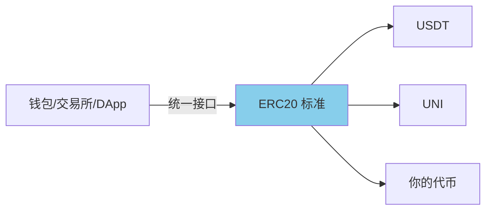
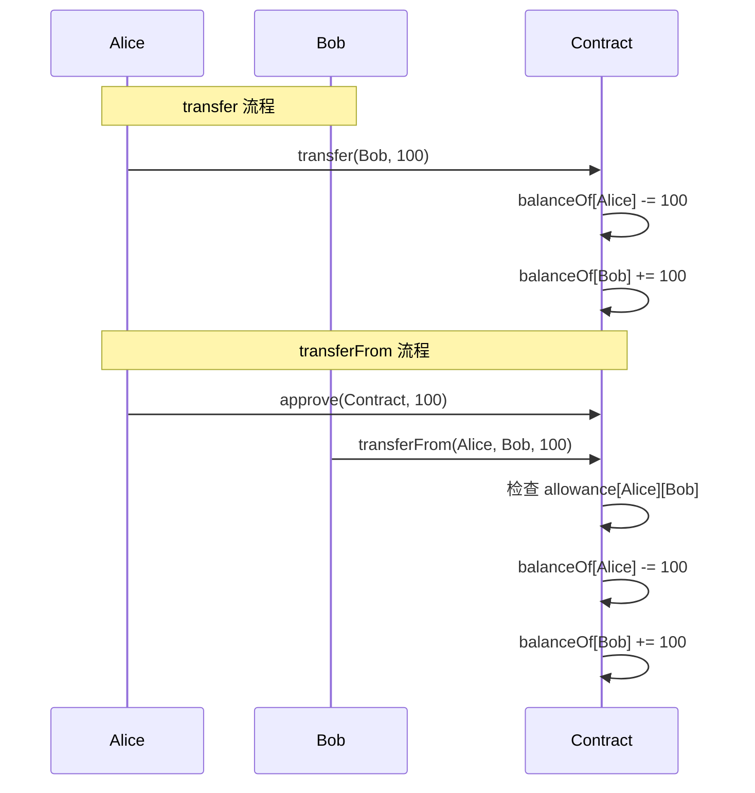
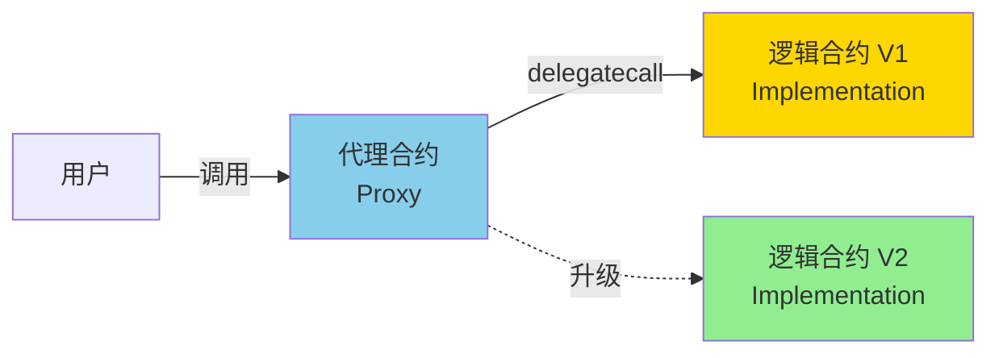

# 代币标准与常见合约

> 理解代币标准的工作原理和底层机制

> [!TIP] 学习路径
> 本章通过**手写代码**帮助你理解代币标准的工作原理。
>
> 学习完本章后，建议继续学习：
> - 📘 [OpenZeppelin Token](./10_ecosystem/01_openzeppelin/03_token.md) - 生产级代币开发
> - 🔐 [OpenZeppelin Security](./10_ecosystem/01_openzeppelin/06_security.md) - 代币安全最佳实践
> - 🔄 [OpenZeppelin Proxy](./10_ecosystem/01_openzeppelin/04_proxy.md) - 可升级合约详解

## 为什么需要代币标准？

在以太坊上，任何人都可以创建自己的代币合约。但如果每个合约的接口都不一样，钱包、交易所、DApp 如何与它们交互？

**代币标准（Token Standards）** 解决了这个问题：
- ✅ **统一接口**：所有代币遵循相同的函数名和行为
- ✅ **互操作性**：钱包和 DApp 可以支持所有符合标准的代币
- ✅ **可组合性**：不同合约可以相互调用



## ERC20 - 同质化代币标准

**ERC20** 是以太坊上最常用的代币标准，用于创建**同质化代币（Fungible Token）**。

### 什么是同质化？

- ✅ **可互换**：Alice 的 1 个 USDT = Bob 的 1 个 USDT
- ✅ **可分割**：支持小数位（如 0.5 个代币）
- ✅ **无差异**：所有代币完全相同

**适用场景：** 货币、积分、治理代币、DeFi 代币

### ERC20 核心接口

```solidity
interface IERC20 {
    // 查询
    function totalSupply() external view returns (uint256);
    function balanceOf(address account) external view returns (uint256);
    function allowance(address owner, address spender) external view returns (uint256);

    // 操作
    function transfer(address to, uint256 amount) external returns (bool);
    function approve(address spender, uint256 amount) external returns (bool);
    function transferFrom(address from, address to, uint256 amount) external returns (bool);

    // 事件
    event Transfer(address indexed from, address indexed to, uint256 value);
    event Approval(address indexed owner, address indexed spender, uint256 value);
}
```

### 手写 ERC20 实现

让我们从零开始实现一个简单的 ERC20 代币，理解其工作原理：

```solidity
// SPDX-License-Identifier: MIT
pragma solidity ^0.8.20;

/**
 * @title SimpleERC20
 * @dev 手写 ERC20 实现，理解工作原理
 */
contract SimpleERC20 {
    // ==================== 状态变量 ====================

    string public name = "Simple Token";    // 代币名称
    string public symbol = "STK";           // 代币符号
    uint8 public decimals = 18;             // 小数位数（18 位是标准）
    uint256 public totalSupply;             // 总供应量

    // 余额映射：地址 => 余额
    mapping(address => uint256) public balanceOf;

    // 授权映射：所有者 => 授权者 => 额度
    mapping(address => mapping(address => uint256)) public allowance;

    // ==================== 事件 ====================

    event Transfer(address indexed from, address indexed to, uint256 value);
    event Approval(address indexed owner, address indexed spender, uint256 value);

    // ==================== 构造函数 ====================

    constructor(uint256 _totalSupply) {
        totalSupply = _totalSupply;
        balanceOf[msg.sender] = totalSupply;  // 全部代币给部署者
        emit Transfer(address(0), msg.sender, totalSupply);
    }

    // ==================== 核心功能 ====================

    /**
     * @dev 转账：从自己账户转给别人
     * @param to 接收者地址
     * @param amount 转账数量
     */
    function transfer(address to, uint256 amount) public returns (bool) {
        require(to != address(0), "Cannot transfer to zero address");
        require(balanceOf[msg.sender] >= amount, "Insufficient balance");

        // 更新余额
        balanceOf[msg.sender] -= amount;
        balanceOf[to] += amount;

        emit Transfer(msg.sender, to, amount);
        return true;
    }

    /**
     * @dev 授权：允许 spender 使用你的代币
     * @param spender 被授权者地址
     * @param amount 授权额度
     */
    function approve(address spender, uint256 amount) public returns (bool) {
        require(spender != address(0), "Cannot approve zero address");

        allowance[msg.sender][spender] = amount;

        emit Approval(msg.sender, spender, amount);
        return true;
    }

    /**
     * @dev 授权转账：使用别人授权给你的代币
     * @param from 代币所有者
     * @param to 接收者
     * @param amount 转账数量
     */
    function transferFrom(address from, address to, uint256 amount) public returns (bool) {
        require(from != address(0), "Cannot transfer from zero address");
        require(to != address(0), "Cannot transfer to zero address");
        require(balanceOf[from] >= amount, "Insufficient balance");
        require(allowance[from][msg.sender] >= amount, "Allowance exceeded");

        // 更新余额和授权额度
        balanceOf[from] -= amount;
        balanceOf[to] += amount;
        allowance[from][msg.sender] -= amount;

        emit Transfer(from, to, amount);
        return true;
    }
}
```

### transfer vs transferFrom 对比

这是 ERC20 最容易混淆的两个函数：

| 函数 | 谁发起？ | 转谁的钱？ | 需要授权？ | 使用场景 |
|------|---------|----------|-----------|----------|
| **`transfer`** | 自己 | 自己的钱 | ❌ 否 | 普通转账、打款给朋友 |
| **`transferFrom`** | 第三方（合约/用户） | 别人授权的钱 | ✅ 是 | 交易所代扣、DeFi 合约、自动支付 |

**流程对比：**



### 可铸造与可销毁代币

在基础 ERC20 之上，我们可以添加铸币和销毁功能：

```solidity
/**
 * @dev 扩展：添加铸币和销毁功能
 */
contract MintableBurnableToken is SimpleERC20 {
    address public owner;

    event Mint(address indexed to, uint256 amount);
    event Burn(address indexed from, uint256 amount);

    constructor(uint256 _totalSupply) SimpleERC20(_totalSupply) {
        owner = msg.sender;
    }

    modifier onlyOwner() {
        require(msg.sender == owner, "Not owner");
        _;
    }

    /**
     * @dev 铸造新代币（仅 owner）
     * 用途：增发代币、奖励、空投
     */
    function mint(address to, uint256 amount) public onlyOwner {
        require(to != address(0), "Invalid address");

        totalSupply += amount;
        balanceOf[to] += amount;

        emit Mint(to, amount);
        emit Transfer(address(0), to, amount);
    }

    /**
     * @dev 销毁自己的代币
     * 用途：通缩机制、回购销毁、质押惩罚
     */
    function burn(uint256 amount) public {
        require(balanceOf[msg.sender] >= amount, "Insufficient balance");

        balanceOf[msg.sender] -= amount;
        totalSupply -= amount;

        emit Burn(msg.sender, amount);
        emit Transfer(msg.sender, address(0), amount);
    }
}
```

### 小数位的理解

ERC20 的 `decimals` 是一个重要概念：

```solidity
// decimals = 18（标准）
// 用户看到的 "1.5 个代币" 在合约中存储为：
uint256 amount = 1.5 * 10**18 = 1500000000000000000

// decimals = 6（USDC、USDT 使用）
uint256 amount = 1.5 * 10**6 = 1500000
```

**为什么需要小数位？**
- Solidity 不支持浮点数
- 通过整数 + 小数位实现"小数"效果
- 18 位是以太坊标准（与 ETH 的 wei 一致）

### 进一步学习

理解了 ERC20 的工作原理后，实际开发中推荐使用：

- 📘 [OpenZeppelin ERC20](./10_ecosystem/01_openzeppelin/03_token.md#erc20-详解) - 9 种扩展（Burnable、Pausable、Snapshot、Permit、Votes 等）
- 🔐 [安全工具](./10_ecosystem/01_openzeppelin/06_security.md) - ReentrancyGuard、PullPayment
- 🧪 [测试指南](./10_ecosystem/03_testing.md) - 如何测试代币合约

## ERC721 - 非同质化代币标准（NFT）

**ERC721** 是以太坊上的 **NFT（Non-Fungible Token，非同质化代币）** 标准。

### 什么是非同质化？

- ✅ **不可互换**：Token ID #1 ≠ Token ID #2（每个都独一无二）
- ❌ **不可分割**：没有小数位，只能整数转移
- ✅ **独立属性**：每个 NFT 有独立的 metadata（图片、属性等）

**适用场景：** 数字艺术品、收藏品、游戏道具、域名、身份证明

### ERC721 核心接口

```solidity
interface IERC721 {
    // 查询
    function balanceOf(address owner) external view returns (uint256);
    function ownerOf(uint256 tokenId) external view returns (address);

    // 转账
    function transferFrom(address from, address to, uint256 tokenId) external;
    function safeTransferFrom(address from, address to, uint256 tokenId) external;
    function safeTransferFrom(address from, address to, uint256 tokenId, bytes calldata data) external;

    // 授权
    function approve(address to, uint256 tokenId) external;
    function setApprovalForAll(address operator, bool approved) external;
    function getApproved(uint256 tokenId) external view returns (address);
    function isApprovedForAll(address owner, address operator) external view returns (bool);

    // 事件
    event Transfer(address indexed from, address indexed to, uint256 indexed tokenId);
    event Approval(address indexed owner, address indexed approved, uint256 indexed tokenId);
    event ApprovalForAll(address indexed owner, address indexed operator, bool approved);
}
```

### 手写 ERC721 实现

```solidity
// SPDX-License-Identifier: MIT
pragma solidity ^0.8.20;

/**
 * @title SimpleERC721
 * @dev 手写 ERC721 实现，理解 NFT 工作原理
 */
contract SimpleERC721 {
    // ==================== 状态变量 ====================

    string public name = "Simple NFT";
    string public symbol = "SNFT";

    uint256 public nextTokenId;  // 下一个 Token ID

    // Token ID => 所有者
    mapping(uint256 => address) private _owners;

    // 所有者 => NFT 数量
    mapping(address => uint256) private _balances;

    // Token ID => 被授权者
    mapping(uint256 => address) private _tokenApprovals;

    // 所有者 => 操作员 => 是否授权所有 NFT
    mapping(address => mapping(address => bool)) private _operatorApprovals;

    // Token ID => metadata URI
    mapping(uint256 => string) private _tokenURIs;

    // ==================== 事件 ====================

    event Transfer(address indexed from, address indexed to, uint256 indexed tokenId);
    event Approval(address indexed owner, address indexed approved, uint256 indexed tokenId);
    event ApprovalForAll(address indexed owner, address indexed operator, bool approved);

    // ==================== 查询功能 ====================

    /**
     * @dev 查询某地址拥有的 NFT 数量
     */
    function balanceOf(address owner) public view returns (uint256) {
        require(owner != address(0), "Invalid address");
        return _balances[owner];
    }

    /**
     * @dev 查询某 NFT 的所有者
     */
    function ownerOf(uint256 tokenId) public view returns (address) {
        address owner = _owners[tokenId];
        require(owner != address(0), "Token does not exist");
        return owner;
    }

    /**
     * @dev 查询 NFT 的 metadata URI
     */
    function tokenURI(uint256 tokenId) public view returns (string memory) {
        require(_exists(tokenId), "Token does not exist");
        return _tokenURIs[tokenId];
    }

    // ==================== 授权功能 ====================

    /**
     * @dev 授权某人操作你的单个 NFT
     */
    function approve(address to, uint256 tokenId) public {
        address owner = ownerOf(tokenId);
        require(to != owner, "Cannot approve owner");
        require(
            msg.sender == owner || isApprovedForAll(owner, msg.sender),
            "Not authorized"
        );

        _tokenApprovals[tokenId] = to;
        emit Approval(owner, to, tokenId);
    }

    /**
     * @dev 查询某 NFT 被授权给谁
     */
    function getApproved(uint256 tokenId) public view returns (address) {
        require(_exists(tokenId), "Token does not exist");
        return _tokenApprovals[tokenId];
    }

    /**
     * @dev 授权某人操作你的所有 NFT
     */
    function setApprovalForAll(address operator, bool approved) public {
        require(operator != msg.sender, "Cannot approve self");
        _operatorApprovals[msg.sender][operator] = approved;
        emit ApprovalForAll(msg.sender, operator, approved);
    }

    /**
     * @dev 查询是否授权了所有 NFT
     */
    function isApprovedForAll(address owner, address operator) public view returns (bool) {
        return _operatorApprovals[owner][operator];
    }

    // ==================== 转账功能 ====================

    /**
     * @dev 转移 NFT
     */
    function transferFrom(address from, address to, uint256 tokenId) public {
        require(_isApprovedOrOwner(msg.sender, tokenId), "Not authorized");
        require(ownerOf(tokenId) == from, "From address is not owner");
        require(to != address(0), "Cannot transfer to zero address");

        _transfer(from, to, tokenId);
    }

    /**
     * @dev 安全转移 NFT（检查接收者是否支持 ERC721）
     */
    function safeTransferFrom(address from, address to, uint256 tokenId) public {
        safeTransferFrom(from, to, tokenId, "");
    }

    function safeTransferFrom(address from, address to, uint256 tokenId, bytes memory data) public {
        require(_isApprovedOrOwner(msg.sender, tokenId), "Not authorized");
        _transfer(from, to, tokenId);
        require(_checkOnERC721Received(from, to, tokenId, data), "Receiver not implemented");
    }

    // ==================== 铸造功能 ====================

    /**
     * @dev 铸造新 NFT
     * @param to 接收者
     * @param uri metadata URI（如 ipfs://Qm...）
     */
    function mint(address to, string memory uri) public {
        require(to != address(0), "Cannot mint to zero address");

        uint256 tokenId = nextTokenId;
        nextTokenId++;

        _balances[to] += 1;
        _owners[tokenId] = to;
        _tokenURIs[tokenId] = uri;

        emit Transfer(address(0), to, tokenId);
    }

    // ==================== 内部函数 ====================

    function _exists(uint256 tokenId) internal view returns (bool) {
        return _owners[tokenId] != address(0);
    }

    function _isApprovedOrOwner(address spender, uint256 tokenId) internal view returns (bool) {
        address owner = ownerOf(tokenId);
        return (
            spender == owner ||
            getApproved(tokenId) == spender ||
            isApprovedForAll(owner, spender)
        );
    }

    function _transfer(address from, address to, uint256 tokenId) internal {
        // 清除授权
        _tokenApprovals[tokenId] = address(0);

        // 更新余额和所有权
        _balances[from] -= 1;
        _balances[to] += 1;
        _owners[tokenId] = to;

        emit Transfer(from, to, tokenId);
    }

    function _checkOnERC721Received(
        address from,
        address to,
        uint256 tokenId,
        bytes memory data
    ) private returns (bool) {
        // 如果接收者是合约，检查是否实现了 onERC721Received
        if (to.code.length > 0) {
            try IERC721Receiver(to).onERC721Received(msg.sender, from, tokenId, data) returns (bytes4 retval) {
                return retval == IERC721Receiver.onERC721Received.selector;
            } catch {
                return false;
            }
        }
        return true;
    }
}

/**
 * @dev 接收者合约必须实现此接口
 */
interface IERC721Receiver {
    function onERC721Received(
        address operator,
        address from,
        uint256 tokenId,
        bytes calldata data
    ) external returns (bytes4);
}
```

### NFT Metadata 结构

NFT 的 `tokenURI` 通常指向一个 JSON 文件：

```json
{
  "name": "My Awesome NFT #1",
  "description": "This is my first NFT",
  "image": "ipfs://QmXXX.../image.png",
  "attributes": [
    {
      "trait_type": "Rarity",
      "value": "Legendary"
    },
    {
      "trait_type": "Power",
      "value": 95
    }
  ]
}
```

**存储位置选择：**

| 方式 | 优点 | 缺点 | 适用场景 |
|-----|------|------|---------|
| **中心化服务器** | 灵活、可修改 | 可能下线、可被篡改 | 测试环境 |
| **IPFS** | 去中心化、内容寻址 | 需要 pinning 服务 | ✅ 生产环境（推荐） |
| **完全链上** | 最安全、永久存储 | Gas 成本极高 | 小型艺术 NFT |

### transfer vs safeTransferFrom

ERC721 有两种转账方式：

```solidity
// ❌ transferFrom：不检查接收者
// 危险：如果接收者是合约但不支持 ERC721，NFT 会永久锁定！
nft.transferFrom(alice, contractAddress, tokenId);

// ✅ safeTransferFrom：检查接收者是否支持 ERC721
// 安全：如果接收者是合约，必须实现 onERC721Received
nft.safeTransferFrom(alice, contractAddress, tokenId);
```

### 进一步学习

理解了 ERC721 的工作原理后，实际开发中推荐使用：

- 📘 [OpenZeppelin ERC721](./10_ecosystem/01_openzeppelin/03_token.md#erc721-详解) - 8 种扩展（URIStorage、Enumerable、Royalty 等）
- 🎨 [NFT Metadata 设计](./10_ecosystem/01_openzeppelin/03_token.md#nft-metadata-最佳实践)
- 🔐 [安全最佳实践](./10_ecosystem/01_openzeppelin/06_security.md)

## 其他代币标准

### ERC1155 - 多代币标准

ERC1155 是一种**多代币标准**，一个合约可以管理多种代币（同质化 + 非同质化）：

**特点：**
- ✅ 一个合约管理多种代币
- ✅ 支持批量操作（节省 Gas）
- ✅ 同时支持 FT 和 NFT

**适用场景：** 游戏道具、票券、多资产管理

**详细教程：** [OpenZeppelin ERC1155](./10_ecosystem/01_openzeppelin/03_token.md#erc1155-详解)

## 常见业务合约

除了代币合约，区块链上还有很多实用的业务逻辑合约。

### 简单众筹合约

> 用户可以向合约捐款，达到目标后创建者可提取资金，否则支持者可退款。

```solidity
// SPDX-License-Identifier: MIT
pragma solidity ^0.8.20;

/**
 * @title SimpleCrowdfunding
 * @dev 简单众筹合约
 */
contract SimpleCrowdfunding {
    address public owner;           // 发起人
    uint256 public goal;            // 众筹目标（wei）
    uint256 public deadline;        // 截止时间

    mapping(address => uint256) public contributions;  // 贡献记录
    bool public goalReached;        // 是否达标

    event Contributed(address indexed contributor, uint256 amount);
    event GoalReached(uint256 totalAmount);
    event Refunded(address indexed contributor, uint256 amount);

    constructor(uint256 _goal, uint256 _durationSeconds) {
        owner = msg.sender;
        goal = _goal;
        deadline = block.timestamp + _durationSeconds;
    }

    /**
     * @dev 贡献资金
     */
    function contribute() external payable {
        require(block.timestamp < deadline, "Crowdfunding ended");
        require(msg.value > 0, "Must send ETH");

        contributions[msg.sender] += msg.value;
        emit Contributed(msg.sender, msg.value);
    }

    /**
     * @dev 达标后提取资金（仅 owner）
     */
    function withdraw() external {
        require(msg.sender == owner, "Not owner");
        require(block.timestamp >= deadline, "Still ongoing");
        require(address(this).balance >= goal, "Goal not reached");

        goalReached = true;
        emit GoalReached(address(this).balance);

        payable(owner).transfer(address(this).balance);
    }

    /**
     * @dev 未达标时退款
     */
    function refund() external {
        require(block.timestamp >= deadline, "Still ongoing");
        require(address(this).balance < goal, "Goal reached");

        uint256 amount = contributions[msg.sender];
        require(amount > 0, "No contribution");

        contributions[msg.sender] = 0;  // 防止重入
        emit Refunded(msg.sender, amount);

        payable(msg.sender).transfer(amount);
    }
}
```

### 简单投票合约

> 参与者给候选人投票，最后统计票数。

```solidity
// SPDX-License-Identifier: MIT
pragma solidity ^0.8.20;

/**
 * @title SimpleVoting
 * @dev 简单投票合约
 */
contract SimpleVoting {
    address public owner;
    string[] public candidates;                 // 候选人列表
    mapping(string => uint256) public votes;    // 候选人 => 票数
    mapping(address => bool) public hasVoted;   // 是否已投票
    mapping(string => bool) public isCandidate; // 候选人验证

    event Voted(address indexed voter, string candidate);

    constructor(string[] memory _candidates) {
        owner = msg.sender;
        candidates = _candidates;

        for (uint256 i = 0; i < _candidates.length; i++) {
            isCandidate[_candidates[i]] = true;
        }
    }

    /**
     * @dev 投票
     */
    function vote(string memory candidate) external {
        require(!hasVoted[msg.sender], "Already voted");
        require(isCandidate[candidate], "Invalid candidate");

        votes[candidate] += 1;
        hasVoted[msg.sender] = true;

        emit Voted(msg.sender, candidate);
    }

    /**
     * @dev 查询候选人票数
     */
    function getVotes(string memory candidate) external view returns (uint256) {
        return votes[candidate];
    }

    /**
     * @dev 获取获胜者
     */
    function getWinner() external view returns (string memory winner, uint256 maxVotes) {
        for (uint256 i = 0; i < candidates.length; i++) {
            if (votes[candidates[i]] > maxVotes) {
                maxVotes = votes[candidates[i]];
                winner = candidates[i];
            }
        }
    }
}
```

### 时间锁合约

> 资金只能在指定时间后提取，常用于治理延迟执行。

```solidity
// SPDX-License-Identifier: MIT
pragma solidity ^0.8.20;

/**
 * @title SimpleTimelock
 * @dev 简单时间锁合约
 */
contract SimpleTimelock {
    address public owner;
    uint256 public releaseTime;  // 释放时间

    event Locked(address indexed owner, uint256 amount, uint256 releaseTime);
    event Withdrawn(address indexed owner, uint256 amount);

    constructor(uint256 _releaseTime) payable {
        require(_releaseTime > block.timestamp, "Release time must be in future");

        owner = msg.sender;
        releaseTime = _releaseTime;

        emit Locked(owner, msg.value, releaseTime);
    }

    /**
     * @dev 提取资金（只能在释放时间后）
     */
    function withdraw() external {
        require(msg.sender == owner, "Not owner");
        require(block.timestamp >= releaseTime, "Still locked");

        uint256 amount = address(this).balance;
        emit Withdrawn(owner, amount);

        payable(owner).transfer(amount);
    }

    /**
     * @dev 接收 ETH
     */
    receive() external payable {}
}
```

## 可升级合约简介

区块链合约一旦部署**不可修改**，但实际开发中我们经常需要修复 bug 或添加新功能。

**解决方案：代理模式（Proxy Pattern）**



**核心思想：**
- **代理合约**：负责存储数据，地址不变
- **逻辑合约**：负责业务逻辑，可以升级
- **delegatecall**：在代理合约的上下文中执行逻辑合约的代码

### 主流升级模式

| 模式 | 特点 | 推荐度 |
|-----|------|--------|
| **UUPS** | 逻辑合约控制升级，代理更轻量 | ✅ 推荐 |
| **Transparent Proxy** | 代理区分管理员和用户调用 | ✅ 成熟稳定 |
| **Beacon Proxy** | 多个代理共享一个逻辑合约 | ⚠️ 特殊场景 |

**详细教程：** [OpenZeppelin Proxy](./10_ecosystem/01_openzeppelin/04_proxy.md)
