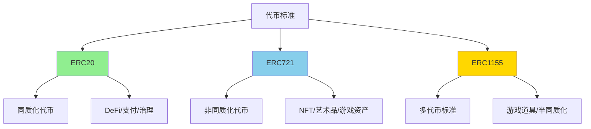
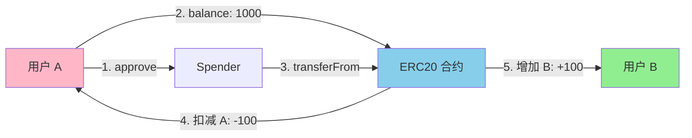
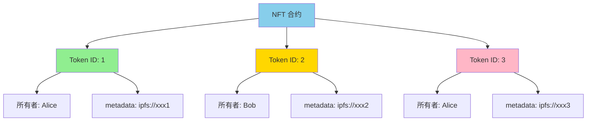
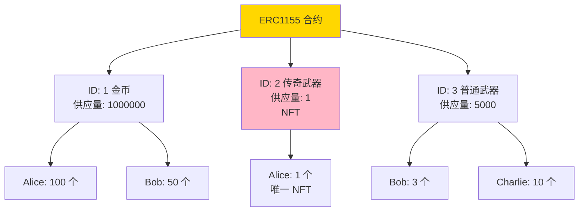

# Token

> 代币标准：ERC20、ERC721、ERC1155 完全指南

> [!IMPORTANT] 本节重点
> 1. ERC20、ERC721、ERC1155 三大标准的区别和使用场景？
> 2. 如何使用 OpenZeppelin 快速开发生产级代币合约？
> 3. 代币扩展（Burnable、Pausable、Snapshot、Permit、Votes）如何选择？
> 4. NFT metadata 如何设计和存储？
> 5. 代币安全最佳实践有哪些？

## 代币标准概览

OpenZeppelin 提供了完整的代币标准实现，覆盖 Web3 应用的所有需求：



### 三大标准对比

| 特性             | ERC20                | ERC721           | ERC1155              |
| -------------- | -------------------- | ---------------- | -------------------- |
| **类型**         | 同质化代币（Fungible）      | 非同质化代币（NFT）      | 多代币（Multi-Token）     |
| **可分割性**       | ✅ 可分割（有小数位）          | ❌ 不可分割           | ✅ 每个 ID 可配置           |
| **唯一性**        | ❌ 所有代币相同             | ✅ 每个 Token ID 唯一 | ✅ 每个 ID 独立            |
| **批量操作**       | ❌ 不支持原生批量            | ❌ 不支持原生批量        | ✅ 原生支持批量转账           |
| **Gas 效率**     | 中等                   | 高（单个转账）          | ✅ 最高（批量优化）           |
| **适用场景**       | 货币、积分、治理代币           | 艺术品、收藏品、域名       | 游戏道具、票券、半同质化资产       |
| **存储结构**       | `mapping(address => uint)` | `mapping(uint => address)` | `mapping(uint => mapping(address => uint))` |
| **典型应用**       | USDT、UNI、AAVE       | CryptoPunks、BAYC | Enjin、Decentraland  |

## ERC20 详解

**ERC20** 是最广泛使用的代币标准，用于创建同质化代币（Fungible Token）。

### 核心功能



### ERC20 扩展对比

| 扩展                    | 功能                       | 使用场景                | Gas 成本    |
| --------------------- | ------------------------ | ------------------- | --------- |
| **ERC20**             | 标准代币                     | 所有 ERC20 项目          | 基准        |
| **ERC20Burnable**     | 可销毁                      | 通缩代币、销毁证明           | +2k       |
| **ERC20Capped**       | 总量上限                     | 固定供应量代币             | +3k       |
| **ERC20Pausable**     | 可暂停转账                    | 紧急情况控制              | +5k       |
| **ERC20Snapshot**     | 快照功能                     | 空投、分红、治理投票          | +20k      |
| **ERC20Permit**       | 无 Gas 授权（签名授权）           | Gasless 交易、DeFi 优化   | +10k      |
| **ERC20Votes**        | 投票权重                     | DAO 治理              | +15k      |
| **ERC20FlashMint**    | 闪电贷                      | DeFi 套利、清算          | +8k       |
| **ERC20Wrapper**      | 包装代币                     | WETH、包装版权益代币        | +12k      |

### 完整实现示例

:::code-group

```solidity [标准 ERC20 代币]
// SPDX-License-Identifier: MIT
pragma solidity ^0.8.20;

import {ERC20} from "@openzeppelin/contracts/token/ERC20/ERC20.sol";
import {Ownable} from "@openzeppelin/contracts/access/Ownable.sol";

/**
 * @title MyToken
 * @dev 标准 ERC20 代币示例
 */
contract MyToken is ERC20, Ownable {
    // 最大供应量
    uint256 public constant MAX_SUPPLY = 1_000_000_000 * 10**18;

    event Minted(address indexed to, uint256 amount);
    event Burned(address indexed from, uint256 amount);

    constructor(address initialOwner) ERC20("MyToken", "MTK") Ownable(initialOwner) {
        // 初始铸造 10% 给部署者
        _mint(initialOwner, MAX_SUPPLY / 10);
    }

    /**
     * @dev 铸币（仅 owner）
     */
    function mint(address to, uint256 amount) external onlyOwner {
        require(totalSupply() + amount <= MAX_SUPPLY, "Exceeds max supply");
        _mint(to, amount);
        emit Minted(to, amount);
    }

    /**
     * @dev 销毁代币（任何人可销毁自己的代币）
     */
    function burn(uint256 amount) external {
        _burn(msg.sender, amount);
        emit Burned(msg.sender, amount);
    }

    /**
     * @dev 重写小数位（可选，默认 18）
     */
    function decimals() public pure override returns (uint8) {
        return 18;
    }
}
```

```solidity [完整功能 DeFi 代币]
// SPDX-License-Identifier: MIT
pragma solidity ^0.8.20;

import {ERC20} from "@openzeppelin/contracts/token/ERC20/ERC20.sol";
import {ERC20Burnable} from "@openzeppelin/contracts/token/ERC20/extensions/ERC20Burnable.sol";
import {ERC20Pausable} from "@openzeppelin/contracts/token/ERC20/extensions/ERC20Pausable.sol";
import {ERC20Permit} from "@openzeppelin/contracts/token/ERC20/extensions/ERC20Permit.sol";
import {ERC20Votes} from "@openzeppelin/contracts/token/ERC20/extensions/ERC20Votes.sol";
import {Ownable} from "@openzeppelin/contracts/access/Ownable.sol";
import {Nonces} from "@openzeppelin/contracts/utils/Nonces.sol";

/**
 * @title DeFiToken
 * @dev 完整功能的 DeFi 治理代币
 *
 * 功能：
 * - ✅ 可销毁
 * - ✅ 可暂停
 * - ✅ 支持 Permit（Gasless 授权）
 * - ✅ 支持投票
 */
contract DeFiToken is
    ERC20,
    ERC20Burnable,
    ERC20Pausable,
    ERC20Permit,
    ERC20Votes,
    Ownable
{
    uint256 public constant MAX_SUPPLY = 1_000_000_000 * 10**18;

    constructor(address initialOwner)
        ERC20("DeFi Token", "DFT")
        ERC20Permit("DeFi Token")
        Ownable(initialOwner)
    {
        // 初始铸造 50% 给部署者
        _mint(initialOwner, MAX_SUPPLY / 2);
    }

    /**
     * @dev 铸币（仅 owner）
     */
    function mint(address to, uint256 amount) external onlyOwner {
        require(totalSupply() + amount <= MAX_SUPPLY, "Exceeds max supply");
        _mint(to, amount);
    }

    /**
     * @dev 暂停转账（仅 owner）
     */
    function pause() external onlyOwner {
        _pause();
    }

    /**
     * @dev 恢复转账（仅 owner）
     */
    function unpause() external onlyOwner {
        _unpause();
    }

    // ===================== 重写函数（解决多继承冲突）=====================

    /**
     * @dev 重写 _update（ERC20Pausable + ERC20Votes）
     */
    function _update(address from, address to, uint256 value)
        internal
        override(ERC20, ERC20Pausable, ERC20Votes)
    {
        super._update(from, to, value);
    }

    /**
     * @dev 重写 nonces（ERC20Permit + Nonces）
     */
    function nonces(address owner)
        public
        view
        override(ERC20Permit, Nonces)
        returns (uint256)
    {
        return super.nonces(owner);
    }
}
```

```solidity [代币快照（空投/分红）]
// SPDX-License-Identifier: MIT
pragma solidity ^0.8.20;

import {ERC20} from "@openzeppelin/contracts/token/ERC20/ERC20.sol";
import {ERC20Snapshot} from "@openzeppelin/contracts/token/ERC20/extensions/ERC20Snapshot.sol";
import {Ownable} from "@openzeppelin/contracts/access/Ownable.sol";

/**
 * @title SnapshotToken
 * @dev 支持快照的代币（用于空投、分红、投票）
 */
contract SnapshotToken is ERC20, ERC20Snapshot, Ownable {
    uint256 public currentSnapshotId;

    event SnapshotCreated(uint256 id, uint256 timestamp);

    constructor(address initialOwner)
        ERC20("Snapshot Token", "SNAP")
        Ownable(initialOwner)
    {
        _mint(initialOwner, 1_000_000 * 10**18);
    }

    /**
     * @dev 创建快照（记录当前所有余额）
     */
    function snapshot() external onlyOwner returns (uint256) {
        currentSnapshotId = _snapshot();
        emit SnapshotCreated(currentSnapshotId, block.timestamp);
        return currentSnapshotId;
    }

    /**
     * @dev 查询某地址在某快照时的余额
     */
    function balanceOfAt(address account, uint256 snapshotId)
        public
        view
        override
        returns (uint256)
    {
        return super.balanceOfAt(account, snapshotId);
    }

    /**
     * @dev 查询某快照时的总供应量
     */
    function totalSupplyAt(uint256 snapshotId)
        public
        view
        override
        returns (uint256)
    {
        return super.totalSupplyAt(snapshotId);
    }

    /**
     * @dev 重写 _update（解决继承冲突）
     */
    function _update(address from, address to, uint256 value)
        internal
        override(ERC20, ERC20Snapshot)
    {
        super._update(from, to, value);
    }
}
```

```solidity [ERC20 Permit 示例（Gasless 授权）]
// SPDX-License-Identifier: MIT
pragma solidity ^0.8.20;

import {ERC20} from "@openzeppelin/contracts/token/ERC20/ERC20.sol";
import {ERC20Permit} from "@openzeppelin/contracts/token/ERC20/extensions/ERC20Permit.sol";

/**
 * @title PermitToken
 * @dev 支持 EIP-2612 Permit 的代币
 *
 * Permit 优势：
 * - 用户无需两次交易（approve + transferFrom）
 * - 通过链下签名完成授权
 * - 节省 Gas
 */
contract PermitToken is ERC20, ERC20Permit {
    constructor() ERC20("Permit Token", "PRMT") ERC20Permit("Permit Token") {
        _mint(msg.sender, 1_000_000 * 10**18);
    }

    /**
     * @dev Permit 使用示例（链下签名）
     *
     * 前端代码：
     * const signature = await signer._signTypedData(domain, types, value);
     * const { v, r, s } = ethers.utils.splitSignature(signature);
     *
     * await token.permit(owner, spender, amount, deadline, v, r, s);
     * await spender.transferFrom(owner, recipient, amount); // 无需事先 approve
     */
}
```

:::

### ERC20 核心源码解析

:::code-group

```solidity [ERC20 核心实现]
// SPDX-License-Identifier: MIT
pragma solidity ^0.8.20;

import {IERC20} from "./IERC20.sol";
import {IERC20Metadata} from "./extensions/IERC20Metadata.sol";
import {Context} from "../../utils/Context.sol";
import {IERC20Errors} from "../../interfaces/draft-IERC6093.sol";

/**
 * @dev ERC20 标准实现
 *
 * 核心设计：
 * - 使用 mapping 存储余额和授权
 * - _update 函数统一处理 mint、burn、transfer
 * - 默认 18 位小数（与 ETH 一致）
 */
abstract contract ERC20 is Context, IERC20, IERC20Metadata, IERC20Errors {
    // ===================== 状态变量 =====================

    mapping(address => uint256) private _balances;         // 余额
    mapping(address => mapping(address => uint256)) private _allowances; // 授权额度
    uint256 private _totalSupply;                          // 总供应量
    string private _name;                                  // 代币名
    string private _symbol;                                // 代币符号

    // ===================== 构造函数 =====================

    constructor(string memory name_, string memory symbol_) {
        _name = name_;
        _symbol = symbol_;
    }

    // ===================== 查询函数 =====================

    function name() public view virtual returns (string memory) {
        return _name;
    }

    function symbol() public view virtual returns (string memory) {
        return _symbol;
    }

    function decimals() public view virtual returns (uint8) {
        return 18; // 默认 18 位小数
    }

    function totalSupply() public view virtual returns (uint256) {
        return _totalSupply;
    }

    function balanceOf(address account) public view virtual returns (uint256) {
        return _balances[account];
    }

    // ===================== 转账函数 =====================

    /**
     * @dev 直接转账
     */
    function transfer(address to, uint256 value) public virtual returns (bool) {
        _transfer(_msgSender(), to, value);
        return true;
    }

    /**
     * @dev 授权额度查询
     */
    function allowance(address owner, address spender)
        public
        view
        virtual
        returns (uint256)
    {
        return _allowances[owner][spender];
    }

    /**
     * @dev 授权
     */
    function approve(address spender, uint256 value) public virtual returns (bool) {
        _approve(_msgSender(), spender, value);
        return true;
    }

    /**
     * @dev 授权转账
     */
    function transferFrom(address from, address to, uint256 value)
        public
        virtual
        returns (bool)
    {
        _spendAllowance(from, _msgSender(), value); // 扣减授权额度
        _transfer(from, to, value);                  // 执行转账
        return true;
    }

    // ===================== 内部函数 =====================

    /**
     * @dev 内部转账
     */
    function _transfer(address from, address to, uint256 value) internal {
        if (from == address(0)) revert ERC20InvalidSender(address(0));
        if (to == address(0)) revert ERC20InvalidReceiver(address(0));
        _update(from, to, value);
    }

    /**
     * @dev 核心更新逻辑（统一处理 mint、burn、transfer）
     *
     * 规则：
     * - from = 0 → mint（总供应量增加）
     * - to = 0 → burn（总供应量减少）
     * - 其他 → transfer（总供应量不变）
     */
    function _update(address from, address to, uint256 value) internal virtual {
        if (from == address(0)) {
            // Mint：增加总供应量
            _totalSupply += value;
        } else {
            // 扣减发送者余额
            uint256 fromBalance = _balances[from];
            if (fromBalance < value) {
                revert ERC20InsufficientBalance(from, fromBalance, value);
            }
            unchecked {
                _balances[from] = fromBalance - value;
            }
        }

        if (to == address(0)) {
            // Burn：减少总供应量
            unchecked {
                _totalSupply -= value;
            }
        } else {
            // 增加接收者余额
            unchecked {
                _balances[to] += value;
            }
        }

        emit Transfer(from, to, value);
    }

    /**
     * @dev 内部铸币
     */
    function _mint(address account, uint256 value) internal {
        if (account == address(0)) revert ERC20InvalidReceiver(address(0));
        _update(address(0), account, value);
    }

    /**
     * @dev 内部销毁
     */
    function _burn(address account, uint256 value) internal {
        if (account == address(0)) revert ERC20InvalidSender(address(0));
        _update(account, address(0), value);
    }

    /**
     * @dev 内部授权
     */
    function _approve(address owner, address spender, uint256 value) internal {
        _approve(owner, spender, value, true);
    }

    function _approve(
        address owner,
        address spender,
        uint256 value,
        bool emitEvent
    ) internal virtual {
        if (owner == address(0)) revert ERC20InvalidApprover(address(0));
        if (spender == address(0)) revert ERC20InvalidSpender(address(0));

        _allowances[owner][spender] = value;

        if (emitEvent) {
            emit Approval(owner, spender, value);
        }
    }

    /**
     * @dev 扣减授权额度（transferFrom 使用）
     *
     * 特殊处理：
     * - 如果授权额度 = type(uint256).max（无限授权），不扣减
     */
    function _spendAllowance(address owner, address spender, uint256 value)
        internal
        virtual
    {
        uint256 currentAllowance = allowance(owner, spender);

        if (currentAllowance != type(uint256).max) {
            if (currentAllowance < value) {
                revert ERC20InsufficientAllowance(spender, currentAllowance, value);
            }
            unchecked {
                _approve(owner, spender, currentAllowance - value, false);
            }
        }
    }
}
```

:::

### ERC20 最佳实践

#### 1. 选择合适的扩展

```solidity
// ❌ 过度设计：简单代币不需要所有扩展
contract OverEngineered is
    ERC20,
    ERC20Burnable,
    ERC20Pausable,
    ERC20Snapshot,
    ERC20Permit,
    ERC20Votes,
    ERC20FlashMint
{
    // Gas 成本太高！
}

// ✅ 合理选择：根据需求选择扩展
contract ReasonableToken is ERC20, ERC20Burnable, ERC20Permit {
    // 基础代币 + 销毁 + Gasless 授权
}
```

#### 2. 防止整数溢出

```solidity
// ✅ Solidity 0.8+ 自动检查溢出
function mint(address to, uint256 amount) external onlyOwner {
    require(totalSupply() + amount <= MAX_SUPPLY, "Exceeds cap");
    _mint(to, amount);
}

// ✅ 使用 unchecked 优化已知安全的操作
function _transfer(address from, address to, uint256 amount) internal {
    unchecked {
        _balances[from] -= amount; // 前面已检查余额
        _balances[to] += amount;   // 不会溢出
    }
}
```

#### 3. 小数位处理

```solidity
// ❌ 错误：直接使用数字
uint256 amount = 100; // 这是 100 wei，不是 100 token

// ✅ 正确：考虑小数位
uint256 amount = 100 * 10**decimals(); // 100 token

// ✅ 推荐：使用常量
uint256 constant TOKEN_DECIMALS = 18;
uint256 amount = 100 * 10**TOKEN_DECIMALS;
```

## ERC721 详解

**ERC721** 是非同质化代币（NFT）标准，每个 Token ID 都是独一无二的。

### 核心概念



### ERC721 扩展对比

| 扩展                      | 功能                     | 使用场景              | Gas 成本    |
| ----------------------- | ---------------------- | ----------------- | --------- |
| **ERC721**              | 标准 NFT                | 所有 NFT 项目          | 基准        |
| **ERC721URIStorage**    | 可变 Token URI           | 动态 metadata、艺术品   | +5k       |
| **ERC721Enumerable**    | 可枚举所有 Token           | 市场列表、批量查询         | +30k      |
| **ERC721Burnable**      | 可销毁                    | 消耗型 NFT           | +2k       |
| **ERC721Pausable**      | 可暂停转账                  | 紧急情况控制            | +5k       |
| **ERC721Royalty**       | 版税（EIP-2981）           | 二级市场分成            | +8k       |
| **ERC721Votes**         | 投票权重                   | NFT DAO 治理        | +15k      |
| **ERC721Consecutive**   | 批量铸造优化                 | 大规模空投             | -70%（批量） |

### 完整实现示例

:::code-group

```solidity [标准 NFT 合约]
// SPDX-License-Identifier: MIT
pragma solidity ^0.8.20;

import {ERC721} from "@openzeppelin/contracts/token/ERC721/ERC721.sol";
import {Ownable} from "@openzeppelin/contracts/access/Ownable.sol";

/**
 * @title MyNFT
 * @dev 标准 NFT 示例
 */
contract MyNFT is ERC721, Ownable {
    uint256 private _nextTokenId;
    string private _baseTokenURI;

    uint256 public constant MAX_SUPPLY = 10000;
    uint256 public constant MINT_PRICE = 0.05 ether;

    event Minted(address indexed to, uint256 tokenId);

    constructor(address initialOwner, string memory baseURI)
        ERC721("MyNFT", "MNFT")
        Ownable(initialOwner)
    {
        _baseTokenURI = baseURI;
    }

    /**
     * @dev 公开铸造
     */
    function mint() external payable {
        require(_nextTokenId < MAX_SUPPLY, "Max supply reached");
        require(msg.value == MINT_PRICE, "Wrong price");

        uint256 tokenId = _nextTokenId++;
        _safeMint(msg.sender, tokenId);

        emit Minted(msg.sender, tokenId);
    }

    /**
     * @dev 批量铸造（仅 owner）
     */
    function mintBatch(address to, uint256 quantity) external onlyOwner {
        require(_nextTokenId + quantity <= MAX_SUPPLY, "Exceeds max supply");

        for (uint256 i = 0; i < quantity; i++) {
            uint256 tokenId = _nextTokenId++;
            _safeMint(to, tokenId);
        }
    }

    /**
     * @dev 返回 base URI
     */
    function _baseURI() internal view override returns (string memory) {
        return _baseTokenURI;
    }

    /**
     * @dev 设置 base URI（仅 owner）
     */
    function setBaseURI(string memory baseURI) external onlyOwner {
        _baseTokenURI = baseURI;
    }

    /**
     * @dev 提取销售收入（仅 owner）
     */
    function withdraw() external onlyOwner {
        payable(owner()).transfer(address(this).balance);
    }

    /**
     * @dev 查询当前已铸造数量
     */
    function totalMinted() external view returns (uint256) {
        return _nextTokenId;
    }
}
```

```solidity [完整功能 NFT（URI Storage + Enumerable）]
// SPDX-License-Identifier: MIT
pragma solidity ^0.8.20;

import {ERC721} from "@openzeppelin/contracts/token/ERC721/ERC721.sol";
import {ERC721URIStorage} from "@openzeppelin/contracts/token/ERC721/extensions/ERC721URIStorage.sol";
import {ERC721Enumerable} from "@openzeppelin/contracts/token/ERC721/extensions/ERC721Enumerable.sol";
import {Ownable} from "@openzeppelin/contracts/access/Ownable.sol";

/**
 * @title AdvancedNFT
 * @dev 高级 NFT：支持可变 URI + 可枚举
 */
contract AdvancedNFT is ERC721, ERC721URIStorage, ERC721Enumerable, Ownable {
    uint256 private _nextTokenId;

    constructor(address initialOwner)
        ERC721("Advanced NFT", "ANFT")
        Ownable(initialOwner)
    {}

    /**
     * @dev 铸造并设置 URI
     */
    function mintWithURI(address to, string memory uri) external onlyOwner {
        uint256 tokenId = _nextTokenId++;
        _safeMint(to, tokenId);
        _setTokenURI(tokenId, uri);
    }

    /**
     * @dev 更新 Token URI（仅 owner）
     */
    function updateTokenURI(uint256 tokenId, string memory newURI)
        external
        onlyOwner
    {
        _setTokenURI(tokenId, newURI);
    }

    /**
     * @dev 获取某用户拥有的所有 Token ID
     */
    function tokensOfOwner(address owner) external view returns (uint256[] memory) {
        uint256 balance = balanceOf(owner);
        uint256[] memory tokens = new uint256[](balance);

        for (uint256 i = 0; i < balance; i++) {
            tokens[i] = tokenOfOwnerByIndex(owner, i);
        }

        return tokens;
    }

    // ===================== 重写函数（解决多继承冲突）=====================

    function tokenURI(uint256 tokenId)
        public
        view
        override(ERC721, ERC721URIStorage)
        returns (string memory)
    {
        return super.tokenURI(tokenId);
    }

    function supportsInterface(bytes4 interfaceId)
        public
        view
        override(ERC721, ERC721URIStorage, ERC721Enumerable)
        returns (bool)
    {
        return super.supportsInterface(interfaceId);
    }

    function _update(address to, uint256 tokenId, address auth)
        internal
        override(ERC721, ERC721Enumerable)
        returns (address)
    {
        return super._update(to, tokenId, auth);
    }

    function _increaseBalance(address account, uint128 value)
        internal
        override(ERC721, ERC721Enumerable)
    {
        super._increaseBalance(account, value);
    }
}
```

```solidity [链上 NFT（动态生成 SVG）]
// SPDX-License-Identifier: MIT
pragma solidity ^0.8.20;

import {ERC721} from "@openzeppelin/contracts/token/ERC721/ERC721.sol";
import {Ownable} from "@openzeppelin/contracts/access/Ownable.sol";
import {Strings} from "@openzeppelin/contracts/utils/Strings.sol";
import {Base64} from "@openzeppelin/contracts/utils/Base64.sol";

/**
 * @title OnChainNFT
 * @dev 完全链上的 NFT（metadata + 图像都在链上）
 */
contract OnChainNFT is ERC721, Ownable {
    using Strings for uint256;

    uint256 private _nextTokenId;

    struct Attributes {
        string name;
        uint256 level;
        uint256 power;
        string color;
    }

    mapping(uint256 => Attributes) public tokenAttributes;

    constructor(address initialOwner)
        ERC721("OnChain NFT", "OCNFT")
        Ownable(initialOwner)
    {}

    /**
     * @dev 铸造并设置属性
     */
    function mint(
        string memory name,
        uint256 level,
        uint256 power,
        string memory color
    ) external onlyOwner {
        uint256 tokenId = _nextTokenId++;

        tokenAttributes[tokenId] = Attributes({
            name: name,
            level: level,
            power: power,
            color: color
        });

        _safeMint(msg.sender, tokenId);
    }

    /**
     * @dev 生成 SVG 图像
     */
    function generateSVG(uint256 tokenId) internal view returns (string memory) {
        Attributes memory attr = tokenAttributes[tokenId];

        return string(abi.encodePacked(
            '<svg xmlns="http://www.w3.org/2000/svg" viewBox="0 0 300 300">',
            '<rect width="300" height="300" fill="', attr.color, '"/>',
            '<text x="20" y="50" font-size="24" fill="white">',
            attr.name,
            '</text>',
            '<text x="20" y="100" font-size="18" fill="white">Level: ',
            attr.level.toString(),
            '</text>',
            '<text x="20" y="130" font-size="18" fill="white">Power: ',
            attr.power.toString(),
            '</text>',
            '</svg>'
        ));
    }

    /**
     * @dev 生成 Token URI（完全链上）
     */
    function tokenURI(uint256 tokenId)
        public
        view
        override
        returns (string memory)
    {
        _requireOwned(tokenId);

        Attributes memory attr = tokenAttributes[tokenId];

        string memory svg = generateSVG(tokenId);
        string memory svgBase64 = Base64.encode(bytes(svg));

        string memory json = string(abi.encodePacked(
            '{"name":"', attr.name,
            '","description":"Fully on-chain NFT",',
            '"image":"data:image/svg+xml;base64,', svgBase64,
            '","attributes":[',
            '{"trait_type":"Level","value":', attr.level.toString(), '},',
            '{"trait_type":"Power","value":', attr.power.toString(), '}',
            ']}'
        ));

        return string(abi.encodePacked(
            "data:application/json;base64,",
            Base64.encode(bytes(json))
        ));
    }
}
```

```solidity [NFT 版税（EIP-2981）]
// SPDX-License-Identifier: MIT
pragma solidity ^0.8.20;

import {ERC721} from "@openzeppelin/contracts/token/ERC721/ERC721.sol";
import {ERC721Royalty} from "@openzeppelin/contracts/token/ERC721/extensions/ERC721Royalty.sol";
import {Ownable} from "@openzeppelin/contracts/access/Ownable.sol";

/**
 * @title RoyaltyNFT
 * @dev 支持版税的 NFT（EIP-2981）
 */
contract RoyaltyNFT is ERC721, ERC721Royalty, Ownable {
    uint256 private _nextTokenId;

    // 默认版税：5%
    uint96 public constant DEFAULT_ROYALTY = 500; // 500 = 5%（基数 10000）

    constructor(address initialOwner)
        ERC721("Royalty NFT", "RNFT")
        Ownable(initialOwner)
    {
        // 设置默认版税接收者和比例
        _setDefaultRoyalty(initialOwner, DEFAULT_ROYALTY);
    }

    /**
     * @dev 铸造 NFT
     */
    function mint(address to) external onlyOwner {
        uint256 tokenId = _nextTokenId++;
        _safeMint(to, tokenId);
    }

    /**
     * @dev 铸造并设置自定义版税
     */
    function mintWithRoyalty(
        address to,
        address royaltyReceiver,
        uint96 royaltyFraction
    ) external onlyOwner {
        uint256 tokenId = _nextTokenId++;
        _safeMint(to, tokenId);
        _setTokenRoyalty(tokenId, royaltyReceiver, royaltyFraction);
    }

    /**
     * @dev 更新默认版税
     */
    function setDefaultRoyalty(address receiver, uint96 feeNumerator)
        external
        onlyOwner
    {
        _setDefaultRoyalty(receiver, feeNumerator);
    }

    /**
     * @dev 重写 supportsInterface
     */
    function supportsInterface(bytes4 interfaceId)
        public
        view
        override(ERC721, ERC721Royalty)
        returns (bool)
    {
        return super.supportsInterface(interfaceId);
    }
}
```

:::

### NFT Metadata 最佳实践

#### 1. URI 设计模式

```solidity
// ❌ 错误：硬编码 URI
function tokenURI(uint256 tokenId) public view returns (string memory) {
    return "https://example.com/token/1.json"; // 所有 token 都一样！
}

// ✅ 方案 1：Base URI + Token ID
function tokenURI(uint256 tokenId) public view override returns (string memory) {
    return string(abi.encodePacked(_baseURI(), tokenId.toString()));
}
// 结果：https://example.com/metadata/1, /2, /3...

// ✅ 方案 2：单独存储每个 URI（ERC721URIStorage）
function tokenURI(uint256 tokenId) public view override returns (string memory) {
    return _tokenURIs[tokenId]; // 每个 token 独立 URI
}
```

#### 2. IPFS 集成

```solidity
// ✅ 推荐：使用 IPFS CID
contract IPFSBasedNFT is ERC721 {
    string private constant BASE_URI = "ipfs://QmXXX..."; // IPFS CID

    function _baseURI() internal pure override returns (string memory) {
        return BASE_URI;
    }

    // tokenURI(1) → ipfs://QmXXX.../1
}
```

#### 3. Metadata JSON 标准

```json
{
  "name": "My NFT #1",
  "description": "This is my awesome NFT",
  "image": "ipfs://Qm.../image.png",
  "external_url": "https://example.com/nft/1",
  "attributes": [
    {
      "trait_type": "Rarity",
      "value": "Legendary"
    },
    {
      "trait_type": "Power",
      "value": 95,
      "max_value": 100
    },
    {
      "display_type": "boost_percentage",
      "trait_type": "Speed Boost",
      "value": 10
    }
  ]
}
```

## ERC1155 详解

**ERC1155** 是多代币标准，一个合约可以管理多个 Token ID，每个 ID 可以有不同的数量。

### 核心优势



### ERC1155 vs ERC20 + ERC721

| 对比项     | ERC20 + ERC721          | ERC1155                  |
| ------- | ----------------------- | ------------------------ |
| **合约数量** | 每种代币 1 个合约               | 所有代币 1 个合约                |
| **批量转账** | ❌ 不支持                   | ✅ 原生支持                   |
| **Gas**  | 高（多次调用）                 | ✅ 低（批量优化）                |
| **适用场景** | DeFi、单一 NFT 系列          | 游戏（多种道具）、SBT、票券          |

### 完整实现示例

:::code-group

```solidity [游戏道具合约]
// SPDX-License-Identifier: MIT
pragma solidity ^0.8.20;

import {ERC1155} from "@openzeppelin/contracts/token/ERC1155/ERC1155.sol";
import {Ownable} from "@openzeppelin/contracts/access/Ownable.sol";
import {Strings} from "@openzeppelin/contracts/utils/Strings.sol";

/**
 * @title GameItems
 * @dev 游戏道具：金币、武器、装备
 */
contract GameItems is ERC1155, Ownable {
    using Strings for uint256;

    // Token ID 定义
    uint256 public constant GOLD = 0;           // 金币（同质化）
    uint256 public constant SWORD = 1;          // 普通剑（半同质化）
    uint256 public constant LEGENDARY_SWORD = 2; // 传奇剑（NFT）
    uint256 public constant SHIELD = 3;         // 盾牌（半同质化）

    string private _baseURI;

    constructor(string memory baseURI, address initialOwner)
        ERC1155(baseURI)
        Ownable(initialOwner)
    {
        _baseURI = baseURI;

        // 初始铸造
        _mint(initialOwner, GOLD, 1_000_000, "");  // 100 万金币
        _mint(initialOwner, SWORD, 1000, "");      // 1000 把普通剑
        _mint(initialOwner, LEGENDARY_SWORD, 1, ""); // 1 把传奇剑（唯一）
    }

    /**
     * @dev 批量铸造
     */
    function mintBatch(
        address to,
        uint256[] memory ids,
        uint256[] memory amounts
    ) external onlyOwner {
        _mintBatch(to, ids, amounts, "");
    }

    /**
     * @dev 游戏内获得奖励
     */
    function rewardPlayer(address player, uint256 goldAmount) external onlyOwner {
        _mint(player, GOLD, goldAmount, "");
    }

    /**
     * @dev 批量转账（玩家交易）
     */
    function batchTransfer(
        address from,
        address to,
        uint256[] memory ids,
        uint256[] memory amounts
    ) external {
        require(
            from == msg.sender || isApprovedForAll(from, msg.sender),
            "Not authorized"
        );
        safeBatchTransferFrom(from, to, ids, amounts, "");
    }

    /**
     * @dev 返回完整 URI
     */
    function uri(uint256 tokenId) public view override returns (string memory) {
        return string(abi.encodePacked(_baseURI, tokenId.toString(), ".json"));
    }

    /**
     * @dev 设置 base URI
     */
    function setURI(string memory newURI) external onlyOwner {
        _baseURI = newURI;
    }
}
```

```solidity [NFT + 代币混合]
// SPDX-License-Identifier: MIT
pragma solidity ^0.8.20;

import {ERC1155} from "@openzeppelin/contracts/token/ERC1155/ERC1155.sol";
import {ERC1155Supply} from "@openzeppelin/contracts/token/ERC1155/extensions/ERC1155Supply.sol";
import {Ownable} from "@openzeppelin/contracts/access/Ownable.sol";

/**
 * @title MixedTokens
 * @dev 同时支持 NFT 和同质化代币
 */
contract MixedTokens is ERC1155, ERC1155Supply, Ownable {
    // ID 范围定义
    uint256 private constant FUNGIBLE_START = 0;
    uint256 private constant FUNGIBLE_END = 999;
    uint256 private constant NFT_START = 1000;

    uint256 private _nextNFTId = NFT_START;

    constructor(address initialOwner)
        ERC1155("https://example.com/metadata/{id}.json")
        Ownable(initialOwner)
    {}

    /**
     * @dev 铸造同质化代币
     */
    function mintFungible(address to, uint256 id, uint256 amount)
        external
        onlyOwner
    {
        require(id >= FUNGIBLE_START && id <= FUNGIBLE_END, "Invalid fungible ID");
        _mint(to, id, amount, "");
    }

    /**
     * @dev 铸造 NFT（自动递增 ID）
     */
    function mintNFT(address to) external onlyOwner returns (uint256) {
        uint256 tokenId = _nextNFTId++;
        _mint(to, tokenId, 1, "");
        return tokenId;
    }

    /**
     * @dev 检查是否为 NFT
     */
    function isNFT(uint256 tokenId) public pure returns (bool) {
        return tokenId >= NFT_START;
    }

    /**
     * @dev 查询 NFT 所有者（单个持有者）
     */
    function ownerOfNFT(uint256 tokenId) external view returns (address) {
        require(isNFT(tokenId), "Not an NFT");
        require(totalSupply(tokenId) == 1, "Invalid NFT supply");

        // 遍历查找所有者（低效，仅示例）
        // 实际应用应使用 mapping 记录
        return address(0); // 简化示例
    }

    /**
     * @dev 批量查询余额
     */
    function balancesOf(address account, uint256[] memory ids)
        external
        view
        returns (uint256[] memory)
    {
        uint256[] memory balances = new uint256[](ids.length);
        for (uint256 i = 0; i < ids.length; i++) {
            balances[i] = balanceOf(account, ids[i]);
        }
        return balances;
    }

    // ===================== 重写函数 =====================

    function _update(
        address from,
        address to,
        uint256[] memory ids,
        uint256[] memory values
    ) internal override(ERC1155, ERC1155Supply) {
        super._update(from, to, ids, values);
    }
}
```

:::

### ERC1155 批量操作优势

```typescript
// ❌ ERC721：需要 3 次交易
await nft.transferFrom(alice, bob, 1);
await nft.transferFrom(alice, bob, 2);
await nft.transferFrom(alice, bob, 3);
// Gas: ~150k

// ✅ ERC1155：1 次批量交易
await erc1155.safeBatchTransferFrom(alice, bob, [1, 2, 3], [1, 1, 1], "0x");
// Gas: ~80k（节省 47%）
```

## 代币安全最佳实践

### 1. 铸币权限控制

```solidity
// ❌ 危险：任何人都能铸币
contract BadToken is ERC20 {
    function mint(address to, uint256 amount) external {
        _mint(to, amount); // 无限增发！
    }
}

// ✅ 推荐：严格权限控制
contract GoodToken is ERC20, Ownable {
    function mint(address to, uint256 amount) external onlyOwner {
        require(totalSupply() + amount <= MAX_SUPPLY, "Exceeds cap");
        _mint(to, amount);
    }
}

// ✅ 更安全：时间锁 + 多签
contract SafeToken is ERC20 {
    address public timelock;

    function mint(address to, uint256 amount) external {
        require(msg.sender == timelock, "Only timelock");
        _mint(to, amount);
    }
}
```

### 2. 防止重入攻击

```solidity
// ❌ 危险：回调函数可被重入
contract BadNFT is ERC721 {
    mapping(uint256 => uint256) public rewards;

    function claimReward(uint256 tokenId) external {
        uint256 reward = rewards[tokenId];

        // 🔥 危险：先转账，后清零
        payable(msg.sender).transfer(reward);
        rewards[tokenId] = 0;
    }
}

// ✅ 正确：使用 ReentrancyGuard
import {ReentrancyGuard} from "@openzeppelin/contracts/utils/ReentrancyGuard.sol";

contract SafeNFT is ERC721, ReentrancyGuard {
    mapping(uint256 => uint256) public rewards;

    function claimReward(uint256 tokenId) external nonReentrant {
        uint256 reward = rewards[tokenId];
        rewards[tokenId] = 0; // 先清零

        payable(msg.sender).transfer(reward); // 后转账
    }
}
```

### 3. 授权安全

```solidity
// ❌ 危险：无限授权
function approveAll(address spender) external {
    _approve(msg.sender, spender, type(uint256).max); // 不安全！
}

// ✅ 推荐：按需授权
function approveExact(address spender, uint256 amount) external {
    _approve(msg.sender, spender, amount);
}

// ✅ 使用 Permit（EIP-2612）避免授权
// 用户链下签名，合约内验证签名后直接转账
```

### 4. 元数据安全

```solidity
// ❌ 危险：中心化服务器可随意修改
string private _baseURI = "https://api.example.com/"; // 可被修改

// ✅ 推荐：使用 IPFS
string private _baseURI = "ipfs://QmXXX/"; // 内容寻址，不可篡改

// ✅ 最安全：完全链上
function tokenURI(uint256 tokenId) public view override returns (string memory) {
    return generateOnChainSVG(tokenId); // 完全去中心化
}
```

## 常见问题 FAQ

### Q1: ERC20、ERC721、ERC1155 如何选择？

**A:**

| 需求              | 推荐标准      | 原因                |
| --------------- | --------- | ----------------- |
| DeFi 代币、治理代币    | ERC20     | 同质化、可分割           |
| 艺术品 NFT、头像 NFT  | ERC721    | 唯一性、独立 metadata  |
| 游戏道具（多种）        | ERC1155   | 批量操作、Gas 效率高     |
| 单一 NFT 系列       | ERC721    | 简单、兼容性好           |
| SBT（灵魂绑定代币）     | ERC721/1155 | 不可转移扩展            |

### Q2: 为什么 NFT 需要 `_safeMint` 而不是 `_mint`？

**A:**

```solidity
// _mint：直接铸造，不检查接收者
_mint(to, tokenId);
// 问题：如果 to 是合约且不支持 ERC721，NFT 永久锁定！

// _safeMint：检查接收者是否支持 ERC721
_safeMint(to, tokenId);
// 如果 to 是合约，必须实现 onERC721Received 回调函数
```

**推荐：**
- 用户地址：用 `_mint`（节省 Gas）
- 合约地址：用 `_safeMint`（安全）
- 不确定：用 `_safeMint`

### Q3: Token URI 应该存储在哪里？

**A:**

| 存储方式      | 优点            | 缺点              | 适用场景       |
| --------- | ------------- | --------------- | ---------- |
| **中心化服务器** | 灵活、可修改        | 可被关闭、可被篡改       | 测试环境       |
| **IPFS**  | 去中心化、内容寻址     | 需要 pinning 服务   | ✅ 生产环境（推荐） |
| **Arweave** | 永久存储          | 成本高             | 高价值 NFT    |
| **完全链上**    | 最安全、完全去中心化    | Gas 成本极高、数据量受限 | 小型 NFT、艺术实验 |

### Q4: 如何实现白名单铸造？

**A:**

```solidity
import {MerkleProof} from "@openzeppelin/contracts/utils/cryptography/MerkleProof.sol";

contract WhitelistNFT is ERC721 {
    bytes32 public merkleRoot;

    function setMerkleRoot(bytes32 root) external onlyOwner {
        merkleRoot = root;
    }

    function whitelistMint(bytes32[] calldata proof) external payable {
        // 验证 Merkle proof
        require(
            MerkleProof.verify(proof, merkleRoot, keccak256(abi.encodePacked(msg.sender))),
            "Not whitelisted"
        );

        _safeMint(msg.sender, _nextTokenId++);
    }
}
```

### Q5: 如何优化批量铸造 Gas？

**A:**

```solidity
// ❌ 低效：逐个铸造
function mintBatch(address to, uint256 quantity) external {
    for (uint256 i = 0; i < quantity; i++) {
        _safeMint(to, _nextTokenId++); // 每次都触发事件
    }
}
// Gas: ~180k * quantity

// ✅ 优化：使用 ERC721Consecutive（批量优化）
import {ERC721Consecutive} from "@openzeppelin/contracts/token/ERC721/extensions/ERC721Consecutive.sol";

contract OptimizedNFT is ERC721Consecutive {
    constructor() ERC721("Optimized", "OPT") {
        _mintConsecutive(msg.sender, 100); // 批量铸造 100 个
    }
}
// Gas: ~60k（节省 67%）
```

### Q6: 如何实现代币质押？

**A:**

```solidity
contract Staking {
    IERC20 public token;
    mapping(address => uint256) public stakedBalance;
    mapping(address => uint256) public stakeTime;

    function stake(uint256 amount) external {
        token.transferFrom(msg.sender, address(this), amount);
        stakedBalance[msg.sender] += amount;
        stakeTime[msg.sender] = block.timestamp;
    }

    function unstake() external {
        uint256 amount = stakedBalance[msg.sender];
        require(amount > 0, "No stake");

        stakedBalance[msg.sender] = 0;
        token.transfer(msg.sender, amount);
    }

    function calculateReward(address user) public view returns (uint256) {
        uint256 duration = block.timestamp - stakeTime[user];
        return (stakedBalance[user] * duration) / 365 days; // 年化 100%
    }
}
```
