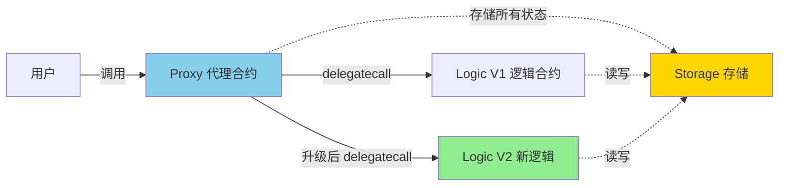
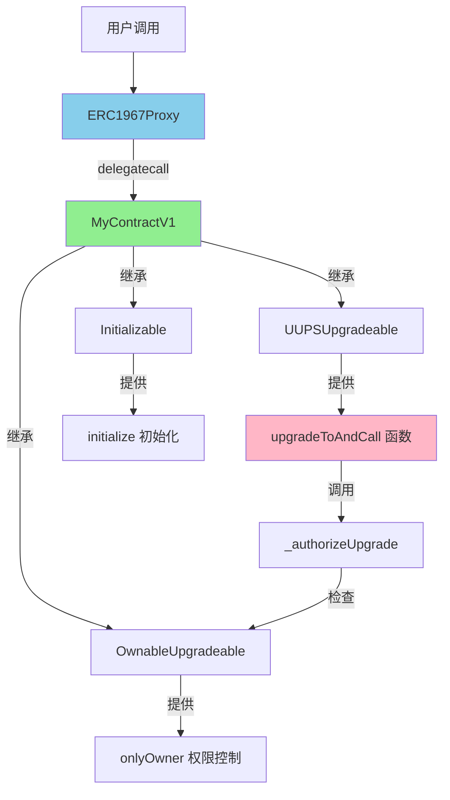
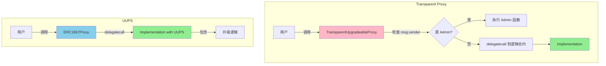
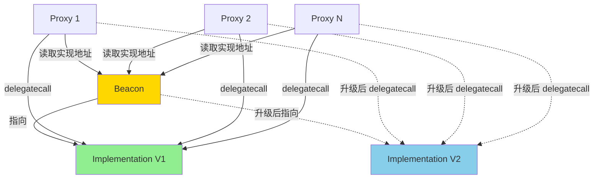

# Proxy

> 合约可升级：在不改变地址的情况下升级逻辑

> [!IMPORTANT] 本节重点
> 1. 什么是代理模式？delegatecall 的工作原理是什么?
> 2. UUPS、Transparent、Beacon 三种代理模式的区别？
> 3. 如何部署和升级可升级合约？
> 4. 存储布局冲突如何避免？
> 5. 可升级合约的安全陷阱有哪些？

## 什么是可升级合约？

**可升级合约（Upgradeable Contracts）** 允许在不改变合约地址、不迁移用户数据的情况下升级业务逻辑。这是 DeFi、GameFi、DAO、NFT 等生产级项目的必备技能。

### 为什么需要可升级？

**传统智能合约的困境：**
- ❌ 合约部署后代码不可变
- ❌ 发现 bug 必须重新部署新合约
- ❌ 用户需要迁移到新地址
- ❌ 数据迁移成本高且易出错

**可升级合约的优势：**
- ✅ 修复 bug 而不更换地址
- ✅ 添加新功能而保留旧数据
- ✅ 用户无感知升级
- ✅ 保持品牌地址不变

### 核心原理：delegatecall



**delegatecall 的关键特性：**

| 项目           | 说明                          |
| ------------ | --------------------------- |
| 代码执行位置       | 逻辑合约（Implementation）        |
| 状态存储位置       | 代理合约（Proxy）                 |
| `msg.sender` | 保持为原始调用者（不是 Proxy）          |
| `msg.value`  | 保持为原始交易金额                   |
| `address(this)` | 指向 Proxy 地址                 |
| 存储布局         | 使用 Proxy 的存储槽，必须与 Logic 兼容 |

## 三种代理模式对比

OpenZeppelin 支持三种可升级模式，各有适用场景：

| 特性            | UUPS                 | Transparent Proxy | Beacon Proxy     |
| ------------- | -------------------- | ----------------- | ---------------- |
| **升级逻辑位置**    | 逻辑合约内                | 代理合约内             | Beacon 合约内      |
| **Gas 成本**    | ✅ 低（每次调用少一次存储读取）     | ❌ 高（需检查调用者）       | 中等               |
| **代理合约复杂度**   | ✅ 简单（最小化）            | ❌ 复杂              | 简单               |
| **误删升级函数风险**  | ⚠️ 有（需谨慎）            | ✅ 无               | ✅ 无              |
| **批量升级**      | ❌ 不支持                | ❌ 不支持             | ✅ 支持（多代理共享逻辑）  |
| **适用场景**      | 单个可升级合约（主流推荐）        | 需最高安全性            | 多个相同合约需统一升级    |
| **OpenZeppelin 推荐** | ⭐⭐⭐⭐⭐              | ⭐⭐⭐              | ⭐⭐⭐⭐ (特定场景)   |

### 选择建议

- **新项目首选 UUPS**：Gas 效率高，代码简洁
- **高价值 DeFi 协议可用 Transparent**：牺牲 Gas 换取更高安全性
- **NFT 系列、游戏道具等批量部署用 Beacon**：一次升级影响所有实例

## UUPS 详解

UUPS（Universal Upgradeable Proxy Standard）是现代主流方案，由 EIP-1822 定义。

### 架构设计



### 完整实现示例

:::code-group

```solidity [MyContractV1.sol - 第一版]
// SPDX-License-Identifier: MIT
pragma solidity ^0.8.22;

import {Initializable} from "@openzeppelin/contracts-upgradeable/proxy/utils/Initializable.sol";
import {UUPSUpgradeable} from "@openzeppelin/contracts-upgradeable/proxy/utils/UUPSUpgradeable.sol";
import {OwnableUpgradeable} from "@openzeppelin/contracts-upgradeable/access/OwnableUpgradeable.sol";

/**
 * @title MyContractV1
 * @dev UUPS 可升级合约 V1 版本
 *
 * 关键点：
 * 1. 继承顺序：Initializable → UUPSUpgradeable → OwnableUpgradeable
 * 2. 使用 initialize 代替 constructor
 * 3. 必须实现 _authorizeUpgrade 控制升级权限
 * 4. 预留 __gap 保证存储布局兼容
 */
contract MyContractV1 is Initializable, UUPSUpgradeable, OwnableUpgradeable {
    // ===================== 状态变量 =====================
    uint256 public value;
    string public message;

    // 预留存储槽，防止未来升级时存储冲突
    // 50 个槽 - 2 个已用 = 48 个预留
    uint256[48] private __gap;

    // ===================== 事件 =====================
    event ValueChanged(uint256 oldValue, uint256 newValue);

    // ===================== 初始化（替代 constructor）=====================

    /// @custom:oz-upgrades-unsafe-allow constructor
    constructor() {
        _disableInitializers(); // 防止逻辑合约被初始化
    }

    /**
     * @dev 初始化函数（仅能调用一次）
     * @param initialOwner 合约所有者地址
     * @param initialValue 初始数值
     * @param initialMessage 初始消息
     */
    function initialize(
        address initialOwner,
        uint256 initialValue,
        string memory initialMessage
    ) public initializer {
        __Ownable_init(initialOwner);  // 初始化 Ownable
        __UUPSUpgradeable_init();      // 初始化 UUPS（可选，v5+ 为空实现）

        value = initialValue;
        message = initialMessage;
    }

    // ===================== 业务函数 =====================

    /**
     * @dev 设置新数值（仅 owner）
     */
    function setValue(uint256 newValue) external onlyOwner {
        uint256 oldValue = value;
        value = newValue;
        emit ValueChanged(oldValue, newValue);
    }

    /**
     * @dev 获取消息
     */
    function getMessage() external view returns (string memory) {
        return message;
    }

    // ===================== 升级授权 =====================

    /**
     * @dev 授权升级（必须实现）
     * 只有 owner 可以升级合约
     */
    function _authorizeUpgrade(address newImplementation)
        internal
        override
        onlyOwner
    {}
}
```

```solidity [MyContractV2.sol - 升级版]
// SPDX-License-Identifier: MIT
pragma solidity ^0.8.22;

import {Initializable} from "@openzeppelin/contracts-upgradeable/proxy/utils/Initializable.sol";
import {UUPSUpgradeable} from "@openzeppelin/contracts-upgradeable/proxy/utils/UUPSUpgradeable.sol";
import {OwnableUpgradeable} from "@openzeppelin/contracts-upgradeable/access/OwnableUpgradeable.sol";

/**
 * @title MyContractV2
 * @dev 升级后的版本，新增功能
 *
 * ⚠️ 升级注意事项：
 * 1. 不能改变现有状态变量的顺序
 * 2. 不能删除现有状态变量
 * 3. 可以在末尾添加新状态变量
 * 4. 通过减少 __gap 数量来添加新变量
 */
contract MyContractV2 is Initializable, UUPSUpgradeable, OwnableUpgradeable {
    // ===================== 原有状态变量（不能改动）=====================
    uint256 public value;
    string public message;

    // ===================== 新增状态变量 =====================
    uint256 public counter;        // 新增计数器
    mapping(address => uint256) public userValues; // 新增用户数据

    // 预留槽减少：48 - 2 = 46
    uint256[46] private __gap;

    // ===================== 新增事件 =====================
    event CounterIncremented(uint256 newCounter);

    /// @custom:oz-upgrades-unsafe-allow constructor
    constructor() {
        _disableInitializers();
    }

    /**
     * @dev V2 不需要新的初始化函数（状态已存在）
     * 但如果需要初始化新变量，可以添加：
     */
    function initializeV2() public reinitializer(2) {
        counter = 0; // 初始化新变量
    }

    // ===================== 保留原有函数 =====================

    function initialize(
        address initialOwner,
        uint256 initialValue,
        string memory initialMessage
    ) public initializer {
        __Ownable_init(initialOwner);
        __UUPSUpgradeable_init();

        value = initialValue;
        message = initialMessage;
    }

    function setValue(uint256 newValue) external onlyOwner {
        value = newValue;
    }

    function getMessage() external view returns (string memory) {
        return message;
    }

    // ===================== 新增函数 =====================

    /**
     * @dev 增加计数器
     */
    function incrementCounter() external {
        counter++;
        emit CounterIncremented(counter);
    }

    /**
     * @dev 设置用户数值
     */
    function setUserValue(uint256 newValue) external {
        userValues[msg.sender] = newValue;
    }

    /**
     * @dev 返回版本号（新增）
     */
    function version() external pure returns (string memory) {
        return "v2.0.0";
    }

    // ===================== 升级授权 =====================

    function _authorizeUpgrade(address newImplementation)
        internal
        override
        onlyOwner
    {}
}
```

```typescript [deploy-and-upgrade.ts - 部署和升级脚本]
import { ethers, upgrades } from "hardhat";

async function main() {
  const [deployer] = await ethers.getSigners();
  console.log("部署账户:", deployer.address);

  // ===================== 1. 部署 V1 =====================
  console.log("\n📦 部署 MyContractV1...");

  const MyContractV1 = await ethers.getContractFactory("MyContractV1");

  // 使用 OpenZeppelin Hardhat Upgrades 插件部署
  const proxy = await upgrades.deployProxy(
    MyContractV1,
    [deployer.address, 100, "Hello V1"], // initialize 参数
    { kind: "uups" }
  );

  await proxy.waitForDeployment();
  const proxyAddress = await proxy.getAddress();

  console.log("✅ Proxy 地址:", proxyAddress);
  console.log("✅ 逻辑合约 V1 地址:", await upgrades.erc1967.getImplementationAddress(proxyAddress));

  // ===================== 2. 验证 V1 功能 =====================
  console.log("\n🔍 验证 V1 功能...");
  console.log("Value:", await proxy.value());
  console.log("Message:", await proxy.getMessage());

  // ===================== 3. 升级到 V2 =====================
  console.log("\n🔄 升级到 MyContractV2...");

  const MyContractV2 = await ethers.getContractFactory("MyContractV2");

  const upgraded = await upgrades.upgradeProxy(proxyAddress, MyContractV2);
  await upgraded.waitForDeployment();

  console.log("✅ 升级成功！");
  console.log("✅ 新逻辑合约 V2 地址:", await upgrades.erc1967.getImplementationAddress(proxyAddress));
  console.log("⚠️  Proxy 地址不变:", await upgraded.getAddress());

  // ===================== 4. 初始化 V2 新变量 =====================
  console.log("\n🎯 初始化 V2 新变量...");
  const tx = await upgraded.initializeV2();
  await tx.wait();

  // ===================== 5. 验证 V2 功能 =====================
  console.log("\n🔍 验证 V2 功能...");
  console.log("Value（旧数据保留）:", await upgraded.value());
  console.log("Message（旧数据保留）:", await upgraded.getMessage());
  console.log("Counter（新变量）:", await upgraded.counter());
  console.log("Version:", await upgraded.version());

  // 测试新功能
  const incrementTx = await upgraded.incrementCounter();
  await incrementTx.wait();
  console.log("Counter（递增后）:", await upgraded.counter());
}

main()
  .then(() => process.exit(0))
  .catch((error) => {
    console.error(error);
    process.exit(1);
  });
```

:::

### UUPSUpgradeable 源码解析

:::code-group

```solidity [UUPSUpgradeable.sol 核心源码]
// SPDX-License-Identifier: MIT
// OpenZeppelin Contracts (last updated v5.5.0) (proxy/utils/UUPSUpgradeable.sol)

pragma solidity ^0.8.22;

import {IERC1822Proxiable} from "../../interfaces/draft-IERC1822.sol";
import {ERC1967Utils} from "../ERC1967/ERC1967Utils.sol";

/**
 * @dev UUPS 升级机制
 *
 * 核心思想：
 * - Proxy 合约极简，仅负责 delegatecall
 * - 升级逻辑放在 Implementation（逻辑合约）内
 * - 通过 ERC1967 标准存储槽存储实现地址
 *
 * 安全机制：
 * - 升级前检查新实现是否仍支持 UUPS（proxiableUUID）
 * - 必须实现 _authorizeUpgrade 控制升级权限
 */
abstract contract UUPSUpgradeable is IERC1822Proxiable {
    /// @custom:oz-upgrades-unsafe-allow state-variable-immutable
    /// 存储当前合约自己的地址，用于判断是否为 delegatecall
    address private immutable __self = address(this);

    /**
     * @dev UUPS 接口版本
     */
    string public constant UPGRADE_INTERFACE_VERSION = "5.0.0";

    /// @dev 未授权的调用来源
    error UUPSUnauthorizedCallContext();

    /// @dev 新实现返回了非法的 UUID
    error UUPSUnsupportedProxiableUUID(bytes32 slot);

    /**
     * @dev modifier onlyProxy
     * 确保函数只能通过 Proxy 的 delegatecall 调用
     *
     * 检查条件：
     * 1. address(this) != __self（说明是 delegatecall）
     * 2. 当前 Proxy 的实现指向本合约
     */
    modifier onlyProxy() {
        _checkProxy();
        _;
    }

    /**
     * @dev modifier notDelegated
     * 确保函数不能通过 delegatecall 调用
     * 用于保护 proxiableUUID 等函数
     */
    modifier notDelegated() {
        _checkNotDelegated();
        _;
    }

    /**
     * @dev ERC1822 标准函数
     * 返回实现存储槽的 UUID
     * 必须用 notDelegated 修饰，防止 Proxy 调用
     */
    function proxiableUUID() external view virtual notDelegated returns (bytes32) {
        return ERC1967Utils.IMPLEMENTATION_SLOT;
    }

    /**
     * @dev UUPS 升级主函数
     * @param newImplementation 新逻辑合约地址
     * @param data 可选的初始化调用数据
     *
     * 流程：
     * 1. 调用 _authorizeUpgrade 检查权限
     * 2. 执行升级并调用初始化函数
     */
    function upgradeToAndCall(address newImplementation, bytes memory data)
        public
        payable
        virtual
        onlyProxy
    {
        _authorizeUpgrade(newImplementation);
        _upgradeToAndCallUUPS(newImplementation, data);
    }

    /**
     * @dev 检查是否为 Proxy 调用
     */
    function _checkProxy() internal view virtual {
        if (
            address(this) == __self ||  // 直接调用，非 delegatecall
            ERC1967Utils.getImplementation() != __self  // Proxy 未指向本合约
        ) {
            revert UUPSUnauthorizedCallContext();
        }
    }

    /**
     * @dev 检查是否为直接调用
     */
    function _checkNotDelegated() internal view virtual {
        if (address(this) != __self) {
            revert UUPSUnauthorizedCallContext();
        }
    }

    /**
     * @dev 授权升级函数（必须由子合约实现）
     *
     * 示例：
     * function _authorizeUpgrade(address) internal override onlyOwner {}
     */
    function _authorizeUpgrade(address newImplementation) internal virtual;

    /**
     * @dev 执行 UUPS 升级
     *
     * 安全检查：
     * 1. 调用 newImplementation.proxiableUUID() 验证支持 UUPS
     * 2. 检查 UUID 是否正确
     * 3. 执行升级
     */
    function _upgradeToAndCallUUPS(address newImplementation, bytes memory data)
        private
    {
        try IERC1822Proxiable(newImplementation).proxiableUUID() returns (bytes32 slot) {
            if (slot != ERC1967Utils.IMPLEMENTATION_SLOT) {
                revert UUPSUnsupportedProxiableUUID(slot);
            }
            ERC1967Utils.upgradeToAndCall(newImplementation, data);
        } catch {
            revert ERC1967Utils.ERC1967InvalidImplementation(newImplementation);
        }
    }
}
```

:::

### 关键设计解析

#### 1. 为什么禁用 constructor？

```solidity
/// @custom:oz-upgrades-unsafe-allow constructor
constructor() {
    _disableInitializers(); // 防止逻辑合约被初始化
}
```

**原因：**
- 逻辑合约的 constructor 在部署时执行，只初始化逻辑合约自己的存储
- Proxy 合约的存储是独立的，constructor 无法初始化 Proxy 的状态
- 必须使用 `initialize()` 函数在 Proxy 上下文中初始化

**安全性：**
- `_disableInitializers()` 防止有人直接调用逻辑合约的 `initialize()`
- 确保初始化只能在 Proxy 上执行一次

#### 2. 存储布局保护：__gap

```solidity
// V1
uint256 public value;
string public message;
uint256[48] private __gap;  // 预留 48 个槽

// V2（新增 2 个变量）
uint256 public value;       // 槽 0（不变）
string public message;      // 槽 1（不变）
uint256 public counter;     // 槽 2（新增）
mapping(address => uint256) public userValues; // 槽 3（新增）
uint256[46] private __gap;  // 48 - 2 = 46
```

**为什么需要 __gap？**
- Solidity 按顺序分配存储槽
- 升级时新增变量会占用新的槽
- 如果父合约升级，可能导致子合约的槽被覆盖
- `__gap` 预留空间，确保升级时槽位不冲突

#### 3. reinitializer 的使用

```solidity
// V1 初始化
function initialize(...) public initializer {
    // 版本 1 的初始化
}

// V2 初始化新变量
function initializeV2() public reinitializer(2) {
    counter = 0; // 初始化 V2 新增的变量
}

// V3 再次升级
function initializeV3() public reinitializer(3) {
    // V3 的初始化
}
```

**版本控制：**
- `initializer`：版本 1，只能调用一次
- `reinitializer(n)`：版本 n，升级时可再次调用
- 每次升级版本号递增

## Transparent Proxy

Transparent Proxy 将升级逻辑放在代理合约内，通过区分 admin 和普通用户的调用来避免函数选择器冲突。

### 架构对比



### 实现示例

:::code-group

```solidity [MyContractTransparent.sol]
// SPDX-License-Identifier: MIT
pragma solidity ^0.8.22;

import {Initializable} from "@openzeppelin/contracts-upgradeable/proxy/utils/Initializable.sol";
import {OwnableUpgradeable} from "@openzeppelin/contracts-upgradeable/access/OwnableUpgradeable.sol";

/**
 * @title MyContractTransparent
 * @dev Transparent Proxy 逻辑合约
 *
 * 与 UUPS 的区别：
 * - 不需要继承 UUPSUpgradeable
 * - 不需要实现 _authorizeUpgrade
 * - 升级逻辑在 ProxyAdmin 合约中
 */
contract MyContractTransparent is Initializable, OwnableUpgradeable {
    uint256 public value;
    string public message;

    uint256[48] private __gap;

    /// @custom:oz-upgrades-unsafe-allow constructor
    constructor() {
        _disableInitializers();
    }

    function initialize(
        address initialOwner,
        uint256 initialValue,
        string memory initialMessage
    ) public initializer {
        __Ownable_init(initialOwner);

        value = initialValue;
        message = initialMessage;
    }

    function setValue(uint256 newValue) external onlyOwner {
        value = newValue;
    }

    function getMessage() external view returns (string memory) {
        return message;
    }
}
```

```typescript [deploy-transparent.ts]
import { ethers, upgrades } from "hardhat";

async function main() {
  const [deployer] = await ethers.getSigners();

  // 部署 Transparent Proxy
  const MyContract = await ethers.getContractFactory("MyContractTransparent");

  const proxy = await upgrades.deployProxy(
    MyContract,
    [deployer.address, 100, "Hello Transparent"],
    { kind: "transparent" } // 指定使用 Transparent Proxy
  );

  await proxy.waitForDeployment();
  const proxyAddress = await proxy.getAddress();

  console.log("Proxy 地址:", proxyAddress);
  console.log("逻辑合约地址:", await upgrades.erc1967.getImplementationAddress(proxyAddress));
  console.log("ProxyAdmin 地址:", await upgrades.erc1967.getAdminAddress(proxyAddress));

  // 升级
  const MyContractV2 = await ethers.getContractFactory("MyContractTransparentV2");
  const upgraded = await upgrades.upgradeProxy(proxyAddress, MyContractV2);

  console.log("升级成功！");
}

main();
```

:::

### Transparent vs UUPS

| 对比项         | Transparent Proxy           | UUPS                      |
| ----------- | --------------------------- | ------------------------- |
| **Gas 成本**  | 每次调用多 ~2000 gas（检查 admin） | 低                         |
| **升级逻辑位置**  | ProxyAdmin 合约              | 逻辑合约内                     |
| **误删升级函数风险** | 无                           | 有（需谨慎）                    |
| **部署成本**    | 高（需额外部署 ProxyAdmin）         | 低                         |
| **代码复杂度**   | Proxy 复杂                    | Proxy 简单                  |
| **适用场景**    | 高价值协议，追求极致安全                | 大多数项目，追求 gas 效率           |

## Beacon Proxy

Beacon Proxy 适用于需要部署多个相同逻辑的代理合约场景（如 NFT 系列、游戏道具等）。

### 架构设计



### 实现示例

:::code-group

```solidity [NFTCollection.sol - 逻辑合约]
// SPDX-License-Identifier: MIT
pragma solidity ^0.8.22;

import {Initializable} from "@openzeppelin/contracts-upgradeable/proxy/utils/Initializable.sol";
import {ERC721Upgradeable} from "@openzeppelin/contracts-upgradeable/token/ERC721/ERC721Upgradeable.sol";
import {OwnableUpgradeable} from "@openzeppelin/contracts-upgradeable/access/OwnableUpgradeable.sol";

/**
 * @dev NFT 集合逻辑合约（Beacon Proxy 实现）
 */
contract NFTCollection is Initializable, ERC721Upgradeable, OwnableUpgradeable {
    uint256 private _nextTokenId;

    uint256[49] private __gap;

    /// @custom:oz-upgrades-unsafe-allow constructor
    constructor() {
        _disableInitializers();
    }

    function initialize(
        string memory name,
        string memory symbol,
        address initialOwner
    ) public initializer {
        __ERC721_init(name, symbol);
        __Ownable_init(initialOwner);
        _nextTokenId = 1;
    }

    function mint(address to) external onlyOwner {
        uint256 tokenId = _nextTokenId++;
        _safeMint(to, tokenId);
    }
}
```

```typescript [deploy-beacon.ts]
import { ethers, upgrades } from "hardhat";

async function main() {
  const [deployer] = await ethers.getSigners();

  // 1. 部署 Beacon（指向逻辑合约）
  const NFTCollection = await ethers.getContractFactory("NFTCollection");
  const beacon = await upgrades.deployBeacon(NFTCollection);
  await beacon.waitForDeployment();

  console.log("Beacon 地址:", await beacon.getAddress());

  // 2. 部署多个 Beacon Proxy 实例
  const collections = [];

  for (let i = 1; i <= 3; i++) {
    const proxy = await upgrades.deployBeaconProxy(
      beacon,
      NFTCollection,
      [`Collection ${i}`, `COL${i}`, deployer.address]
    );
    await proxy.waitForDeployment();

    console.log(`Collection ${i} 地址:`, await proxy.getAddress());
    collections.push(proxy);
  }

  // 3. 升级所有 Proxy（一次性）
  console.log("\n🔄 升级所有集合...");

  const NFTCollectionV2 = await ethers.getContractFactory("NFTCollectionV2");
  await upgrades.upgradeBeacon(beacon, NFTCollectionV2);

  console.log("✅ 所有集合已升级到 V2！");

  // 验证升级
  for (let i = 0; i < collections.length; i++) {
    const v2 = await ethers.getContractAt("NFTCollectionV2", await collections[i].getAddress());
    console.log(`Collection ${i + 1} 版本:`, await v2.version());
  }
}

main();
```

:::

### Beacon Proxy 优势

- ✅ 一次升级影响所有代理
- ✅ 节省升级 gas（单次交易）
- ✅ 统一管理大量相同逻辑的合约
- ⚠️ 需要额外的 Beacon 合约管理

## 存储布局详解

可升级合约最关键的安全问题是**存储布局冲突**。

### 存储槽分配规则

```solidity
contract Example {
    uint256 a;        // 槽 0
    uint256 b;        // 槽 1
    uint128 c;        // 槽 2（前 128 位）
    uint128 d;        // 槽 2（后 128 位）
    mapping(address => uint256) e;  // 槽 3（keccak256 计算实际位置）
    uint256[] f;      // 槽 4（数组长度）
    // 数组元素：keccak256(槽 4) + index
}
```

### 升级安全规则

:::code-group

```solidity [❌ 错误示例 1：改变顺序]
// V1
contract V1 {
    uint256 public a;
    uint256 public b;
}

// V2（错误！）
contract V2 {
    uint256 public b;  // ❌ 顺序改变，现在在槽 0
    uint256 public a;  // ❌ 现在在槽 1
}

// 结果：数据错乱！
// Proxy 槽 0 存的是 a 的值，V2 读取时认为是 b
```

```solidity [❌ 错误示例 2：改变类型]
// V1
contract V1 {
    uint256 public value;
}

// V2（错误！）
contract V2 {
    address public value;  // ❌ 类型改变
}

// 结果：数据损坏！
// uint256 转 address 会截断数据
```

```solidity [❌ 错误示例 3：删除变量]
// V1
contract V1 {
    uint256 public a;
    uint256 public b;
    uint256 public c;
}

// V2（错误！）
contract V2 {
    uint256 public a;
    // ❌ 删除了 b
    uint256 public c;  // ❌ 现在在槽 1，但数据在槽 2
}
```

```solidity [✅ 正确示例：仅在末尾添加]
// V1
contract V1 {
    uint256 public a;
    uint256 public b;
    uint256[48] private __gap;
}

// V2（正确）
contract V2 {
    uint256 public a;     // 槽 0（不变）
    uint256 public b;     // 槽 1（不变）
    uint256 public c;     // 槽 2（新增）
    uint256[47] private __gap; // 48 - 1 = 47
}
```

:::

### OpenZeppelin 升级检查工具

```typescript
import { ethers, upgrades } from "hardhat";

// 部署时自动检查存储布局
const proxy = await upgrades.deployProxy(MyContract, [...]);

// 升级时自动验证兼容性
await upgrades.upgradeProxy(proxyAddress, MyContractV2);
// 如果布局不兼容，会抛出错误：
// Error: New storage layout is incompatible
```

**手动验证：**

```bash
# 生成存储布局报告
npx hardhat storage-layout MyContractV1
npx hardhat storage-layout MyContractV2

# 比较差异
npx hardhat storage-layout-check MyContractV1 MyContractV2
```

## 最佳实践

### 1. 使用 OpenZeppelin Hardhat 插件

```javascript
// hardhat.config.js
require("@openzeppelin/hardhat-upgrades");

module.exports = {
  solidity: "0.8.22",
};
```

**自动检查：**
- ✅ 存储布局兼容性
- ✅ constructor 使用
- ✅ delegatecall 安全性
- ✅ selfdestruct 检测

### 2. 初始化安全

```solidity
// ✅ 正确
function initialize(address owner) public initializer {
    __Ownable_init(owner);
    __UUPSUpgradeable_init();
}

// ❌ 错误：缺少 initializer
function initialize(address owner) public {
    __Ownable_init(owner);
}

// ❌ 错误：使用 constructor
constructor(address owner) {
    __Ownable_init(owner);  // 在 Proxy 上无效！
}
```

### 3. 避免 selfdestruct 和 delegatecall

```solidity
// ❌ 禁止使用
contract Bad {
    function destroy() external {
        selfdestruct(payable(msg.sender));  // 会销毁 Proxy！
    }
}

// ❌ 谨慎使用
contract Risky {
    function dangerousCall(address target, bytes memory data) external {
        target.delegatecall(data);  // 可能破坏存储
    }
}
```

### 4. 预留足够的 __gap

```solidity
// 推荐：至少预留 50 个槽
contract MyContract {
    uint256 public value;
    uint256[50] private __gap;  // 为未来升级预留
}

// 如果继承多个合约
contract MyContract is A, B, C {
    // 每个合约都应有自己的 __gap
}
```

### 5. 测试升级流程

```typescript
describe("Upgrade Test", function () {
  it("should preserve state after upgrade", async function () {
    // 部署 V1
    const V1 = await ethers.getContractFactory("MyContractV1");
    const proxy = await upgrades.deployProxy(V1, [owner.address, 100, "test"]);

    // 设置状态
    await proxy.setValue(200);
    const valueBefore = await proxy.value();

    // 升级到 V2
    const V2 = await ethers.getContractFactory("MyContractV2");
    const upgraded = await upgrades.upgradeProxy(proxy, V2);

    // 验证状态保留
    expect(await upgraded.value()).to.equal(valueBefore);

    // 测试新功能
    await upgraded.incrementCounter();
    expect(await upgraded.counter()).to.equal(1);
  });
});
```

## 常见安全陷阱

### 1. 初始化被跳过

```solidity
// ❌ 问题代码
contract MyContract is UUPSUpgradeable {
    uint256 public value = 100;  // ❌ 直接赋值无效！

    function initialize() public initializer {
        // value 不会被设置
    }
}

// ✅ 正确做法
contract MyContract is UUPSUpgradeable {
    uint256 public value;

    function initialize() public initializer {
        value = 100;  // ✅ 在 initialize 中赋值
    }
}
```

### 2. 升级权限失控

```solidity
// ❌ 危险：任何人都能升级
contract BadContract is UUPSUpgradeable {
    function _authorizeUpgrade(address) internal override {
        // 没有权限检查！
    }
}

// ✅ 正确：只有 owner 可升级
contract GoodContract is UUPSUpgradeable, OwnableUpgradeable {
    function _authorizeUpgrade(address) internal override onlyOwner {}
}

// ✅ 更安全：多签控制升级
contract SafeContract is UUPSUpgradeable {
    address public multisig;

    function _authorizeUpgrade(address) internal override {
        require(msg.sender == multisig, "Only multisig");
    }
}
```

### 3. 误删 UUPS 升级逻辑

```solidity
// ❌ 致命错误：V2 删除了 UUPSUpgradeable
contract V2 is OwnableUpgradeable {
    // ❌ 没有继承 UUPSUpgradeable
    // 升级到这个版本后，合约将永远无法再升级！
}

// ✅ 正确：始终保留 UUPS
contract V2 is UUPSUpgradeable, OwnableUpgradeable {
    function _authorizeUpgrade(address) internal override onlyOwner {}
}
```

### 4. 不兼容的存储布局

使用 OpenZeppelin 插件可自动检测：

```bash
npx hardhat test

# 如果检测到不兼容：
# Error: New storage layout is incompatible
#   > Variable `value` has a different type in the new contract
```

## 常见问题 FAQ

### Q1: UUPS 和 Transparent 如何选择？

**A:** 推荐 UUPS，除非：
- 你管理的是数十亿美元的 DeFi 协议（用 Transparent）
- 你担心误删升级函数（用 Transparent）
- 其他情况都用 UUPS（gas 更低，代码更简洁）

### Q2: 为什么 constructor 不能用？

**A:** 因为 Proxy 模式下：
- 逻辑合约的 constructor 只初始化逻辑合约自己的存储
- Proxy 的存储是独立的，无法被 constructor 初始化
- 必须用 `initialize()` 在 Proxy 上下文中执行初始化

### Q3: 如何检查合约是否可升级？

```typescript
import { upgrades } from "hardhat";

// 检查实现地址
const implAddress = await upgrades.erc1967.getImplementationAddress(proxyAddress);
console.log("逻辑合约:", implAddress);

// 检查 Admin（Transparent Proxy）
const adminAddress = await upgrades.erc1967.getAdminAddress(proxyAddress);
console.log("ProxyAdmin:", adminAddress);

// 检查 Beacon（Beacon Proxy）
const beaconAddress = await upgrades.beacon.getBeacon(proxyAddress);
console.log("Beacon:", beaconAddress);
```

### Q4: 升级后如何初始化新变量？

```solidity
// V1
function initialize() public initializer {
    // 版本 1 初始化
}

// V2 新增变量
uint256 public newVar;

function initializeV2() public reinitializer(2) {
    newVar = 0;  // 初始化新变量
}
```

**调用流程：**
```typescript
// 部署 V1
const proxy = await upgrades.deployProxy(V1, []);

// 升级到 V2
await upgrades.upgradeProxy(proxyAddress, V2);

// 初始化新变量
await proxy.initializeV2();
```

### Q5: 如何实现紧急暂停升级？

```solidity
contract MyContract is UUPSUpgradeable, OwnableUpgradeable {
    bool public upgradesPaused;

    function _authorizeUpgrade(address) internal override onlyOwner {
        require(!upgradesPaused, "Upgrades paused");
    }

    function pauseUpgrades() external onlyOwner {
        upgradesPaused = true;
    }

    function unpauseUpgrades() external onlyOwner {
        upgradesPaused = false;
    }
}
```

### Q6: 如何实现延迟升级（Timelock）？

```solidity
import {TimelockController} from "@openzeppelin/contracts/governance/TimelockController.sol";

contract MyContract is UUPSUpgradeable {
    TimelockController public timelock;

    function _authorizeUpgrade(address) internal override {
        require(msg.sender == address(timelock), "Only timelock");
    }

    // 升级流程：
    // 1. 通过 Timelock 提交升级提案
    // 2. 等待延迟期（如 2 天）
    // 3. 执行升级
}
```

## 参考资源

- [OpenZeppelin Upgrades 官方文档](https://docs.openzeppelin.com/upgrades-plugins/1.x/)
- [EIP-1822: Universal Upgradeable Proxy Standard](https://eips.ethereum.org/EIPS/eip-1822)
- [EIP-1967: Proxy Storage Slots](https://eips.ethereum.org/EIPS/eip-1967)
- [OpenZeppelin Hardhat Upgrades Plugin](https://github.com/OpenZeppelin/openzeppelin-upgrades)
