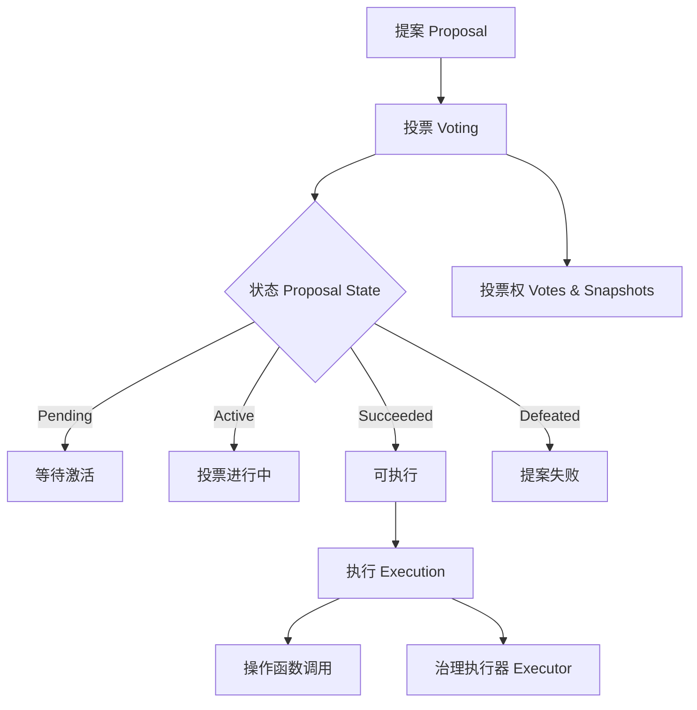

# Governance

OpenZeppelin 治理模块（Governance） 的核心内容：

| 模块                            | 功能                    |
| ----------------------------- | --------------------- |
| `Governor`                    | 核心逻辑：提案、投票、状态、执行权限    |
| `GovernorCountingSimple`      | 简单投票计数（赞成/反对/弃权）      |
| `GovernorVotes`               | 基于 ERC20/ERC721 的投票权重 |
| `GovernorVotesQuorumFraction` | 基于百分比的法定票数（quorum）    |
| `GovernorTimelockControl`     | 使用 Timelock 合约进行延迟执行  |
| `GovernorSettings`            | 设置投票延迟、周期、提案门槛        |
| `TimelockController` | 投票通过后延迟执行提案，提高安全性                     |
| `Votes Extensions`   | 支持基于 ERC20Votes / ERC721Votes 的投票加权机制 |




## Governor

:::code-group

```solidity [Governor 源码]
// SPDX-License-Identifier: MIT
// OpenZeppelin Contracts (last updated v5.5.0) (governance/Governor.sol)

pragma solidity ^0.8.24;

import {IERC721Receiver} from "../token/ERC721/IERC721Receiver.sol";
import {IERC1155Receiver} from "../token/ERC1155/IERC1155Receiver.sol";
import {EIP712} from "../utils/cryptography/EIP712.sol";
import {SignatureChecker} from "../utils/cryptography/SignatureChecker.sol";
import {IERC165, ERC165} from "../utils/introspection/ERC165.sol";
import {SafeCast} from "../utils/math/SafeCast.sol";
import {DoubleEndedQueue} from "../utils/structs/DoubleEndedQueue.sol";
import {Address} from "../utils/Address.sol";
import {Context} from "../utils/Context.sol";
import {Nonces} from "../utils/Nonces.sol";
import {Strings} from "../utils/Strings.sol";
import {IGovernor, IERC6372} from "./IGovernor.sol";

/**
 * @dev 核心治理合约，提供提案创建、投票、执行流程。
 * 这个合约是抽象的，需要通过模块扩展功能：
 *
 * - 计数模块：必须实现 {_quorumReached}, {_voteSucceeded} 和 {_countVote}。
 * - 投票模块：必须实现 {_getVotes}。
 * - 另外，还需实现 {votingPeriod}, {votingDelay}, {quorum}。
 */
abstract contract Governor is Context, ERC165, EIP712, Nonces, IGovernor, IERC721Receiver, IERC1155Receiver {
    using DoubleEndedQueue for DoubleEndedQueue.Bytes32Deque;

    // 投票签名类型哈希
    bytes32 public constant BALLOT_TYPEHASH =
        keccak256("Ballot(uint256 proposalId,uint8 support,address voter,uint256 nonce)");
    bytes32 public constant EXTENDED_BALLOT_TYPEHASH =
        keccak256(
            "ExtendedBallot(uint256 proposalId,uint8 support,address voter,uint256 nonce,string reason,bytes params)"
        );

    // 提案核心信息
    struct ProposalCore {
        address proposer;   // 提案人
        uint48 voteStart;   // 投票开始时间/区块
        uint32 voteDuration;// 投票持续时间
        bool executed;      // 是否已执行
        bool canceled;      // 是否已取消
        uint48 etaSeconds;  // 排队等待执行时间（ETA）
    }

    // 所有提案状态的 bitmap
    bytes32 private constant ALL_PROPOSAL_STATES_BITMAP = bytes32((2 ** (uint8(type(ProposalState).max) + 1)) - 1);
    string private _name;

    // proposalId => ProposalCore
    mapping(uint256 proposalId => ProposalCore) private _proposals;

    // 用于 onlyGovernance 修饰器，保证治理函数只能通过提案执行
    DoubleEndedQueue.Bytes32Deque private _governanceCall;

    /**
     * @dev 限制函数只能通过治理提案执行，例如 GovernorSettings 中的参数修改函数。
     */
    modifier onlyGovernance() {
        _checkGovernance();
        _;
    }

    /**
     * @dev 构造函数设置 name 和 version
     */
    constructor(string memory name_) EIP712(name_, version()) {
        _name = name_;
    }

    /**
     * @dev 接收 ETH，默认情况下禁止，除非执行者是 Governor 本身
     */
    receive() external payable virtual {
        if (_executor() != address(this)) {
            revert GovernorDisabledDeposit();
        }
    }

    /// @inheritdoc IERC165
    function supportsInterface(bytes4 interfaceId) public view virtual override(IERC165, ERC165) returns (bool) {
        return
            interfaceId == type(IGovernor).interfaceId ||
            interfaceId == type(IGovernor).interfaceId ^ IGovernor.getProposalId.selector ||
            interfaceId == type(IERC1155Receiver).interfaceId ||
            super.supportsInterface(interfaceId);
    }

    /// @inheritdoc IGovernor
    function name() public view virtual returns (string memory) {
        return _name;
    }

    /// @inheritdoc IGovernor
    function version() public view virtual returns (string memory) {
        return "1";
    }

    /**
     * @dev 根据 targets、values、calldatas、descriptionHash 计算 proposalId
     * 同样的提案在不同链或不同 governor 上会生成相同 ID。
     */
    function hashProposal(
        address[] memory targets,
        uint256[] memory values,
        bytes[] memory calldatas,
        bytes32 descriptionHash
    ) public pure virtual returns (uint256) {
        return uint256(keccak256(abi.encode(targets, values, calldatas, descriptionHash)));
    }

    /// @inheritdoc IGovernor
    function getProposalId(
        address[] memory targets,
        uint256[] memory values,
        bytes[] memory calldatas,
        bytes32 descriptionHash
    ) public view virtual returns (uint256) {
        return hashProposal(targets, values, calldatas, descriptionHash);
    }

    /**
     * @dev 返回提案状态
     */
    function state(uint256 proposalId) public view virtual returns (ProposalState) {
        ProposalCore storage proposal = _proposals[proposalId];
        bool proposalExecuted = proposal.executed;
        bool proposalCanceled = proposal.canceled;

        if (proposalExecuted) {
            return ProposalState.Executed;
        }

        if (proposalCanceled) {
            return ProposalState.Canceled;
        }

        uint256 snapshot = proposalSnapshot(proposalId);

        if (snapshot == 0) {
            revert GovernorNonexistentProposal(proposalId);
        }

        uint256 currentTimepoint = clock();

        if (snapshot >= currentTimepoint) {
            return ProposalState.Pending;
        }

        uint256 deadline = proposalDeadline(proposalId);

        if (deadline >= currentTimepoint) {
            return ProposalState.Active;
        } else if (!_quorumReached(proposalId) || !_voteSucceeded(proposalId)) {
            return ProposalState.Defeated;
        } else if (proposalEta(proposalId) == 0) {
            return ProposalState.Succeeded;
        } else {
            return ProposalState.Queued;
        }
    }

    /// 提案门槛，默认为 0
    function proposalThreshold() public view virtual returns (uint256) {
        return 0;
    }

    /// 投票开始时间
    function proposalSnapshot(uint256 proposalId) public view virtual returns (uint256) {
        return _proposals[proposalId].voteStart;
    }

    /// 投票结束时间
    function proposalDeadline(uint256 proposalId) public view virtual returns (uint256) {
        return _proposals[proposalId].voteStart + _proposals[proposalId].voteDuration;
    }

    /// 提案发起人
    function proposalProposer(uint256 proposalId) public view virtual returns (address) {
        return _proposals[proposalId].proposer;
    }

    /// 提案 ETA（队列执行时间）
    function proposalEta(uint256 proposalId) public view virtual returns (uint256) {
        return _proposals[proposalId].etaSeconds;
    }

    /// 是否需要排队
    function proposalNeedsQueuing(uint256) public view virtual returns (bool) {
        return false;
    }

    /**
     * @dev 验证是否为治理调用
     */
    function _checkGovernance() internal virtual {
        if (_executor() != _msgSender()) {
            revert GovernorOnlyExecutor(_msgSender());
        }
        if (_executor() != address(this)) {
            bytes32 msgDataHash = keccak256(_msgData());
            while (_governanceCall.popFront() != msgDataHash) {}
        }
    }

    // --- 抽象函数，子模块需要实现 ---
    function _quorumReached(uint256 proposalId) internal view virtual returns (bool);
    function _voteSucceeded(uint256 proposalId) internal view virtual returns (bool);
    function _getVotes(address account, uint256 timepoint, bytes memory params) internal view virtual returns (uint256);
    function _countVote(
        uint256 proposalId,
        address account,
        uint8 support,
        uint256 totalWeight,
        bytes memory params
    ) internal virtual returns (uint256);
    function _tallyUpdated(uint256 proposalId) internal virtual {}
    function _defaultParams() internal view virtual returns (bytes memory) { return ""; }

    // --- 提案创建 ---
    function propose(
        address[] memory targets,
        uint256[] memory values,
        bytes[] memory calldatas,
        string memory description
    ) public virtual returns (uint256) {
        address proposer = _msgSender();

        if (!_isValidDescriptionForProposer(proposer, description)) {
            revert GovernorRestrictedProposer(proposer);
        }

        uint256 votesThreshold = proposalThreshold();
        if (votesThreshold > 0) {
            uint256 proposerVotes = getVotes(proposer, clock() - 1);
            if (proposerVotes < votesThreshold) {
                revert GovernorInsufficientProposerVotes(proposer, proposerVotes, votesThreshold);
            }
        }

        return _propose(targets, values, calldatas, description, proposer);
    }

    function _propose(
        address[] memory targets,
        uint256[] memory values,
        bytes[] memory calldatas,
        string memory description,
        address proposer
    ) internal virtual returns (uint256 proposalId) {
        proposalId = getProposalId(targets, values, calldatas, keccak256(bytes(description)));

        if (targets.length != values.length || targets.length != calldatas.length || targets.length == 0) {
            revert GovernorInvalidProposalLength(targets.length, calldatas.length, values.length);
        }
        if (_proposals[proposalId].voteStart != 0) {
            revert GovernorUnexpectedProposalState(proposalId, state(proposalId), bytes32(0));
        }

        uint256 snapshot = clock() + votingDelay();
        uint256 duration = votingPeriod();

        ProposalCore storage proposal = _proposals[proposalId];
        proposal.proposer = proposer;
        proposal.voteStart = SafeCast.toUint48(snapshot);
        proposal.voteDuration = SafeCast.toUint32(duration);

        emit ProposalCreated(
            proposalId,
            proposer,
            targets,
            values,
            new string[](targets.length),
            calldatas,
            snapshot,
            snapshot + duration,
            description
        );
    }

    // --- 队列与执行 ---
    function queue(
        address[] memory targets,
        uint256[] memory values,
        bytes[] memory calldatas,
        bytes32 descriptionHash
    ) public virtual returns (uint256) {
        uint256 proposalId = getProposalId(targets, values, calldatas, descriptionHash);

        _validateStateBitmap(proposalId, _encodeStateBitmap(ProposalState.Succeeded));

        uint48 etaSeconds = _queueOperations(proposalId, targets, values, calldatas, descriptionHash);
        if (etaSeconds != 0) {
            _proposals[proposalId].etaSeconds = etaSeconds;
            emit ProposalQueued(proposalId, etaSeconds);
        } else {
            revert GovernorQueueNotImplemented();
        }

        return proposalId;
    }

    function _queueOperations(
        uint256, address[] memory, uint256[] memory, bytes[] memory, bytes32
    ) internal virtual returns (uint48) { return 0; }

    function execute(
        address[] memory targets,
        uint256[] memory values,
        bytes[] memory calldatas,
        bytes32 descriptionHash
    ) public payable virtual returns (uint256) {
        uint256 proposalId = getProposalId(targets, values, calldatas, descriptionHash);

        _validateStateBitmap(
            proposalId,
            _encodeStateBitmap(ProposalState.Succeeded) | _encodeStateBitmap(ProposalState.Queued)
        );

        _proposals[proposalId].executed = true;

        if (_executor() != address(this)) {
            for (uint256 i = 0; i < targets.length; ++i) {
                if (targets[i] == address(this)) {
                    _governanceCall.pushBack(keccak256(calldatas[i]));
                }
            }
        }

        _executeOperations(proposalId, targets, values, calldatas, descriptionHash);

        if (_executor() != address(this) && !_governanceCall.empty()) {
            _governanceCall.clear();
        }

        emit ProposalExecuted(proposalId);

        return proposalId;
    }

    function _executeOperations(
        uint256, address[] memory targets, uint256[] memory values, bytes[] memory calldatas, bytes32
    ) internal virtual {
        for (uint256 i = 0; i < targets.length; ++i) {
            (bool success, bytes memory returndata) = targets[i].call{value: values[i]}(calldatas[i]);
            Address.verifyCallResult(success, returndata);
        }
    }

    // --- 投票 ---
    function getVotes(address account, uint256 timepoint) public view virtual returns (uint256) {
        return _getVotes(account, timepoint, _defaultParams());
    }

    function castVote(uint256 proposalId, uint8 support) public virtual returns (uint256) {
        return _castVote(proposalId, _msgSender(), support, "");
    }

    function _castVote(
        uint256 proposalId,
        address account,
        uint8 support,
        string memory reason,
        bytes memory params
    ) internal virtual returns (uint256) {
        _validateStateBitmap(proposalId, _encodeStateBitmap(ProposalState.Active));

        uint256 totalWeight = _getVotes(account, proposalSnapshot(proposalId), params);
        uint256 votedWeight = _countVote(proposalId, account, support, totalWeight, params);

        if (params.length == 0) {
            emit VoteCast(account, proposalId, support, votedWeight, reason);
        } else {
            emit VoteCastWithParams(account, proposalId, support, votedWeight, reason, params);
        }

        _tallyUpdated(proposalId);

        return votedWeight;
    }

    // --- 执行者地址 ---
    function _executor() internal view virtual returns (address) {
        return address(this);
    }

    // --- 接收 NFT ---
    function onERC721Received(address, address, uint256, bytes memory) public virtual returns (bytes4) {
        if (_executor() != address(this)) revert GovernorDisabledDeposit();
        return this.onERC721Received.selector;
    }

    function onERC1155Received(address, address, uint256, uint256, bytes memory) public virtual returns (bytes4) {
        if (_executor() != address(this)) revert GovernorDisabledDeposit();
        return this.onERC1155Received.selector;
    }

    function onERC1155BatchReceived(address, address, uint256[] memory, uint256[] memory, bytes memory) public virtual returns (bytes4) {
        if (_executor() != address(this)) revert GovernorDisabledDeposit();
        return this.onERC1155BatchReceived.selector;
    }

    // --- Proposal 状态 bitmap 编码 ---
    function _encodeStateBitmap(ProposalState proposalState) internal pure returns (bytes32) {
        return bytes32(1 << uint8(proposalState));
    }

    function _validateStateBitmap(uint256 proposalId, bytes32 allowedStates) internal view returns (ProposalState) {
        ProposalState currentState = state(proposalId);
        if (_encodeStateBitmap(currentState) & allowedStates == bytes32(0)) {
            revert GovernorUnexpectedProposalState(proposalId, currentState, allowedStates);
        }
        return currentState;
    }

    // --- 投票延迟、投票周期、法定人数等 ---
    function clock() public view virtual returns (uint48);
    function CLOCK_MODE() public view virtual returns (string memory);
    function votingDelay() public view virtual returns (uint256);
    function votingPeriod() public view virtual returns (uint256);
    function quorum(uint256 timepoint) public view virtual returns (uint256);

    function _unsafeReadBytesOffset(bytes memory buffer, uint256 offset) private pure returns (bytes32 value) {
        assembly ("memory-safe") {
            value := mload(add(add(buffer, 0x20), offset))
        }
    }
}
```
:::