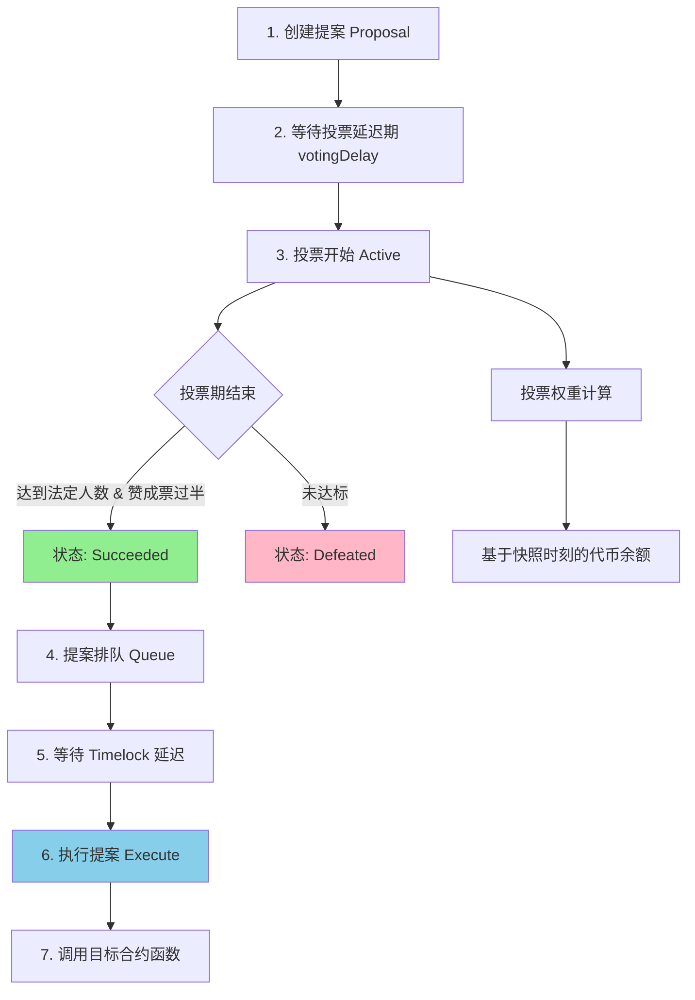

# Governance

> 链上 DAO 治理：如何让社区真正掌控协议

> [!IMPORTANT] 本节重点
> 1. OpenZeppelin Governor 治理系统的完整架构是什么？
> 2. 如何创建一个完整的 DAO 治理合约？
> 3. 提案从创建到执行的完整流程是怎样的？
> 4. 如何使用 Timelock 保护提案执行安全？
> 5. 投票权重如何计算？法定人数如何设置？

## 什么是 DAO 治理？

**DAO（Decentralized Autonomous Organization，去中心化自治组织）** 是一种通过智能合约实现的组织形式，决策权由代币持有者共同行使，而非中心化团队。

OpenZeppelin 的 Governance 模块提供了一套完整的链上治理解决方案，被 Compound、Uniswap、ENS 等知名项目采用。

### 核心优势

- **完全链上**：提案、投票、执行全部在链上完成，公开透明
- **模块化设计**：可灵活组合不同功能模块
- **安全可靠**：经过大量审计和实战检验
- **兼容标准**：遵循 Governor Bravo 规范

## 核心模块总览

| 模块                            | 功能                        | 必需性 |
| ----------------------------- | ------------------------- | --- |
| `Governor`                    | 核心逻辑：提案、投票、状态、执行权限        | ✅   |
| `GovernorCountingSimple`      | 简单投票计数（赞成/反对/弃权）          | ✅   |
| `GovernorVotes`               | 基于 ERC20Votes/ERC721Votes 的投票权重 | ✅   |
| `GovernorVotesQuorumFraction` | 基于百分比的法定票数（quorum）        | 可选  |
| `GovernorTimelockControl`     | 使用 Timelock 合约进行延迟执行      | 推荐  |
| `GovernorSettings`            | 设置投票延迟、周期、提案门槛            | 推荐  |
| `TimelockController`          | 投票通过后延迟执行提案，提高安全性         | 推荐  |
| `Votes Extensions`            | 支持 ERC20Votes / ERC721Votes 投票加权 | ✅   |

## 治理流程图



### 提案状态机

```
Pending（待激活）
    ↓
Active（投票中）
    ↓
    ├─→ Defeated（失败）
    ├─→ Succeeded（成功）
    │       ↓
    │   Queued（已排队，需要 Timelock）
    │       ↓
    └─→ Executed（已执行）
```

## Governor 核心合约

`Governor` 是治理系统的基石，提供了提案创建、投票、执行的完整框架。

:::code-group

```solidity [完整示例：MyGovernor]
// SPDX-License-Identifier: MIT
pragma solidity ^0.8.24;

import {Governor} from "@openzeppelin/contracts/governance/Governor.sol";
import {GovernorCountingSimple} from "@openzeppelin/contracts/governance/extensions/GovernorCountingSimple.sol";
import {GovernorVotes} from "@openzeppelin/contracts/governance/extensions/GovernorVotes.sol";
import {GovernorVotesQuorumFraction} from "@openzeppelin/contracts/governance/extensions/GovernorVotesQuorumFraction.sol";
import {GovernorTimelockControl} from "@openzeppelin/contracts/governance/extensions/GovernorTimelockControl.sol";
import {GovernorSettings} from "@openzeppelin/contracts/governance/extensions/GovernorSettings.sol";
import {TimelockController} from "@openzeppelin/contracts/governance/TimelockController.sol";
import {IVotes} from "@openzeppelin/contracts/governance/utils/IVotes.sol";

/**
 * @title MyGovernor
 * @dev 完整的 DAO 治理合约示例
 *
 * 功能特性：
 * - 基于 ERC20Votes 的投票权重
 * - 法定人数为总供应量的 4%
 * - 提案需要 1000 票才能发起
 * - 投票延迟 1 天，投票周期 1 周
 * - 使用 2 天 Timelock 延迟执行
 */
contract MyGovernor is
    Governor,
    GovernorSettings,
    GovernorCountingSimple,
    GovernorVotes,
    GovernorVotesQuorumFraction,
    GovernorTimelockControl
{
    constructor(
        IVotes _token,
        TimelockController _timelock
    )
        Governor("MyGovernor")
        GovernorSettings(
            7200,   /* 投票延迟 1 天 (假设 12s/block) */
            50400,  /* 投票周期 1 周 */
            1000e18 /* 提案门槛 1000 票 */
        )
        GovernorVotes(_token)
        GovernorVotesQuorumFraction(4) // 法定人数 4%
        GovernorTimelockControl(_timelock)
    {}

    // --- 必需的重写函数 ---

    function votingDelay()
        public
        view
        override(Governor, GovernorSettings)
        returns (uint256)
    {
        return super.votingDelay();
    }

    function votingPeriod()
        public
        view
        override(Governor, GovernorSettings)
        returns (uint256)
    {
        return super.votingPeriod();
    }

    function quorum(uint256 blockNumber)
        public
        view
        override(Governor, GovernorVotesQuorumFraction)
        returns (uint256)
    {
        return super.quorum(blockNumber);
    }

    function state(uint256 proposalId)
        public
        view
        override(Governor, GovernorTimelockControl)
        returns (ProposalState)
    {
        return super.state(proposalId);
    }

    function proposalNeedsQueuing(uint256 proposalId)
        public
        view
        override(Governor, GovernorTimelockControl)
        returns (bool)
    {
        return super.proposalNeedsQueuing(proposalId);
    }

    function proposalThreshold()
        public
        view
        override(Governor, GovernorSettings)
        returns (uint256)
    {
        return super.proposalThreshold();
    }

    function _executeOperations(
        uint256 proposalId,
        address[] memory targets,
        uint256[] memory values,
        bytes[] memory calldatas,
        bytes32 descriptionHash
    ) internal override(Governor, GovernorTimelockControl) {
        super._executeOperations(proposalId, targets, values, calldatas, descriptionHash);
    }

    function _cancel(
        address[] memory targets,
        uint256[] memory values,
        bytes[] memory calldatas,
        bytes32 descriptionHash
    ) internal override(Governor, GovernorTimelockControl) returns (uint256) {
        return super._cancel(targets, values, calldatas, descriptionHash);
    }

    function _executor()
        internal
        view
        override(Governor, GovernorTimelockControl)
        returns (address)
    {
        return super._executor();
    }
}
```

```solidity [Governor 核心源码]
// SPDX-License-Identifier: MIT
// OpenZeppelin Contracts (last updated v5.5.0) (governance/Governor.sol)

pragma solidity ^0.8.24;

import {IERC721Receiver} from "../token/ERC721/IERC721Receiver.sol";
import {IERC1155Receiver} from "../token/ERC1155/IERC1155Receiver.sol";
import {EIP712} from "../utils/cryptography/EIP712.sol";
import {SignatureChecker} from "../utils/cryptography/SignatureChecker.sol";
import {IERC165, ERC165} from "../utils/introspection/ERC165.sol";
import {SafeCast} from "../utils/math/SafeCast.sol";
import {DoubleEndedQueue} from "../utils/structs/DoubleEndedQueue.sol";
import {Address} from "../utils/Address.sol";
import {Context} from "../utils/Context.sol";
import {Nonces} from "../utils/Nonces.sol";
import {Strings} from "../utils/Strings.sol";
import {IGovernor, IERC6372} from "./IGovernor.sol";

/**
 * @dev 核心治理合约，提供提案创建、投票、执行流程。
 * 这个合约是抽象的，需要通过模块扩展功能：
 *
 * - 计数模块：必须实现 {_quorumReached}, {_voteSucceeded} 和 {_countVote}。
 * - 投票模块：必须实现 {_getVotes}。
 * - 另外，还需实现 {votingPeriod}, {votingDelay}, {quorum}。
 */
abstract contract Governor is Context, ERC165, EIP712, Nonces, IGovernor, IERC721Receiver, IERC1155Receiver {
    using DoubleEndedQueue for DoubleEndedQueue.Bytes32Deque;

    // 投票签名类型哈希
    bytes32 public constant BALLOT_TYPEHASH =
        keccak256("Ballot(uint256 proposalId,uint8 support,address voter,uint256 nonce)");
    bytes32 public constant EXTENDED_BALLOT_TYPEHASH =
        keccak256(
            "ExtendedBallot(uint256 proposalId,uint8 support,address voter,uint256 nonce,string reason,bytes params)"
        );

    // 提案核心信息
    struct ProposalCore {
        address proposer;   // 提案人
        uint48 voteStart;   // 投票开始时间/区块
        uint32 voteDuration;// 投票持续时间
        bool executed;      // 是否已执行
        bool canceled;      // 是否已取消
        uint48 etaSeconds;  // 排队等待执行时间（ETA）
    }

    // 所有提案状态的 bitmap
    bytes32 private constant ALL_PROPOSAL_STATES_BITMAP = bytes32((2 ** (uint8(type(ProposalState).max) + 1)) - 1);
    string private _name;

    // proposalId => ProposalCore
    mapping(uint256 proposalId => ProposalCore) private _proposals;

    // 用于 onlyGovernance 修饰器，保证治理函数只能通过提案执行
    DoubleEndedQueue.Bytes32Deque private _governanceCall;

    /**
     * @dev 限制函数只能通过治理提案执行，例如 GovernorSettings 中的参数修改函数。
     */
    modifier onlyGovernance() {
        _checkGovernance();
        _;
    }

    /**
     * @dev 构造函数设置 name 和 version
     */
    constructor(string memory name_) EIP712(name_, version()) {
        _name = name_;
    }

    /**
     * @dev 接收 ETH，默认情况下禁止，除非执行者是 Governor 本身
     */
    receive() external payable virtual {
        if (_executor() != address(this)) {
            revert GovernorDisabledDeposit();
        }
    }

    /// @inheritdoc IERC165
    function supportsInterface(bytes4 interfaceId) public view virtual override(IERC165, ERC165) returns (bool) {
        return
            interfaceId == type(IGovernor).interfaceId ||
            interfaceId == type(IGovernor).interfaceId ^ IGovernor.getProposalId.selector ||
            interfaceId == type(IERC1155Receiver).interfaceId ||
            super.supportsInterface(interfaceId);
    }

    /// @inheritdoc IGovernor
    function name() public view virtual returns (string memory) {
        return _name;
    }

    /// @inheritdoc IGovernor
    function version() public view virtual returns (string memory) {
        return "1";
    }

    /**
     * @dev 根据 targets、values、calldatas、descriptionHash 计算 proposalId
     * 同样的提案在不同链或不同 governor 上会生成相同 ID。
     */
    function hashProposal(
        address[] memory targets,
        uint256[] memory values,
        bytes[] memory calldatas,
        bytes32 descriptionHash
    ) public pure virtual returns (uint256) {
        return uint256(keccak256(abi.encode(targets, values, calldatas, descriptionHash)));
    }

    /// @inheritdoc IGovernor
    function getProposalId(
        address[] memory targets,
        uint256[] memory values,
        bytes[] memory calldatas,
        bytes32 descriptionHash
    ) public view virtual returns (uint256) {
        return hashProposal(targets, values, calldatas, descriptionHash);
    }

    /**
     * @dev 返回提案状态
     */
    function state(uint256 proposalId) public view virtual returns (ProposalState) {
        ProposalCore storage proposal = _proposals[proposalId];
        bool proposalExecuted = proposal.executed;
        bool proposalCanceled = proposal.canceled;

        if (proposalExecuted) {
            return ProposalState.Executed;
        }

        if (proposalCanceled) {
            return ProposalState.Canceled;
        }

        uint256 snapshot = proposalSnapshot(proposalId);

        if (snapshot == 0) {
            revert GovernorNonexistentProposal(proposalId);
        }

        uint256 currentTimepoint = clock();

        if (snapshot >= currentTimepoint) {
            return ProposalState.Pending;
        }

        uint256 deadline = proposalDeadline(proposalId);

        if (deadline >= currentTimepoint) {
            return ProposalState.Active;
        } else if (!_quorumReached(proposalId) || !_voteSucceeded(proposalId)) {
            return ProposalState.Defeated;
        } else if (proposalEta(proposalId) == 0) {
            return ProposalState.Succeeded;
        } else {
            return ProposalState.Queued;
        }
    }

    /// 提案门槛，默认为 0
    function proposalThreshold() public view virtual returns (uint256) {
        return 0;
    }

    /// 投票开始时间
    function proposalSnapshot(uint256 proposalId) public view virtual returns (uint256) {
        return _proposals[proposalId].voteStart;
    }

    /// 投票结束时间
    function proposalDeadline(uint256 proposalId) public view virtual returns (uint256) {
        return _proposals[proposalId].voteStart + _proposals[proposalId].voteDuration;
    }

    /// 提案发起人
    function proposalProposer(uint256 proposalId) public view virtual returns (address) {
        return _proposals[proposalId].proposer;
    }

    /// 提案 ETA（队列执行时间）
    function proposalEta(uint256 proposalId) public view virtual returns (uint256) {
        return _proposals[proposalId].etaSeconds;
    }

    /// 是否需要排队
    function proposalNeedsQueuing(uint256) public view virtual returns (bool) {
        return false;
    }

    /**
     * @dev 验证是否为治理调用
     */
    function _checkGovernance() internal virtual {
        if (_executor() != _msgSender()) {
            revert GovernorOnlyExecutor(_msgSender());
        }
        if (_executor() != address(this)) {
            bytes32 msgDataHash = keccak256(_msgData());
            while (_governanceCall.popFront() != msgDataHash) {}
        }
    }

    // --- 抽象函数，子模块需要实现 ---
    function _quorumReached(uint256 proposalId) internal view virtual returns (bool);
    function _voteSucceeded(uint256 proposalId) internal view virtual returns (bool);
    function _getVotes(address account, uint256 timepoint, bytes memory params) internal view virtual returns (uint256);
    function _countVote(
        uint256 proposalId,
        address account,
        uint8 support,
        uint256 totalWeight,
        bytes memory params
    ) internal virtual returns (uint256);
    function _tallyUpdated(uint256 proposalId) internal virtual {}
    function _defaultParams() internal view virtual returns (bytes memory) { return ""; }

    // --- 提案创建 ---
    function propose(
        address[] memory targets,
        uint256[] memory values,
        bytes[] memory calldatas,
        string memory description
    ) public virtual returns (uint256) {
        address proposer = _msgSender();

        if (!_isValidDescriptionForProposer(proposer, description)) {
            revert GovernorRestrictedProposer(proposer);
        }

        uint256 votesThreshold = proposalThreshold();
        if (votesThreshold > 0) {
            uint256 proposerVotes = getVotes(proposer, clock() - 1);
            if (proposerVotes < votesThreshold) {
                revert GovernorInsufficientProposerVotes(proposer, proposerVotes, votesThreshold);
            }
        }

        return _propose(targets, values, calldatas, description, proposer);
    }

    function _propose(
        address[] memory targets,
        uint256[] memory values,
        bytes[] memory calldatas,
        string memory description,
        address proposer
    ) internal virtual returns (uint256 proposalId) {
        proposalId = getProposalId(targets, values, calldatas, keccak256(bytes(description)));

        if (targets.length != values.length || targets.length != calldatas.length || targets.length == 0) {
            revert GovernorInvalidProposalLength(targets.length, calldatas.length, values.length);
        }
        if (_proposals[proposalId].voteStart != 0) {
            revert GovernorUnexpectedProposalState(proposalId, state(proposalId), bytes32(0));
        }

        uint256 snapshot = clock() + votingDelay();
        uint256 duration = votingPeriod();

        ProposalCore storage proposal = _proposals[proposalId];
        proposal.proposer = proposer;
        proposal.voteStart = SafeCast.toUint48(snapshot);
        proposal.voteDuration = SafeCast.toUint32(duration);

        emit ProposalCreated(
            proposalId,
            proposer,
            targets,
            values,
            new string[](targets.length),
            calldatas,
            snapshot,
            snapshot + duration,
            description
        );
    }

    // --- 队列与执行 ---
    function queue(
        address[] memory targets,
        uint256[] memory values,
        bytes[] memory calldatas,
        bytes32 descriptionHash
    ) public virtual returns (uint256) {
        uint256 proposalId = getProposalId(targets, values, calldatas, descriptionHash);

        _validateStateBitmap(proposalId, _encodeStateBitmap(ProposalState.Succeeded));

        uint48 etaSeconds = _queueOperations(proposalId, targets, values, calldatas, descriptionHash);
        if (etaSeconds != 0) {
            _proposals[proposalId].etaSeconds = etaSeconds;
            emit ProposalQueued(proposalId, etaSeconds);
        } else {
            revert GovernorQueueNotImplemented();
        }

        return proposalId;
    }

    function _queueOperations(
        uint256, address[] memory, uint256[] memory, bytes[] memory, bytes32
    ) internal virtual returns (uint48) { return 0; }

    function execute(
        address[] memory targets,
        uint256[] memory values,
        bytes[] memory calldatas,
        bytes32 descriptionHash
    ) public payable virtual returns (uint256) {
        uint256 proposalId = getProposalId(targets, values, calldatas, descriptionHash);

        _validateStateBitmap(
            proposalId,
            _encodeStateBitmap(ProposalState.Succeeded) | _encodeStateBitmap(ProposalState.Queued)
        );

        _proposals[proposalId].executed = true;

        if (_executor() != address(this)) {
            for (uint256 i = 0; i < targets.length; ++i) {
                if (targets[i] == address(this)) {
                    _governanceCall.pushBack(keccak256(calldatas[i]));
                }
            }
        }

        _executeOperations(proposalId, targets, values, calldatas, descriptionHash);

        if (_executor() != address(this) && !_governanceCall.empty()) {
            _governanceCall.clear();
        }

        emit ProposalExecuted(proposalId);

        return proposalId;
    }

    function _executeOperations(
        uint256, address[] memory targets, uint256[] memory values, bytes[] memory calldatas, bytes32
    ) internal virtual {
        for (uint256 i = 0; i < targets.length; ++i) {
            (bool success, bytes memory returndata) = targets[i].call{value: values[i]}(calldatas[i]);
            Address.verifyCallResult(success, returndata);
        }
    }

    // --- 投票 ---
    function getVotes(address account, uint256 timepoint) public view virtual returns (uint256) {
        return _getVotes(account, timepoint, _defaultParams());
    }

    function castVote(uint256 proposalId, uint8 support) public virtual returns (uint256) {
        return _castVote(proposalId, _msgSender(), support, "");
    }

    function _castVote(
        uint256 proposalId,
        address account,
        uint8 support,
        string memory reason,
        bytes memory params
    ) internal virtual returns (uint256) {
        _validateStateBitmap(proposalId, _encodeStateBitmap(ProposalState.Active));

        uint256 totalWeight = _getVotes(account, proposalSnapshot(proposalId), params);
        uint256 votedWeight = _countVote(proposalId, account, support, totalWeight, params);

        if (params.length == 0) {
            emit VoteCast(account, proposalId, support, votedWeight, reason);
        } else {
            emit VoteCastWithParams(account, proposalId, support, votedWeight, reason, params);
        }

        _tallyUpdated(proposalId);

        return votedWeight;
    }

    // --- 执行者地址 ---
    function _executor() internal view virtual returns (address) {
        return address(this);
    }

    // --- 接收 NFT ---
    function onERC721Received(address, address, uint256, bytes memory) public virtual returns (bytes4) {
        if (_executor() != address(this)) revert GovernorDisabledDeposit();
        return this.onERC721Received.selector;
    }

    function onERC1155Received(address, address, uint256, uint256, bytes memory) public virtual returns (bytes4) {
        if (_executor() != address(this)) revert GovernorDisabledDeposit();
        return this.onERC1155Received.selector;
    }

    function onERC1155BatchReceived(address, address, uint256[] memory, uint256[] memory, bytes memory) public virtual returns (bytes4) {
        if (_executor() != address(this)) revert GovernorDisabledDeposit();
        return this.onERC1155BatchReceived.selector;
    }

    // --- Proposal 状态 bitmap 编码 ---
    function _encodeStateBitmap(ProposalState proposalState) internal pure returns (bytes32) {
        return bytes32(1 << uint8(proposalState));
    }

    function _validateStateBitmap(uint256 proposalId, bytes32 allowedStates) internal view returns (ProposalState) {
        ProposalState currentState = state(proposalId);
        if (_encodeStateBitmap(currentState) & allowedStates == bytes32(0)) {
            revert GovernorUnexpectedProposalState(proposalId, currentState, allowedStates);
        }
        return currentState;
    }

    // --- 投票延迟、投票周期、法定人数等 ---
    function clock() public view virtual returns (uint48);
    function CLOCK_MODE() public view virtual returns (string memory);
    function votingDelay() public view virtual returns (uint256);
    function votingPeriod() public view virtual returns (uint256);
    function quorum(uint256 timepoint) public view virtual returns (uint256);

    function _unsafeReadBytesOffset(bytes memory buffer, uint256 offset) private pure returns (bytes32 value) {
        assembly ("memory-safe") {
            value := mload(add(add(buffer, 0x20), offset))
        }
    }
}
```

:::

### 关键设计解析

#### 1. 提案 ID 的确定性（Line 141-148）

```solidity
function hashProposal(
    address[] memory targets,    // 要调用的合约地址数组
    uint256[] memory values,      // 每个调用携带的 ETH 数量
    bytes[] memory calldatas,     // 函数调用编码
    bytes32 descriptionHash       // 描述哈希
) public pure virtual returns (uint256)
```

**为什么使用确定性哈希？**
- 相同提案在任何链上都有相同 ID
- 防止重复提案
- 支持跨链治理验证

#### 2. 状态判断优先级（Line 163-199）

提案状态的判断遵循严格优先级：
1. **Executed** > **Canceled**（已完成状态优先）
2. **时间检查**（Pending/Active 基于时间）
3. **投票结果**（Defeated/Succeeded 基于计票）
4. **队列状态**（Queued 需要 Timelock）

#### 3. onlyGovernance 修饰器（Line 97-100）

```solidity
modifier onlyGovernance() {
    _checkGovernance();  // 确保只有治理提案可调用
    _;
}
```

**应用场景**：
- 修改治理参数（如投票周期、法定人数）
- 升级合约
- 修改关键配置

## 核心扩展模块

### GovernorCountingSimple

实现简单的三选一投票机制。

:::code-group

```solidity [GovernorCountingSimple]
// SPDX-License-Identifier: MIT
pragma solidity ^0.8.24;

import {Governor} from "../Governor.sol";

/**
 * @dev 简单投票计数模块
 * 支持三种投票选项：
 * - Against（反对）= 0
 * - For（赞成）= 1
 * - Abstain（弃权）= 2
 *
 * 投票通过条件：For > Against
 */
abstract contract GovernorCountingSimple is Governor {
    enum VoteType {
        Against,
        For,
        Abstain
    }

    struct ProposalVote {
        uint256 againstVotes;  // 反对票
        uint256 forVotes;      // 赞成票
        uint256 abstainVotes;  // 弃权票
        mapping(address voter => bool) hasVoted; // 投票记录
    }

    mapping(uint256 proposalId => ProposalVote) private _proposalVotes;

    /**
     * @dev 查询提案的投票结果
     */
    function proposalVotes(uint256 proposalId)
        public
        view
        virtual
        returns (uint256 againstVotes, uint256 forVotes, uint256 abstainVotes)
    {
        ProposalVote storage proposalVote = _proposalVotes[proposalId];
        return (proposalVote.againstVotes, proposalVote.forVotes, proposalVote.abstainVotes);
    }

    /**
     * @dev 查询地址是否已投票
     */
    function hasVoted(uint256 proposalId, address account) public view virtual returns (bool) {
        return _proposalVotes[proposalId].hasVoted[account];
    }

    /**
     * @dev 是否达到法定人数（赞成票 + 弃权票 >= quorum）
     */
    function _quorumReached(uint256 proposalId) internal view virtual override returns (bool) {
        ProposalVote storage proposalVote = _proposalVotes[proposalId];
        return quorum(proposalSnapshot(proposalId)) <= proposalVote.forVotes + proposalVote.abstainVotes;
    }

    /**
     * @dev 投票是否成功（赞成票 > 反对票）
     */
    function _voteSucceeded(uint256 proposalId) internal view virtual override returns (bool) {
        ProposalVote storage proposalVote = _proposalVotes[proposalId];
        return proposalVote.forVotes > proposalVote.againstVotes;
    }

    /**
     * @dev 记录投票
     */
    function _countVote(
        uint256 proposalId,
        address account,
        uint8 support,
        uint256 weight,
        bytes memory // params
    ) internal virtual override returns (uint256) {
        ProposalVote storage proposalVote = _proposalVotes[proposalId];

        if (proposalVote.hasVoted[account]) {
            revert GovernorAlreadyCastVote(account);
        }
        proposalVote.hasVoted[account] = true;

        if (support == uint8(VoteType.Against)) {
            proposalVote.againstVotes += weight;
        } else if (support == uint8(VoteType.For)) {
            proposalVote.forVotes += weight;
        } else if (support == uint8(VoteType.Abstain)) {
            proposalVote.abstainVotes += weight;
        } else {
            revert GovernorInvalidVoteType();
        }

        return weight;
    }
}
```

:::

**关键点**：
- 弃权票计入法定人数，但不影响投票结果
- 每个地址只能投票一次
- 投票通过需要 `For > Against`

### GovernorVotes

基于 ERC20Votes 或 ERC721Votes 获取投票权重。

:::code-group

```solidity [GovernorVotes]
// SPDX-License-Identifier: MIT
pragma solidity ^0.8.24;

import {Governor} from "../Governor.sol";
import {IVotes} from "../utils/IVotes.sol";
import {IERC6372} from "../../interfaces/IERC6372.sol";
import {SafeCast} from "../../utils/math/SafeCast.sol";
import {Time} from "../../utils/types/Time.sol";

/**
 * @dev 基于代币投票权重的扩展
 * 支持 ERC20Votes 和 ERC721Votes
 */
abstract contract GovernorVotes is Governor {
    IVotes private immutable _token;

    constructor(IVotes tokenAddress) {
        _token = tokenAddress;
    }

    /**
     * @dev 返回投票代币合约地址
     */
    function token() public view virtual returns (IVotes) {
        return _token;
    }

    /**
     * @dev 使用代币的 clock 模式
     */
    function clock() public view virtual override returns (uint48) {
        try IERC6372(address(_token)).clock() returns (uint48 timepoint) {
            return timepoint;
        } catch {
            return Time.blockNumber();
        }
    }

    /**
     * @dev 返回时钟模式
     */
    function CLOCK_MODE() public view virtual override returns (string memory) {
        try IERC6372(address(_token)).CLOCK_MODE() returns (string memory clockmode) {
            return clockmode;
        } catch {
            return "mode=blocknumber&from=default";
        }
    }

    /**
     * @dev 获取账户在指定时间点的投票权重
     */
    function _getVotes(
        address account,
        uint256 timepoint,
        bytes memory /*params*/
    ) internal view virtual override returns (uint256) {
        return _token.getPastVotes(account, timepoint);
    }
}
```

:::

**投票权重机制**：
- 基于快照时刻的代币余额
- 防止提案发起后买票刷票
- 支持委托投票（delegate）

### GovernorVotesQuorumFraction

设置基于总供应量百分比的法定人数。

:::code-group

```solidity [GovernorVotesQuorumFraction]
// SPDX-License-Identifier: MIT
pragma solidity ^0.8.24;

import {GovernorVotes} from "./GovernorVotes.sol";
import {Checkpoints} from "../../utils/structs/Checkpoints.sol";

/**
 * @dev 法定人数扩展：基于总供应量百分比
 * 例如设置为 4，则法定人数为总供应量的 4%
 */
abstract contract GovernorVotesQuorumFraction is GovernorVotes {
    using Checkpoints for Checkpoints.Trace208;

    Checkpoints.Trace208 private _quorumNumeratorHistory;

    event QuorumNumeratorUpdated(uint256 oldQuorumNumerator, uint256 newQuorumNumerator);

    /**
     * @dev 初始化法定人数分子（分母默认 100）
     * @param quorumNumeratorValue 例如 4 表示 4%
     */
    constructor(uint256 quorumNumeratorValue) {
        _updateQuorumNumerator(quorumNumeratorValue);
    }

    /**
     * @dev 返回当前法定人数分子
     */
    function quorumNumerator() public view virtual returns (uint256) {
        return _quorumNumeratorHistory.latest();
    }

    /**
     * @dev 返回历史法定人数分子
     */
    function quorumNumerator(uint256 timepoint) public view virtual returns (uint256) {
        uint256 length = _quorumNumeratorHistory._checkpoints.length;

        if (length == 0) {
            return 0;
        }

        return _quorumNumeratorHistory.upperLookupRecent(SafeCast.toUint48(timepoint));
    }

    /**
     * @dev 返回法定人数分母（默认 100）
     */
    function quorumDenominator() public view virtual returns (uint256) {
        return 100;
    }

    /**
     * @dev 计算法定人数 = 总供应量 * 分子 / 分母
     */
    function quorum(uint256 timepoint) public view virtual override returns (uint256) {
        return (token().getPastTotalSupply(timepoint) * quorumNumerator(timepoint)) / quorumDenominator();
    }

    /**
     * @dev 更新法定人数（仅限治理提案调用）
     */
    function updateQuorumNumerator(uint256 newQuorumNumerator) external virtual onlyGovernance {
        _updateQuorumNumerator(newQuorumNumerator);
    }

    function _updateQuorumNumerator(uint256 newQuorumNumerator) internal virtual {
        if (newQuorumNumerator > quorumDenominator()) {
            revert GovernorInvalidQuorumFraction(newQuorumNumerator, quorumDenominator());
        }

        uint256 oldQuorumNumerator = quorumNumerator();
        _quorumNumeratorHistory.push(clock(), SafeCast.toUint208(newQuorumNumerator));

        emit QuorumNumeratorUpdated(oldQuorumNumerator, newQuorumNumerator);
    }
}
```

:::

**动态调整**：
- 法定人数随总供应量变化
- 支持通过治理提案修改百分比
- 使用 Checkpoints 追踪历史变更

### GovernorTimelockControl

集成 TimelockController 实现延迟执行。

:::code-group

```solidity [GovernorTimelockControl]
// SPDX-License-Identifier: MIT
pragma solidity ^0.8.24;

import {Governor} from "../Governor.sol";
import {TimelockController} from "../TimelockController.sol";

/**
 * @dev Timelock 扩展：提案通过后需要等待延迟期才能执行
 *
 * 安全优势：
 * - 给社区时间审查即将执行的提案
 * - 允许用户在不同意时退出协议
 * - 防止闪电攻击
 */
abstract contract GovernorTimelockControl is Governor {
    TimelockController private _timelock;
    mapping(uint256 proposalId => bytes32) private _timelockIds;

    event TimelockChange(address oldTimelock, address newTimelock);

    constructor(TimelockController timelockAddress) {
        _updateTimelock(timelockAddress);
    }

    /**
     * @dev 返回 Timelock 合约地址
     */
    function timelock() public view virtual returns (address) {
        return address(_timelock);
    }

    /**
     * @dev 提案需要排队
     */
    function proposalNeedsQueuing(uint256) public view virtual override returns (bool) {
        return true;
    }

    /**
     * @dev 将提案加入 Timelock 队列
     */
    function _queueOperations(
        uint256 proposalId,
        address[] memory targets,
        uint256[] memory values,
        bytes[] memory calldatas,
        bytes32 descriptionHash
    ) internal virtual override returns (uint48) {
        uint256 delay = _timelock.getMinDelay();

        bytes32 salt = _timelockSalt(descriptionHash);
        _timelockIds[proposalId] = _timelock.hashOperationBatch(targets, values, calldatas, 0, salt);

        _timelock.scheduleBatch(targets, values, calldatas, 0, salt, delay);

        return SafeCast.toUint48(block.timestamp + delay);
    }

    /**
     * @dev 通过 Timelock 执行提案
     */
    function _executeOperations(
        uint256 proposalId,
        address[] memory targets,
        uint256[] memory values,
        bytes[] memory calldatas,
        bytes32 descriptionHash
    ) internal virtual override {
        _timelock.executeBatch(targets, values, calldatas, 0, _timelockSalt(descriptionHash));
        delete _timelockIds[proposalId];
    }

    /**
     * @dev 取消 Timelock 中的提案
     */
    function _cancel(
        address[] memory targets,
        uint256[] memory values,
        bytes[] memory calldatas,
        bytes32 descriptionHash
    ) internal virtual override returns (uint256) {
        uint256 proposalId = super._cancel(targets, values, calldatas, descriptionHash);

        bytes32 timelockId = _timelockIds[proposalId];
        if (timelockId != 0) {
            _timelock.cancel(timelockId);
            delete _timelockIds[proposalId];
        }

        return proposalId;
    }

    /**
     * @dev 执行者是 Timelock 合约
     */
    function _executor() internal view virtual override returns (address) {
        return address(_timelock);
    }

    function _updateTimelock(TimelockController newTimelock) private {
        emit TimelockChange(address(_timelock), address(newTimelock));
        _timelock = newTimelock;
    }

    function _timelockSalt(bytes32 descriptionHash) private pure returns (bytes32) {
        return bytes32(uint256(descriptionHash) ^ uint256(0x5f474f5645524e4f525f54494d454c4f434b5f53414c54));
    }
}
```

:::

**Timelock 的作用**：
1. **安全缓冲**：给社区时间审查提案
2. **允许退出**：不同意的用户可以提前退出
3. **防止攻击**：避免恶意提案立即执行

### GovernorSettings

可配置的治理参数。

:::code-group

```solidity [GovernorSettings]
// SPDX-License-Identifier: MIT
pragma solidity ^0.8.24;

import {Governor} from "../Governor.sol";

/**
 * @dev 治理参数设置扩展
 * 支持动态修改投票延迟、投票周期、提案门槛
 */
abstract contract GovernorSettings is Governor {
    uint256 private _votingDelay;
    uint256 private _votingPeriod;
    uint256 private _proposalThreshold;

    event VotingDelaySet(uint256 oldVotingDelay, uint256 newVotingDelay);
    event VotingPeriodSet(uint256 oldVotingPeriod, uint256 newVotingPeriod);
    event ProposalThresholdSet(uint256 oldProposalThreshold, uint256 newProposalThreshold);

    /**
     * @dev 初始化治理参数
     * @param initialVotingDelay 投票延迟（区块数）
     * @param initialVotingPeriod 投票周期（区块数）
     * @param initialProposalThreshold 提案门槛（代币数量）
     */
    constructor(uint256 initialVotingDelay, uint256 initialVotingPeriod, uint256 initialProposalThreshold) {
        _setVotingDelay(initialVotingDelay);
        _setVotingPeriod(initialVotingPeriod);
        _setProposalThreshold(initialProposalThreshold);
    }

    /**
     * @dev 返回投票延迟
     */
    function votingDelay() public view virtual override returns (uint256) {
        return _votingDelay;
    }

    /**
     * @dev 返回投票周期
     */
    function votingPeriod() public view virtual override returns (uint256) {
        return _votingPeriod;
    }

    /**
     * @dev 返回提案门槛
     */
    function proposalThreshold() public view virtual override returns (uint256) {
        return _proposalThreshold;
    }

    /**
     * @dev 设置投票延迟（仅限治理提案）
     */
    function setVotingDelay(uint256 newVotingDelay) public virtual onlyGovernance {
        _setVotingDelay(newVotingDelay);
    }

    /**
     * @dev 设置投票周期（仅限治理提案）
     */
    function setVotingPeriod(uint256 newVotingPeriod) public virtual onlyGovernance {
        _setVotingPeriod(newVotingPeriod);
    }

    /**
     * @dev 设置提案门槛（仅限治理提案）
     */
    function setProposalThreshold(uint256 newProposalThreshold) public virtual onlyGovernance {
        _setProposalThreshold(newProposalThreshold);
    }

    function _setVotingDelay(uint256 newVotingDelay) internal virtual {
        emit VotingDelaySet(_votingDelay, newVotingDelay);
        _votingDelay = newVotingDelay;
    }

    function _setVotingPeriod(uint256 newVotingPeriod) internal virtual {
        if (newVotingPeriod == 0) revert GovernorInvalidVotingPeriod(0);
        emit VotingPeriodSet(_votingPeriod, newVotingPeriod);
        _votingPeriod = newVotingPeriod;
    }

    function _setProposalThreshold(uint256 newProposalThreshold) internal virtual {
        emit ProposalThresholdSet(_proposalThreshold, newProposalThreshold);
        _proposalThreshold = newProposalThreshold;
    }
}
```

:::

**参数说明**：
- **votingDelay**：提案创建后延迟多久开始投票（防止闪电提案）
- **votingPeriod**：投票持续时间
- **proposalThreshold**：发起提案所需的最低代币数量

## TimelockController

独立的时间锁合约，用于延迟执行操作。

:::code-group

```solidity [TimelockController 使用示例]
// SPDX-License-Identifier: MIT
pragma solidity ^0.8.24;

import {TimelockController} from "@openzeppelin/contracts/governance/TimelockController.sol";

/**
 * @dev 部署 Timelock 示例
 *
 * 角色说明：
 * - PROPOSER_ROLE: 可以提交操作到队列（通常是 Governor 合约）
 * - EXECUTOR_ROLE: 可以执行已到期的操作（可设为任何人）
 * - ADMIN_ROLE: 可以管理角色（建议设为 address(0) 或 Governor）
 */
contract DeployTimelock {
    function deployTimelock(
        uint256 minDelay,           // 最小延迟时间（秒）
        address[] memory proposers, // 提案者地址（Governor）
        address[] memory executors  // 执行者地址（address(0) = 任何人）
    ) public returns (TimelockController) {
        return new TimelockController(
            minDelay,
            proposers,
            executors,
            msg.sender // admin（建议后续 renounce）
        );
    }
}
```

```solidity [TimelockController 核心功能]
// SPDX-License-Identifier: MIT
pragma solidity ^0.8.24;

/**
 * @dev TimelockController 核心接口
 */
interface ITimelockController {
    /**
     * @dev 将操作加入队列
     * @param target 目标合约
     * @param value 携带的 ETH
     * @param data 调用数据
     * @param predecessor 前置操作 ID（0 表示无依赖）
     * @param salt 用于生成唯一 ID
     * @param delay 延迟时间
     */
    function schedule(
        address target,
        uint256 value,
        bytes calldata data,
        bytes32 predecessor,
        bytes32 salt,
        uint256 delay
    ) external;

    /**
     * @dev 批量加入队列
     */
    function scheduleBatch(
        address[] calldata targets,
        uint256[] calldata values,
        bytes[] calldata payloads,
        bytes32 predecessor,
        bytes32 salt,
        uint256 delay
    ) external;

    /**
     * @dev 执行已到期的操作
     */
    function execute(
        address target,
        uint256 value,
        bytes calldata payload,
        bytes32 predecessor,
        bytes32 salt
    ) external payable;

    /**
     * @dev 批量执行
     */
    function executeBatch(
        address[] calldata targets,
        uint256[] calldata values,
        bytes[] calldata payloads,
        bytes32 predecessor,
        bytes32 salt
    ) external payable;

    /**
     * @dev 取消操作
     */
    function cancel(bytes32 id) external;

    /**
     * @dev 查询最小延迟时间
     */
    function getMinDelay() external view returns (uint256);

    /**
     * @dev 检查操作是否已准备好
     */
    function isOperationReady(bytes32 id) external view returns (bool);
}
```

:::

**Timelock 最佳实践**：
1. **延迟设置**：建议 2-7 天，平衡安全和效率
2. **执行权限**：设为 `address(0)` 允许任何人执行（去中心化）
3. **Admin 放弃**：部署后将 admin 权限转移给 Governor 或放弃

## 完整部署示例

这是一个完整的 DAO 治理系统部署流程。

:::code-group

```solidity [1. 投票代币 GovernanceToken]
// SPDX-License-Identifier: MIT
pragma solidity ^0.8.24;

import {ERC20} from "@openzeppelin/contracts/token/ERC20/ERC20.sol";
import {ERC20Permit} from "@openzeppelin/contracts/token/ERC20/extensions/ERC20Permit.sol";
import {ERC20Votes} from "@openzeppelin/contracts/token/ERC20/extensions/ERC20Votes.sol";
import {Nonces} from "@openzeppelin/contracts/utils/Nonces.sol";

/**
 * @dev 治理代币
 * 继承 ERC20Votes 以支持投票和委托
 */
contract GovernanceToken is ERC20, ERC20Permit, ERC20Votes {
    constructor() ERC20("GovernanceToken", "GOV") ERC20Permit("GovernanceToken") {
        // 初始发行 1000 万代币
        _mint(msg.sender, 10_000_000 * 10 ** decimals());
    }

    // 必需的重写函数
    function _update(address from, address to, uint256 amount) internal override(ERC20, ERC20Votes) {
        super._update(from, to, amount);
    }

    function nonces(address owner) public view override(ERC20Permit, Nonces) returns (uint256) {
        return super.nonces(owner);
    }
}
```

```solidity [2. 部署 Timelock]
// SPDX-License-Identifier: MIT
pragma solidity ^0.8.24;

import {TimelockController} from "@openzeppelin/contracts/governance/TimelockController.sol";

/**
 * @dev 部署脚本（或在合约中部署）
 */
contract DeployTimelock {
    function deploy(address governor) public returns (TimelockController) {
        address[] memory proposers = new address[](1);
        proposers[0] = governor; // Governor 合约可以提案

        address[] memory executors = new address[](1);
        executors[0] = address(0); // 任何人都可以执行

        // 2 天延迟
        return new TimelockController(
            2 days,
            proposers,
            executors,
            address(0) // 无 admin（完全去中心化）
        );
    }
}
```

```solidity [3. 部署 Governor]
// SPDX-License-Identifier: MIT
pragma solidity ^0.8.24;

import {MyGovernor} from "./MyGovernor.sol"; // 前面定义的完整 Governor
import {GovernanceToken} from "./GovernanceToken.sol";
import {TimelockController} from "@openzeppelin/contracts/governance/TimelockController.sol";

/**
 * @dev 完整部署流程
 */
contract DeployGovernance {
    GovernanceToken public token;
    TimelockController public timelock;
    MyGovernor public governor;

    constructor() {
        // 1. 部署治理代币
        token = new GovernanceToken();

        // 2. 部署 Timelock（先用临时地址）
        address[] memory proposers = new address[](0);
        address[] memory executors = new address[](1);
        executors[0] = address(0);

        timelock = new TimelockController(
            2 days,
            proposers,
            executors,
            msg.sender // 临时 admin
        );

        // 3. 部署 Governor
        governor = new MyGovernor(token, timelock);

        // 4. 将 Governor 设为 Timelock 的 proposer
        bytes32 proposerRole = timelock.PROPOSER_ROLE();
        timelock.grantRole(proposerRole, address(governor));

        // 5. 放弃 Timelock admin 权限
        bytes32 adminRole = timelock.DEFAULT_ADMIN_ROLE();
        timelock.revokeRole(adminRole, msg.sender);
    }
}
```

```typescript [4. 前端交互脚本 (ethers.js)]
import { ethers } from "ethers";

// 1. 委托投票权（必需步骤！）
async function delegateVotes(tokenContract, signer) {
  const tx = await tokenContract.delegate(await signer.getAddress());
  await tx.wait();
  console.log("✅ 投票权已委托给自己");
}

// 2. 创建提案
async function createProposal(governorContract, targetContract) {
  const proposalDescription = "提案 #1: 修改协议参数";

  // 构造调用数据
  const encodedFunction = targetContract.interface.encodeFunctionData(
    "setParameter",
    [100] // 新参数值
  );

  const tx = await governorContract.propose(
    [targetContract.address],    // targets
    [0],                          // values (0 ETH)
    [encodedFunction],            // calldatas
    proposalDescription
  );

  const receipt = await tx.wait();
  const proposalId = receipt.events[0].args.proposalId;

  console.log("✅ 提案已创建:", proposalId.toString());
  return proposalId;
}

// 3. 投票
async function vote(governorContract, proposalId, support) {
  // support: 0 = Against, 1 = For, 2 = Abstain
  const tx = await governorContract.castVote(proposalId, support);
  await tx.wait();
  console.log("✅ 投票成功");
}

// 4. 提案排队
async function queueProposal(
  governorContract,
  targetContract,
  encodedFunction,
  description
) {
  const descriptionHash = ethers.utils.id(description);

  const tx = await governorContract.queue(
    [targetContract.address],
    [0],
    [encodedFunction],
    descriptionHash
  );
  await tx.wait();
  console.log("✅ 提案已加入队列");
}

// 5. 执行提案
async function executeProposal(
  governorContract,
  targetContract,
  encodedFunction,
  description
) {
  const descriptionHash = ethers.utils.id(description);

  const tx = await governorContract.execute(
    [targetContract.address],
    [0],
    [encodedFunction],
    descriptionHash
  );
  await tx.wait();
  console.log("✅ 提案已执行");
}
```

:::

## 实战案例：修改协议费率

假设我们有一个 DeFi 协议，需要通过 DAO 投票修改手续费率。

:::code-group

```solidity [被治理的协议合约]
// SPDX-License-Identifier: MIT
pragma solidity ^0.8.24;

import {Ownable} from "@openzeppelin/contracts/access/Ownable.sol";

/**
 * @dev 示例 DeFi 协议
 * 关键参数由 Governor 控制
 */
contract DeFiProtocol is Ownable {
    uint256 public feeRate = 30; // 0.3% (30/10000)

    event FeeRateUpdated(uint256 oldRate, uint256 newRate);

    constructor(address governor) Ownable(governor) {}

    /**
     * @dev 修改费率（仅限 owner，即 Timelock）
     */
    function setFeeRate(uint256 newFeeRate) external onlyOwner {
        require(newFeeRate <= 100, "Fee too high"); // 最高 1%

        uint256 oldRate = feeRate;
        feeRate = newFeeRate;

        emit FeeRateUpdated(oldRate, newFeeRate);
    }

    // ... 其他协议逻辑
}
```

```typescript [完整治理流程]
import { ethers } from "ethers";

async function governanceWorkflow() {
  const [signer] = await ethers.getSigners();

  // 合约实例
  const token = await ethers.getContractAt("GovernanceToken", TOKEN_ADDRESS);
  const governor = await ethers.getContractAt("MyGovernor", GOVERNOR_ADDRESS);
  const protocol = await ethers.getContractAt("DeFiProtocol", PROTOCOL_ADDRESS);

  // ============ 步骤 1: 委托投票权 ============
  console.log("📝 步骤 1: 委托投票权...");
  const delegateTx = await token.delegate(await signer.getAddress());
  await delegateTx.wait();
  console.log("✅ 完成\n");

  // ============ 步骤 2: 创建提案 ============
  console.log("📝 步骤 2: 创建提案 - 修改费率为 0.5%");

  const newFeeRate = 50; // 0.5%
  const encodedFunction = protocol.interface.encodeFunctionData(
    "setFeeRate",
    [newFeeRate]
  );

  const description = "提案 #1: 将手续费率从 0.3% 调整为 0.5%";

  const proposeTx = await governor.propose(
    [protocol.address],
    [0],
    [encodedFunction],
    description
  );

  const proposeReceipt = await proposeTx.wait();
  const proposalId = proposeReceipt.events[0].args.proposalId;
  console.log("✅ 提案 ID:", proposalId.toString());
  console.log("⏳ 等待投票延迟期（1 天）...\n");

  // ============ 步骤 3: 等待投票开始 ============
  // 在实际中需要等待 votingDelay 区块
  // 这里假设已经过了延迟期

  // ============ 步骤 4: 投票 ============
  console.log("📝 步骤 4: 投票赞成");
  const voteTx = await governor.castVote(proposalId, 1); // 1 = For
  await voteTx.wait();
  console.log("✅ 投票成功");
  console.log("⏳ 等待投票周期结束（1 周）...\n");

  // ============ 步骤 5: 查询投票结果 ============
  const state = await governor.state(proposalId);
  console.log("📊 提案状态:", state); // 4 = Succeeded

  const votes = await governor.proposalVotes(proposalId);
  console.log("📊 投票结果:");
  console.log("  - 反对:", ethers.utils.formatEther(votes.againstVotes));
  console.log("  - 赞成:", ethers.utils.formatEther(votes.forVotes));
  console.log("  - 弃权:", ethers.utils.formatEther(votes.abstainVotes), "\n");

  // ============ 步骤 6: 提案排队 ============
  console.log("📝 步骤 6: 提案加入 Timelock 队列");
  const descriptionHash = ethers.utils.id(description);

  const queueTx = await governor.queue(
    [protocol.address],
    [0],
    [encodedFunction],
    descriptionHash
  );
  await queueTx.wait();
  console.log("✅ 已加入队列");
  console.log("⏳ 等待 Timelock 延迟（2 天）...\n");

  // ============ 步骤 7: 执行提案 ============
  console.log("📝 步骤 7: 执行提案");
  const executeTx = await governor.execute(
    [protocol.address],
    [0],
    [encodedFunction],
    descriptionHash
  );
  await executeTx.wait();
  console.log("✅ 提案已执行！\n");

  // ============ 步骤 8: 验证结果 ============
  const newRate = await protocol.feeRate();
  console.log("🎉 新费率:", newRate.toString(), "(0." + newRate/10 + "%)");
}

governanceWorkflow();
```

:::

## 最佳实践与安全建议

### 1. 投票权重安全

```solidity
// ❌ 错误：直接使用余额
function getVotes(address account) public view returns (uint256) {
    return token.balanceOf(account); // 可被操纵！
}

// ✅ 正确：使用快照
function getVotes(address account, uint256 timepoint) public view returns (uint256) {
    return token.getPastVotes(account, timepoint); // 基于快照
}
```

**为什么使用快照？**
- 防止闪电贷攻击：攻击者无法在投票期间临时借入代币投票
- 确保公平：投票权基于提案创建时的持有量

### 2. 法定人数设置

| 协议类型 | 建议法定人数 | 说明                 |
| ---- | ------ | ------------------ |
| 小型 DAO  | 10-20% | 确保社区参与度            |
| 中型 DAO  | 4-10%  | 平衡效率和去中心化          |
| 大型 DAO  | 2-5%   | 考虑代币分布和活跃度         |
| 紧急提案  | 更高     | 关键参数修改需要更高共识       |

### 3. 提案门槛

```solidity
// 防止垃圾提案
constructor() GovernorSettings(
    7200,    // votingDelay
    50400,   // votingPeriod
    0.1% of total supply // proposalThreshold
) {}
```

**建议**：
- **代币治理**：总供应量的 0.1% - 1%
- **NFT 治理**：1-10 个 NFT
- **过高风险**：排除小持有者参与
- **过低风险**：垃圾提案泛滥

### 4. Timelock 延迟

```solidity
// 根据提案类型设置不同延迟
uint256 constant STANDARD_DELAY = 2 days;
uint256 constant CRITICAL_DELAY = 7 days;

// 关键操作使用更长延迟
if (isCriticalOperation) {
    timelock.schedule(..., CRITICAL_DELAY);
}
```

### 5. 紧急情况处理

```solidity
/**
 * @dev 紧急守护者角色
 * 可以快速响应严重漏洞，但权力受限
 */
contract GovernorWithGuardian is MyGovernor {
    address public guardian;

    event GuardianAction(string reason);

    modifier onlyGuardian() {
        require(msg.sender == guardian, "Not guardian");
        _;
    }

    /**
     * @dev 仅用于紧急暂停，不能执行其他操作
     */
    function emergencyPause(address target) external onlyGuardian {
        IPausable(target).pause();
        emit GuardianAction("Emergency pause");
    }

    /**
     * @dev 守护者权限应该可以通过治理移除
     */
    function removeGuardian() external onlyGovernance {
        guardian = address(0);
    }
}
```

### 6. 常见安全陷阱

| 陷阱               | 风险                   | 防护措施                 |
| ---------------- | -------------------- | -------------------- |
| 无 Timelock       | 恶意提案立即执行             | 使用 GovernorTimelockControl |
| 法定人数过低           | 少数人控制决策              | 设置合理的 quorum          |
| 无提案门槛            | 垃圾提案攻击               | 设置 proposalThreshold  |
| 投票期过短            | 社区无足够时间参与            | 至少 3-7 天              |
| 未委托投票权           | 用户无法投票               | 提醒用户调用 delegate()     |
| Timelock admin未放弃 | 中心化风险                | 部署后 renounce          |

## 常见问题 FAQ

### Q1: 为什么我的代币余额显示正常，但投票权为 0？

**A:** 你需要先委托投票权给自己：

```solidity
// 在代币合约上调用
token.delegate(msg.sender); // 委托给自己
```

ERC20Votes 默认不自动启用投票权，必须显式委托。

### Q2: 提案状态一直是 Pending？

**A:** 检查投票延迟是否已过：

```typescript
const snapshot = await governor.proposalSnapshot(proposalId);
const currentBlock = await ethers.provider.getBlockNumber();

console.log("投票开始区块:", snapshot.toString());
console.log("当前区块:", currentBlock);

if (currentBlock < snapshot) {
  console.log("还需等待", snapshot - currentBlock, "个区块");
}
```

### Q3: 如何计算提案 ID？

```typescript
const proposalId = ethers.utils.keccak256(
  ethers.utils.defaultAbiCoder.encode(
    ["address[]", "uint256[]", "bytes[]", "bytes32"],
    [targets, values, calldatas, descriptionHash]
  )
);
```

### Q4: Timelock 和 Governor 的 owner 关系？

```
被治理合约.owner = Timelock 地址
Timelock.proposer = Governor 地址
Governor 无 owner（完全由代币持有者控制）
```

### Q5: 如何升级 Governor 合约？

```solidity
// 方案 1: 使用可升级代理（不推荐，引入中心化）
// 方案 2: 部署新 Governor，通过提案迁移
contract Migration {
    function migrateGovernor(
        TimelockController timelock,
        address oldGovernor,
        address newGovernor
    ) external {
        // 通过旧 Governor 提案执行：
        // 1. revoke 旧 Governor 的 PROPOSER_ROLE
        // 2. grant 新 Governor 的 PROPOSER_ROLE
        bytes32 proposerRole = timelock.PROPOSER_ROLE();
        timelock.revokeRole(proposerRole, oldGovernor);
        timelock.grantRole(proposerRole, newGovernor);
    }
}
```
