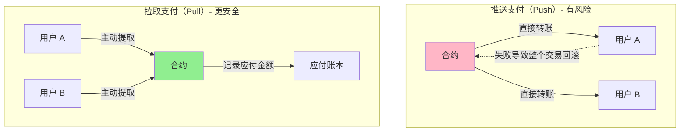

# Security

> 合约安全：防御常见攻击的实用工具

> [!IMPORTANT] 本节重点
> 1. 什么是重入攻击？如何使用 ReentrancyGuard 防御？
> 2. 如何实现紧急暂停机制？
> 3. 拉取支付模式如何避免资金锁定？
> 4. 如何防止整数溢出和下溢？
> 5. 常见安全陷阱有哪些？

## 智能合约安全的重要性

智能合约一旦部署无法修改，安全漏洞可能导致：
- 💸 资金被盗（如 2016 年 DAO 黑客事件损失 6000 万美元）
- 🔒 合约永久锁定
- 💥 协议信誉受损
- ⚖️ 法律责任

OpenZeppelin 提供了一套经过实战检验的安全工具，帮助开发者构建安全的智能合约。

## ReentrancyGuard

### 什么是重入攻击？

**重入攻击（Reentrancy Attack）** 是智能合约最常见的漏洞之一。

```mermaid
sequenceDiagram
    participant 攻击者
    participant 攻击合约
    participant 受害合约

    攻击者->>攻击合约: 调用 attack()
    攻击合约->>受害合约: withdraw()
    受害合约->>受害合约: 检查余额 ✅
    受害合约->>攻击合约: 转账 ETH
    攻击合约->>受害合约: fallback() 再次调用 withdraw()
    受害合约->>受害合约: 检查余额 ✅ (余额还未更新!)
    受害合约->>攻击合约: 再次转账 ETH
    攻击合约->>受害合约: fallback() 继续攻击...
    Note over 攻击合约,受害合约: 循环直到耗尽资金

    style 受害合约 fill:#FFB6C6
    style 攻击合约 fill:#FF6B6B
```

### 漏洞代码示例

:::code-group

```solidity [❌ 有漏洞的代码]
// SPDX-License-Identifier: MIT
pragma solidity ^0.8.20;

/**
 * @dev 存在重入漏洞的合约
 */
contract VulnerableBank {
    mapping(address => uint256) public balances;

    function deposit() external payable {
        balances[msg.sender] += msg.value;
    }

    /**
     * @dev ❌ 漏洞：先转账，后更新余额
     */
    function withdraw() external {
        uint256 balance = balances[msg.sender];
        require(balance > 0, "No balance");

        // ❌ 危险：在更新状态前转账
        (bool success, ) = msg.sender.call{value: balance}("");
        require(success, "Transfer failed");

        // ❌ 余额更新太晚，可被重入攻击
        balances[msg.sender] = 0;
    }
}
```

```solidity [攻击合约]
// SPDX-License-Identifier: MIT
pragma solidity ^0.8.20;

/**
 * @dev 重入攻击合约
 */
contract Attacker {
    VulnerableBank public bank;
    uint256 public constant AMOUNT = 1 ether;

    constructor(address _bankAddress) {
        bank = VulnerableBank(_bankAddress);
    }

    function attack() external payable {
        require(msg.value == AMOUNT, "Need 1 ETH");

        // 1. 存款
        bank.deposit{value: AMOUNT}();

        // 2. 发起提款攻击
        bank.withdraw();
    }

    /**
     * @dev 接收 ETH 时触发重入攻击
     */
    receive() external payable {
        if (address(bank).balance >= AMOUNT) {
            bank.withdraw(); // 🔥 重入攻击！
        }
    }

    function getBalance() external view returns (uint256) {
        return address(this).balance;
    }
}
```

:::

### 使用 ReentrancyGuard 防御

:::code-group

```solidity [✅ 安全版本 - 使用 ReentrancyGuard]
// SPDX-License-Identifier: MIT
pragma solidity ^0.8.20;

import {ReentrancyGuard} from "@openzeppelin/contracts/utils/ReentrancyGuard.sol";

/**
 * @dev 使用 ReentrancyGuard 保护的银行合约
 */
contract SecureBank is ReentrancyGuard {
    mapping(address => uint256) public balances;

    event Deposit(address indexed user, uint256 amount);
    event Withdraw(address indexed user, uint256 amount);

    function deposit() external payable {
        balances[msg.sender] += msg.value;
        emit Deposit(msg.sender, msg.value);
    }

    /**
     * @dev ✅ 使用 nonReentrant 修饰器防止重入
     */
    function withdraw() external nonReentrant {
        uint256 balance = balances[msg.sender];
        require(balance > 0, "No balance");

        // ✅ 先更新状态（Checks-Effects-Interactions 模式）
        balances[msg.sender] = 0;

        // ✅ 最后转账
        (bool success, ) = msg.sender.call{value: balance}("");
        require(success, "Transfer failed");

        emit Withdraw(msg.sender, balance);
    }

    function getBalance() external view returns (uint256) {
        return address(this).balance;
    }
}
```

```solidity [ReentrancyGuard 源码]
// SPDX-License-Identifier: MIT
// OpenZeppelin Contracts (last updated v5.5.0) (utils/ReentrancyGuard.sol)

pragma solidity ^0.8.20;

/**
 * @dev 防止重入攻击的合约模块
 *
 * 工作原理：
 * - 使用状态变量标记函数是否正在执行
 * - 在函数入口检查标记，防止重复进入
 *
 * 使用方法：
 * 1. 继承 ReentrancyGuard
 * 2. 在可能被重入的函数上添加 nonReentrant 修饰器
 */
abstract contract ReentrancyGuard {
    // 状态常量
    uint256 private constant NOT_ENTERED = 1;
    uint256 private constant ENTERED = 2;

    // 当前状态
    uint256 private _status;

    /// @dev 检测到重入攻击
    error ReentrancyGuardReentrantCall();

    constructor() {
        _status = NOT_ENTERED;
    }

    /**
     * @dev 防止重入的修饰器
     *
     * 使用方法：
     * function withdraw() external nonReentrant {
     *     // 受保护的代码
     * }
     */
    modifier nonReentrant() {
        _nonReentrantBefore();
        _;
        _nonReentrantAfter();
    }

    function _nonReentrantBefore() private {
        // 检查是否已进入
        if (_status == ENTERED) {
            revert ReentrancyGuardReentrantCall();
        }

        // 标记为已进入
        _status = ENTERED;
    }

    function _nonReentrantAfter() private {
        // 恢复状态
        _status = NOT_ENTERED;
    }

    /**
     * @dev 返回当前是否处于非重入状态
     */
    function _reentrancyGuardEntered() internal view returns (bool) {
        return _status == ENTERED;
    }
}
```

:::

### 最佳实践：CEI 模式

**CEI（Checks-Effects-Interactions）模式** 是防止重入的黄金法则：

```solidity
function transfer(address to, uint256 amount) external {
    // 1. Checks（检查）
    require(balances[msg.sender] >= amount, "Insufficient balance");
    require(to != address(0), "Invalid address");

    // 2. Effects（更新状态）
    balances[msg.sender] -= amount;
    balances[to] += amount;

    // 3. Interactions（外部交互）
    emit Transfer(msg.sender, to, amount);
    // 如果需要调用外部合约，放在最后
}
```

## Pausable

**Pausable（可暂停）** 模块允许在紧急情况下暂停合约的关键功能。

### 使用场景

- 🚨 发现安全漏洞
- 🔧 进行协议升级
- 🛑 应对黑客攻击
- 📊 市场异常波动

### 完整示例

:::code-group

```solidity [继承 Pausable]
// SPDX-License-Identifier: MIT
pragma solidity ^0.8.20;

import {Pausable} from "@openzeppelin/contracts/utils/Pausable.sol";
import {Ownable} from "@openzeppelin/contracts/access/Ownable.sol";

/**
 * @dev 可暂停的代币合约
 */
contract PausableToken is Pausable, Ownable {
    mapping(address => uint256) public balances;

    event Transfer(address indexed from, address indexed to, uint256 amount);

    constructor() Ownable(msg.sender) {
        balances[msg.sender] = 1000000 * 10**18;
    }

    /**
     * @dev 转账函数（暂停时无法调用）
     */
    function transfer(address to, uint256 amount) external whenNotPaused {
        require(balances[msg.sender] >= amount, "Insufficient balance");

        balances[msg.sender] -= amount;
        balances[to] += amount;

        emit Transfer(msg.sender, to, amount);
    }

    /**
     * @dev 紧急暂停（仅 owner）
     */
    function pause() external onlyOwner {
        _pause();
    }

    /**
     * @dev 恢复运行（仅 owner）
     */
    function unpause() external onlyOwner {
        _unpause();
    }

    /**
     * @dev 紧急提款（暂停期间也可调用）
     */
    function emergencyWithdraw() external whenPaused onlyOwner {
        payable(owner()).transfer(address(this).balance);
    }
}
```

```solidity [Pausable 源码]
// SPDX-License-Identifier: MIT
// OpenZeppelin Contracts (last updated v5.5.0) (utils/Pausable.sol)

pragma solidity ^0.8.20;

import {Context} from "../utils/Context.sol";

/**
 * @dev 可暂停合约模块
 *
 * 提供两个修饰器：
 * - whenNotPaused: 仅在未暂停时可调用
 * - whenPaused: 仅在暂停时可调用
 */
abstract contract Pausable is Context {
    bool private _paused;

    /// @dev 触发暂停
    event Paused(address account);

    /// @dev 触发恢复
    event Unpaused(address account);

    /// @dev 期望暂停但当前未暂停
    error EnforcedPause();

    /// @dev 期望未暂停但当前已暂停
    error ExpectedPause();

    /**
     * @dev 初始化为未暂停状态
     */
    constructor() {
        _paused = false;
    }

    /**
     * @dev 修饰器：仅在未暂停时可调用
     */
    modifier whenNotPaused() {
        _requireNotPaused();
        _;
    }

    /**
     * @dev 修饰器：仅在暂停时可调用
     */
    modifier whenPaused() {
        _requirePaused();
        _;
    }

    /**
     * @dev 返回当前是否暂停
     */
    function paused() public view virtual returns (bool) {
        return _paused;
    }

    /**
     * @dev 要求当前未暂停
     */
    function _requireNotPaused() internal view virtual {
        if (paused()) {
            revert EnforcedPause();
        }
    }

    /**
     * @dev 要求当前已暂停
     */
    function _requirePaused() internal view virtual {
        if (!paused()) {
            revert ExpectedPause();
        }
    }

    /**
     * @dev 触发暂停（内部函数）
     */
    function _pause() internal virtual whenNotPaused {
        _paused = true;
        emit Paused(_msgSender());
    }

    /**
     * @dev 触发恢复（内部函数）
     */
    function _unpause() internal virtual whenPaused {
        _paused = false;
        emit Unpaused(_msgSender());
    }
}
```

:::

### 结合时间锁的高级暂停

```solidity
// SPDX-License-Identifier: MIT
pragma solidity ^0.8.20;

import {Pausable} from "@openzeppelin/contracts/utils/Pausable.sol";
import {Ownable} from "@openzeppelin/contracts/access/Ownable.sol";

/**
 * @dev 带自动恢复的暂停机制
 */
contract TimedPausable is Pausable, Ownable {
    uint256 public pauseEndTime;
    uint256 public constant MAX_PAUSE_DURATION = 7 days;

    constructor() Ownable(msg.sender) {}

    /**
     * @dev 定时暂停
     * @param duration 暂停时长（秒）
     */
    function pauseFor(uint256 duration) external onlyOwner {
        require(duration <= MAX_PAUSE_DURATION, "Pause too long");

        _pause();
        pauseEndTime = block.timestamp + duration;
    }

    /**
     * @dev 自动检查是否应该恢复
     */
    function checkAndUnpause() external {
        if (paused() && block.timestamp >= pauseEndTime) {
            _unpause();
        }
    }

    /**
     * @dev 立即恢复（需 owner 权限）
     */
    function unpause() external onlyOwner {
        _unpause();
        pauseEndTime = 0;
    }
}
```

## PullPayment

**拉取支付（Pull Payment）** 模式避免了推送支付可能导致的问题。

### 推送 vs 拉取



### 问题场景

:::code-group

```solidity [❌ 推送支付的问题]
// SPDX-License-Identifier: MIT
pragma solidity ^0.8.20;

/**
 * @dev 存在问题的拍卖合约
 */
contract BadAuction {
    address public highestBidder;
    uint256 public highestBid;

    function bid() external payable {
        require(msg.value > highestBid, "Bid too low");

        // ❌ 问题：如果这个转账失败，整个 bid 都会回滚
        if (highestBidder != address(0)) {
            (bool success, ) = highestBidder.call{value: highestBid}("");
            require(success, "Refund failed"); // 🔥 攻击者可以让这里失败
        }

        highestBidder = msg.sender;
        highestBid = msg.value;
    }
}

/**
 * @dev 恶意合约：拒绝接收 ETH
 */
contract MaliciousBidder {
    BadAuction public auction;

    constructor(address _auction) {
        auction = BadAuction(_auction);
    }

    function attack() external payable {
        auction.bid{value: msg.value}();
    }

    // ❌ 拒绝接收 ETH，导致退款失败
    receive() external payable {
        revert("I don't accept refunds!");
    }
}
```

```solidity [✅ 拉取支付解决方案]
// SPDX-License-Identifier: MIT
pragma solidity ^0.8.20;

import {PullPayment} from "@openzeppelin/contracts/security/PullPayment.sol";

/**
 * @dev 使用拉取支付的安全拍卖
 */
contract SafeAuction is PullPayment {
    address public highestBidder;
    uint256 public highestBid;

    event NewHighestBid(address bidder, uint256 amount);

    function bid() external payable {
        require(msg.value > highestBid, "Bid too low");

        // ✅ 记录应退款金额，而非直接转账
        if (highestBidder != address(0)) {
            _asyncTransfer(highestBidder, highestBid);
        }

        highestBidder = msg.sender;
        highestBid = msg.value;

        emit NewHighestBid(msg.sender, msg.value);
    }

    /**
     * @dev 用户主动提取退款
     * 继承自 PullPayment.withdrawPayments()
     */
}
```

```solidity [PullPayment 源码]
// SPDX-License-Identifier: MIT
// OpenZeppelin Contracts (last updated v5.5.0) (security/PullPayment.sol)

pragma solidity ^0.8.20;

import {Escrow} from "../utils/escrow/Escrow.sol";

/**
 * @dev 拉取支付模块
 *
 * 提供异步转账机制：
 * 1. 调用 _asyncTransfer 记录应付金额
 * 2. 用户调用 withdrawPayments 主动提取
 */
abstract contract PullPayment {
    Escrow private immutable _escrow;

    constructor() {
        _escrow = new Escrow();
    }

    /**
     * @dev 用户提取支付
     * @param payee 收款人地址
     */
    function withdrawPayments(address payable payee) public virtual {
        _escrow.withdraw(payee);
    }

    /**
     * @dev 查询应付金额
     */
    function payments(address dest) public view returns (uint256) {
        return _escrow.depositsOf(dest);
    }

    /**
     * @dev 异步转账（内部函数）
     * @param dest 收款人
     * @param amount 金额
     */
    function _asyncTransfer(address dest, uint256 amount) internal virtual {
        _escrow.deposit{value: amount}(dest);
    }
}
```

:::

## 其他安全工具

### Address 库

安全的地址操作工具。

:::code-group

```solidity [Address 常用功能]
// SPDX-License-Identifier: MIT
pragma solidity ^0.8.20;

import {Address} from "@openzeppelin/contracts/utils/Address.sol";

contract AddressExample {
    using Address for address;
    using Address for address payable;

    /**
     * @dev 检查是否为合约地址
     */
    function isContract(address account) external view returns (bool) {
        return account.isContract();
    }

    /**
     * @dev 安全发送 ETH（不受 gas 限制）
     */
    function sendETH(address payable recipient, uint256 amount) external {
        recipient.sendValue(amount);
    }

    /**
     * @dev 安全调用合约函数
     */
    function callContract(
        address target,
        bytes memory data
    ) external returns (bytes memory) {
        return target.functionCall(data);
    }

    /**
     * @dev 带 ETH 的合约调用
     */
    function callWithValue(
        address target,
        bytes memory data,
        uint256 value
    ) external payable returns (bytes memory) {
        return target.functionCallWithValue(data, value);
    }
}
```

:::

### SafeERC20

安全的 ERC20 代币操作（处理不规范的代币）。

:::code-group

```solidity [SafeERC20 使用示例]
// SPDX-License-Identifier: MIT
pragma solidity ^0.8.20;

import {IERC20} from "@openzeppelin/contracts/token/ERC20/IERC20.sol";
import {SafeERC20} from "@openzeppelin/contracts/token/ERC20/utils/SafeERC20.sol";

/**
 * @dev 安全的代币交互
 */
contract TokenVault {
    using SafeERC20 for IERC20;

    /**
     * @dev 安全存款（处理不返回 bool 的代币）
     */
    function deposit(IERC20 token, uint256 amount) external {
        // ✅ SafeERC20 会检查返回值并处理异常
        token.safeTransferFrom(msg.sender, address(this), amount);
    }

    /**
     * @dev 安全提款
     */
    function withdraw(IERC20 token, uint256 amount) external {
        token.safeTransfer(msg.sender, amount);
    }

    /**
     * @dev 安全授权
     */
    function approveSpender(IERC20 token, address spender, uint256 amount) external {
        token.safeApprove(spender, amount);
    }

    /**
     * @dev 增加授权额度
     */
    function increaseAllowance(IERC20 token, address spender, uint256 addedValue) external {
        token.safeIncreaseAllowance(spender, addedValue);
    }
}
```

:::

## 安全检查清单

开发智能合约时，请遵循这个安全检查清单：

### 1. 重入攻击防护

- [ ] 在涉及 ETH 转账的函数使用 `nonReentrant`
- [ ] 遵循 CEI 模式（Checks-Effects-Interactions）
- [ ] 外部调用放在函数最后

### 2. 整数安全

- [ ] 使用 Solidity 0.8+ 的内置溢出检查
- [ ] 或使用 SafeMath（Solidity 0.7 及以下）
- [ ] 注意除零错误

### 3. 访问控制

- [ ] 关键函数使用 `onlyOwner` 或基于角色的权限
- [ ] 避免使用 `tx.origin` 做权限检查
- [ ] 实现多签或 DAO 治理

### 4. 外部调用

- [ ] 使用 `Address.functionCall` 等安全方法
- [ ] 检查返回值
- [ ] 设置 gas 限制防止 DoS

### 5. 代币操作

- [ ] 使用 `SafeERC20` 处理代币转账
- [ ] 检查授权额度
- [ ] 处理代币小数位

### 6. 紧急机制

- [ ] 实现 Pausable 暂停功能
- [ ] 添加紧急提款函数
- [ ] 设置升级机制（UUPS/Transparent Proxy）

### 7. 测试与审计

- [ ] 编写全面的单元测试
- [ ] 进行模糊测试（Fuzzing）
- [ ] 第三方安全审计
- [ ] Bug 赏金计划

## 常见安全陷阱

### 1. 使用 transfer/send 转账

```solidity
// ❌ 问题：2300 gas 限制，可能失败
function badWithdraw() external {
    payable(msg.sender).transfer(amount);  // 可能因 gas 不足失败
}

// ✅ 推荐：使用 call
function goodWithdraw() external nonReentrant {
    (bool success, ) = msg.sender.call{value: amount}("");
    require(success, "Transfer failed");
}
```

### 2. 前置攻击（Front-running）

```solidity
// ❌ 易受攻击：交易可被提前执行
function buyToken(uint256 price) external payable {
    require(msg.value == price, "Wrong price");
    // 攻击者看到这个交易后，可以抢先买入
}

// ✅ 使用承诺-揭示模式
function commitPurchase(bytes32 commitment) external {
    // 第一步：提交哈希承诺
}

function revealPurchase(uint256 price, bytes32 salt) external payable {
    // 第二步：揭示真实数据
    require(keccak256(abi.encodePacked(price, salt)) == storedCommitment);
}
```

### 3. 时间戳依赖

```solidity
// ❌ 矿工可操控 15 秒内的时间戳
function badRandomness() external view returns (uint256) {
    return uint256(keccak256(abi.encodePacked(block.timestamp))) % 100;
}

// ✅ 使用 Chainlink VRF 等安全随机数源
```

### 4. 未初始化的存储指针

```solidity
// ❌ Solidity < 0.7 的危险代码
struct User {
    uint256 balance;
}

User user;  // 未初始化，指向槽 0

// ✅ 正确初始化
User memory user = User({balance: 100});
```

## 安全资源

### 学习资源

- [Solidity 官方安全指南](https://docs.soliditylang.org/en/latest/security-considerations.html)
- [Smart Contract Security Best Practices](https://consensys.github.io/smart-contract-best-practices/)
- [Ethereum Smart Contract Security](https://ethereum.org/en/developers/docs/smart-contracts/security/)

### 安全工具

- **Slither**: 静态分析工具
- **Mythril**: 符号执行引擎
- **Echidna**: 模糊测试工具
- **Foundry**: 测试框架

### 审计公司

- OpenZeppelin
- Trail of Bits
- ConsenSys Diligence
- Certik
