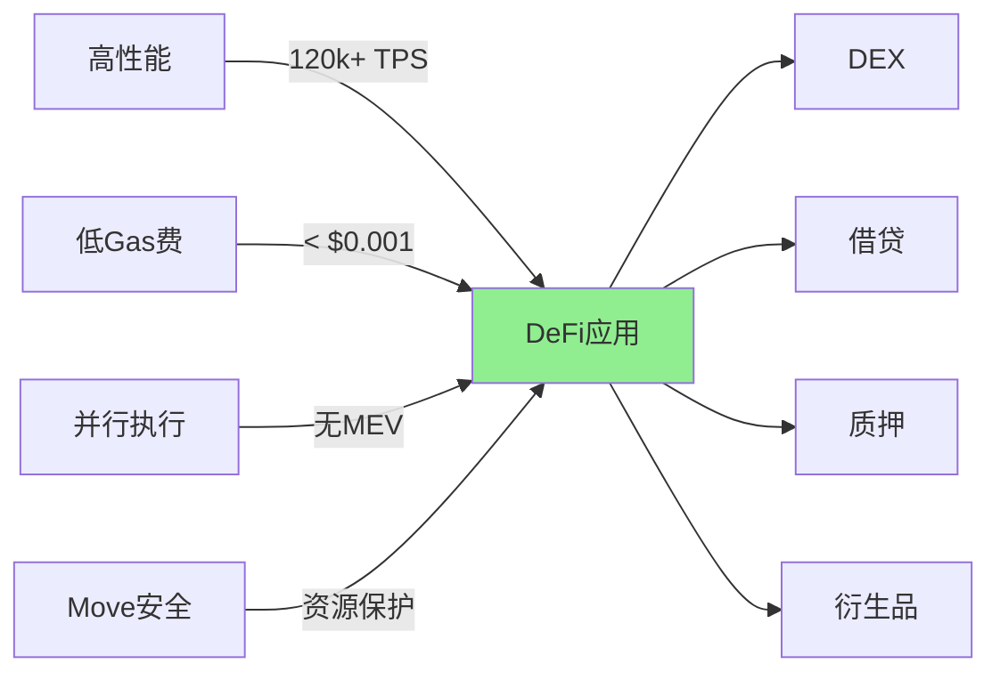

# DeFi 开发

> Sui 上的去中心化金融应用开发

> [!IMPORTANT] 本节重点
> 1. 如何在 Sui 上创建和管理代币？
> 2. 去中心化交易所（DEX）如何实现？
> 3. 流动性池和 AMM 机制是什么？
> 4. 如何构建借贷协议？
> 5. 质押和收益农场如何设计？

## DeFi 基础

### Sui DeFi 生态优势



**Sui DeFi 特点：**
- ⚡ **超高性能** - 支持高频交易
- 💰 **极低费用** - 适合小额交易
- 🔒 **安全可靠** - Move 语言资源安全
- 🚀 **快速确认** - 亚秒级交易
- 📊 **无 MEV** - 并行执行减少抢跑

### DeFi 协议分类

| 类型 | 说明 | 代表项目 |
|------|------|----------|
| **DEX** | 去中心化交易所 | Cetus, Turbos |
| **借贷** | 借贷协议 | Scallop, Navi |
| **稳定币** | 算法稳定币 | USDC, USDT |
| **衍生品** | 期货、期权 | BlueFin |
| **聚合器** | 收益聚合 | Aftermath |

## 代币创建

### 基础代币

```move
module defi::basic_token {
    use sui::coin::{Self, Coin, TreasuryCap};
    use sui::transfer;
    use sui::tx_context::{Self, TxContext};
    use std::option;

    // OTW
    struct BASIC_TOKEN has drop {}

    // 初始化
    fun init(witness: BASIC_TOKEN, ctx: &mut TxContext) {
        let (treasury, metadata) = coin::create_currency(
            witness,
            9,                              // 小数位数
            b"BTK",                         // 符号
            b"Basic Token",                 // 名称
            b"A basic token example",       // 描述
            option::none(),                 // 图标 URL
            ctx
        );

        // 冻结元数据（不可更改）
        transfer::public_freeze_object(metadata);

        // 转移 treasury 给创建者
        transfer::public_transfer(treasury, tx_context::sender(ctx));
    }

    // 铸造代币
    public entry fun mint(
        treasury: &mut TreasuryCap<BASIC_TOKEN>,
        amount: u64,
        recipient: address,
        ctx: &mut TxContext
    ) {
        let coin = coin::mint(treasury, amount, ctx);
        transfer::public_transfer(coin, recipient);
    }

    // 销毁代币
    public entry fun burn(
        treasury: &mut TreasuryCap<BASIC_TOKEN>,
        coin: Coin<BASIC_TOKEN>
    ) {
        coin::burn(treasury, coin);
    }

    // 查询总供应量
    public fun total_supply(treasury: &TreasuryCap<BASIC_TOKEN>): u64 {
        coin::total_supply(treasury)
    }
}
```

### 带权限的代币

```move
module defi::managed_token {
    use sui::coin::{Self, Coin, TreasuryCap};
    use sui::transfer;
    use sui::tx_context::{Self, TxContext};
    use sui::object::{Self, UID};

    // OTW
    struct MANAGED_TOKEN has drop {}

    // 铸币权限
    struct MinterCap has key, store {
        id: UID
    }

    // 管理员权限
    struct AdminCap has key {
        id: UID
    }

    // 代币配置
    struct TokenConfig has key {
        id: UID,
        max_supply: u64,
        current_supply: u64,
        paused: bool
    }

    const EExceedsMaxSupply: u64 = 0;
    const EPaused: u64 = 1;

    fun init(witness: MANAGED_TOKEN, ctx: &mut TxContext) {
        let (treasury, metadata) = coin::create_currency(
            witness,
            9,
            b"MGT",
            b"Managed Token",
            b"A token with access control",
            option::none(),
            ctx
        );

        transfer::public_freeze_object(metadata);

        // 创建权限凭证
        let admin_cap = AdminCap {
            id: object::new(ctx)
        };

        let minter_cap = MinterCap {
            id: object::new(ctx)
        };

        // 创建配置
        let config = TokenConfig {
            id: object::new(ctx),
            max_supply: 1_000_000_000_000_000,  // 1M tokens
            current_supply: 0,
            paused: false
        };

        let sender = tx_context::sender(ctx);
        transfer::transfer(admin_cap, sender);
        transfer::public_transfer(minter_cap, sender);
        transfer::public_transfer(treasury, sender);
        transfer::share_object(config);
    }

    // 铸造（需要 MinterCap）
    public entry fun mint(
        _minter: &MinterCap,
        treasury: &mut TreasuryCap<MANAGED_TOKEN>,
        config: &mut TokenConfig,
        amount: u64,
        recipient: address,
        ctx: &mut TxContext
    ) {
        // 检查是否暂停
        assert!(!config.paused, EPaused);

        // 检查供应量限制
        let new_supply = config.current_supply + amount;
        assert!(new_supply <= config.max_supply, EExceedsMaxSupply);

        // 铸造
        let coin = coin::mint(treasury, amount, ctx);
        config.current_supply = new_supply;

        transfer::public_transfer(coin, recipient);
    }

    // 暂停（需要 AdminCap）
    public entry fun pause(_admin: &AdminCap, config: &mut TokenConfig) {
        config.paused = true;
    }

    // 恢复（需要 AdminCap）
    public entry fun unpause(_admin: &AdminCap, config: &mut TokenConfig) {
        config.paused = false;
    }

    // 设置最大供应量（需要 AdminCap）
    public entry fun set_max_supply(
        _admin: &AdminCap,
        config: &mut TokenConfig,
        new_max: u64
    ) {
        assert!(new_max >= config.current_supply, 0);
        config.max_supply = new_max;
    }
}
```

## 简单 DEX

### AMM 流动性池

```move
module defi::simple_dex {
    use sui::object::{Self, UID};
    use sui::coin::{Self, Coin};
    use sui::balance::{Self, Balance};
    use sui::transfer;
    use sui::tx_context::{Self, TxContext};
    use sui::math;

    // 流动性池
    struct Pool<phantom CoinA, phantom CoinB> has key {
        id: UID,
        reserve_a: Balance<CoinA>,
        reserve_b: Balance<CoinB>,
        lp_supply: u64,
        fee_percent: u64  // 手续费百分比（基点，如 30 = 0.3%）
    }

    // LP 代币
    struct LPCoin<phantom CoinA, phantom CoinB> has key, store {
        id: UID,
        value: u64
    }

    const EInsufficientLiquidity: u64 = 0;
    const ESlippageExceeded: u64 = 1;
    const EInsufficientAmount: u64 = 2;

    // 创建流动性池
    public entry fun create_pool<CoinA, CoinB>(
        ctx: &mut TxContext
    ) {
        let pool = Pool<CoinA, CoinB> {
            id: object::new(ctx),
            reserve_a: balance::zero(),
            reserve_b: balance::zero(),
            lp_supply: 0,
            fee_percent: 30  // 0.3% 手续费
        };
        transfer::share_object(pool);
    }

    // 添加流动性
    public entry fun add_liquidity<CoinA, CoinB>(
        pool: &mut Pool<CoinA, CoinB>,
        coin_a: Coin<CoinA>,
        coin_b: Coin<CoinB>,
        ctx: &mut TxContext
    ) {
        let amount_a = coin::value(&coin_a);
        let amount_b = coin::value(&coin_b);

        assert!(amount_a > 0 && amount_b > 0, EInsufficientAmount);

        // 计算 LP 代币数量
        let lp_amount = if (pool.lp_supply == 0) {
            // 首次添加流动性
            math::sqrt(amount_a) * math::sqrt(amount_b)
        } else {
            // 按比例计算
            let reserve_a = balance::value(&pool.reserve_a);
            let reserve_b = balance::value(&pool.reserve_b);

            let lp_from_a = (amount_a * pool.lp_supply) / reserve_a;
            let lp_from_b = (amount_b * pool.lp_supply) / reserve_b;

            // 取较小值
            if (lp_from_a < lp_from_b) { lp_from_a } else { lp_from_b }
        };

        // 添加到池子
        coin::put(&mut pool.reserve_a, coin_a);
        coin::put(&mut pool.reserve_b, coin_b);
        pool.lp_supply = pool.lp_supply + lp_amount;

        // 铸造 LP 代币
        let lp_coin = LPCoin<CoinA, CoinB> {
            id: object::new(ctx),
            value: lp_amount
        };

        transfer::transfer(lp_coin, tx_context::sender(ctx));
    }

    // 移除流动性
    public entry fun remove_liquidity<CoinA, CoinB>(
        pool: &mut Pool<CoinA, CoinB>,
        lp_coin: LPCoin<CoinA, CoinB>,
        ctx: &mut TxContext
    ) {
        let LPCoin { id, value: lp_amount } = lp_coin;
        object::delete(id);

        let reserve_a = balance::value(&pool.reserve_a);
        let reserve_b = balance::value(&pool.reserve_b);

        // 计算可取回的代币数量
        let amount_a = (lp_amount * reserve_a) / pool.lp_supply;
        let amount_b = (lp_amount * reserve_b) / pool.lp_supply;

        // 从池子取出
        let coin_a = coin::take(&mut pool.reserve_a, amount_a, ctx);
        let coin_b = coin::take(&mut pool.reserve_b, amount_b, ctx);

        pool.lp_supply = pool.lp_supply - lp_amount;

        // 转给用户
        let sender = tx_context::sender(ctx);
        transfer::public_transfer(coin_a, sender);
        transfer::public_transfer(coin_b, sender);
    }

    // 交换：A -> B
    public entry fun swap_a_to_b<CoinA, CoinB>(
        pool: &mut Pool<CoinA, CoinB>,
        coin_a: Coin<CoinA>,
        min_output: u64,
        ctx: &mut TxContext
    ) {
        let amount_in = coin::value(&coin_a);
        assert!(amount_in > 0, EInsufficientAmount);

        // 计算输出数量（恒定乘积公式：x * y = k）
        let reserve_a = balance::value(&pool.reserve_a);
        let reserve_b = balance::value(&pool.reserve_b);

        // 扣除手续费
        let amount_in_with_fee = amount_in * (10000 - pool.fee_percent);
        let numerator = amount_in_with_fee * reserve_b;
        let denominator = (reserve_a * 10000) + amount_in_with_fee;
        let amount_out = numerator / denominator;

        // 检查滑点
        assert!(amount_out >= min_output, ESlippageExceeded);
        assert!(amount_out < reserve_b, EInsufficientLiquidity);

        // 存入 A，取出 B
        coin::put(&mut pool.reserve_a, coin_a);
        let coin_b = coin::take(&mut pool.reserve_b, amount_out, ctx);

        transfer::public_transfer(coin_b, tx_context::sender(ctx));
    }

    // 交换：B -> A
    public entry fun swap_b_to_a<CoinA, CoinB>(
        pool: &mut Pool<CoinA, CoinB>,
        coin_b: Coin<CoinB>,
        min_output: u64,
        ctx: &mut TxContext
    ) {
        let amount_in = coin::value(&coin_b);
        assert!(amount_in > 0, EInsufficientAmount);

        let reserve_a = balance::value(&pool.reserve_a);
        let reserve_b = balance::value(&pool.reserve_b);

        let amount_in_with_fee = amount_in * (10000 - pool.fee_percent);
        let numerator = amount_in_with_fee * reserve_a;
        let denominator = (reserve_b * 10000) + amount_in_with_fee;
        let amount_out = numerator / denominator;

        assert!(amount_out >= min_output, ESlippageExceeded);
        assert!(amount_out < reserve_a, EInsufficientLiquidity);

        coin::put(&mut pool.reserve_b, coin_b);
        let coin_a = coin::take(&mut pool.reserve_a, amount_out, ctx);

        transfer::public_transfer(coin_a, tx_context::sender(ctx));
    }

    // 查询函数
    public fun get_reserves<CoinA, CoinB>(pool: &Pool<CoinA, CoinB>): (u64, u64) {
        (
            balance::value(&pool.reserve_a),
            balance::value(&pool.reserve_b)
        )
    }

    public fun get_output_amount<CoinA, CoinB>(
        pool: &Pool<CoinA, CoinB>,
        amount_in: u64,
        a_to_b: bool
    ): u64 {
        let (reserve_a, reserve_b) = get_reserves(pool);

        let (reserve_in, reserve_out) = if (a_to_b) {
            (reserve_a, reserve_b)
        } else {
            (reserve_b, reserve_a)
        };

        let amount_in_with_fee = amount_in * (10000 - pool.fee_percent);
        let numerator = amount_in_with_fee * reserve_out;
        let denominator = (reserve_in * 10000) + amount_in_with_fee;

        numerator / denominator
    }
}
```

## 借贷协议

```move
module defi::lending_protocol {
    use sui::object::{Self, UID};
    use sui::coin::{Self, Coin};
    use sui::balance::{Self, Balance};
    use sui::transfer;
    use sui::tx_context::{Self, TxContext};
    use sui::table::{Self, Table};

    // 借贷池
    struct LendingPool<phantom T> has key {
        id: UID,
        total_deposits: Balance<T>,
        total_borrows: u64,
        interest_rate: u64,  // 年化利率（基点）
        collateral_ratio: u64,  // 抵押率（150 = 150%）
        users: Table<address, UserPosition>
    }

    // 用户仓位
    struct UserPosition has store {
        deposited: u64,
        borrowed: u64,
        collateral: u64,  // 抵押品价值（USD）
        last_update: u64
    }

    // 存款凭证
    struct DepositReceipt<phantom T> has key, store {
        id: UID,
        amount: u64,
        pool_id: address
    }

    const EInsufficientCollateral: u64 = 0;
    const EInsufficientBalance: u64 = 1;
    const EPositionNotFound: u64 = 2;

    // 创建借贷池
    public entry fun create_pool<T>(
        interest_rate: u64,
        collateral_ratio: u64,
        ctx: &mut TxContext
    ) {
        let pool = LendingPool<T> {
            id: object::new(ctx),
            total_deposits: balance::zero(),
            total_borrows: 0,
            interest_rate,
            collateral_ratio,
            users: table::new(ctx)
        };
        transfer::share_object(pool);
    }

    // 存款
    public entry fun deposit<T>(
        pool: &mut LendingPool<T>,
        coin: Coin<T>,
        ctx: &mut TxContext
    ) {
        let amount = coin::value(&coin);
        let user = tx_context::sender(ctx);

        // 添加到池子
        coin::put(&mut pool.total_deposits, coin);

        // 更新用户仓位
        if (!table::contains(&pool.users, user)) {
            table::add(&mut pool.users, user, UserPosition {
                deposited: 0,
                borrowed: 0,
                collateral: 0,
                last_update: tx_context::epoch(ctx)
            });
        };

        let position = table::borrow_mut(&mut pool.users, user);
        position.deposited = position.deposited + amount;
        position.last_update = tx_context::epoch(ctx);

        // 发放存款凭证
        let receipt = DepositReceipt<T> {
            id: object::new(ctx),
            amount,
            pool_id: object::uid_to_address(&pool.id)
        };

        transfer::transfer(receipt, user);
    }

    // 取款
    public entry fun withdraw<T>(
        pool: &mut LendingPool<T>,
        receipt: DepositReceipt<T>,
        ctx: &mut TxContext
    ) {
        let DepositReceipt { id, amount, pool_id: _ } = receipt;
        object::delete(id);

        let user = tx_context::sender(ctx);

        // 检查用户仓位
        assert!(table::contains(&pool.users, user), EPositionNotFound);
        let position = table::borrow_mut(&mut pool.users, user);

        // 计算利息（简化）
        let interest = (amount * pool.interest_rate) / 10000;
        let total_amount = amount + interest;

        assert!(position.deposited >= total_amount, EInsufficientBalance);

        // 从池子取出
        let coin = coin::take(&mut pool.total_deposits, total_amount, ctx);
        position.deposited = position.deposited - total_amount;

        transfer::public_transfer(coin, user);
    }

    // 借款（需要抵押品）
    public entry fun borrow<T>(
        pool: &mut LendingPool<T>,
        amount: u64,
        collateral_value: u64,  // 抵押品价值（USD）
        ctx: &mut TxContext
    ) {
        let user = tx_context::sender(ctx);

        // 检查抵押率
        let required_collateral = (amount * pool.collateral_ratio) / 100;
        assert!(collateral_value >= required_collateral, EInsufficientCollateral);

        // 更新用户仓位
        if (!table::contains(&pool.users, user)) {
            table::add(&mut pool.users, user, UserPosition {
                deposited: 0,
                borrowed: 0,
                collateral: 0,
                last_update: tx_context::epoch(ctx)
            });
        };

        let position = table::borrow_mut(&mut pool.users, user);
        position.borrowed = position.borrowed + amount;
        position.collateral = position.collateral + collateral_value;
        position.last_update = tx_context::epoch(ctx);

        // 从池子借出
        let coin = coin::take(&mut pool.total_deposits, amount, ctx);
        pool.total_borrows = pool.total_borrows + amount;

        transfer::public_transfer(coin, user);
    }

    // 还款
    public entry fun repay<T>(
        pool: &mut LendingPool<T>,
        coin: Coin<T>,
        ctx: &mut TxContext
    ) {
        let amount = coin::value(&coin);
        let user = tx_context::sender(ctx);

        assert!(table::contains(&pool.users, user), EPositionNotFound);
        let position = table::borrow_mut(&mut pool.users, user);

        // 计算利息
        let interest = (position.borrowed * pool.interest_rate) / 10000;
        let total_debt = position.borrowed + interest;

        let repay_amount = if (amount >= total_debt) {
            // 全部还清
            position.borrowed = 0;
            total_debt
        } else {
            // 部分还款
            position.borrowed = total_debt - amount;
            amount
        };

        // 归还到池子
        coin::put(&mut pool.total_deposits, coin);
        pool.total_borrows = pool.total_borrows - repay_amount;
    }

    // 查询用户仓位
    public fun get_position<T>(
        pool: &LendingPool<T>,
        user: address
    ): (u64, u64, u64) {
        if (!table::contains(&pool.users, user)) {
            return (0, 0, 0)
        };

        let position = table::borrow(&pool.users, user);
        (position.deposited, position.borrowed, position.collateral)
    }

    // 查询池子状态
    public fun get_pool_stats<T>(pool: &LendingPool<T>): (u64, u64, u64) {
        (
            balance::value(&pool.total_deposits),
            pool.total_borrows,
            pool.interest_rate
        )
    }
}
```

## 质押系统

```move
module defi::staking {
    use sui::object::{Self, UID};
    use sui::coin::{Self, Coin};
    use sui::balance::{Self, Balance};
    use sui::transfer;
    use sui::tx_context::{Self, TxContext};
    use sui::table::{Self, Table};

    // 质押池
    struct StakingPool<phantom StakeToken, phantom RewardToken> has key {
        id: UID,
        total_staked: Balance<StakeToken>,
        reward_pool: Balance<RewardToken>,
        reward_rate: u64,  // 每个 epoch 的奖励率（基点）
        stakers: Table<address, StakerInfo>,
        total_stakers: u64
    }

    // 质押者信息
    struct StakerInfo has store {
        staked_amount: u64,
        stake_epoch: u64,
        unclaimed_rewards: u64
    }

    // 质押凭证
    struct StakeReceipt<phantom StakeToken, phantom RewardToken> has key {
        id: UID,
        amount: u64,
        pool_id: address,
        stake_epoch: u64
    }

    const EInsufficientStake: u64 = 0;
    const ENoRewards: u64 = 1;

    // 创建质押池
    public entry fun create_pool<StakeToken, RewardToken>(
        reward_rate: u64,
        ctx: &mut TxContext
    ) {
        let pool = StakingPool<StakeToken, RewardToken> {
            id: object::new(ctx),
            total_staked: balance::zero(),
            reward_pool: balance::zero(),
            reward_rate,
            stakers: table::new(ctx),
            total_stakers: 0
        };
        transfer::share_object(pool);
    }

    // 添加奖励
    public entry fun add_rewards<StakeToken, RewardToken>(
        pool: &mut StakingPool<StakeToken, RewardToken>,
        rewards: Coin<RewardToken>
    ) {
        coin::put(&mut pool.reward_pool, rewards);
    }

    // 质押
    public entry fun stake<StakeToken, RewardToken>(
        pool: &mut StakingPool<StakeToken, RewardToken>,
        coin: Coin<StakeToken>,
        ctx: &mut TxContext
    ) {
        let amount = coin::value(&coin);
        let user = tx_context::sender(ctx);
        let current_epoch = tx_context::epoch(ctx);

        // 添加到池子
        coin::put(&mut pool.total_staked, coin);

        // 更新质押者信息
        if (!table::contains(&pool.stakers, user)) {
            table::add(&mut pool.stakers, user, StakerInfo {
                staked_amount: 0,
                stake_epoch: current_epoch,
                unclaimed_rewards: 0
            });
            pool.total_stakers = pool.total_stakers + 1;
        } else {
            // 计算之前的奖励
            let info = table::borrow_mut(&mut pool.stakers, user);
            let pending_rewards = calculate_rewards(
                info.staked_amount,
                current_epoch - info.stake_epoch,
                pool.reward_rate
            );
            info.unclaimed_rewards = info.unclaimed_rewards + pending_rewards;
        };

        let info = table::borrow_mut(&mut pool.stakers, user);
        info.staked_amount = info.staked_amount + amount;
        info.stake_epoch = current_epoch;

        // 发放质押凭证
        let receipt = StakeReceipt<StakeToken, RewardToken> {
            id: object::new(ctx),
            amount,
            pool_id: object::uid_to_address(&pool.id),
            stake_epoch: current_epoch
        };

        transfer::transfer(receipt, user);
    }

    // 解除质押
    public entry fun unstake<StakeToken, RewardToken>(
        pool: &mut StakingPool<StakeToken, RewardToken>,
        receipt: StakeReceipt<StakeToken, RewardToken>,
        ctx: &mut TxContext
    ) {
        let StakeReceipt { id, amount, pool_id: _, stake_epoch } = receipt;
        object::delete(id);

        let user = tx_context::sender(ctx);
        let current_epoch = tx_context::epoch(ctx);

        // 计算奖励
        let epochs_staked = current_epoch - stake_epoch;
        let rewards = calculate_rewards(amount, epochs_staked, pool.reward_rate);

        // 更新质押者信息
        let info = table::borrow_mut(&mut pool.stakers, user);
        assert!(info.staked_amount >= amount, EInsufficientStake);

        info.staked_amount = info.staked_amount - amount;
        info.unclaimed_rewards = info.unclaimed_rewards + rewards;

        // 返还质押代币
        let staked_coin = coin::take(&mut pool.total_staked, amount, ctx);
        transfer::public_transfer(staked_coin, user);
    }

    // 领取奖励
    public entry fun claim_rewards<StakeToken, RewardToken>(
        pool: &mut StakingPool<StakeToken, RewardToken>,
        ctx: &mut TxContext
    ) {
        let user = tx_context::sender(ctx);
        let current_epoch = tx_context::epoch(ctx);

        let info = table::borrow_mut(&mut pool.stakers, user);

        // 计算当前质押的奖励
        let epochs_staked = current_epoch - info.stake_epoch;
        let current_rewards = calculate_rewards(
            info.staked_amount,
            epochs_staked,
            pool.reward_rate
        );

        let total_rewards = info.unclaimed_rewards + current_rewards;
        assert!(total_rewards > 0, ENoRewards);

        // 重置奖励
        info.unclaimed_rewards = 0;
        info.stake_epoch = current_epoch;

        // 发放奖励
        let reward_coin = coin::take(&mut pool.reward_pool, total_rewards, ctx);
        transfer::public_transfer(reward_coin, user);
    }

    // 计算奖励
    fun calculate_rewards(
        staked_amount: u64,
        epochs: u64,
        reward_rate: u64
    ): u64 {
        (staked_amount * epochs * reward_rate) / 10000
    }

    // 查询质押信息
    public fun get_staker_info<StakeToken, RewardToken>(
        pool: &StakingPool<StakeToken, RewardToken>,
        user: address
    ): (u64, u64, u64) {
        if (!table::contains(&pool.stakers, user)) {
            return (0, 0, 0)
        };

        let info = table::borrow(&pool.stakers, user);
        (info.staked_amount, info.stake_epoch, info.unclaimed_rewards)
    }

    // 查询池子统计
    public fun get_pool_stats<StakeToken, RewardToken>(
        pool: &StakingPool<StakeToken, RewardToken>
    ): (u64, u64, u64) {
        (
            balance::value(&pool.total_staked),
            balance::value(&pool.reward_pool),
            pool.total_stakers
        )
    }
}
```

## 收益聚合器

```move
module defi::yield_aggregator {
    use sui::object::{Self, UID};
    use sui::coin::{Self, Coin};
    use sui::balance::{Self, Balance};
    use sui::transfer;
    use sui::tx_context::{Self, TxContext};
    use sui::table::{Self, Table};

    // 金库
    struct Vault<phantom T> has key {
        id: UID,
        total_assets: Balance<T>,
        total_shares: u64,
        users: Table<address, u64>,  // user -> shares
        strategy_count: u8,
        performance_fee: u64,  // 性能费（基点）
        management_fee: u64    // 管理费（基点）
    }

    // 份额凭证
    struct ShareToken<phantom T> has key, store {
        id: UID,
        shares: u64,
        vault_id: address
    }

    const EInsufficientShares: u64 = 0;

    // 创建金库
    public entry fun create_vault<T>(
        performance_fee: u64,
        management_fee: u64,
        ctx: &mut TxContext
    ) {
        let vault = Vault<T> {
            id: object::new(ctx),
            total_assets: balance::zero(),
            total_shares: 0,
            users: table::new(ctx),
            strategy_count: 0,
            performance_fee,
            management_fee
        };
        transfer::share_object(vault);
    }

    // 存入资产
    public entry fun deposit<T>(
        vault: &mut Vault<T>,
        coin: Coin<T>,
        ctx: &mut TxContext
    ) {
        let amount = coin::value(&coin);
        let user = tx_context::sender(ctx);

        // 计算份额
        let shares = if (vault.total_shares == 0) {
            amount  // 首次存款，1:1
        } else {
            let total_assets = balance::value(&vault.total_assets);
            (amount * vault.total_shares) / total_assets
        };

        // 添加资产
        coin::put(&mut vault.total_assets, coin);
        vault.total_shares = vault.total_shares + shares;

        // 更新用户份额
        if (!table::contains(&vault.users, user)) {
            table::add(&mut vault.users, user, 0);
        };

        let user_shares = table::borrow_mut(&mut vault.users, user);
        *user_shares = *user_shares + shares;

        // 发放份额凭证
        let share_token = ShareToken<T> {
            id: object::new(ctx),
            shares,
            vault_id: object::uid_to_address(&vault.id)
        };

        transfer::transfer(share_token, user);
    }

    // 取出资产
    public entry fun withdraw<T>(
        vault: &mut Vault<T>,
        share_token: ShareToken<T>,
        ctx: &mut TxContext
    ) {
        let ShareToken { id, shares, vault_id: _ } = share_token;
        object::delete(id);

        let user = tx_context::sender(ctx);

        // 计算可取回的资产
        let total_assets = balance::value(&vault.total_assets);
        let amount = (shares * total_assets) / vault.total_shares;

        // 扣除管理费
        let management_fee = (amount * vault.management_fee) / 10000;
        let net_amount = amount - management_fee;

        // 更新份额
        vault.total_shares = vault.total_shares - shares;
        let user_shares = table::borrow_mut(&mut vault.users, user);
        assert!(*user_shares >= shares, EInsufficientShares);
        *user_shares = *user_shares - shares;

        // 取出资产
        let coin = coin::take(&mut vault.total_assets, net_amount, ctx);
        transfer::public_transfer(coin, user);
    }

    // 收获收益（策略执行）
    public entry fun harvest<T>(
        vault: &mut Vault<T>,
        profit: Coin<T>
    ) {
        let profit_amount = coin::value(&profit);

        // 扣除性能费
        let performance_fee = (profit_amount * vault.performance_fee) / 10000;
        let net_profit = profit_amount - performance_fee;

        // 添加到金库（性能费也加入）
        coin::put(&mut vault.total_assets, profit);
    }

    // 查询用户份额
    public fun get_user_shares<T>(
        vault: &Vault<T>,
        user: address
    ): u64 {
        if (!table::contains(&vault.users, user)) {
            0
        } else {
            *table::borrow(&vault.users, user)
        }
    }

    // 查询用户资产价值
    public fun get_user_value<T>(
        vault: &Vault<T>,
        user: address
    ): u64 {
        let shares = get_user_shares(vault, user);
        if (shares == 0 || vault.total_shares == 0) {
            0
        } else {
            let total_assets = balance::value(&vault.total_assets);
            (shares * total_assets) / vault.total_shares
        }
    }

    // 查询金库统计
    public fun get_vault_stats<T>(vault: &Vault<T>): (u64, u64) {
        (
            balance::value(&vault.total_assets),
            vault.total_shares
        )
    }
}
```

## 实战：完整的 DeFi 协议

```move
module defi::complete_protocol {
    use sui::object::{Self, UID};
    use sui::coin::{Self, Coin, TreasuryCap};
    use sui::balance::{Self, Balance};
    use sui::transfer;
    use sui::tx_context::{Self, TxContext};
    use sui::table::{Self, Table};
    use sui::event;

    // ========== 协议代币 ==========

    struct PROTOCOL_TOKEN has drop {}

    struct TokenConfig has key {
        id: UID,
        treasury: TreasuryCap<PROTOCOL_TOKEN>,
        total_minted: u64,
        max_supply: u64
    }

    // ========== DEX 流动性池 ==========

    struct LiquidityPool<phantom CoinA, phantom CoinB> has key {
        id: UID,
        reserve_a: Balance<CoinA>,
        reserve_b: Balance<CoinB>,
        lp_supply: u64,
        fee: u64,
        protocol_fee_percent: u64
    }

    // ========== 质押池 ==========

    struct StakePool has key {
        id: UID,
        total_staked: Balance<PROTOCOL_TOKEN>,
        reward_rate: u64,
        stakers: Table<address, StakeInfo>
    }

    struct StakeInfo has store {
        amount: u64,
        reward_debt: u64,
        last_stake_time: u64
    }

    // ========== 治理 ==========

    struct GovernanceProposal has key {
        id: UID,
        proposer: address,
        description: vector<u8>,
        votes_for: u64,
        votes_against: u64,
        end_time: u64,
        executed: bool
    }

    // ========== 事件 ==========

    struct LiquidityAdded has copy, drop {
        user: address,
        amount_a: u64,
        amount_b: u64,
        lp_minted: u64
    }

    struct TokensSwapped has copy, drop {
        user: address,
        amount_in: u64,
        amount_out: u64,
        is_a_to_b: bool
    }

    struct TokensStaked has copy, drop {
        user: address,
        amount: u64,
        timestamp: u64
    }

    struct ProposalCreated has copy, drop {
        proposal_id: address,
        proposer: address,
        description: vector<u8>
    }

    // ========== 初始化 ==========

    fun init(witness: PROTOCOL_TOKEN, ctx: &mut TxContext) {
        // 创建协议代币
        let (treasury, metadata) = coin::create_currency(
            witness,
            9,
            b"PROTO",
            b"Protocol Token",
            b"DeFi Protocol Token",
            option::none(),
            ctx
        );

        transfer::public_freeze_object(metadata);

        let config = TokenConfig {
            id: object::new(ctx),
            treasury,
            total_minted: 0,
            max_supply: 1_000_000_000_000_000  // 1M tokens
        };

        transfer::share_object(config);
    }

    // ========== DEX 功能 ==========

    public entry fun create_pool<CoinA, CoinB>(ctx: &mut TxContext) {
        let pool = LiquidityPool<CoinA, CoinB> {
            id: object::new(ctx),
            reserve_a: balance::zero(),
            reserve_b: balance::zero(),
            lp_supply: 0,
            fee: 30,  // 0.3%
            protocol_fee_percent: 5  // 5% of trading fees
        };
        transfer::share_object(pool);
    }

    public entry fun add_liquidity<CoinA, CoinB>(
        pool: &mut LiquidityPool<CoinA, CoinB>,
        coin_a: Coin<CoinA>,
        coin_b: Coin<CoinB>,
        ctx: &mut TxContext
    ) {
        let amount_a = coin::value(&coin_a);
        let amount_b = coin::value(&coin_b);

        let lp_amount = if (pool.lp_supply == 0) {
            math::sqrt(amount_a) * math::sqrt(amount_b)
        } else {
            let reserve_a = balance::value(&pool.reserve_a);
            math::min(
                (amount_a * pool.lp_supply) / reserve_a,
                (amount_b * pool.lp_supply) / balance::value(&pool.reserve_b)
            )
        };

        coin::put(&mut pool.reserve_a, coin_a);
        coin::put(&mut pool.reserve_b, coin_b);
        pool.lp_supply = pool.lp_supply + lp_amount;

        event::emit(LiquidityAdded {
            user: tx_context::sender(ctx),
            amount_a,
            amount_b,
            lp_minted: lp_amount
        });
    }

    // ========== 质押功能 ==========

    public entry fun create_stake_pool(
        reward_rate: u64,
        ctx: &mut TxContext
    ) {
        let pool = StakePool {
            id: object::new(ctx),
            total_staked: balance::zero(),
            reward_rate,
            stakers: table::new(ctx)
        };
        transfer::share_object(pool);
    }

    public entry fun stake_tokens(
        pool: &mut StakePool,
        coin: Coin<PROTOCOL_TOKEN>,
        ctx: &mut TxContext
    ) {
        let amount = coin::value(&coin);
        let user = tx_context::sender(ctx);
        let current_time = tx_context::epoch(ctx);

        coin::put(&mut pool.total_staked, coin);

        if (!table::contains(&pool.stakers, user)) {
            table::add(&mut pool.stakers, user, StakeInfo {
                amount: 0,
                reward_debt: 0,
                last_stake_time: current_time
            });
        };

        let info = table::borrow_mut(&mut pool.stakers, user);
        info.amount = info.amount + amount;
        info.last_stake_time = current_time;

        event::emit(TokensStaked {
            user,
            amount,
            timestamp: current_time
        });
    }

    // ========== 治理功能 ==========

    public entry fun create_proposal(
        description: vector<u8>,
        end_time: u64,
        ctx: &mut TxContext
    ) {
        let proposal = GovernanceProposal {
            id: object::new(ctx),
            proposer: tx_context::sender(ctx),
            description,
            votes_for: 0,
            votes_against: 0,
            end_time,
            executed: false
        };

        let proposal_id = object::uid_to_address(&proposal.id);

        event::emit(ProposalCreated {
            proposal_id,
            proposer: tx_context::sender(ctx),
            description
        });

        transfer::share_object(proposal);
    }

    public entry fun vote(
        proposal: &mut GovernanceProposal,
        vote_for: bool,
        voting_power: u64,
        _ctx: &TxContext
    ) {
        if (vote_for) {
            proposal.votes_for = proposal.votes_for + voting_power;
        } else {
            proposal.votes_against = proposal.votes_against + voting_power;
        }
    }
}
```

## 最佳实践

### 1. 安全检查

```move
// ✅ 检查溢出
let new_balance = old_balance + amount;
assert!(new_balance >= old_balance, EOverflow);

// ✅ 检查除零
assert!(denominator != 0, EDivisionByZero);

// ✅ 检查滑点
assert!(output_amount >= min_output, ESlippageExceeded);

// ✅ 检查权限
assert!(tx_context::sender(ctx) == owner, EUnauthorized);
```

### 2. Gas 优化

```move
// ✅ 使用 Balance 代替多个 Coin
struct Pool<phantom T> has key {
    id: UID,
    balance: Balance<T>  // ✅ 不是 vector<Coin<T>>
}

// ✅ 批量操作
public entry fun batch_stake(
    pool: &mut Pool,
    coins: vector<Coin<TOKEN>>,
    ctx: &mut TxContext
) {
    let merged = merge_coins(coins);  // 合并后统一处理
    stake_internal(pool, merged, ctx);
}
```

### 3. 精度处理

```move
// ✅ 使用固定小数位数
const PRECISION: u64 = 1_000_000_000;  // 9 位小数

public fun calculate_share(amount: u64, total: u64): u64 {
    (amount * PRECISION) / total
}

// ✅ 防止精度丢失
let result = (a * b) / c;  // 先乘后除
```

## 常见问题

### Q1: Sui DeFi 和以太坊 DeFi 的主要区别？

**A:** 主要区别：

| 特性 | Sui DeFi | Ethereum DeFi |
|------|---------|---------------|
| **Gas 费用** | ~$0.0005 | $5-50 |
| **确认速度** | < 1s | 12-15s |
| **并行性** | ✅ 原生支持 | ❌ 顺序执行 |
| **MEV** | ✅ 几乎不存在 | ⚠️ 严重问题 |
| **语言** | Move | Solidity |

### Q2: 如何防止闪电贷攻击？

**A:** 防护策略：
1. 使用预言机获取价格
2. 时间加权平均价格（TWAP）
3. 限制单笔交易规模
4. 重入保护（Move 结构性防护）

### Q3: LP 代币如何估值？

**A:** LP 代币价值计算：
```move
let reserve_a = balance::value(&pool.reserve_a);
let reserve_b = balance::value(&pool.reserve_b);

let value_in_a = (lp_amount * reserve_a) / lp_supply;
let value_in_b = (lp_amount * reserve_b) / lp_supply;
```

### Q4: 如何实现价格预言机？

**A:** Sui 上的预言机选项：
- **Pyth Network** - 高频金融数据
- **Switchboard** - 去中心化预言机
- **Supra** - 低延迟价格流
- **自定义 TWAP** - 基于 DEX 的价格

### Q5: 无常损失如何计算？

**A:** 无常损失公式：
```
IL = 2 * √(price_ratio) / (1 + price_ratio) - 1

例如：价格上涨 2 倍
IL = 2 * √2 / (1 + 2) - 1 ≈ -5.7%
```

## 参考资源

- [Sui DeFi 开发指南](https://docs.sui.io/guides/developer/defi)
- [Cetus Protocol](https://github.com/CetusProtocol) - 开源 DEX
- [Scallop](https://github.com/scallop-io) - 借贷协议
- [Sui Move by Example](https://examples.sui.io)
- [DeFi 安全最佳实践](https://docs.sui.io/guides/developer/advanced/security)
