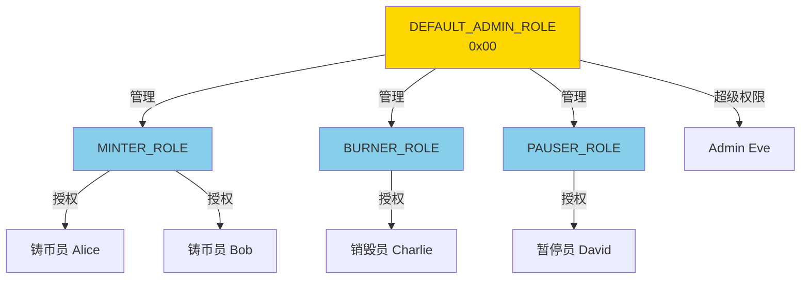

# Access

> 权限控制：智能合约的安全基石

> [!IMPORTANT] 本节重点
> 1. Ownable、Ownable2Step、AccessControl 如何选择？
> 2. 如何设计多角色权限系统？
> 3. 如何防止权限丢失和误操作？
> 4. 权限升级和最佳实践是什么？

## 权限控制的重要性

智能合约一旦部署无法修改，权限管理不当可能导致：
- 💸 资金永久锁定或被盗
- 🔒 合约功能无法升级
- ⚠️ 恶意用户滥用特权功能
- 🚫 合法管理员无法操作

OpenZeppelin 提供了三种权限控制方案，适用不同场景。

## 三种权限模式对比

| 特性            | Ownable          | Ownable2Step         | AccessControl      |
| ------------- | ---------------- | -------------------- | ------------------ |
| **复杂度**       | ⭐ 最简单           | ⭐⭐ 简单              | ⭐⭐⭐ 复杂           |
| **权限粒度**      | 单一 owner        | 单一 owner（安全转移）      | 多角色、细粒度            |
| **转移安全性**     | ⚠️ 一步完成，易出错     | ✅ 两步确认，更安全          | ✅ 灵活授权撤销          |
| **Gas 成本**    | 低                | 低                    | 中等（存储更多）           |
| **扩展性**       | ❌ 难以扩展         | ❌ 难以扩展             | ✅ 高度灵活            |
| **适用场景**      | 简单合约、原型        | 生产级单管理员             | 复杂系统、DAO、DeFi     |
| **误操作风险**     | ⚠️ 高（一键放弃所有权）   | ⚠️ 中（两步确认）          | ✅ 低（可撤销）          |
| **多签支持**      | 需配合 Gnosis Safe | 需配合 Gnosis Safe     | ✅ 内置多角色          |

**选择建议：**
- 🔰 学习/测试合约 → **Ownable**
- 🏢 生产级单管理员 → **Ownable2Step**
- 🏗️ 复杂权限系统 → **AccessControl**

## Ownable

**Ownable** 提供最基础的单一所有者权限控制。

### 核心功能

```mermaid
graph LR
    A[部署合约] -->|设置 owner| B[Owner 地址]
    B -->|onlyOwner| C[执行特权函数]
    B -->|transferOwnership| D[新 Owner]
    B -->|renounceOwnership| E[address(0)]

    style B fill:#90EE90
    style E fill:#FFB6C6
```

### 完整示例

:::code-group

```solidity [简单 DeFi 协议]
// SPDX-License-Identifier: MIT
pragma solidity ^0.8.20;

import {Ownable} from "@openzeppelin/contracts/access/Ownable.sol";

/**
 * @dev 简单的流动性池
 */
contract LiquidityPool is Ownable {
    uint256 public feeRate = 30; // 0.3% (30/10000)
    mapping(address => uint256) public balances;

    event FeeRateUpdated(uint256 oldRate, uint256 newRate);
    event Deposited(address indexed user, uint256 amount);
    event Withdrawn(address indexed user, uint256 amount);

    constructor(address initialOwner) Ownable(initialOwner) {}

    /**
     * @dev 存款（任何人）
     */
    function deposit() external payable {
        balances[msg.sender] += msg.value;
        emit Deposited(msg.sender, msg.value);
    }

    /**
     * @dev 提款（任何人）
     */
    function withdraw(uint256 amount) external {
        require(balances[msg.sender] >= amount, "Insufficient balance");

        balances[msg.sender] -= amount;
        payable(msg.sender).transfer(amount);

        emit Withdrawn(msg.sender, amount);
    }

    /**
     * @dev 修改费率（仅 owner）
     */
    function setFeeRate(uint256 newFeeRate) external onlyOwner {
        require(newFeeRate <= 100, "Fee too high"); // 最高 1%

        uint256 oldRate = feeRate;
        feeRate = newFeeRate;

        emit FeeRateUpdated(oldRate, newFeeRate);
    }

    /**
     * @dev 提取手续费（仅 owner）
     */
    function collectFees() external onlyOwner {
        uint256 balance = address(this).balance;
        payable(owner()).transfer(balance);
    }

    /**
     * @dev 紧急暂停（结合 Pausable）
     */
    function emergencyPause() external onlyOwner {
        // 配合 Pausable 使用
    }
}
```

```solidity [Ownable 源码详解]
// SPDX-License-Identifier: MIT
pragma solidity ^0.8.20;

import {Context} from "../utils/Context.sol";

/**
 * @dev 单一所有者权限控制
 *
 * 核心功能：
 * - owner(): 查询当前所有者
 * - onlyOwner: 限制函数仅 owner 可调用
 * - transferOwnership(): 转移所有权
 * - renounceOwnership(): 放弃所有权（⚠️ 不可逆）
 */
abstract contract Ownable is Context {
    address private _owner;

    /// @dev 错误：未授权的账户
    error OwnableUnauthorizedAccount(address account);

    /// @dev 错误：无效的 owner 地址
    error OwnableInvalidOwner(address owner);

    /// @dev 事件：所有权转移
    event OwnershipTransferred(
        address indexed previousOwner,
        address indexed newOwner
    );

    /**
     * @dev 构造函数：设置初始 owner
     */
    constructor(address initialOwner) {
        if (initialOwner == address(0)) {
            revert OwnableInvalidOwner(address(0));
        }
        _transferOwnership(initialOwner);
    }

    /**
     * @dev 修饰器：仅 owner 可调用
     */
    modifier onlyOwner() {
        _checkOwner();
        _;
    }

    /**
     * @dev 返回当前 owner
     */
    function owner() public view virtual returns (address) {
        return _owner;
    }

    /**
     * @dev 检查调用者是否为 owner
     */
    function _checkOwner() internal view virtual {
        if (owner() != _msgSender()) {
            revert OwnableUnauthorizedAccount(_msgSender());
        }
    }

    /**
     * @dev 放弃所有权
     * ⚠️ 警告：不可逆操作！
     */
    function renounceOwnership() public virtual onlyOwner {
        _transferOwnership(address(0));
    }

    /**
     * @dev 转移所有权
     */
    function transferOwnership(address newOwner) public virtual onlyOwner {
        if (newOwner == address(0)) {
            revert OwnableInvalidOwner(address(0));
        }
        _transferOwnership(newOwner);
    }

    /**
     * @dev 内部：执行所有权转移
     */
    function _transferOwnership(address newOwner) internal virtual {
        address oldOwner = _owner;
        _owner = newOwner;
        emit OwnershipTransferred(oldOwner, newOwner);
    }
}
```

:::

### 常见陷阱

```solidity
// ❌ 错误 1：误操作放弃所有权
contract BadExample is Ownable {
    function cleanup() external onlyOwner {
        renounceOwnership(); // 🔥 永久失去控制权！
    }
}

// ❌ 错误 2：转移到错误地址
function transferToWrongAddress() external onlyOwner {
    transferOwnership(0x0000000000000000000000000000000000000001); // 🔥 无效地址
}

// ❌ 错误 3：constructor 中误用
contract BadConstructor is Ownable {
    constructor() Ownable(address(0)) {} // 🔥 会 revert
}

// ✅ 正确做法
contract GoodExample is Ownable {
    bool public ownershipRenounced;

    constructor(address initialOwner) Ownable(initialOwner) {}

    // 两步确认放弃所有权
    function initiateRenounce() external onlyOwner {
        ownershipRenounced = true;
    }

    function confirmRenounce() external onlyOwner {
        require(ownershipRenounced, "Not initiated");
        renounceOwnership();
    }
}
```

## Ownable2Step

**Ownable2Step** 提供两步确认的所有权转移，避免误操作。

### 工作流程

```mermaid
sequenceDiagram
    participant 当前Owner
    participant 合约
    participant 新Owner

    当前Owner->>合约: 1. transferOwnership(newOwner)
    合约->>合约: pendingOwner = newOwner
    Note over 合约: owner 未改变

    新Owner->>合约: 2. acceptOwnership()
    合约->>合约: owner = pendingOwner
    合约->>合约: pendingOwner = address(0)

    Note over 新Owner: 成功成为 owner

    style 合约 fill:#87CEEB
    style 新Owner fill:#90EE90
```

### 实现示例

:::code-group

```solidity [使用 Ownable2Step]
// SPDX-License-Identifier: MIT
pragma solidity ^0.8.20;

import {Ownable2Step} from "@openzeppelin/contracts/access/Ownable2Step.sol";
import {Ownable} from "@openzeppelin/contracts/access/Ownable.sol";

/**
 * @dev 生产级协议合约
 */
contract ProductionProtocol is Ownable2Step {
    uint256 public parameter;

    event ParameterUpdated(uint256 newValue);

    constructor(address initialOwner) Ownable(initialOwner) {}

    /**
     * @dev 更新参数（仅 owner）
     */
    function updateParameter(uint256 newValue) external onlyOwner {
        parameter = newValue;
        emit ParameterUpdated(newValue);
    }

    /**
     * @dev 转移所有权（两步流程）
     * 1. 当前 owner 调用 transferOwnership(newOwner)
     * 2. newOwner 调用 acceptOwnership()
     */

    /**
     * @dev 查询待定的新 owner
     */
    function getPendingOwner() external view returns (address) {
        return pendingOwner();
    }
}
```

```solidity [Ownable2Step 源码]
// SPDX-License-Identifier: MIT
pragma solidity ^0.8.20;

import {Ownable} from "./Ownable.sol";

/**
 * @dev 两步确认的所有权转移
 *
 * 流程：
 * 1. owner 调用 transferOwnership(newOwner)
 * 2. newOwner 调用 acceptOwnership()
 *
 * 优势：防止转移到错误地址
 */
abstract contract Ownable2Step is Ownable {
    address private _pendingOwner;

    /// @dev 事件：所有权转移已启动
    event OwnershipTransferStarted(
        address indexed previousOwner,
        address indexed newOwner
    );

    /**
     * @dev 返回待定的新 owner
     */
    function pendingOwner() public view virtual returns (address) {
        return _pendingOwner;
    }

    /**
     * @dev 第一步：启动所有权转移
     * 仅设置 pendingOwner，不改变 owner
     */
    function transferOwnership(address newOwner)
        public
        virtual
        override
        onlyOwner
    {
        _pendingOwner = newOwner;
        emit OwnershipTransferStarted(owner(), newOwner);
    }

    /**
     * @dev 第二步：新 owner 接受所有权
     */
    function acceptOwnership() public virtual {
        address sender = _msgSender();

        if (pendingOwner() != sender) {
            revert OwnableUnauthorizedAccount(sender);
        }

        _transferOwnership(sender);
        delete _pendingOwner;
    }

    /**
     * @dev 重写：放弃所有权时清除 pendingOwner
     */
    function renounceOwnership() public virtual override onlyOwner {
        delete _pendingOwner;
        super.renounceOwnership();
    }
}
```

:::

### 对比 Ownable

| 操作       | Ownable                    | Ownable2Step                    |
| -------- | -------------------------- | ------------------------------- |
| 转移所有权    | 一步完成，立即生效                  | 两步确认，新 owner 需接受                |
| 误操作风险    | ⚠️ 高（可能转到错误地址）             | ✅ 低（新 owner 必须主动接受）             |
| Gas 成本   | 低                          | 略高（多一次交易）                       |
| 适用场景     | 测试、简单合约                    | 生产环境、高价值合约                      |
| 恢复可能性    | ❌ 转移后无法撤销                 | ✅ 转移前可撤销（重新调用 transferOwnership） |

## AccessControl

**AccessControl** 提供灵活的基于角色的权限控制（RBAC）。

### 核心概念



### 角色定义

```solidity
// 角色使用 bytes32 定义
bytes32 public constant MINTER_ROLE = keccak256("MINTER_ROLE");
bytes32 public constant BURNER_ROLE = keccak256("BURNER_ROLE");
bytes32 public constant PAUSER_ROLE = keccak256("PAUSER_ROLE");

// 默认管理员角色（管理所有角色）
bytes32 public constant DEFAULT_ADMIN_ROLE = 0x00;
```

### 完整示例

:::code-group

```solidity [DeFi 代币合约]
// SPDX-License-Identifier: MIT
pragma solidity ^0.8.20;

import {AccessControl} from "@openzeppelin/contracts/access/AccessControl.sol";
import {ERC20} from "@openzeppelin/contracts/token/ERC20/ERC20.sol";
import {Pausable} from "@openzeppelin/contracts/utils/Pausable.sol";

/**
 * @dev 完整的 DeFi 代币：多角色权限管理
 */
contract DeFiToken is ERC20, AccessControl, Pausable {
    // 定义角色
    bytes32 public constant MINTER_ROLE = keccak256("MINTER_ROLE");
    bytes32 public constant BURNER_ROLE = keccak256("BURNER_ROLE");
    bytes32 public constant PAUSER_ROLE = keccak256("PAUSER_ROLE");

    // 最大供应量
    uint256 public constant MAX_SUPPLY = 1_000_000 * 10**18;

    constructor(address admin) ERC20("DeFi Token", "DFT") {
        // 授予 admin 所有角色
        _grantRole(DEFAULT_ADMIN_ROLE, admin);
        _grantRole(MINTER_ROLE, admin);
        _grantRole(BURNER_ROLE, admin);
        _grantRole(PAUSER_ROLE, admin);
    }

    /**
     * @dev 铸币（仅 MINTER_ROLE）
     */
    function mint(address to, uint256 amount) external onlyRole(MINTER_ROLE) {
        require(totalSupply() + amount <= MAX_SUPPLY, "Exceeds max supply");
        _mint(to, amount);
    }

    /**
     * @dev 销毁（仅 BURNER_ROLE）
     */
    function burn(address from, uint256 amount) external onlyRole(BURNER_ROLE) {
        _burn(from, amount);
    }

    /**
     * @dev 暂停（仅 PAUSER_ROLE）
     */
    function pause() external onlyRole(PAUSER_ROLE) {
        _pause();
    }

    /**
     * @dev 恢复（仅 PAUSER_ROLE）
     */
    function unpause() external onlyRole(PAUSER_ROLE) {
        _unpause();
    }

    /**
     * @dev 重写：转账时检查暂停状态
     */
    function _update(address from, address to, uint256 amount)
        internal
        override
        whenNotPaused
    {
        super._update(from, to, amount);
    }
}
```

```solidity [DAO 金库管理]
// SPDX-License-Identifier: MIT
pragma solidity ^0.8.20;

import {AccessControl} from "@openzeppelin/contracts/access/AccessControl.sol";

/**
 * @dev DAO 金库：分层权限管理
 */
contract DAOTreasury is AccessControl {
    // 角色定义
    bytes32 public constant TREASURER_ROLE = keccak256("TREASURER_ROLE");
    bytes32 public constant AUDITOR_ROLE = keccak256("AUDITOR_ROLE");
    bytes32 public constant EXECUTOR_ROLE = keccak256("EXECUTOR_ROLE");

    struct Proposal {
        address to;
        uint256 amount;
        bool executed;
        uint256 approvals;
    }

    mapping(uint256 => Proposal) public proposals;
    uint256 public proposalCount;

    event ProposalCreated(uint256 indexed id, address to, uint256 amount);
    event ProposalApproved(uint256 indexed id, address approver);
    event ProposalExecuted(uint256 indexed id);

    constructor(address admin) {
        _grantRole(DEFAULT_ADMIN_ROLE, admin);
    }

    /**
     * @dev 创建提案（仅 TREASURER_ROLE）
     */
    function createProposal(address to, uint256 amount)
        external
        onlyRole(TREASURER_ROLE)
        returns (uint256)
    {
        uint256 id = proposalCount++;
        proposals[id] = Proposal({
            to: to,
            amount: amount,
            executed: false,
            approvals: 0
        });

        emit ProposalCreated(id, to, amount);
        return id;
    }

    /**
     * @dev 审批提案（仅 AUDITOR_ROLE）
     */
    function approveProposal(uint256 id) external onlyRole(AUDITOR_ROLE) {
        Proposal storage proposal = proposals[id];
        require(!proposal.executed, "Already executed");

        proposal.approvals++;
        emit ProposalApproved(id, msg.sender);
    }

    /**
     * @dev 执行提案（仅 EXECUTOR_ROLE，需足够审批）
     */
    function executeProposal(uint256 id) external onlyRole(EXECUTOR_ROLE) {
        Proposal storage proposal = proposals[id];

        require(!proposal.executed, "Already executed");
        require(proposal.approvals >= 2, "Insufficient approvals");
        require(address(this).balance >= proposal.amount, "Insufficient balance");

        proposal.executed = true;
        payable(proposal.to).transfer(proposal.amount);

        emit ProposalExecuted(id);
    }

    /**
     * @dev 接收 ETH
     */
    receive() external payable {}
}
```

:::

### 核心API

| 函数                                 | 说明                    | 权限要求              |
| ---------------------------------- | --------------------- | ----------------- |
| `hasRole(role, account)`           | 检查账户是否有角色             | 无                 |
| `grantRole(role, account)`         | 授予角色                  | 角色的管理员            |
| `revokeRole(role, account)`        | 撤销角色                  | 角色的管理员            |
| `renounceRole(role, account)`      | 放弃自己的角色               | 调用者本人             |
| `getRoleAdmin(role)`               | 查询角色的管理员角色            | 无                 |
| `_setRoleAdmin(role, adminRole)`   | 设置角色的管理员（构造函数或内部使用）   | 内部调用              |
| `_grantRole(role, account)`        | 内部授予（无权限检查）           | 内部调用              |
| `_revokeRole(role, account)`       | 内部撤销（无权限检查）           | 内部调用              |
| `onlyRole(role)` modifier          | 限制函数仅特定角色可调用          | -                 |

### 高级模式：层级角色

```solidity
// SPDX-License-Identifier: MIT
pragma solidity ^0.8.20;

import {AccessControl} from "@openzeppelin/contracts/access/AccessControl.sol";

/**
 * @dev 层级权限系统
 */
contract HierarchicalAccess is AccessControl {
    bytes32 public constant ADMIN_ROLE = keccak256("ADMIN_ROLE");
    bytes32 public constant MODERATOR_ROLE = keccak256("MODERATOR_ROLE");
    bytes32 public constant USER_ROLE = keccak256("USER_ROLE");

    constructor(address superAdmin) {
        // 超级管理员
        _grantRole(DEFAULT_ADMIN_ROLE, superAdmin);

        // 设置角色层级
        _setRoleAdmin(ADMIN_ROLE, DEFAULT_ADMIN_ROLE);
        _setRoleAdmin(MODERATOR_ROLE, ADMIN_ROLE); // ADMIN 管理 MODERATOR
        _setRoleAdmin(USER_ROLE, MODERATOR_ROLE);   // MODERATOR 管理 USER
    }

    /**
     * @dev 超级管理员操作
     */
    function superAdminAction() external onlyRole(DEFAULT_ADMIN_ROLE) {
        // 最高权限操作
    }

    /**
     * @dev 管理员操作
     */
    function adminAction() external onlyRole(ADMIN_ROLE) {
        // 管理员操作
    }

    /**
     * @dev 版主操作
     */
    function moderatorAction() external onlyRole(MODERATOR_ROLE) {
        // 版主操作
    }
}
```

## AccessControlEnumerable

**AccessControlEnumerable** 添加角色成员枚举功能。

:::code-group

```solidity [白名单管理系统]
// SPDX-License-Identifier: MIT
pragma solidity ^0.8.20;

import {AccessControlEnumerable} from "@openzeppelin/contracts/access/extensions/AccessControlEnumerable.sol";

/**
 * @dev NFT 白名单铸造
 */
contract WhitelistNFT is AccessControlEnumerable {
    bytes32 public constant WHITELISTED_ROLE = keccak256("WHITELISTED_ROLE");

    mapping(address => bool) public hasMinted;

    constructor(address admin) {
        _grantRole(DEFAULT_ADMIN_ROLE, admin);
    }

    /**
     * @dev 批量添加白名单
     */
    function addToWhitelist(address[] memory users) external onlyRole(DEFAULT_ADMIN_ROLE) {
        for (uint256 i = 0; i < users.length; i++) {
            _grantRole(WHITELISTED_ROLE, users[i]);
        }
    }

    /**
     * @dev 白名单铸造
     */
    function mint() external onlyRole(WHITELISTED_ROLE) {
        require(!hasMinted[msg.sender], "Already minted");
        hasMinted[msg.sender] = true;
        // 铸造 NFT 逻辑
    }

    /**
     * @dev 获取白名单总数
     */
    function getWhitelistCount() external view returns (uint256) {
        return getRoleMemberCount(WHITELISTED_ROLE);
    }

    /**
     * @dev 获取第 N 个白名单地址
     */
    function getWhitelistMember(uint256 index) external view returns (address) {
        return getRoleMember(WHITELISTED_ROLE, index);
    }

    /**
     * @dev 获取所有白名单地址（⚠️ Gas 密集）
     */
    function getAllWhitelisted() external view returns (address[] memory) {
        return getRoleMembers(WHITELISTED_ROLE);
    }
}
```

:::

## 最佳实践

### 1. 选择合适的权限模式

```solidity
// ❌ 错误：简单合约使用复杂权限
contract SimpleVault is AccessControl {
    // 过度设计！只需 Ownable
}

// ✅ 正确：根据需求选择
contract SimpleVault is Ownable {
    // 简单合约用 Ownable
}

contract ComplexDeFi is AccessControl {
    // 复杂系统用 AccessControl
}
```

### 2. 保护 DEFAULT_ADMIN_ROLE

```solidity
// ❌ 危险：直接授予用户最高权限
constructor() {
    _grantRole(DEFAULT_ADMIN_ROLE, msg.sender);
}

// ✅ 推荐：使用多签钱包
constructor(address multisig) {
    require(multisig != address(0), "Invalid multisig");
    _grantRole(DEFAULT_ADMIN_ROLE, multisig); // Gnosis Safe 等
}
```

### 3. 角色粒度设计

```solidity
// ❌ 权限过于粗糙
bytes32 public constant ADMIN_ROLE = keccak256("ADMIN_ROLE");
// ADMIN 可以做所有事

// ✅ 细粒度权限
bytes32 public constant MINT_ROLE = keccak256("MINT_ROLE");
bytes32 public constant BURN_ROLE = keccak256("BURN_ROLE");
bytes32 public constant PAUSE_ROLE = keccak256("PAUSE_ROLE");
bytes32 public constant UPGRADE_ROLE = keccak256("UPGRADE_ROLE");
```

### 4. 紧急情况处理

```solidity
contract EmergencyProtocol is AccessControl {
    bytes32 public constant GUARDIAN_ROLE = keccak256("GUARDIAN_ROLE");
    bool public emergencyShutdown;

    /**
     * @dev 紧急关闭（限时权限）
     */
    function triggerEmergency() external onlyRole(GUARDIAN_ROLE) {
        emergencyShutdown = true;
        // 24 小时后自动解除
    }

    /**
     * @dev 通过治理恢复
     */
    function resolveEmergency() external onlyRole(DEFAULT_ADMIN_ROLE) {
        emergencyShutdown = false;
    }
}
```

### 5. 事件监控

```solidity
contract AuditedAccess is AccessControl {
    event CriticalOperation(address indexed operator, string action);

    function criticalAction() external onlyRole(ADMIN_ROLE) {
        emit CriticalOperation(msg.sender, "critical_action_executed");
        // 关键操作
    }
}
```

## 常见陷阱与安全建议

### 1. 权限丢失

```solidity
// ❌ 致命错误：永久失去控制权
function dangerousRenounce() external onlyOwner {
    renounceOwnership(); // 🔥 合约永久锁定
}

// ✅ 安全做法：多签 + 时间锁
contract SafeProtocol is Ownable2Step {
    address public immutable timelock;

    constructor(address _timelock) Ownable(msg.sender) {
        timelock = _timelock;
    }

    // 重要操作需要 timelock
    modifier onlyTimelock() {
        require(msg.sender == timelock, "Not timelock");
        _;
    }
}
```

### 2. 角色冲突

```solidity
// ❌ 角色设计冲突
bytes32 public constant ROLE_A = keccak256("ROLE");
bytes32 public constant ROLE_B = keccak256("ROLE"); // 🔥 相同哈希！

// ✅ 清晰命名
bytes32 public constant MINTER_ROLE = keccak256("MINTER_ROLE");
bytes32 public constant BURNER_ROLE = keccak256("BURNER_ROLE");
```

### 3. 前端权限检查

```typescript
// ✅ 前端检查（提升 UX）
const hasRole = await contract.hasRole(MINTER_ROLE, userAddress);
if (!hasRole) {
  alert("You don't have permission to mint");
  return;
}

// ✅ 链上强制检查（安全）
await contract.mint(amount); // onlyRole(MINTER_ROLE)
```

## 常见问题 FAQ

### Q1: 如何实现多签控制？

**A:** 使用 Gnosis Safe 配合 Ownable/AccessControl

```typescript
// 部署时将 owner 设为 Gnosis Safe 地址
const safe = "0x..."; // Gnosis Safe 地址
const contract = await Contract.deploy(safe);
```

### Q2: 如何升级权限系统？

**A:** 使用可升级代理（UUPS）

```solidity
contract UpgradeableAccess is AccessControl, UUPSUpgradeable {
    function _authorizeUpgrade(address) internal override onlyRole(DEFAULT_ADMIN_ROLE) {}
}
```

### Q3: AccessControl vs Ownable 哪个更省 Gas？

**A:**

| 操作         | Ownable | AccessControl |
| ---------- | ------- | ------------- |
| 部署成本       | ~50k    | ~150k         |
| 权限检查（读取）   | ~2k     | ~5k           |
| 适用场景       | 简单合约    | 复杂系统          |
