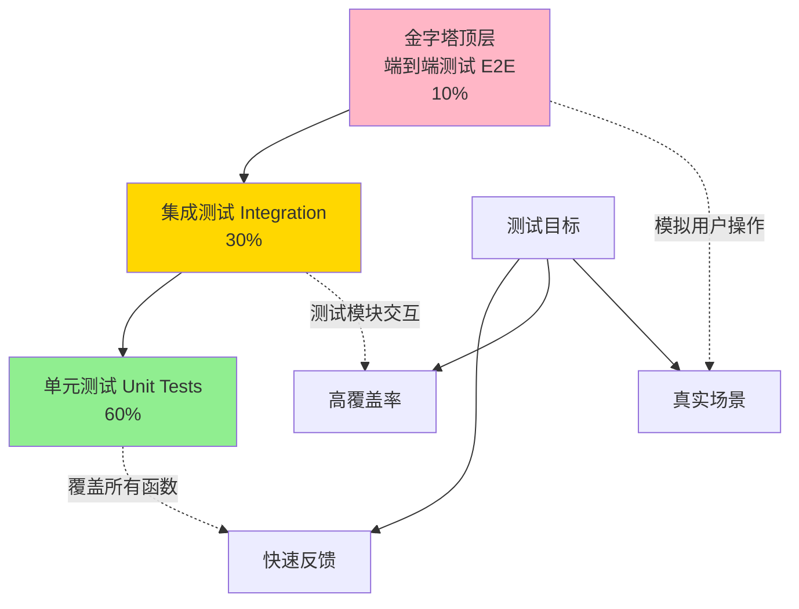

# Solidity 测试完全指南 <Badge type="tip" text="从新手到熟练" />

> 智能合约测试：从零到精通的完整路径

> [!IMPORTANT] 本章重点
> 1. 为什么智能合约测试如此重要？
> 2. Hardhat 和 Foundry 测试框架如何选择？
> 3. 如何编写单元测试、集成测试和端到端测试？
> 4. 测试覆盖率如何达到 100%？
> 5. 如何进行 Gas 优化和安全测试？
> 6. 生产级测试的最佳实践是什么？

## 为什么测试智能合约？

智能合约一旦部署**不可修改**，测试不足可能导致：

- 💸 **资金损失**：2016 年 DAO 黑客事件损失 6000 万美元
- 🔒 **合约锁定**：Parity 多签钱包冻结 2.8 亿美元
- 💥 **协议崩溃**：逻辑错误导致整个 DeFi 协议瘫痪
- ⚖️ **法律责任**：代码即法律，Bug 可能引发诉讼

**测试是智能合约安全的第一道防线！**

### 测试金字塔



| 测试类型 | 比例 | 执行速度 | 覆盖范围 | 成本 |
|---------|------|---------|---------|------|
| **单元测试** | 60% | ⚡ 最快（毫秒） | 单个函数 | 低 |
| **集成测试** | 30% | 🚀 较快（秒） | 多个合约交互 | 中 |
| **端到端测试** | 10% | 🐢 较慢（分钟） | 完整用户流程 | 高 |

## 测试框架对比

### Hardhat vs Foundry

| 特性 | Hardhat | Foundry |
|-----|---------|---------|
| **测试语言** | JavaScript/TypeScript | Solidity |
| **执行速度** | 🚀 快 | ⚡ 极快（10-100x） |
| **Gas 报告** | ✅ 支持 | ✅ 内置，更详细 |
| **模糊测试** | ❌ 需插件 | ✅ 原生支持 |
| **调试工具** | ✅ 强大（console.log） | ✅ 强大（forge debug） |
| **生态系统** | ✅ 成熟，插件丰富 | ✅ 新兴，快速发展 |
| **学习曲线** | 📈 中等（需会 JS） | 📊 陡峭（纯 Solidity） |
| **适用场景** | DApp 开发、前端集成 | 协议开发、性能优化 |
| **快照测试** | ✅ 支持 | ✅ 原生 |
| **代码覆盖率** | ✅ 需配置 | ✅ 原生 `forge coverage` |

**选择建议：**
- 🔰 新手学习 → **Hardhat**（更友好的错误提示）
- 🏗️ DeFi 协议 → **Foundry**（极致性能 + 模糊测试）
- 🌐 DApp 前端 → **Hardhat**（与 ethers.js 无缝集成）
- 🔬 安全审计 → **Foundry**（深度测试工具）

## Hardhat 测试框架

### 环境搭建

:::code-group

```bash [安装 Hardhat]
# 创建项目
mkdir my-project && cd my-project
npm init -y

# 安装 Hardhat
npm install --save-dev hardhat

# 初始化项目
npx hardhat init
# 选择 "Create a TypeScript project"

# 安装测试依赖
npm install --save-dev @nomicfoundation/hardhat-toolbox
npm install --save-dev @nomicfoundation/hardhat-chai-matchers
npm install --save-dev chai ethers
```

```javascript [hardhat.config.js]
require("@nomicfoundation/hardhat-toolbox");

module.exports = {
  solidity: {
    version: "0.8.20",
    settings: {
      optimizer: {
        enabled: true,
        runs: 200,
      },
    },
  },
  networks: {
    hardhat: {
      // 本地测试网络配置
      chainId: 31337,
    },
    sepolia: {
      url: process.env.SEPOLIA_RPC_URL || "",
      accounts: process.env.PRIVATE_KEY ? [process.env.PRIVATE_KEY] : [],
    },
  },
  gasReporter: {
    enabled: true,
    currency: "USD",
    coinmarketcap: process.env.COINMARKETCAP_API_KEY,
  },
};
```

:::

### 单元测试示例

:::code-group

```solidity [Counter.sol - 被测合约]
// SPDX-License-Identifier: MIT
pragma solidity ^0.8.20;

/**
 * @dev 简单计数器合约（用于测试演示）
 */
contract Counter {
    uint256 public count;
    address public owner;

    event Incremented(uint256 newCount, address indexed caller);
    event Decremented(uint256 newCount, address indexed caller);
    event Reset(address indexed caller);

    error UnauthorizedReset(address caller);

    constructor(uint256 initialCount) {
        count = initialCount;
        owner = msg.sender;
    }

    function increment() external {
        count += 1;
        emit Incremented(count, msg.sender);
    }

    function decrement() external {
        require(count > 0, "Count cannot go below zero");
        count -= 1;
        emit Decremented(count, msg.sender);
    }

    function reset() external {
        if (msg.sender != owner) {
            revert UnauthorizedReset(msg.sender);
        }
        count = 0;
        emit Reset(msg.sender);
    }

    function getCount() external view returns (uint256) {
        return count;
    }
}
```

```typescript [Counter.test.ts - 测试文件]
import { expect } from "chai";
import { ethers } from "hardhat";
import { Counter } from "../typechain-types";
import { SignerWithAddress } from "@nomicfoundation/hardhat-ethers/signers";
import { loadFixture } from "@nomicfoundation/hardhat-network-helpers";

describe("Counter 合约测试", function () {
  // ===================== Fixture 模式（推荐）=====================

  /**
   * @dev Fixture：可重用的测试环境
   * 每个测试自动回滚到初始状态，速度快
   */
  async function deployCounterFixture() {
    const [owner, user1, user2] = await ethers.getSigners();

    const Counter = await ethers.getContractFactory("Counter");
    const counter = await Counter.deploy(10); // 初始值 10

    return { counter, owner, user1, user2 };
  }

  // ===================== 部署测试 =====================

  describe("部署", function () {
    it("应该正确设置初始计数", async function () {
      const { counter } = await loadFixture(deployCounterFixture);

      expect(await counter.count()).to.equal(10);
    });

    it("应该正确设置所有者", async function () {
      const { counter, owner } = await loadFixture(deployCounterFixture);

      expect(await counter.owner()).to.equal(owner.address);
    });

    it("应该允许部署时设置任意初始值", async function () {
      const Counter = await ethers.getContractFactory("Counter");
      const counter = await Counter.deploy(999);

      expect(await counter.count()).to.equal(999);
    });
  });

  // ===================== 功能测试 =====================

  describe("increment", function () {
    it("应该增加计数", async function () {
      const { counter } = await loadFixture(deployCounterFixture);

      await counter.increment();

      expect(await counter.count()).to.equal(11);
    });

    it("应该正确触发 Incremented 事件", async function () {
      const { counter, owner } = await loadFixture(deployCounterFixture);

      await expect(counter.increment())
        .to.emit(counter, "Incremented")
        .withArgs(11, owner.address);
    });

    it("应该允许任何人调用", async function () {
      const { counter, user1 } = await loadFixture(deployCounterFixture);

      await expect(counter.connect(user1).increment())
        .to.not.be.reverted;

      expect(await counter.count()).to.equal(11);
    });

    it("应该支持多次递增", async function () {
      const { counter } = await loadFixture(deployCounterFixture);

      await counter.increment();
      await counter.increment();
      await counter.increment();

      expect(await counter.count()).to.equal(13);
    });
  });

  describe("decrement", function () {
    it("应该减少计数", async function () {
      const { counter } = await loadFixture(deployCounterFixture);

      await counter.decrement();

      expect(await counter.count()).to.equal(9);
    });

    it("当计数为 0 时应该回滚", async function () {
      const Counter = await ethers.getContractFactory("Counter");
      const counter = await Counter.deploy(0);

      await expect(counter.decrement())
        .to.be.revertedWith("Count cannot go below zero");
    });

    it("应该正确触发 Decremented 事件", async function () {
      const { counter, owner } = await loadFixture(deployCounterFixture);

      await expect(counter.decrement())
        .to.emit(counter, "Decremented")
        .withArgs(9, owner.address);
    });
  });

  describe("reset", function () {
    it("所有者应该能重置计数", async function () {
      const { counter, owner } = await loadFixture(deployCounterFixture);

      await counter.increment(); // count = 11
      await counter.reset();

      expect(await counter.count()).to.equal(0);
    });

    it("非所有者应该无法重置", async function () {
      const { counter, user1 } = await loadFixture(deployCounterFixture);

      await expect(counter.connect(user1).reset())
        .to.be.revertedWithCustomError(counter, "UnauthorizedReset")
        .withArgs(user1.address);
    });

    it("应该触发 Reset 事件", async function () {
      const { counter, owner } = await loadFixture(deployCounterFixture);

      await expect(counter.reset())
        .to.emit(counter, "Reset")
        .withArgs(owner.address);
    });
  });

  // ===================== 边界测试 =====================

  describe("边界条件", function () {
    it("应该处理大数值", async function () {
      const Counter = await ethers.getContractFactory("Counter");
      const maxUint = ethers.MaxUint256;

      // 部署时使用最大值
      const counter = await Counter.deploy(maxUint);
      expect(await counter.count()).to.equal(maxUint);

      // 递增应该溢出回滚（Solidity 0.8+）
      await expect(counter.increment()).to.be.reverted;
    });

    it("应该处理零值边界", async function () {
      const Counter = await ethers.getContractFactory("Counter");
      const counter = await Counter.deploy(1);

      await counter.decrement(); // count = 0
      expect(await counter.count()).to.equal(0);

      await expect(counter.decrement()).to.be.revertedWith(
        "Count cannot go below zero"
      );
    });
  });

  // ===================== Gas 测试 =====================

  describe("Gas 优化", function () {
    it("increment 应该消耗合理的 Gas", async function () {
      const { counter } = await loadFixture(deployCounterFixture);

      const tx = await counter.increment();
      const receipt = await tx.wait();

      console.log(`increment Gas 使用: ${receipt?.gasUsed.toString()}`);

      // 断言 Gas 使用在合理范围内（< 50k）
      expect(receipt?.gasUsed).to.be.lessThan(50000);
    });

    it("多次调用 Gas 应该稳定", async function () {
      const { counter } = await loadFixture(deployCounterFixture);

      const tx1 = await counter.increment();
      const receipt1 = await tx1.wait();

      const tx2 = await counter.increment();
      const receipt2 = await tx2.wait();

      // 后续调用 Gas 应该相同（warm storage）
      expect(receipt1?.gasUsed).to.be.closeTo(receipt2?.gasUsed!, 1000);
    });
  });
});
```

```bash [运行测试]
# 运行所有测试
npx hardhat test

# 运行特定文件
npx hardhat test test/Counter.test.ts

# 显示详细 Gas 报告
REPORT_GAS=true npx hardhat test

# 显示测试覆盖率
npx hardhat coverage

# 并行运行测试（加速）
npx hardhat test --parallel

# 只运行包含特定描述的测试
npx hardhat test --grep "increment"
```

:::

### 高级测试技巧

:::code-group

```typescript [时间操作]
import { time } from "@nomicfoundation/hardhat-network-helpers";

describe("时间相关测试", function () {
  it("应该在锁定期后允许提款", async function () {
    const { lock } = await loadFixture(deployLockFixture);

    const unlockTime = await lock.unlockTime();

    // 前进到解锁时间
    await time.increaseTo(unlockTime);

    // 现在可以提款
    await expect(lock.withdraw()).to.not.be.reverted;
  });

  it("应该在 7 天后过期", async function () {
    const { token } = await loadFixture(deployTokenFixture);

    // 前进 7 天
    await time.increase(7 * 24 * 60 * 60);

    expect(await token.isExpired()).to.be.true;
  });

  it("应该获取当前区块时间戳", async function () {
    const latestTime = await time.latest();
    console.log("当前时间:", latestTime);
  });
});
```

```typescript [余额和状态变化检查]
import { expect } from "chai";
import { ethers } from "hardhat";

describe("余额和状态变化", function () {
  it("应该正确转移 ETH", async function () {
    const [sender, receiver] = await ethers.getSigners();

    // 检查 ETH 余额变化
    await expect(
      sender.sendTransaction({
        to: receiver.address,
        value: ethers.parseEther("1.0")
      })
    ).to.changeEtherBalances(
      [sender, receiver],
      [ethers.parseEther("-1.0"), ethers.parseEther("1.0")]
    );
  });

  it("应该正确转移代币", async function () {
    const { token, sender, receiver } = await loadFixture(deployTokenFixture);

    // 检查代币余额变化
    await expect(
      token.connect(sender).transfer(receiver.address, 100)
    ).to.changeTokenBalances(
      token,
      [sender, receiver],
      [-100, 100]
    );
  });
});
```

```typescript [事件过滤和多参数]
describe("事件测试高级用法", function () {
  it("应该触发多个事件", async function () {
    const { contract } = await loadFixture(deployFixture);

    const tx = await contract.complexOperation();

    // 检查多个事件
    await expect(tx)
      .to.emit(contract, "EventA")
      .and.to.emit(contract, "EventB");
  });

  it("应该触发带索引参数的事件", async function () {
    const { contract, user } = await loadFixture(deployFixture);

    await expect(contract.action())
      .to.emit(contract, "ActionPerformed")
      .withArgs(user.address, 123, "success");
  });

  it("应该获取事件日志", async function () {
    const { contract } = await loadFixture(deployFixture);

    const tx = await contract.mint(100);
    const receipt = await tx.wait();

    const events = receipt?.logs.filter(
      (log: any) => log.eventName === "Minted"
    );

    expect(events).to.have.lengthOf(1);
  });
});
```

```typescript [Revert 原因测试]
describe("错误处理测试", function () {
  it("应该因特定原因回滚（require）", async function () {
    const { contract } = await loadFixture(deployFixture);

    await expect(contract.withdraw(1000))
      .to.be.revertedWith("Insufficient balance");
  });

  it("应该回滚自定义错误", async function () {
    const { contract } = await loadFixture(deployFixture);

    await expect(contract.restrictedFunction())
      .to.be.revertedWithCustomError(contract, "Unauthorized")
      .withArgs(user.address);
  });

  it("应该捕获 panic 错误", async function () {
    const { contract } = await loadFixture(deployFixture);

    // 溢出错误（Panic code 0x11）
    await expect(contract.overflow())
      .to.be.revertedWithPanic(0x11);
  });

  it("应该测试 revert 不带消息", async function () {
    const { contract } = await loadFixture(deployFixture);

    await expect(contract.fail()).to.be.reverted;
  });
});
```

```typescript [快照和回滚]
import { takeSnapshot } from "@nomicfoundation/hardhat-network-helpers";

describe("快照测试", function () {
  it("应该回滚到快照状态", async function () {
    const { contract } = await loadFixture(deployFixture);

    // 记录初始状态
    const initialValue = await contract.value();

    // 创建快照
    const snapshot = await takeSnapshot();

    // 修改状态
    await contract.setValue(999);
    expect(await contract.value()).to.equal(999);

    // 回滚到快照
    await snapshot.restore();

    // 状态已恢复
    expect(await contract.value()).to.equal(initialValue);
  });
});
```

```typescript [模拟其他账户]
describe("多账户交互", function () {
  it("应该模拟不同账户调用", async function () {
    const { contract, owner, user1, user2 } = await loadFixture(deployFixture);

    // owner 调用
    await contract.connect(owner).adminFunction();

    // user1 调用
    await contract.connect(user1).userFunction();

    // user2 调用
    await contract.connect(user2).userFunction();
  });

  it("应该测试授权流程", async function () {
    const { token, owner, spender } = await loadFixture(deployFixture);

    // owner 授权 spender
    await token.connect(owner).approve(spender.address, 1000);

    // spender 使用授权额度
    await token.connect(spender).transferFrom(
      owner.address,
      spender.address,
      500
    );

    expect(await token.balanceOf(spender.address)).to.equal(500);
  });
});
```

:::

## Foundry 测试框架

### 环境搭建

:::code-group

```bash [安装 Foundry]
# 安装 Foundry（macOS/Linux）
curl -L https://foundry.paradigm.xyz | bash

# 重新加载 PATH
source ~/.bashrc  # 或 source ~/.zshrc

# 安装 foundryup
foundryup

# 创建项目
forge init my-project
cd my-project

# 项目结构
# ├── src/          # 合约源码
# ├── test/         # 测试文件
# ├── script/       # 部署脚本
# └── lib/          # 依赖库

# 安装 OpenZeppelin
forge install OpenZeppelin/openzeppelin-contracts

# 配置 remappings
echo "@openzeppelin/contracts/=lib/openzeppelin-contracts/contracts/" > remappings.txt
```

```toml [foundry.toml]
[profile.default]
src = "src"
out = "out"
libs = ["lib"]
solc_version = "0.8.20"
optimizer = true
optimizer_runs = 200

# 测试配置
verbosity = 3
gas_reports = ["*"]
fuzz = { runs = 256 }

[profile.ci]
fuzz = { runs = 10000 }
invariant = { runs = 1000 }

# RPC 端点
[rpc_endpoints]
sepolia = "${SEPOLIA_RPC_URL}"
mainnet = "${MAINNET_RPC_URL}"
```

:::

### Foundry 单元测试

:::code-group

```solidity [Counter.t.sol - Foundry 测试]
// SPDX-License-Identifier: MIT
pragma solidity ^0.8.20;

import "forge-std/Test.sol";
import "../src/Counter.sol";

/**
 * @dev Foundry 测试合约
 * 继承 Test 获得测试工具
 */
contract CounterTest is Test {
    Counter public counter;

    address public owner;
    address public user1;
    address public user2;

    // ===================== setUp：每个测试前执行 =====================

    function setUp() public {
        owner = address(this);
        user1 = address(0x1);
        user2 = address(0x2);

        // 部署合约
        counter = new Counter(10);
    }

    // ===================== 部署测试 =====================

    function test_InitialCount() public {
        assertEq(counter.count(), 10);
    }

    function test_OwnerIsSet() public {
        assertEq(counter.owner(), owner);
    }

    function test_DeployWithAnyInitialValue() public {
        Counter newCounter = new Counter(999);
        assertEq(newCounter.count(), 999);
    }

    // ===================== increment 测试 =====================

    function test_Increment() public {
        counter.increment();
        assertEq(counter.count(), 11);
    }

    function test_IncrementEvent() public {
        // 期望触发事件
        vm.expectEmit(true, true, false, true);
        emit Counter.Incremented(11, owner);

        counter.increment();
    }

    function test_IncrementByAnyUser() public {
        // 模拟 user1 调用
        vm.prank(user1);
        counter.increment();

        assertEq(counter.count(), 11);
    }

    function test_MultipleIncrements() public {
        counter.increment();
        counter.increment();
        counter.increment();

        assertEq(counter.count(), 13);
    }

    // ===================== decrement 测试 =====================

    function test_Decrement() public {
        counter.decrement();
        assertEq(counter.count(), 9);
    }

    function test_DecrementRevertsAtZero() public {
        Counter newCounter = new Counter(0);

        vm.expectRevert("Count cannot go below zero");
        newCounter.decrement();
    }

    function test_DecrementEvent() public {
        vm.expectEmit(true, true, false, true);
        emit Counter.Decremented(9, owner);

        counter.decrement();
    }

    // ===================== reset 测试 =====================

    function test_ResetByOwner() public {
        counter.increment(); // count = 11
        counter.reset();

        assertEq(counter.count(), 0);
    }

    function test_ResetByNonOwnerReverts() public {
        vm.prank(user1);

        vm.expectRevert(
            abi.encodeWithSelector(Counter.UnauthorizedReset.selector, user1)
        );
        counter.reset();
    }

    function test_ResetEvent() public {
        vm.expectEmit(true, false, false, true);
        emit Counter.Reset(owner);

        counter.reset();
    }

    // ===================== 边界测试 =====================

    function test_MaxUint256() public {
        Counter newCounter = new Counter(type(uint256).max);
        assertEq(newCounter.count(), type(uint256).max);

        // 溢出应该回滚
        vm.expectRevert();
        newCounter.increment();
    }

    function test_ZeroBoundary() public {
        Counter newCounter = new Counter(1);

        newCounter.decrement(); // count = 0
        assertEq(newCounter.count(), 0);

        vm.expectRevert("Count cannot go below zero");
        newCounter.decrement();
    }

    // ===================== 模糊测试（Fuzz Testing）=====================

    /**
     * @dev 模糊测试：自动生成随机输入
     * Foundry 会生成 256 种不同的 initialCount
     */
    function testFuzz_DeployWithAnyValue(uint256 initialCount) public {
        Counter newCounter = new Counter(initialCount);
        assertEq(newCounter.count(), initialCount);
    }

    /**
     * @dev 模糊测试：increment 后应该总是比原值大 1
     */
    function testFuzz_IncrementAlwaysAddsOne(uint256 initialCount) public {
        // 排除会溢出的情况
        vm.assume(initialCount < type(uint256).max);

        Counter newCounter = new Counter(initialCount);
        newCounter.increment();

        assertEq(newCounter.count(), initialCount + 1);
    }

    /**
     * @dev 模糊测试：decrement 的前提条件
     */
    function testFuzz_DecrementRequiresNonZero(uint256 initialCount) public {
        vm.assume(initialCount > 0);

        Counter newCounter = new Counter(initialCount);
        newCounter.decrement();

        assertEq(newCounter.count(), initialCount - 1);
    }

    // ===================== 不变量测试（Invariant Testing）=====================

    /**
     * @dev 不变量：count 永远 >= 0（uint256 天然保证）
     * 但我们测试 decrement 的逻辑保护
     */
    function invariant_CountNeverNegative() public view {
        // uint256 类型保证非负
        assert(counter.count() >= 0);
    }

    // ===================== Gas 快照测试 =====================

    function test_IncrementGas() public {
        uint256 gasBefore = gasleft();
        counter.increment();
        uint256 gasAfter = gasleft();

        uint256 gasUsed = gasBefore - gasAfter;
        console.log("Increment Gas Used:", gasUsed);

        // 断言 Gas 使用合理
        assertLt(gasUsed, 50000);
    }
}
```

```bash [运行测试]
# 运行所有测试
forge test

# 详细输出
forge test -vv

# 极详细输出（显示所有 console.log）
forge test -vvvv

# 运行特定测试
forge test --match-test test_Increment

# 运行特定合约
forge test --match-contract CounterTest

# 显示 Gas 报告
forge test --gas-report

# 测试覆盖率
forge coverage

# 模糊测试（增加运行次数）
forge test --fuzz-runs 10000

# 生成覆盖率报告（HTML）
forge coverage --report lcov
genhtml lcov.info -o coverage
```

:::

### Foundry Cheat Codes

Foundry 提供了强大的 **cheat codes**（作弊码），通过 `vm` 对象调用：

:::code-group

```solidity [时间操作]
contract TimeTest is Test {
    function test_Warp() public {
        // 设置区块时间戳
        vm.warp(1641070800); // 2022-01-02 00:00:00 UTC

        assertEq(block.timestamp, 1641070800);
    }

    function test_Skip() public {
        uint256 startTime = block.timestamp;

        // 前进 1 天
        skip(1 days);

        assertEq(block.timestamp, startTime + 1 days);
    }

    function test_Rewind() public {
        vm.warp(1000);

        // 后退 500 秒
        rewind(500);

        assertEq(block.timestamp, 500);
    }
}
```

```solidity [账户操作]
contract AccountTest is Test {
    function test_Prank() public {
        address alice = address(0xA11CE);

        // 下一个调用模拟为 alice
        vm.prank(alice);
        counter.increment();

        // 后续调用恢复为原调用者
        counter.increment();
    }

    function test_StartPrank() public {
        address alice = address(0xA11CE);

        // 所有后续调用都模拟为 alice
        vm.startPrank(alice);
        counter.increment();
        counter.increment();
        vm.stopPrank();
    }

    function test_Deal() public {
        address alice = address(0xA11CE);

        // 给 alice 设置 ETH 余额
        vm.deal(alice, 100 ether);

        assertEq(alice.balance, 100 ether);
    }

    function test_Hoax() public {
        address alice = address(0xA11CE);

        // prank + deal 组合：设置余额并模拟调用
        hoax(alice, 10 ether);

        // alice 可以发送 1 ETH
        payable(address(counter)).transfer(1 ether);
    }
}
```

```solidity [存储操作]
contract StorageTest is Test {
    function test_Store() public {
        // 直接修改存储槽
        vm.store(
            address(counter),
            bytes32(uint256(0)), // slot 0
            bytes32(uint256(999)) // 新值
        );

        assertEq(counter.count(), 999);
    }

    function test_Load() public {
        // 读取存储槽
        bytes32 value = vm.load(
            address(counter),
            bytes32(uint256(0))
        );

        assertEq(uint256(value), counter.count());
    }
}
```

```solidity [事件测试]
contract EventTest is Test {
    function test_ExpectEmit() public {
        // 参数：checkTopic1, checkTopic2, checkTopic3, checkData
        vm.expectEmit(true, true, false, true);

        // 期望的事件
        emit Counter.Incremented(11, address(this));

        // 实际调用
        counter.increment();
    }

    function test_RecordLogs() public {
        vm.recordLogs();

        counter.increment();
        counter.increment();

        Vm.Log[] memory logs = vm.getRecordedLogs();
        assertEq(logs.length, 2);
    }
}
```

```solidity [Revert 测试]
contract RevertTest is Test {
    function test_ExpectRevert() public {
        Counter newCounter = new Counter(0);

        // 期望下一个调用回滚
        vm.expectRevert("Count cannot go below zero");

        newCounter.decrement();
    }

    function test_ExpectRevertCustomError() public {
        vm.prank(address(0x123));

        vm.expectRevert(
            abi.encodeWithSelector(
                Counter.UnauthorizedReset.selector,
                address(0x123)
            )
        );

        counter.reset();
    }
}
```

```solidity [Mock 调用]
contract MockTest is Test {
    function test_MockCall() public {
        address mockContract = address(0x999);

        // Mock 合约调用
        vm.mockCall(
            mockContract,
            abi.encodeWithSelector(IERC20.balanceOf.selector, address(this)),
            abi.encode(1000 ether)
        );

        // 调用会返回 mock 的值
        uint256 balance = IERC20(mockContract).balanceOf(address(this));
        assertEq(balance, 1000 ether);
    }
}
```

:::

### 模糊测试（Fuzz Testing）

Foundry 原生支持模糊测试，自动生成大量随机输入：

:::code-group

```solidity [模糊测试示例]
// SPDX-License-Identifier: MIT
pragma solidity ^0.8.20;

import "forge-std/Test.sol";

contract MathContract {
    function add(uint256 a, uint256 b) external pure returns (uint256) {
        return a + b;
    }

    function safeMul(uint256 a, uint256 b) external pure returns (uint256) {
        require(a == 0 || (a * b) / a == b, "Overflow");
        return a * b;
    }
}

contract MathFuzzTest is Test {
    MathContract math;

    function setUp() public {
        math = new MathContract();
    }

    /**
     * @dev 模糊测试：add 函数溢出保护
     */
    function testFuzz_AddOverflow(uint256 a, uint256 b) public {
        // 排除会溢出的情况
        vm.assume(a <= type(uint256).max - b);

        uint256 result = math.add(a, b);
        assertEq(result, a + b);
    }

    /**
     * @dev 模糊测试：乘法溢出检测
     */
    function testFuzz_SafeMul(uint256 a, uint256 b) public {
        if (a == 0 || b <= type(uint256).max / a) {
            // 不会溢出
            uint256 result = math.safeMul(a, b);
            assertEq(result, a * b);
        } else {
            // 应该回滚
            vm.expectRevert("Overflow");
            math.safeMul(a, b);
        }
    }

    /**
     * @dev 约束模糊测试输入范围
     */
    function testFuzz_AddWithBounds(uint128 a, uint128 b) public {
        // uint128 保证不会溢出 uint256
        uint256 result = math.add(a, b);
        assertEq(result, uint256(a) + uint256(b));
    }
}
```

```solidity [复杂模糊测试]
contract TokenFuzzTest is Test {
    ERC20Token token;
    address[] public users;

    function setUp() public {
        token = new ERC20Token();

        // 创建多个测试用户
        for (uint i = 0; i < 10; i++) {
            users.push(address(uint160(i + 1)));
            vm.deal(users[i], 100 ether);
        }
    }

    /**
     * @dev 模糊测试：转账后总供应量不变
     */
    function testFuzz_TransferPreservesTotalSupply(
        uint8 fromIndex,
        uint8 toIndex,
        uint256 amount
    ) public {
        vm.assume(fromIndex < users.length);
        vm.assume(toIndex < users.length);
        vm.assume(fromIndex != toIndex);

        address from = users[fromIndex];
        address to = users[toIndex];

        // 给 from 足够的代币
        vm.prank(address(this));
        token.mint(from, amount);

        uint256 totalBefore = token.totalSupply();

        // 执行转账
        vm.prank(from);
        if (amount <= token.balanceOf(from)) {
            token.transfer(to, amount);

            // 总供应量应该不变
            assertEq(token.totalSupply(), totalBefore);
        }
    }
}
```

:::

## 集成测试

集成测试验证多个合约之间的交互：

:::code-group

```solidity [DeFi 协议集成测试]
// SPDX-License-Identifier: MIT
pragma solidity ^0.8.20;

import "forge-std/Test.sol";
import "../src/Token.sol";
import "../src/Staking.sol";
import "../src/Rewards.sol";

/**
 * @dev 质押系统集成测试
 */
contract StakingIntegrationTest is Test {
    Token public token;
    Staking public staking;
    Rewards public rewards;

    address public alice = address(0xA11CE);
    address public bob = address(0xB0B);

    function setUp() public {
        // 部署所有合约
        token = new Token();
        rewards = new Rewards(address(token));
        staking = new Staking(address(token), address(rewards));

        // 设置权限
        rewards.setStakingContract(address(staking));

        // 给用户分配代币
        token.mint(alice, 1000 ether);
        token.mint(bob, 1000 ether);
    }

    /**
     * @dev 完整质押流程
     */
    function test_FullStakingFlow() public {
        // 1. Alice 授权
        vm.startPrank(alice);
        token.approve(address(staking), 100 ether);

        // 2. Alice 质押
        staking.stake(100 ether);
        assertEq(staking.stakedBalance(alice), 100 ether);

        // 3. 时间前进
        skip(30 days);

        // 4. 查询奖励
        uint256 pending = rewards.pendingRewards(alice);
        assertGt(pending, 0);

        // 5. 领取奖励
        staking.claimRewards();
        assertEq(token.balanceOf(alice), 900 ether + pending);

        // 6. 解除质押
        staking.unstake(100 ether);
        assertEq(token.balanceOf(alice), 1000 ether + pending);

        vm.stopPrank();
    }

    /**
     * @dev 多用户质押测试
     */
    function test_MultiUserStaking() public {
        // Alice 质押 100
        vm.startPrank(alice);
        token.approve(address(staking), 100 ether);
        staking.stake(100 ether);
        vm.stopPrank();

        // Bob 质押 200
        vm.startPrank(bob);
        token.approve(address(staking), 200 ether);
        staking.stake(200 ether);
        vm.stopPrank();

        // 前进时间
        skip(30 days);

        // Bob 的奖励应该是 Alice 的 2 倍
        uint256 aliceRewards = rewards.pendingRewards(alice);
        uint256 bobRewards = rewards.pendingRewards(bob);

        assertApproxEqRel(bobRewards, aliceRewards * 2, 0.01e18); // 1% 误差
    }

    /**
     * @dev 紧急提款测试
     */
    function test_EmergencyWithdraw() public {
        vm.startPrank(alice);
        token.approve(address(staking), 100 ether);
        staking.stake(100 ether);

        // 暂停合约
        vm.stopPrank();
        staking.pause();

        // 紧急提款（放弃奖励）
        vm.prank(alice);
        staking.emergencyWithdraw();

        assertEq(token.balanceOf(alice), 1000 ether); // 本金返还
        assertEq(staking.stakedBalance(alice), 0);
    }
}
```

```typescript [Hardhat 集成测试]
import { expect } from "chai";
import { ethers } from "hardhat";

describe("DEX 集成测试", function () {
  let tokenA, tokenB, pair, router, factory;
  let owner, trader;

  beforeEach(async function () {
    [owner, trader] = await ethers.getSigners();

    // 部署代币
    const Token = await ethers.getContractFactory("ERC20Token");
    tokenA = await Token.deploy("Token A", "TKA");
    tokenB = await Token.deploy("Token B", "TKB");

    // 部署 DEX 组件
    factory = await (await ethers.getContractFactory("Factory")).deploy();
    router = await (await ethers.getContractFactory("Router")).deploy(
      factory.address
    );

    // 创建交易对
    await factory.createPair(tokenA.address, tokenB.address);
    const pairAddress = await factory.getPair(tokenA.address, tokenB.address);
    pair = await ethers.getContractAt("Pair", pairAddress);

    // 分配代币
    await tokenA.mint(trader.address, ethers.parseEther("10000"));
    await tokenB.mint(trader.address, ethers.parseEther("10000"));
  });

  it("应该完成完整的流动性和交易流程", async function () {
    // 1. 添加流动性
    await tokenA.connect(trader).approve(router.address, ethers.MaxUint256);
    await tokenB.connect(trader).approve(router.address, ethers.MaxUint256);

    await router.connect(trader).addLiquidity(
      tokenA.address,
      tokenB.address,
      ethers.parseEther("1000"),
      ethers.parseEther("1000"),
      0,
      0,
      trader.address,
      Date.now() + 3600
    );

    // 2. 验证流动性
    expect(await pair.balanceOf(trader.address)).to.be.gt(0);

    // 3. 执行 Swap
    const amountIn = ethers.parseEther("100");
    const amountOutMin = ethers.parseEther("90");

    await router.connect(trader).swapExactTokensForTokens(
      amountIn,
      amountOutMin,
      [tokenA.address, tokenB.address],
      trader.address,
      Date.now() + 3600
    );

    // 4. 验证余额变化
    expect(await tokenA.balanceOf(trader.address)).to.be.lt(
      ethers.parseEther("9000")
    );
    expect(await tokenB.balanceOf(trader.address)).to.be.gt(
      ethers.parseEther("9000")
    );
  });
});
```

:::

## 测试覆盖率

### Hardhat 覆盖率

```bash
# 安装插件
npm install --save-dev solidity-coverage

# hardhat.config.js
require("solidity-coverage");

# 运行覆盖率
npx hardhat coverage

# 输出示例：
# -----------|----------|----------|----------|----------|
# File       |  % Stmts | % Branch |  % Funcs |  % Lines |
# -----------|----------|----------|----------|----------|
#  Counter.sol|   100.00 |   100.00 |   100.00 |   100.00 |
# -----------|----------|----------|----------|----------|
```

### Foundry 覆盖率

```bash
# 生成覆盖率报告
forge coverage

# 输出 LCOV 格式
forge coverage --report lcov

# 生成 HTML 报告
genhtml lcov.info --branch-coverage --output-dir coverage

# 打开报告
open coverage/index.html
```

### 覆盖率目标

| 覆盖率类型 | 最低目标 | 推荐目标 | 说明 |
|-----------|---------|---------|------|
| **语句覆盖率** | 80% | 95%+ | 每条语句至少执行一次 |
| **分支覆盖率** | 75% | 90%+ | 每个 if/else 分支都测试 |
| **函数覆盖率** | 90% | 100% | 所有public/external函数 |
| **行覆盖率** | 80% | 95%+ | 每行代码至少执行一次 |

**关键合约要求 100% 覆盖率：**
- 代币合约（ERC20/721/1155）
- 金库/资金管理合约
- 权限控制合约
- 升级逻辑合约

## Gas 优化测试

### Hardhat Gas Reporter

```bash
# 安装插件
npm install --save-dev hardhat-gas-reporter

# hardhat.config.js
require("hardhat-gas-reporter");

module.exports = {
  gasReporter: {
    enabled: true,
    currency: "USD",
    gasPrice: 20,
    coinmarketcap: process.env.COINMARKETCAP_API_KEY,
  },
};

# 运行测试查看 Gas
npx hardhat test
```

输出示例：
```
·-----------------------------------------|---------------------------|-------------|-----------------------------·
|  Solc version: 0.8.20                   ·  Optimizer enabled: true  ·  Runs: 200  ·  Block limit: 30000000 gas  │
··········································|···························|·············|······························
|  Methods                                                                                                        │
·················|························|·············|·············|·············|···············|··············
|  Contract      ·  Method                ·  Min        ·  Max        ·  Avg        ·  # calls      ·  usd (avg)  │
·················|························|·············|·············|·············|···············|··············
|  Counter       ·  increment             ·      28393  ·      45493  ·      36943  ·            8  ·       0.44  │
·················|························|·············|·············|·············|···············|··············
|  Counter       ·  decrement             ·      28271  ·      45371  ·      36821  ·            4  ·       0.44  │
·················|························|·············|·············|·············|···············|··············
```

### Foundry Gas 快照

```bash
# 生成 Gas 快照
forge snapshot

# 输出文件：.gas-snapshot
# testFuzz_DeployWithAnyValue(uint256) (runs: 256, μ: 387699, ~: 387708)
# test_Increment() (gas: 31198)

# 比较 Gas 变化
forge snapshot --diff .gas-snapshot

# Gas 优化后查看改进
forge test --gas-report
```

### Gas 优化技巧

:::code-group

```solidity [优化前]
contract Unoptimized {
    uint256 public value1;
    uint256 public value2;
    uint256 public value3;

    function set(uint256 _v1, uint256 _v2, uint256 _v3) external {
        value1 = _v1;
        value2 = _v2;
        value3 = _v3;
    }

    function get() external view returns (uint256, uint256, uint256) {
        return (value1, value2, value3);
    }
}
```

```solidity [优化后]
contract Optimized {
    // 打包到单个存储槽（节省 SSTORE）
    uint128 public value1;
    uint64 public value2;
    uint64 public value3;

    function set(uint128 _v1, uint64 _v2, uint64 _v3) external {
        value1 = _v1;
        value2 = _v2;
        value3 = _v3;
    }

    // 使用 calldata 代替 memory（节省复制成本）
    function getOptimized() external view returns (uint128, uint64, uint64) {
        return (value1, value2, value3);
    }
}
```

:::

## 安全测试

### Slither 静态分析

```bash
# 安装 Slither
pip3 install slither-analyzer

# 运行分析
slither .

# 输出特定检测器
slither . --detect reentrancy-eth

# 生成报告
slither . --json output.json
```

### Mythril 符号执行

```bash
# 安装 Mythril
pip3 install mythril

# 分析合约
myth analyze contracts/MyContract.sol

# 指定Solidity版本
myth analyze contracts/MyContract.sol --solv 0.8.20
```

### Echidna 模糊测试

```bash
# 安装 Echidna
# macOS
brew install echidna

# 配置文件：echidna.yaml
testMode: assertion
testLimit: 50000
deployer: "0x00a329c0648769a73afac7f9381e08fb43dbea70"

# 运行
echidna-test contracts/MyContract.sol --contract MyContract
```

## 最佳实践

### 1. 测试命名规范

```solidity
// ✅ 好的命名
function test_TransferRevertsWhenInsufficientBalance() public {}
function testFuzz_MintNeverExceedsMaxSupply(uint256 amount) public {}
function test_RevertWhen_CallerIsNotOwner() public {}

// ❌ 差的命名
function test1() public {}
function testTransfer() public {}
function fuzzTest(uint256 x) public {}
```

### 2. AAA 模式（Arrange-Act-Assert）

```solidity
function test_Transfer() public {
    // Arrange：准备测试环境
    address sender = address(0x1);
    address receiver = address(0x2);
    uint256 amount = 100;

    vm.deal(sender, amount);

    // Act：执行被测操作
    vm.prank(sender);
    token.transfer(receiver, amount);

    // Assert：验证结果
    assertEq(token.balanceOf(receiver), amount);
    assertEq(token.balanceOf(sender), 0);
}
```

### 3. 使用 Fixture 提高性能

```typescript
// ✅ 使用 Fixture（快）
async function deployFixture() {
  const [owner] = await ethers.getSigners();
  const token = await ethers.deployContract("Token");
  return { token, owner };
}

it("test1", async () => {
  const { token } = await loadFixture(deployFixture);
  // 测试逻辑
});

// ❌ 每次都重新部署（慢）
let token;
beforeEach(async () => {
  token = await ethers.deployContract("Token");
});
```

### 4. 测试边界条件

```solidity
function test_BoundaryConditions() public {
    // 测试 0
    token.transfer(user, 0);

    // 测试最大值
    token.transfer(user, type(uint256).max);

    // 测试最小有效值
    token.transfer(user, 1);

    // 测试最大有效值
    uint256 balance = token.balanceOf(owner);
    token.transfer(user, balance);
}
```

### 5. 测试事件和错误

```solidity
// ✅ 完整的事件测试
function test_EventEmission() public {
    vm.expectEmit(true, true, false, true);
    emit Transfer(owner, user, 100);

    token.transfer(user, 100);
}

// ✅ 自定义错误测试
function test_CustomError() public {
    vm.expectRevert(
        abi.encodeWithSelector(
            Token.InsufficientBalance.selector,
            0,
            100
        )
    );

    token.transfer(user, 100);
}
```

### 6. 隔离测试

```solidity
// ✅ 每个测试独立
function test_Scenario1() public {
    // 完整的setup + test + cleanup
}

function test_Scenario2() public {
    // 不依赖 test_Scenario1
}

// ❌ 测试相互依赖
uint256 stateVariable;

function test_Step1() public {
    stateVariable = 100; // 影响其他测试
}

function test_Step2() public {
    // 依赖 test_Step1 的状态
}
```

## 持续集成（CI）

### GitHub Actions 配置

:::code-group

```yaml [.github/workflows/test.yml]
name: Tests

on:
  push:
    branches: [main, develop]
  pull_request:

jobs:
  hardhat-test:
    runs-on: ubuntu-latest

    steps:
      - uses: actions/checkout@v3
        with:
          submodules: recursive

      - name: Setup Node.js
        uses: actions/setup-node@v3
        with:
          node-version: '18'
          cache: 'npm'

      - name: Install dependencies
        run: npm ci

      - name: Run Hardhat tests
        run: npx hardhat test

      - name: Generate coverage
        run: npx hardhat coverage

      - name: Upload coverage to Codecov
        uses: codecov/codecov-action@v3
        with:
          file: ./coverage/lcov.info

  foundry-test:
    runs-on: ubuntu-latest

    steps:
      - uses: actions/checkout@v3
        with:
          submodules: recursive

      - name: Install Foundry
        uses: foundry-rs/foundry-toolchain@v1

      - name: Run Forge tests
        run: forge test -vvv

      - name: Run Forge coverage
        run: forge coverage

      - name: Run Slither
        uses: crytic/slither-action@v0.3.0
```

:::

## 常见问题 FAQ

### Q1: Hardhat 和 Foundry 应该选哪个？

**A:** 根据项目类型选择

| 场景 | 推荐 | 原因 |
|-----|------|------|
| DApp 开发 | Hardhat | 与前端集成更方便 |
| DeFi 协议 | Foundry | 模糊测试 + 极致性能 |
| 学习测试 | Hardhat | 更友好的错误提示 |
| 安全审计 | Foundry | 深度测试工具 |

**最佳实践：** 同时使用两者，Hardhat 用于前端集成测试，Foundry 用于协议层测试。

### Q2: 测试覆盖率达到多少才够？

**A:**

- **最低标准：** 80% 语句覆盖率
- **生产标准：** 95% 语句覆盖率 + 90% 分支覆盖率
- **关键合约：** 100% 覆盖率（代币、金库、权限）

**但覆盖率不是唯一指标！** 还需要：
- 边界条件测试
- 安全性测试
- 集成测试
- 模糊测试

### Q3: 如何测试可升级合约？

**A:**

```typescript
import { upgrades } from "@openzeppelin/hardhat-upgrades";

describe("可升级合约测试", function () {
  it("应该正确升级", async function () {
    // 部署 V1
    const V1 = await ethers.getContractFactory("MyContractV1");
    const proxy = await upgrades.deployProxy(V1, [42]);

    // 升级到 V2
    const V2 = await ethers.getContractFactory("MyContractV2");
    const upgraded = await upgrades.upgradeProxy(proxy.address, V2);

    // 验证状态保留
    expect(await upgraded.value()).to.equal(42);

    // 验证新功能
    expect(await upgraded.newFunction()).to.exist;
  });

  it("应该验证升级安全性", async function () {
    await upgrades.validateUpgrade(V1, V2);
  });
});
```

### Q4: 如何测试 Fork 主网合约？

**A:**

```bash
# Hardhat
npx hardhat test --network hardhat --fork https://eth-mainnet.alchemyapi.io/v2/YOUR_KEY

# Foundry
forge test --fork-url https://eth-mainnet.alchemyapi.io/v2/YOUR_KEY
```

```typescript
describe("Fork 测试", function () {
  it("应该与 Uniswap V2 交互", async function () {
    // Fork 到特定区块
    await network.provider.request({
      method: "hardhat_reset",
      params: [{
        forking: {
          jsonRpcUrl: process.env.MAINNET_RPC_URL,
          blockNumber: 15000000
        }
      }]
    });

    // 获取主网合约
    const uniswap = await ethers.getContractAt(
      "IUniswapV2Router02",
      "0x7a250d5630B4cF539739dF2C5dAcb4c659F2488D"
    );

    // 测试交互
    await uniswap.swapExactETHForTokens(/*...*/);
  });
});
```

### Q5: 如何加速测试运行？

**A:**

1. **使用 Fixture**
```typescript
// ✅ 快（使用快照）
const { contract } = await loadFixture(deployFixture);
```

2. **并行运行**
```bash
npx hardhat test --parallel
forge test --threads 8
```

3. **只运行变更的测试**
```bash
# Git 变更文件测试
npx hardhat test $(git diff --name-only | grep '.test.ts')
```

4. **禁用 Gas 报告（开发时）**
```javascript
gasReporter: { enabled: false }
```

### Q6: 如何测试随机数？

**A:** 使用 Chainlink VRF 或模拟：

```solidity
contract RandomTest is Test {
    MockVRFCoordinator vrfCoordinator;

    function setUp() public {
        vrfCoordinator = new MockVRFCoordinator();
    }

    function test_RandomnessMock() public {
        // Mock 随机数结果
        uint256 mockRandom = 12345;
        vrfCoordinator.mockFulfillRandomWords(mockRandom);

        // 测试使用随机数的逻辑
        uint256 result = contract.processRandom();
        assertEq(result, expectedOutput(mockRandom));
    }
}
```
