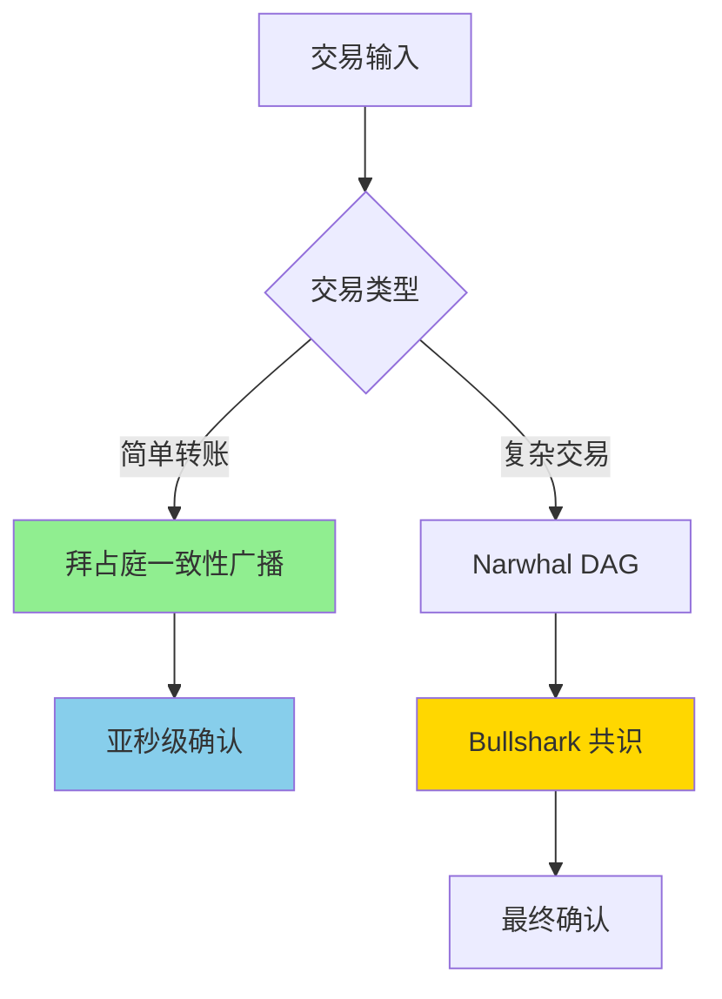
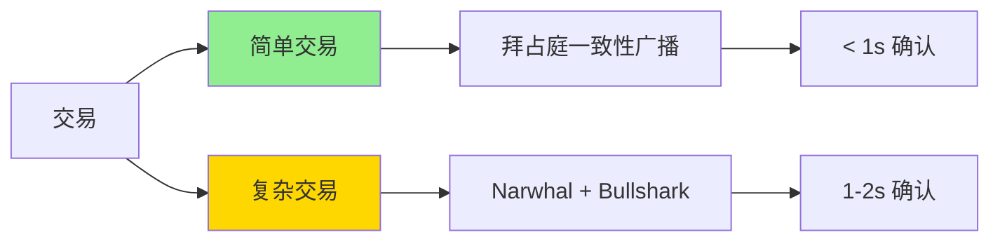

# 公链概述

> 下一代高性能 Layer 1 区块链

## 什么是 Sui？

**Sui** 是由 Mysten Labs 开发的新一代 Layer 1 区块链，旨在解决传统区块链的可扩展性、性能和开发体验问题。Sui 的核心团队来自 Meta（Facebook）的 Diem 和 Novi 项目。

### 核心特性

- ⚡ **超高性能** - 理论 TPS 超过 120,000，实际测试达到 297,000 TPS
- 🔄 **并行执行** - 使用对象模型实现真正的并行交易处理
- 💎 **Move 语言** - 使用安全的 Move 编程语言开发智能合约
- 🎯 **对象为中心** - 独特的对象模型，每个资产都是独立对象
- 🚀 **即时终局性** - 简单交易实现亚秒级确认
- 💰 **低 Gas 费** - 交易费用极低且稳定

## 技术架构

### 共识机制：Narwhal & Bullshark

Sui 采用创新的双层共识架构：



**Narwhal**：内存池层，使用 DAG（有向无环图）结构
**Bullshark**：共识层，基于 DAG 的高效共识算法

### 对象模型

Sui 的核心创新是**对象为中心**的数据模型，每个资产都是独立的对象：

```
传统区块链（账户模型）:
Account A: { balance: 100, nonce: 5, data: ... }

Sui（对象模型）:
Object 1: { id: 0x123, owner: A, value: 50 }
Object 2: { id: 0x456, owner: A, value: 50 }
```

**优势：**
- ✅ 无关联交易可并行处理
- ✅ 避免状态竞争
- ✅ 更好的所有权语义
- ✅ 支持复杂的资产关系

## 与其他区块链对比

| 特性 | Sui | Solana | Ethereum | Aptos |
|------|-----|--------|----------|-------|
| **编程语言** | Move | Rust/C | Solidity | Move |
| **共识机制** | Narwhal & Bullshark | PoH + PoS | PoS | AptosBFT |
| **理论 TPS** | 120,000+ | 65,000 | 15-30 | 160,000 |
| **确认时间** | < 1s（简单交易） | 400ms | 12-15s | 1-2s |
| **数据模型** | 对象模型 | 账户模型 | 账户模型 | 资源模型 |
| **并行执行** | ✅ 原生支持 | ✅ Sealevel | ❌ 顺序执行 | ✅ BlockSTM |
| **Gas 费用** | 极低且稳定 | 极低但波动 | 高且波动 | 低 |

## Move 编程语言

### 为什么选择 Move？

**Move** 最初由 Facebook（现 Meta）为 Diem（原 Libra）项目开发，专为区块链设计：

#### 1. **资源安全性**

```move
// Move 中的资源不能被复制或丢弃
struct Coin has key {
    value: u64
}

// ✅ 转移所有权
public fun transfer(coin: Coin, recipient: address) {
    transfer::transfer(coin, recipient)
}

// ❌ 编译错误：不能复制资源
public fun duplicate(coin: Coin): (Coin, Coin) {
    (coin, coin)  // 编译失败！
}
```

#### 2. **所有权清晰**

```move
// 对象的所有权在类型系统中明确
struct NFT has key, store {
    id: UID,
    name: String,
    owner: address
}
```

#### 3. **能力系统（Abilities）**

Move 使用能力系统控制类型的行为：

| 能力 | 说明 | 用途 |
|------|------|------|
| `copy` | 可以复制 | 基本类型（u64, bool） |
| `drop` | 可以丢弃 | 临时数据 |
| `store` | 可以存储在其他对象中 | 嵌套结构 |
| `key` | 可以作为全局存储的键 | 顶层对象 |

### Move vs Solidity

| 特性 | Move | Solidity |
|------|------|----------|
| **资源安全** | ✅ 编译时保证 | ❌ 运行时检查 |
| **重入攻击** | ✅ 结构上不可能 | ⚠️ 需手动防护 |
| **溢出检查** | ✅ 默认检查 | ✅ 0.8+ 检查 |
| **所有权模型** | ✅ 明确的线性类型 | ❌ 隐式引用 |
| **学习曲线** | 中等 | 低 |

## Sui 生态系统

### 钱包

- **Sui Wallet** - 官方浏览器钱包
- **Suiet** - 功能丰富的钱包
- **Ethos Wallet** - 邮箱登录钱包
- **Martian Wallet** - 多链钱包

### DeFi 协议

- **Cetus** - DEX 和流动性协议
- **Turbos Finance** - DEX 聚合器
- **Scallop** - 借贷协议
- **Aftermath Finance** - 全链 DeFi 套件

### NFT 市场

- **BlueMove** - 综合 NFT 市场
- **Clutchy** - NFT 交易平台
- **Keepsake** - NFT 启动平台

### 基础设施

- **Mysten Labs** - Sui 开发团队
- **SuiScan** - 区块浏览器（https://suiscan.xyz）
- **Sui Explorer** - 官方浏览器（https://explorer.sui.io）
- **SuiNS** - 域名服务

## 学习路径

### 🎯 入门阶段

1. **了解 Sui 基础**
   - 阅读白皮书
   - 理解对象模型
   - 安装开发环境

2. **Move 语言基础**
   - 基本语法
   - 类型系统
   - 模块和函数

### 🚀 进阶阶段

3. **对象模型深入**
   - 对象所有权
   - 共享对象
   - 对象包装

4. **能力系统**
   - Witness 模式
   - Hot Potato 模式
   - 一次性见证（OTW）

5. **存储与所有权**
   - 动态字段
   - 表（Table）
   - 对象转移

### 💼 实战阶段

6. **DeFi 开发**
   - 代币创建
   - DEX 开发
   - 借贷协议

7. **NFT 开发**
   - NFT 标准
   - 市场集成
   - 游戏道具

## 核心概念速览

### 对象类型

| 类型 | 说明 | 用途 |
|------|------|------|
| **Owned Object** | 单一所有者对象 | NFT、个人资产 |
| **Shared Object** | 共享对象 | DeFi 池、市场 |
| **Immutable Object** | 不可变对象 | 配置、元数据 |
| **Wrapped Object** | 包装对象 | 组合资产 |

### 交易类型



**简单交易**：只涉及拥有对象，无需共识
**复杂交易**：涉及共享对象，需要共识

## 常见问题

### Q1: Sui 和 Aptos 都使用 Move，有什么区别？

**A:** 主要区别：

| 特性 | Sui Move | Aptos Move |
|------|----------|------------|
| **数据模型** | 对象模型 | 资源模型 |
| **全局存储** | 对象存储 | 账户资源 |
| **并行执行** | 对象级并行 | BlockSTM |
| **地址格式** | 32 字节 | 32 字节 |
| **标准库** | Sui Framework | Aptos Framework |

### Q2: Sui 的 Gas 费用如何计算？

**A:** Gas 费用 = 计算成本 + 存储成本
- **计算成本**：执行交易的计算量
- **存储成本**：链上存储的数据量
- 与以太坊不同，Sui 的 Gas 费用相对稳定

### Q3: 如何获取测试币？

**A:**
```bash
# 使用 CLI
sui client faucet

# 或访问 Discord 水龙头
# https://discord.gg/sui
```

### Q4: Sui 适合开发什么类型的应用？

**A:** Sui 特别适合：
- ✅ 高频交易应用（DEX、游戏）
- ✅ NFT 和数字资产
- ✅ DeFi 协议
- ✅ 社交网络
- ✅ 游戏道具交易

### Q5: Move 难学吗？

**A:** 学习曲线：
- 有 Rust 经验：容易
- 有 Solidity 经验：中等
- 无编程经验：较难

建议先学习基础语法，再深入对象模型和能力系统。

## 参考资源

### 官方资源

- [Sui 官网](https://sui.io)
- [官方文档](https://docs.sui.io)
- [Move 语言书](https://move-book.com/)
- [GitHub 仓库](https://github.com/MystenLabs/sui)

### 开发工具

- [Sui Explorer](https://explorer.sui.io)
- [SuiScan](https://suiscan.xyz)
- [Sui TypeScript SDK](https://github.com/MystenLabs/sui/tree/main/sdk/typescript)

### 社区资源

- [Sui Discord](https://discord.gg/sui)
- [Sui Twitter](https://twitter.com/SuiNetwork)
- [Sui 开发者论坛](https://forums.sui.io)

### 教程和示例

- [Sui by Example](https://examples.sui.io)
- [Move Patterns](https://www.move-patterns.com/)
- [Sui Move Intro Course](https://github.com/sui-foundation/sui-move-intro-course)
