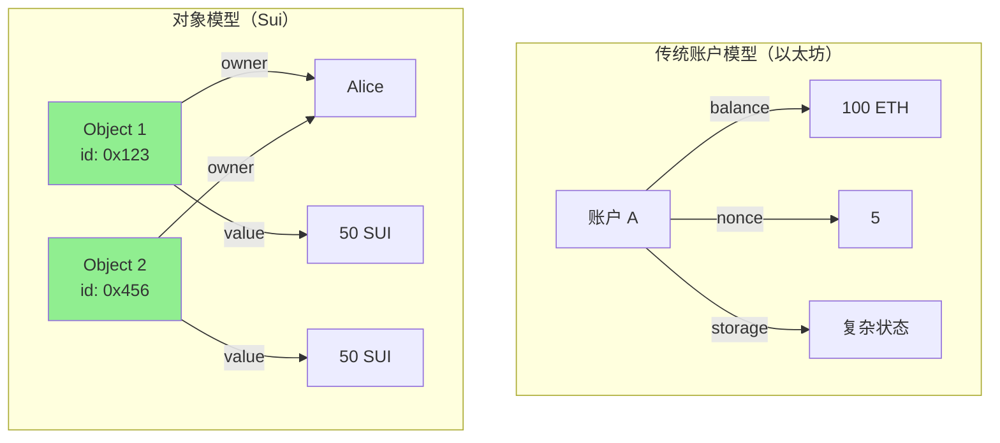

# 对象模型

> Sui 的核心创新：对象为中心的数据模型

> [!IMPORTANT] 本节重点
> 1. Sui 对象的定义和特点是什么？
> 2. 四种对象所有权模式有何区别？
> 3. 如何创建、转移和删除对象？
> 4. 共享对象和拥有对象的使用场景？
> 5. 对象包装和动态字段如何工作？

## 什么是 Sui 对象？

**Sui 对象**是 Sui 区块链上的基本存储单元，每个对象都是独立的、可寻址的数据实体。

### 对象 vs 账户模型



**优势：**
- ✅ **并行执行** - 不同对象的交易可并行处理
- ✅ **简单性** - 每个对象独立，状态清晰
- ✅ **安全性** - 明确的所有权语义
- ✅ **可扩展** - 更好的水平扩展能力

## 对象定义

### 基本对象结构

```move
module example::basic_object {
    use sui::object::{Self, UID};
    use sui::transfer;
    use sui::tx_context::{Self, TxContext};

    // Sui 对象必须包含：
    // 1. UID 字段（名为 id）
    // 2. key 能力
    struct MyObject has key {
        id: UID,        // 必需：对象唯一标识符
        value: u64,     // 自定义字段
        name: vector<u8>
    }

    // 创建对象
    public entry fun create(value: u64, name: vector<u8>, ctx: &mut TxContext) {
        let obj = MyObject {
            id: object::new(ctx),  // 生成新的 UID
            value,
            name
        };

        // 转移给调用者
        transfer::transfer(obj, tx_context::sender(ctx));
    }
}
```

### 对象的必要条件

✅ **必须满足：**
1. 第一个字段必须是 `id: UID`
2. 必须有 `key` 能力
3. 可以有其他能力（`store`）

## 对象所有权

Sui 支持四种对象所有权模式：

### 1. 拥有对象（Owned Object）

**单一所有者拥有的对象**

```move
module example::owned {
    use sui::object::{Self, UID};
    use sui::transfer;
    use sui::tx_context::{Self, TxContext};

    struct OwnedObject has key {
        id: UID,
        value: u64
    }

    // 创建并转移给调用者
    public entry fun create(value: u64, ctx: &mut TxContext) {
        let obj = OwnedObject {
            id: object::new(ctx),
            value
        };

        transfer::transfer(obj, tx_context::sender(ctx));
    }

    // 转移给其他人
    public entry fun transfer_object(
        obj: OwnedObject,
        recipient: address
    ) {
        transfer::transfer(obj, recipient);
    }

    // 修改对象
    public entry fun update(obj: &mut OwnedObject, new_value: u64) {
        obj.value = new_value;
    }

    // 删除对象
    public entry fun delete(obj: OwnedObject) {
        let OwnedObject { id, value: _ } = obj;
        object::delete(id);
    }
}
```

**特点：**
- ✅ 只有所有者能操作
- ✅ 交易快速（无需共识）
- ✅ 可并行处理
- 🎯 **用途：NFT、个人资产**

### 2. 共享对象（Shared Object）

**多人可访问的对象**

```move
module example::shared {
    use sui::object::{Self, UID};
    use sui::transfer;
    use sui::tx_context::TxContext;

    struct Counter has key {
        id: UID,
        value: u64
    }

    // 创建共享对象
    public entry fun create(ctx: &mut TxContext) {
        let counter = Counter {
            id: object::new(ctx),
            value: 0
        };

        // 转为共享对象
        transfer::share_object(counter);
    }

    // 任何人都可以增加计数
    public entry fun increment(counter: &mut Counter) {
        counter.value = counter.value + 1;
    }

    // 读取计数
    public fun get_value(counter: &Counter): u64 {
        counter.value
    }
}
```

**特点：**
- ✅ 多人可访问
- ⚠️ 需要共识（略慢）
- ⚠️ 不可删除（一旦共享，永久共享）
- 🎯 **用途：DeFi 池、市场、DAO**

### 3. 不可变对象（Immutable Object）

**只读的对象**

```move
module example::immutable {
    use sui::object::{Self, UID};
    use sui::transfer;
    use sui::tx_context::TxContext;

    struct Config has key {
        id: UID,
        max_supply: u64,
        decimals: u8
    }

    // 创建不可变对象
    public entry fun create(
        max_supply: u64,
        decimals: u8,
        ctx: &mut TxContext
    ) {
        let config = Config {
            id: object::new(ctx),
            max_supply,
            decimals
        };

        // 冻结为不可变
        transfer::freeze_object(config);
    }

    // 只能读取
    public fun get_max_supply(config: &Config): u64 {
        config.max_supply
    }
}
```

**特点：**
- ✅ 任何人可读
- ❌ 无法修改
- ❌ 无法删除
- 🎯 **用途：配置、元数据、常量**

### 4. 包装对象（Wrapped Object）

**存储在其他对象内部的对象**

```move
module example::wrapped {
    use sui::object::{Self, UID};
    use sui::transfer;
    use sui::tx_context::{Self, TxContext};

    // 被包装的对象（需要 store 能力）
    struct InnerObject has key, store {
        id: UID,
        value: u64
    }

    // 包装其他对象的对象
    struct WrapperObject has key {
        id: UID,
        inner: InnerObject  // 包装的对象
    }

    // 创建并包装
    public entry fun create_wrapped(value: u64, ctx: &mut TxContext) {
        let inner = InnerObject {
            id: object::new(ctx),
            value
        };

        let wrapper = WrapperObject {
            id: object::new(ctx),
            inner
        };

        transfer::transfer(wrapper, tx_context::sender(ctx));
    }

    // 解包
    public entry fun unwrap(wrapper: WrapperObject, ctx: &mut TxContext) {
        let WrapperObject { id, inner } = wrapper;
        object::delete(id);

        // 转移内部对象
        transfer::transfer(inner, tx_context::sender(ctx));
    }
}
```

**特点：**
- ✅ 对象组合
- ✅ 内部对象不可直接访问
- ✅ 可以解包
- 🎯 **用途：组合 NFT、质押凭证**

## 对象操作

### 创建对象

```move
module example::creation {
    use sui::object::{Self, UID};
    use sui::transfer;
    use sui::tx_context::{Self, TxContext};

    struct Item has key {
        id: UID,
        name: vector<u8>
    }

    // 方式 1：直接转移给调用者
    public entry fun create_and_transfer(name: vector<u8>, ctx: &mut TxContext) {
        let item = Item {
            id: object::new(ctx),
            name
        };
        transfer::transfer(item, tx_context::sender(ctx));
    }

    // 方式 2：转移给指定地址
    public entry fun create_for(
        name: vector<u8>,
        recipient: address,
        ctx: &mut TxContext
    ) {
        let item = Item {
            id: object::new(ctx),
            name
        };
        transfer::transfer(item, recipient);
    }

    // 方式 3：共享
    public entry fun create_shared(name: vector<u8>, ctx: &mut TxContext) {
        let item = Item {
            id: object::new(ctx),
            name
        };
        transfer::share_object(item);
    }

    // 方式 4：冻结
    public entry fun create_frozen(name: vector<u8>, ctx: &mut TxContext) {
        let item = Item {
            id: object::new(ctx),
            name
        };
        transfer::freeze_object(item);
    }
}
```

### 转移对象

```move
module example::transfer_example {
    use sui::object::UID;
    use sui::transfer;

    struct Asset has key {
        id: UID,
        value: u64
    }

    // 转移拥有对象
    public entry fun transfer_owned(asset: Asset, recipient: address) {
        transfer::transfer(asset, recipient);
    }

    // 共享对象不能转移！
    // ❌ 这会编译错误
    // public entry fun transfer_shared(asset: Asset, recipient: address) {
    //     transfer::share_object(asset);  // 错误！
    // }

    // 使用公共转移
    public entry fun public_transfer(asset: Asset, recipient: address) {
        transfer::public_transfer(asset, recipient);
    }
}
```

### 删除对象

```move
module example::deletion {
    use sui::object::{Self, UID};

    struct Temporary has key {
        id: UID,
        data: vector<u8>
    }

    // 删除对象
    public entry fun delete(obj: Temporary) {
        let Temporary { id, data: _ } = obj;
        object::delete(id);
    }

    // ❌ 不能删除共享对象
    // ❌ 不能删除不可变对象
    // ❌ 不能删除包装的对象（需先解包）
}
```

## 对象 ID

### UID 和 ID

```move
module example::object_ids {
    use sui::object::{Self, UID, ID};
    use sui::transfer;
    use sui::tx_context::{Self, TxContext};

    struct MyObject has key {
        id: UID,
        value: u64
    }

    // UID -> ID 转换
    public fun get_id(obj: &MyObject): ID {
        object::uid_to_inner(&obj.id)
    }

    // 将 UID 转为地址
    public fun get_address(obj: &MyObject): address {
        object::uid_to_address(&obj.id)
    }

    // 从 ID 获取地址
    public fun id_to_address(id: ID): address {
        object::id_to_address(&id)
    }
}
```

### 对象查找

```move
module example::lookup {
    use sui::object::{Self, UID, ID};
    use sui::dynamic_object_field as dof;

    struct Parent has key {
        id: UID
    }

    struct Child has key, store {
        id: UID,
        value: u64
    }

    // 通过 ID 添加子对象
    public fun add_child(parent: &mut Parent, child: Child) {
        dof::add(&mut parent.id, object::id(&child), child);
    }

    // 通过 ID 查找子对象
    public fun get_child(parent: &Parent, child_id: ID): &Child {
        dof::borrow(&parent.id, child_id)
    }
}
```

## 实战示例

### 示例 1：简单 NFT

```move
module example::simple_nft {
    use sui::object::{Self, UID};
    use sui::transfer;
    use sui::tx_context::{Self, TxContext};
    use std::string::{Self, String};

    // NFT 结构
    struct NFT has key, store {
        id: UID,
        name: String,
        description: String,
        image_url: String
    }

    // 铸造 NFT
    public entry fun mint(
        name: vector<u8>,
        description: vector<u8>,
        image_url: vector<u8>,
        ctx: &mut TxContext
    ) {
        let nft = NFT {
            id: object::new(ctx),
            name: string::utf8(name),
            description: string::utf8(description),
            image_url: string::utf8(image_url)
        };

        transfer::public_transfer(nft, tx_context::sender(ctx));
    }

    // 转移 NFT
    public entry fun transfer_nft(nft: NFT, recipient: address) {
        transfer::public_transfer(nft, recipient);
    }

    // 销毁 NFT
    public entry fun burn(nft: NFT) {
        let NFT { id, name: _, description: _, image_url: _ } = nft;
        object::delete(id);
    }

    // 查询函数
    public fun name(nft: &NFT): String {
        nft.name
    }

    public fun description(nft: &NFT): String {
        nft.description
    }

    public fun image_url(nft: &NFT): String {
        nft.image_url
    }
}
```

### 示例 2：共享计数器

```move
module example::shared_counter {
    use sui::object::{Self, UID};
    use sui::transfer;
    use sui::tx_context::TxContext;

    // 共享计数器
    struct Counter has key {
        id: UID,
        value: u64,
        owner: address  // 记录创建者
    }

    // 创建共享计数器
    public entry fun create(ctx: &mut TxContext) {
        let counter = Counter {
            id: object::new(ctx),
            value: 0,
            owner: tx_context::sender(ctx)
        };

        transfer::share_object(counter);
    }

    // 任何人都可以增加
    public entry fun increment(counter: &mut Counter) {
        counter.value = counter.value + 1;
    }

    // 只有所有者可以重置
    public entry fun reset(counter: &mut Counter, ctx: &mut TxContext) {
        assert!(counter.owner == tx_context::sender(ctx), 0);
        counter.value = 0;
    }

    // 查询
    public fun get_value(counter: &Counter): u64 {
        counter.value
    }
}
```

### 示例 3：对象包装（质押）

```move
module example::staking {
    use sui::object::{Self, UID};
    use sui::transfer;
    use sui::tx_context::{Self, TxContext};
    use sui::coin::{Self, Coin};
    use sui::sui::SUI;

    // 质押凭证（包装了质押的币）
    struct StakeReceipt has key {
        id: UID,
        staked_amount: u64,
        staked_coin: Coin<SUI>,  // 包装的币
        stake_timestamp: u64
    }

    // 质押
    public entry fun stake(
        coin: Coin<SUI>,
        ctx: &mut TxContext
    ) {
        let amount = coin::value(&coin);

        let receipt = StakeReceipt {
            id: object::new(ctx),
            staked_amount: amount,
            staked_coin: coin,  // 包装币
            stake_timestamp: tx_context::epoch(ctx)
        };

        transfer::transfer(receipt, tx_context::sender(ctx));
    }

    // 解除质押
    public entry fun unstake(
        receipt: StakeReceipt,
        ctx: &mut TxContext
    ) {
        let StakeReceipt {
            id,
            staked_amount: _,
            staked_coin,
            stake_timestamp: _
        } = receipt;

        object::delete(id);

        // 返还币
        transfer::public_transfer(staked_coin, tx_context::sender(ctx));
    }

    // 查询质押信息
    public fun get_staked_amount(receipt: &StakeReceipt): u64 {
        receipt.staked_amount
    }
}
```

### 示例 4：市场（共享对象）

```move
module example::marketplace {
    use sui::object::{Self, UID, ID};
    use sui::transfer;
    use sui::tx_context::{Self, TxContext};
    use sui::coin::{Self, Coin};
    use sui::sui::SUI;
    use sui::table::{Self, Table};

    // NFT 类型（示例）
    struct GameItem has key, store {
        id: UID,
        power: u64
    }

    // 挂单信息
    struct Listing has store {
        seller: address,
        price: u64,
        item_id: ID
    }

    // 市场（共享对象）
    struct Marketplace has key {
        id: UID,
        listings: Table<ID, Listing>  // item_id -> Listing
    }

    // 创建市场
    public entry fun create_marketplace(ctx: &mut TxContext) {
        let marketplace = Marketplace {
            id: object::new(ctx),
            listings: table::new(ctx)
        };

        transfer::share_object(marketplace);
    }

    // 挂单（将物品转移到市场）
    public entry fun list_item(
        marketplace: &mut Marketplace,
        item: GameItem,
        price: u64,
        ctx: &mut TxContext
    ) {
        let item_id = object::id(&item);

        let listing = Listing {
            seller: tx_context::sender(ctx),
            price,
            item_id
        };

        table::add(&mut marketplace.listings, item_id, listing);

        // 转移物品到市场对象
        transfer::public_transfer(item, object::uid_to_address(&marketplace.id));
    }

    // 购买（需要重新获取物品后实现）
    // 简化示例，实际实现需要动态对象字段
}
```

## 动态字段

### 动态字段 vs 动态对象字段

```move
module example::dynamic_fields {
    use sui::object::{Self, UID};
    use sui::dynamic_field as df;
    use sui::dynamic_object_field as dof;
    use sui::transfer;
    use sui::tx_context::{Self, TxContext};

    struct Parent has key {
        id: UID
    }

    struct Child has key, store {
        id: UID,
        value: u64
    }

    // 动态字段（值类型）
    public fun add_value_field(parent: &mut Parent) {
        df::add(&mut parent.id, b"key", 100u64);
    }

    public fun get_value_field(parent: &Parent): u64 {
        *df::borrow(&parent.id, b"key")
    }

    // 动态对象字段（对象类型）
    public fun add_object_field(parent: &mut Parent, child: Child) {
        let child_id = object::id(&child);
        dof::add(&mut parent.id, child_id, child);
    }

    public fun get_object_field(parent: &Parent, child_id: ID): &Child {
        dof::borrow(&parent.id, child_id)
    }

    // 删除字段
    public fun remove_field(parent: &mut Parent): u64 {
        df::remove(&mut parent.id, b"key")
    }
}
```

## 对象权限设计模式

### 模式 1：所有者检查

```move
module example::owner_check {
    use sui::object::UID;
    use sui::tx_context::{Self, TxContext};

    struct OwnedItem has key {
        id: UID,
        owner: address,
        value: u64
    }

    // 只有所有者可以修改
    public entry fun update(
        item: &mut OwnedItem,
        new_value: u64,
        ctx: &TxContext
    ) {
        assert!(item.owner == tx_context::sender(ctx), 0);
        item.value = new_value;
    }
}
```

### 模式 2：管理员权限

```move
module example::admin {
    use sui::object::{Self, UID};
    use sui::transfer;
    use sui::tx_context::{Self, TxContext};

    // 管理员凭证
    struct AdminCap has key {
        id: UID
    }

    // 受保护的资源
    struct ProtectedResource has key {
        id: UID,
        data: vector<u8>
    }

    // 初始化时创建管理员凭证
    fun init(ctx: &mut TxContext) {
        let admin_cap = AdminCap {
            id: object::new(ctx)
        };

        transfer::transfer(admin_cap, tx_context::sender(ctx));
    }

    // 只有持有 AdminCap 才能调用
    public entry fun admin_only(
        _admin_cap: &AdminCap,
        resource: &mut ProtectedResource,
        new_data: vector<u8>
    ) {
        resource.data = new_data;
    }
}
```

## 最佳实践

### 1. 选择合适的所有权模式

```move
// ✅ 个人资产 -> 拥有对象
struct NFT has key { id: UID }

// ✅ 多人访问 -> 共享对象
struct DEXPool has key { id: UID }

// ✅ 只读配置 -> 不可变对象
struct GameConfig has key { id: UID }

// ✅ 组合资产 -> 包装对象
struct StakeReceipt has key {
    id: UID,
    staked: Coin<SUI>  // 包装
}
```

### 2. 对象能力设计

```move
// ✅ 顶层对象：key
struct TopLevel has key { id: UID }

// ✅ 可嵌套对象：key + store
struct Nested has key, store { id: UID }

// ❌ 避免不必要的能力
// 资产类型不要加 copy 或 drop
```

### 3. 删除对象

```move
// ✅ 正确的删除方式
public entry fun delete(obj: MyObject) {
    let MyObject { id, data: _ } = obj;
    object::delete(id);
}

// ❌ 错误：忘记删除 UID
public entry fun wrong_delete(obj: MyObject) {
    let MyObject { id: _, data: _ } = obj;
    // UID 泄漏！
}
```

## 常见问题

### Q1: 共享对象和拥有对象的性能差异？

**A:**
- **拥有对象**：无需共识，< 1秒确认
- **共享对象**：需要共识，1-2秒确认

使用场景：
- 个人资产（NFT）→ 拥有对象
- DeFi 池、市场 → 共享对象

### Q2: 能否将共享对象转回拥有对象？

**A:** 不可以。一旦对象被共享，就永远是共享对象。

### Q3: 包装对象有什么限制？

**A:**
- 被包装的对象必须有 `store` 能力
- 包装后不可直接访问
- 必须解包后才能转移或删除

### Q4: 动态字段的 Gas 成本？

**A:** 动态字段的 Gas 成本高于静态字段。建议：
- 已知的固定字段 → 使用静态字段
- 不确定数量的数据 → 使用动态字段

### Q5: 如何实现对象的"软删除"？

**A:** 使用标记字段：

```move
struct Item has key {
    id: UID,
    deleted: bool  // 软删除标记
}

public entry fun soft_delete(item: &mut Item) {
    item.deleted = true;
}
```

## 参考资源

- [Sui 对象模型官方文档](https://docs.sui.io/build/programming-with-objects)
- [对象所有权文档](https://docs.sui.io/build/programming-with-objects/object-ownership)
- [动态字段文档](https://docs.sui.io/build/programming-with-objects/dynamic-fields)
- [Sui Framework 源码](https://github.com/MystenLabs/sui/tree/main/crates/sui-framework)
