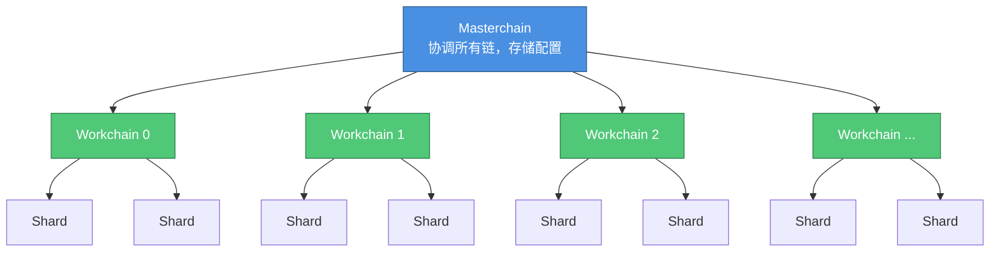
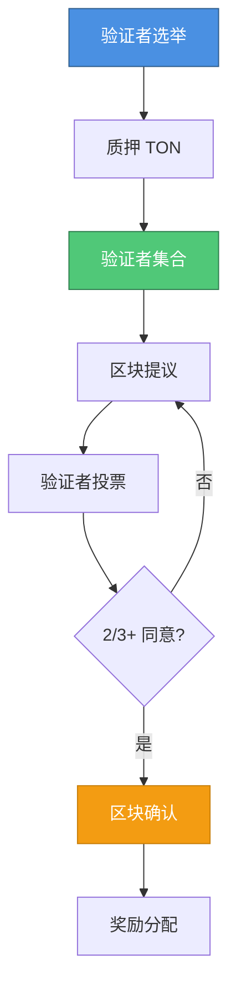
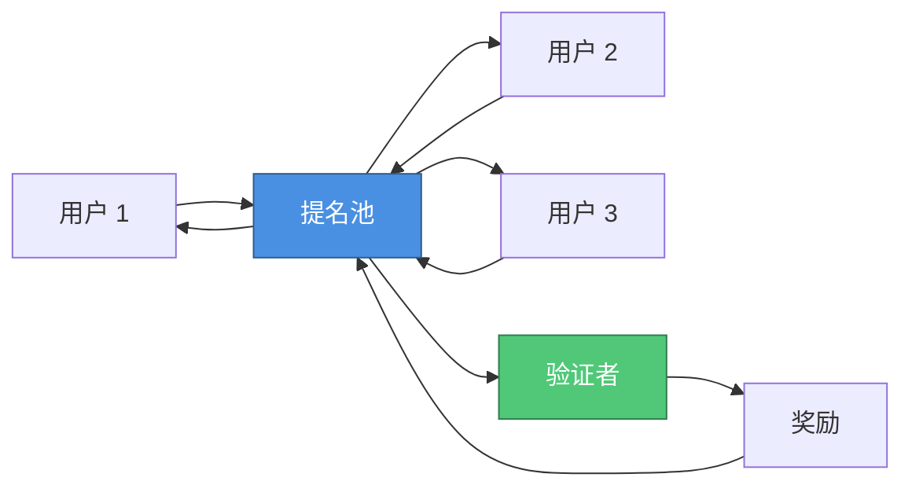
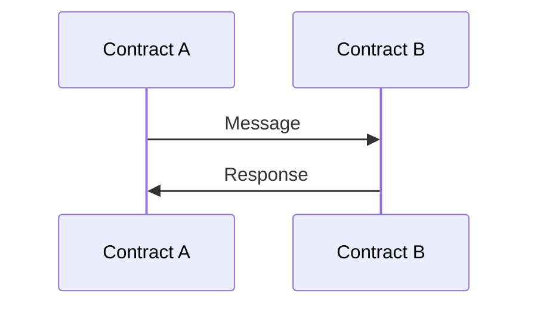
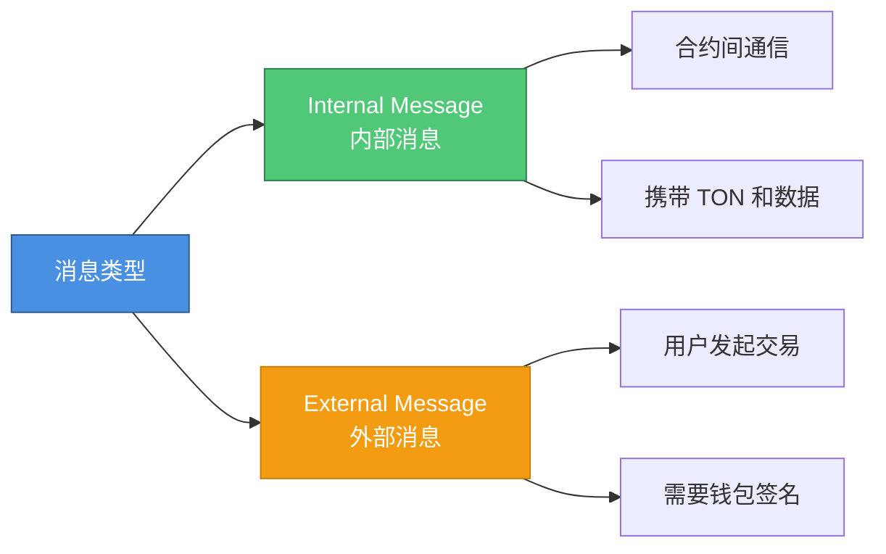
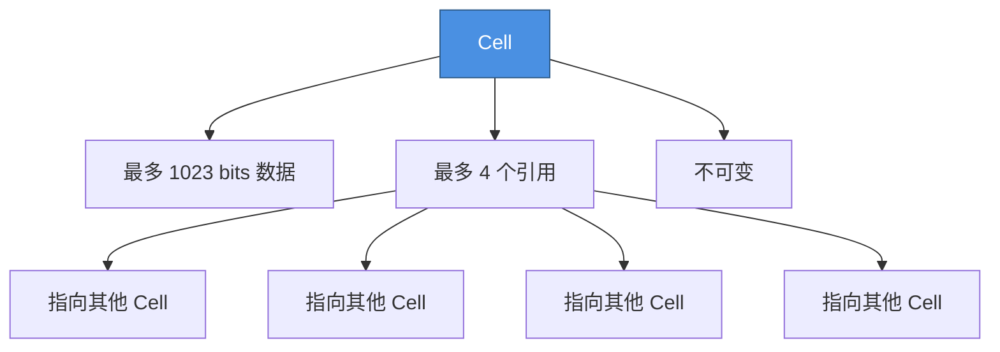
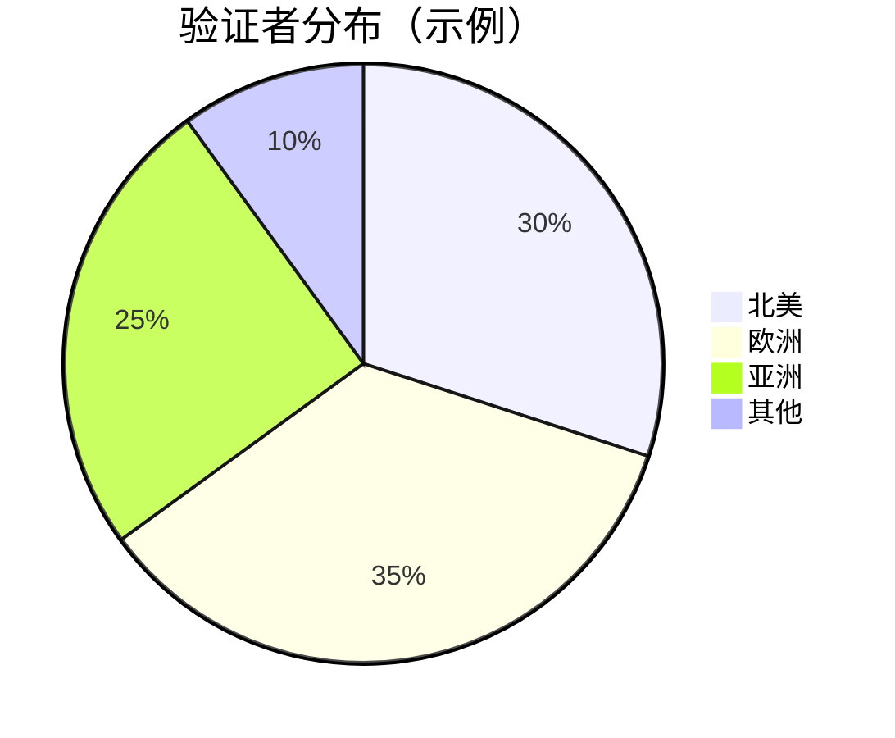
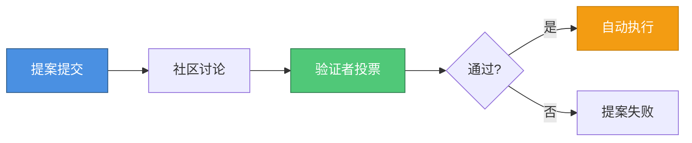
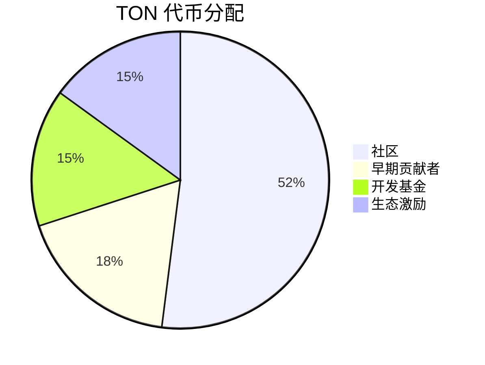
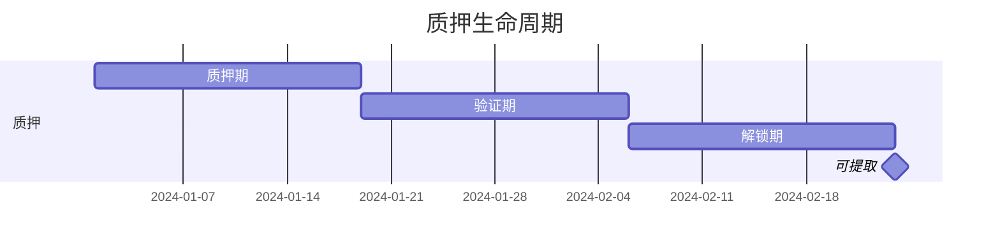

# 公链概览
> 与 Telegram 深度整合的高性能区块链

> [!INFO] 导航
> [TONScan 区块浏览器](https://tonscan.org/)
> 
> [TON 官网](https://ton.org/)
>
> [Tonkeeper 钱包](https://tonkeeper.com/)

## 什么是 TON？

**TON**（The Open Network）是由 Telegram 团队设计的新一代 Layer 1 区块链，旨在为全球数十亿用户提供快速、安全、可扩展的区块链基础设施。TON 的核心团队来自 Telegram，后由开源社区接管并持续发展。

### 核心特性

- ⚡ **超高性能** - 理论 TPS 超过 100,000，实际测试达到数百万 TPS
- 🔄 **无限分片** - 动态分片架构，支持水平扩展
- 💎 **异步架构** - Actor 模型，智能合约间异步通信
- 🎯 **Telegram 整合** - 9 亿+ Telegram 用户可直接使用
- 🚀 **即时确认** - 约 5 秒出块，6 秒最终确认
- 💰 **低 Gas 费** - 交易费用约 $0.01

## 技术架构

### 多链架构

TON 采用创新的多链分片架构：



**Masterchain**：主链，协调所有工作链
**Workchain**：工作链，最多 2^32 条，独立处理交易
**Shardchain**：分片链，工作链可动态分片

### 共识机制：BFT-PoS

TON 采用**拜占庭容错权益证明**（Byzantine Fault Tolerant Proof-of-Stake）共识机制，结合了 PoS 的能效和 BFT 的安全性。

#### 工作原理



#### 核心特性

| 特性 | 说明 |
|------|------|
| **出块时间** | ~5 秒 |
| **最终确认** | ~6 秒（1-2 个区块） |
| **验证者数量** | 动态调整，通常 100-400 个 |
| **容错能力** | 容忍最多 1/3 的恶意验证者 |
| **能源效率** | 相比 PoW 节省 99%+ 能源 |

#### 验证者机制

**成为验证者的要求：**
- 最低质押：约 300,000 TON（动态调整）
- 运行全节点
- 稳定的网络连接
- 足够的计算资源

**验证者职责：**
- 验证交易和区块
- 参与共识投票
- 维护网络安全
- 处理跨分片消息

**奖励机制：**
- 区块奖励：新铸造的 TON
- 交易费用：用户支付的 Gas 费
- 年化收益：约 3-5%（视网络参与度）

**惩罚机制（Slashing）：**
- 双重签名：扣除部分质押
- 长时间离线：降低奖励
- 恶意行为：没收全部质押

#### 提名池（Nominator Pool）

普通用户可通过提名池参与质押：



- **最低质押**：通常 10-100 TON
- **灵活性**：可随时提取（有解锁期）
- **收益**：略低于直接验证（扣除池费用）
- **风险**：与验证者共担 Slashing 风险

### Actor 模型

TON 智能合约采用 Actor 模型，通过异步消息通信：



**优势：**
- ✅ 支持并行处理
- ✅ 避免全局状态锁定
- ✅ 更好的可扩展性
- ✅ 天然适配分片架构

## 与其他区块链对比

| 特性 | TON | Solana | Ethereum | Sui |
|------|-----|--------|----------|-----|
| **编程语言** | FunC/Tact | Rust/C | Solidity | Move |
| **共识机制** | BFT-PoS | PoH + PoS | PoS | Narwhal & Bullshark |
| **理论 TPS** | 100,000+ | 65,000 | 15-30 | 120,000+ |
| **确认时间** | ~5s | 400ms | 12-15s | < 1s |
| **架构** | 多链分片 | 单链 | 单链 | 对象模型 |
| **Gas 费用** | ~$0.01 | ~$0.00025 | $1-50 | 极低 |
| **生态整合** | Telegram | 独立 | 独立 | 独立 |

## 编程语言

### FunC

**FunC** 是 TON 原生智能合约语言，类 C 语法：

```func
() recv_internal(int msg_value, cell in_msg, slice in_msg_body) impure {
    int op = in_msg_body~load_uint(32);
    
    if (op == 1) {
        ;; 处理操作
        int amount = in_msg_body~load_coins();
        save_data(amount);
    }
}
```

**特点：**
- 类 C 语法，学习曲线适中
- 直接操作 Cell 数据结构
- 高性能，接近底层
- 适合复杂逻辑

### Tact

**Tact** 是高级智能合约语言，语法更友好：

```tact
contract Counter {
    counter: Int;
    
    init() {
        self.counter = 0;
    }
    
    receive("increment") {
        self.counter += 1;
    }
    
    get fun counter(): Int {
        return self.counter;
    }
}
```

**特点：**
- 现代语法，易于学习
- 类型安全
- 自动生成样板代码
- 适合快速开发

### FunC vs Tact

| 特性 | FunC | Tact |
|------|------|------|
| **学习曲线** | 中等 | 低 |
| **性能** | 高 | 高 |
| **开发速度** | 慢 | 快 |
| **灵活性** | 高 | 中 |
| **适用场景** | 复杂协议 | 快速开发 |

## TON 生态系统

### DeFi 协议

- **STON.fi** - 领先的 DEX
- **DeDust** - AMM 协议
- **Evaa Protocol** - 借贷协议
- **Megaton Finance** - DeFi 套件

### NFT 市场

- **Getgems** - 最大的 NFT 市场
- **TON Diamonds** - NFT 收藏品
- **Fragment** - 用户名/号码拍卖

### 基础设施

- **TON DNS** - 去中心化域名
- **TON Storage** - 分布式存储
- **TON Proxy** - 去中心化代理
- **TON Sites** - 去中心化网站

### Telegram 整合

- **Telegram Wallet** - 内置钱包
- **TON Space** - 自托管钱包
- **Mini Apps** - 小程序平台
- **Bot Payments** - 机器人支付

## 核心概念速览

### 账户类型

| 类型 | 说明 | 用途 |
|------|------|------|
| **Wallet** | 钱包合约 | 存储 TON，发送交易 |
| **Smart Contract** | 智能合约 | 业务逻辑 |
| **Uninit** | 未初始化账户 | 预留地址 |

### 消息类型



### Cell 数据结构

TON 使用 **Cell** 作为基础数据结构：



## 去中心化与治理

### 网络去中心化

TON 通过多层次的去中心化保证网络安全和抗审查：

#### 验证者去中心化



- **地理分布**：验证者分布在全球各地
- **实体多样性**：个人、机构、交易所等
- **动态轮换**：每个 epoch（约 18 小时）重新选举
- **无需许可**：任何人都可以成为验证者

#### 节点类型

| 节点类型 | 职责 | 要求 |
|---------|------|------|
| **验证者节点** | 验证交易、生产区块 | 高配置、大质押 |
| **全节点** | 存储完整区块链数据 | 中等配置 |
| **轻节点** | 验证区块头 | 低配置 |
| **归档节点** | 存储历史数据 | 大存储空间 |

### 治理机制

TON 采用链上治理模型：

#### 提案流程



#### 可治理参数

- **网络参数**：Gas 价格、区块大小、验证者数量
- **经济参数**：通胀率、质押要求、奖励分配
- **协议升级**：新功能、性能优化、安全补丁

#### 投票权重

- 基于质押的 TON 数量
- 验证者拥有更大权重
- 需要超过 2/3 的验证者同意

### 代币经济学

#### TON 代币分配



#### 供应机制

- **初始供应**：约 50 亿 TON
- **通胀率**：每年约 0.6%（用于验证者奖励）
- **销毁机制**：部分交易费用被销毁
- **长期趋势**：趋向通缩

#### 代币用途

| 用途 | 说明 |
|------|------|
| **Gas 费用** | 支付交易和智能合约执行 |
| **质押** | 成为验证者或参与提名池 |
| **存储租金** | 支付链上存储费用 |
| **治理** | 参与网络治理投票 |
| **域名注册** | 购买 TON DNS 域名 |

### 质押机制详解

#### 质押收益计算

```
年化收益 = (区块奖励 + 交易费用) / 总质押量
实际收益 = 质押量 × 年化收益 × (1 - 池费用)
```

#### 质押周期



- **质押期**：提交质押，等待下一个 epoch
- **验证期**：参与验证，获得奖励
- **解锁期**：申请解锁后的等待期
- **可提取**：可以提取本金和奖励

#### 风险与收益

**收益来源：**
- ✅ 区块奖励（新铸造的 TON）
- ✅ 交易费用分成
- ✅ 存储租金分成

**潜在风险：**
- ⚠️ Slashing（验证者作恶或离线）
- ⚠️ 市场波动（TON 价格下跌）
- ⚠️ 机会成本（锁定期无法交易）

## 常见问题

### Q1: TON 和 Telegram 是什么关系？

**A:** TON 最初由 Telegram 团队开发，2020 年因监管原因 Telegram 退出，项目由开源社区接管。现在 Telegram 重新整合 TON，提供钱包和支付功能。

### Q2: TON 的 Gas 费用如何计算？

**A:** Gas 费用 = 计算成本 + 存储成本 + 转发成本
- **计算成本**：执行指令的费用
- **存储成本**：链上存储的费用（按时间计费）
- **转发成本**：消息传递的费用

平均交易费用约 0.005 TON（~$0.01）

### Q3: TON 适合开发什么类型的应用？

**A:** TON 特别适合：
- 高频交易应用（DEX、游戏）
- 社交应用（与 Telegram 整合）
- 支付系统
- NFT 和数字资产
- DeFi 协议

### Q4: 如何开始学习 TON 开发？

**A:** 学习路径：
1. 了解 TON 架构和概念
2. 学习 FunC 或 Tact 语言
3. 使用 Blueprint 框架开发
4. 部署到测试网测试
5. 参与社区和生态项目

### Q5: TON 如何保证去中心化？

**A:** TON 通过多种机制保证去中心化：
- **验证者分布**：全球数百个独立验证者
- **无需许可**：任何人都可以成为验证者
- **动态选举**：每 18 小时重新选举验证者
- **抗审查**：分布式架构难以被单点控制

### Q6: 如何参与 TON 质押？

**A:** 两种方式：
1. **直接验证**：质押 300,000+ TON，运行验证者节点
2. **提名池**：质押 10+ TON，通过提名池参与

推荐使用 Tonkeeper 等钱包的质押功能。

## 独特优势

### 1. Telegram 生态

- **9 亿+用户** - 庞大的潜在用户群
- **无缝整合** - 用户无需下载额外应用
- **社交支付** - 通过聊天直接转账
- **Mini Apps** - 小程序生态

### 2. 无限扩展性

- **动态分片** - 根据负载自动分片
- **多链架构** - 支持多条工作链
- **异步通信** - 高效的消息传递

### 3. 开发者友好

- **多语言支持** - FunC、Tact、TypeScript
- **完善工具链** - Blueprint、TON SDK
- **活跃社区** - 丰富的文档和示例
