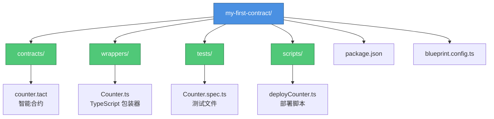

# 快速入门

> 从零开始搭建 TON 开发环境并创建第一个应用

## 开发环境搭建

### 系统要求

- **操作系统**：macOS、Linux 或 Windows (WSL2)
- **Node.js**：>= 18.0
- **内存**：至少 4GB RAM
- **磁盘空间**：至少 5GB 可用空间

### 安装 Node.js

:::code-group

```bash [macOS]
# 使用 Homebrew
brew install node

# 验证安装
node --version
npm --version
```

```bash [Linux (Ubuntu/Debian)]
# 安装 Node.js 18
curl -fsSL https://deb.nodesource.com/setup_18.x | sudo -E bash -
sudo apt-get install -y nodejs

# 验证安装
node --version
npm --version
```

```bash [Windows (WSL2)]
# 在 WSL2 中安装
curl -fsSL https://deb.nodesource.com/setup_18.x | sudo -E bash -
sudo apt-get install -y nodejs

# 验证安装
node --version
npm --version
```

:::

### 安装 Blueprint

Blueprint 是 TON 官方推荐的智能合约开发框架。

```bash
# 全局安装 Blueprint CLI
npm install -g @ton/blueprint

# 验证安装
blueprint --version
```

## 钱包管理

### 安装 Tonkeeper

Tonkeeper 是最流行的 TON 钱包：

- **移动端**：[iOS](https://apps.apple.com/app/tonkeeper/id1587742107) | [Android](https://play.google.com/store/apps/details?id=com.ton_keeper)
- **浏览器扩展**：[Chrome](https://chrome.google.com/webstore/detail/tonkeeper/jnfdfpidcnljmhacdickfajjnmafhonh)

### 创建钱包

1. 打开 Tonkeeper
2. 点击"创建新钱包"
3. 备份助记词（24 个单词）
4. 设置密码
5. 完成创建

### 获取测试币

```bash
# 访问测试网水龙头
# https://t.me/testgiver_ton_bot

# 在 Telegram 中发送你的测试网地址
# 机器人会自动发送测试币
```

## 创建第一个项目

### 初始化项目

```bash
# 创建新项目
npm create ton@latest

# 按提示选择：
# ✔ Project name: my-first-contract
# ✔ Choose template: Counter
# ✔ Choose network: testnet

# 进入项目目录
cd my-first-contract

# 安装依赖
npm install
```

### 项目结构



### Counter 合约示例

查看 `contracts/counter.tact`：

```tact
import "@stdlib/deploy";

message Add {
    amount: Int as uint32;
}

contract Counter with Deployable {
    id: Int as uint32;
    counter: Int as uint32;
    
    init(id: Int) {
        self.id = id;
        self.counter = 0;
    }
    
    receive(msg: Add) {
        self.counter += msg.amount;
    }
    
    get fun counter(): Int {
        return self.counter;
    }
    
    get fun id(): Int {
        return self.id;
    }
}
```

### 编译项目

```bash
# 编译合约
npx blueprint build

# 输出示例：
# ✔ Compiled Counter successfully
# Build artifacts saved to build/Counter/
```

### 测试项目

查看 `tests/Counter.spec.ts`：

```typescript
import { Blockchain, SandboxContract, TreasuryContract } from '@ton/sandbox';
import { toNano } from '@ton/core';
import { Counter } from '../wrappers/Counter';
import '@ton/test-utils';

describe('Counter', () => {
    let blockchain: Blockchain;
    let deployer: SandboxContract<TreasuryContract>;
    let counter: SandboxContract<Counter>;

    beforeEach(async () => {
        blockchain = await Blockchain.create();
        deployer = await blockchain.treasury('deployer');

        counter = blockchain.openContract(await Counter.fromInit(0n));

        const deployResult = await counter.send(
            deployer.getSender(),
            {
                value: toNano('0.05'),
            },
            {
                $type: 'Deploy',
                queryId: 0n,
            }
        );

        expect(deployResult.transactions).toHaveTransaction({
            from: deployer.address,
            to: counter.address,
            deploy: true,
            success: true,
        });
    });

    it('should deploy', async () => {
        // 部署测试已在 beforeEach 中完成
    });

    it('should increase counter', async () => {
        const increaseTimes = 3;
        for (let i = 0; i < increaseTimes; i++) {
            await counter.send(
                deployer.getSender(),
                {
                    value: toNano('0.05'),
                },
                {
                    $type: 'Add',
                    amount: 1n,
                }
            );
        }

        const counterValue = await counter.getCounter();
        expect(counterValue).toEqual(BigInt(increaseTimes));
    });
});
```

运行测试：

```bash
# 运行所有测试
npx blueprint test

# 输出示例：
# PASS  tests/Counter.spec.ts
#   Counter
#     ✓ should deploy (123ms)
#     ✓ should increase counter (234ms)
#
# Test Suites: 1 passed, 1 total
# Tests:       2 passed, 2 total

# 运行特定测试
npx blueprint test Counter

# 显示详细输出
npx blueprint test --verbose
```

### 部署项目

```bash
# 部署到测试网
npx blueprint run

# 选择部署脚本
# ✔ Choose script to run: deployCounter

# 选择网络
# ✔ Choose network: testnet

# 输出示例：
# ✔ Contract deployed at address: EQD...
# ✔ Transaction confirmed
# 
# Contract address: EQD4FPq-PRDieyQKkizFTRtSDyucUIqrj0v_zXJmqaDp6_0t
# Transaction: https://testnet.tonscan.org/tx/ABC123...

# 保存合约地址
export CONTRACT_ADDRESS=EQD4FPq-PRDieyQKkizFTRtSDyucUIqrj0v_zXJmqaDp6_0t
```

### 与合约交互

创建交互脚本 `scripts/interact.ts`：

```typescript
import { Address, toNano } from '@ton/core';
import { Counter } from '../wrappers/Counter';
import { NetworkProvider } from '@ton/blueprint';

export async function run(provider: NetworkProvider) {
    const ui = provider.ui();
    const address = Address.parse(await ui.input('Contract address'));

    const counter = provider.open(Counter.fromAddress(address));

    // 查询当前值
    const counterValue = await counter.getCounter();
    ui.write(`Current counter value: ${counterValue}`);

    // 增加计数
    await counter.send(
        provider.sender(),
        {
            value: toNano('0.05'),
        },
        {
            $type: 'Add',
            amount: 1n,
        }
    );

    ui.write('Counter increased!');

    // 再次查询
    const newValue = await counter.getCounter();
    ui.write(`New counter value: ${newValue}`);
}
```

运行交互脚本：

```bash
npx blueprint run interact
```

## Blueprint CLI 常用命令

### 项目管理

```bash
# ========== 创建项目 ==========
# 创建新项目
npm create ton@latest

# 从模板创建
npm create ton@latest -- --template counter
npm create ton@latest -- --template jetton

# ========== 编译 ==========
# 编译所有合约
npx blueprint build

# 编译特定合约
npx blueprint build Counter

# 清理编译产物
npx blueprint clean

# ========== 测试 ==========
# 运行所有测试
npx blueprint test

# 运行特定测试
npx blueprint test Counter

# 监听模式
npx blueprint test --watch

# 生成覆盖率
npx blueprint test --coverage

# ========== 部署 ==========
# 部署合约
npx blueprint run

# 指定脚本
npx blueprint run deployCounter

# 指定网络
npx blueprint run --network testnet
npx blueprint run --network mainnet

# ========== 工具 ==========
# 生成包装器
npx blueprint generate

# 验证合约
npx blueprint verify

# 查看帮助
npx blueprint --help
```

### 网络配置

编辑 `blueprint.config.ts`：

```typescript
import { Config } from '@ton/blueprint';

export const config: Config = {
    network: {
        endpoint: 'https://testnet.toncenter.com/api/v2/jsonRPC',
        type: 'testnet',
        version: 'v2',
        key: 'your-api-key', // 可选
    },
};
```

## 使用 TON SDK

### 安装依赖

```bash
npm install @ton/ton @ton/core @ton/crypto
npm install @tonconnect/sdk
```

### 基础示例

创建 `src/example.ts`：

```typescript
import { TonClient, Address, toNano } from '@ton/ton';

async function main() {
    // 连接到测试网
    const client = new TonClient({
        endpoint: 'https://testnet.toncenter.com/api/v2/jsonRPC',
    });

    // 查询余额
    const address = Address.parse('EQ...');
    const balance = await client.getBalance(address);
    console.log('余额:', balance);

    // 查询合约状态
    const state = await client.getContractState(address);
    console.log('状态:', state);
}

main();
```

### 连接钱包

使用 TON Connect 连接钱包：

```typescript
import { TonConnectUI } from '@tonconnect/ui';

// 初始化 TON Connect
const tonConnectUI = new TonConnectUI({
    manifestUrl: 'https://your-app.com/tonconnect-manifest.json',
});

// 连接钱包
await tonConnectUI.connectWallet();

// 获取钱包信息
const wallet = tonConnectUI.wallet;
console.log('钱包地址:', wallet?.account.address);

// 发送交易
await tonConnectUI.sendTransaction({
    validUntil: Math.floor(Date.now() / 1000) + 600,
    messages: [
        {
            address: 'EQ...',
            amount: toNano('1').toString(),
        },
    ],
});
```

## 调试技巧

### 1. 使用 Sandbox

```typescript
import { Blockchain } from '@ton/sandbox';

const blockchain = await Blockchain.create();

// 打印所有交易
blockchain.verbosity = {
    print: true,
    blockchainLogs: true,
    vmLogs: 'vm_logs',
    debugLogs: true,
};
```

### 2. 查看交易日志

```typescript
const result = await counter.send(
    deployer.getSender(),
    { value: toNano('0.05') },
    { $type: 'Add', amount: 1n }
);

// 打印所有交易
result.transactions.forEach((tx, i) => {
    console.log(`Transaction ${i}:`, tx);
});
```

### 3. 使用 TONScan

在测试网部署后，访问 TONScan 查看详情：

```
https://testnet.tonscan.org/address/YOUR_CONTRACT_ADDRESS
```

## 常见问题

### Q1: 如何获取测试币？

**A:** 使用 Telegram 机器人：
1. 打开 [@testgiver_ton_bot](https://t.me/testgiver_ton_bot)
2. 发送你的测试网地址
3. 机器人会自动发送测试币

### Q2: 部署失败怎么办？

**A:** 检查以下几点：
- 余额是否足够（至少 0.1 TON）
- 网络连接是否正常
- 合约是否编译成功
- Gas 预算是否足够

### Q3: 如何查看合约状态？

**A:** 使用 TONScan 或 SDK：

```typescript
const client = new TonClient({
    endpoint: 'https://testnet.toncenter.com/api/v2/jsonRPC',
});

const state = await client.getContractState(address);
console.log('状态:', state);
```

### Q4: 如何升级合约？

**A:** TON 合约默认不可升级。如需升级功能，需要在合约中实现升级逻辑，或使用代理模式。
